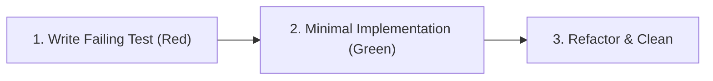

# 🧪 Testing Standards & TDD Guidelines

## 1. Test-Driven Development (TDD) Mandatory Flow

All changes affecting business logic, fraud engine, or ledger accounting must follow the strict TDD cycle:

1. **Red**: Write a test defining the requirement, invariant, or edge case. Run it and verify that it fails for the expected reason.
2. **Green**: Write the minimal production code necessary to make the test pass.
3. **Refactor**: Clean up implementation without altering observable behavior, maintaining all tests green.

---

## 2. Testing Levels

### Unit Tests (`src/test/java/.../unit/`)
- Fast, isolated in-memory tests.
- Mock external dependencies with Mockito.
- Focus on domain invariants, calculation edge cases, hash chains, and rule scoring.

### Integration Tests (`src/test/java/.../integration/`)
- Extend `DockerProperties` and import `IntegrationTestBase.class`.
- Use Testcontainers to run PostgreSQL, Redis, and NATS.
- Clean database before each test via `DatabaseCleaner`.
- Focus on database transactions, concurrency, outbox relay retries, and REST contracts.

---

## 3. Mandatory Test Coverage Checklist

Every financial operation test suite must verify:
- [ ] **Happy Path**: Correct account balance updates and ledger entries created.
- [ ] **Hash Chain Integrity**: Subsequent entries correctly hash-chain to `previous_hash`.
- [ ] **Idempotency**: Replaying request with same `operation_id` returns cached result without duplicate ledger entries.
- [ ] **Insufficient Balance**: Debiting more than current balance fails and aborts transaction completely.
- [ ] **Concurrent Execution**: Race conditions and concurrent transfers do not corrupt balances or cause deadlocks.
- [ ] **Anti-Fraud Triggers**: Blocked/exceeded thresholds produce `FraudBlockedException` with zero ledger mutation.
- [ ] **Outbox Relay**: Events are written to `outbox` table and processed asynchronously.
