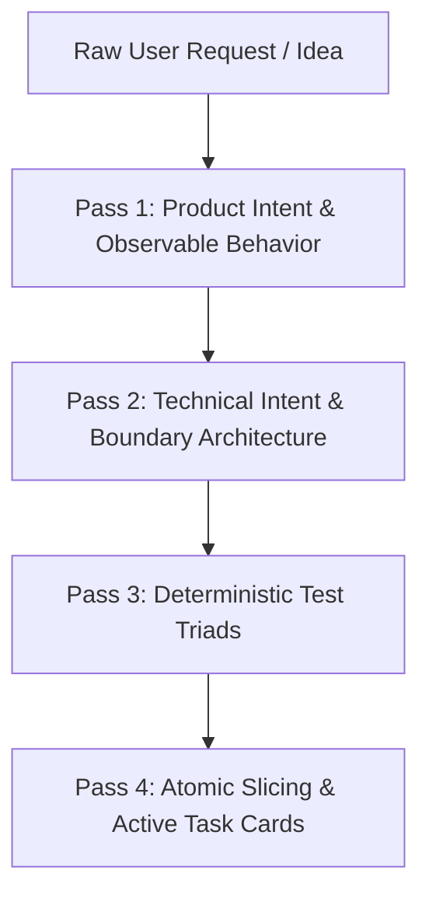

# 🎯 Design Spec Extraction Skill — Token-Compliant Multi-Pass Protocol

## 1. Identity & Objective

The **Design Spec Extraction** skill governs the rigorous translation of user prompts, feature requests, domain discussions, or legacy refactoring notes into **token-compliant, mathematically unambiguous specifications** (`SPEC-XXX.md`), architecture plans (`plans/PLAN-XXX.md`), and atomic TDD task cards (`tasks/TASKS-XXX.md`).

### Architectural Mantra
> *"Capture what the business needs (Product Intent), formalize how the system safely enforces it (Technical Intent), and define exactly how behavior is proved (Deterministic Test Triad) — without leaking implementation trivia."*

---

## 2. Progressive Disclosure & Context Budgeting

To eliminate LLM context window saturation and mitigate the **"lost in the middle"** degradation problem, this skill enforces a **3-tier progressive context disclosure model**:

```text
┌───────────────────────────────────────────────────────────────────┐
│ Tier 1: Metadata & Frontmatter (Always Scanned)                   │
│   • Skill Name, Description, Trigger Rules                        │
├───────────────────────────────────────────────────────────────────┤
│ Tier 2: Extraction Workflow & Invariants (Loaded on Activation)   │
│   • Multi-Pass Extraction Protocol, Slicing Rules, MoSCoW Tags    │
├───────────────────────────────────────────────────────────────────┤
│ Tier 3: Domain References & Artifact Templates (Loaded On-Demand) │
│   • product-vs-tech-intent.md, behavior-over-implementation.md    │
│   • extraction-prompt-template.md, Active Task Card Templates     │
└───────────────────────────────────────────────────────────────────┘
```

- **Token Budget Limit**: Extracted specifications MUST NOT exceed **250 lines** (`I-SDD-006`).
- **Attention Density**: Eliminate stream-of-consciousness narratives. Use dense, typed Markdown tables, formal mathematical notation, and concise bullet points.

---

## 3. Multi-Pass Extraction Protocol

Never attempt to extract business intent, architectural topology, concurrency locking, and test triads in a single unguided pass. Execute the following **4-pass extraction**:



---

### Pass 1: Product Intent & Behavioral Extraction

**Objective**: Define the problem, user journeys, observable behavior, and business constraints without polluting requirements with technical implementation trivia.

1. **Focus on Behavior over Implementation**:
   - Specify **WHAT** happens from the outside in (API requests, event emissions, observable account state, error rejections).
   - **Strictly Prohibited**: Never specify internal class names, private method signatures, database table indexes, or loop mechanics in Product Requirements.
2. **MoSCoW Prioritization (`I-SDD-004`)**:
   - `[MUST]`: Absolute core invariants and non-negotiable financial contracts.
   - `[SHOULD]`: Operational resilience, retries, metrics, caching optimizations.
   - `[COULD]`: Ergonomic conveniences, extended filter options.
   - `[WON'T]`: Explicitly excluded boundaries for this release slice.
3. **Reference**: See [`references/behavior-over-implementation.md`](references/behavior-over-implementation.md).

---

### Pass 2: Technical Intent & Architecture Boundary Extraction

**Objective**: Formalize the architectural foundation, concurrency guarantees, and system invariants required to fulfill the product intent safely.

1. **Separate Product and Tech Intent**:
   - Keep business requirements (`REQ-XXX`) decoupled from technical decisions (`ADR-XXX`).
   - Reference: See [`references/product-vs-tech-intent.md`](references/product-vs-tech-intent.md).
2. **Spring Modulith Boundaries**:
   - Assign module ownership (`ledger`, `fraud`, `savings`, `goals`, `dlq`).
   - Define `@NamedInterface` published contracts (`.api`) and preserve sealed implementation (`.internal`).
   - Enforce `RULE-CAP-001` through `RULE-CAP-008`.
3. **Concurrency & Data Layer**:
   - Deterministic row locking: `SELECT FOR UPDATE` sorted lexicographically by UUID (`I-CONCURRENCY-001`).
   - Idempotency key requirement (`I-IDEMPOTENCY-001`).
   - PostgreSQL DDL schemas, `pgvector` embedding dimensions, DragonflyDB keys, and Lua scripts.
4. **Cross-Feature Impact Matrix (`I-SDD-005`)**:
   - Explicitly evaluate impacts on Ledger Concurrency, Account Lifecycle (`I-ACCOUNT-001`), Fraud Gate SLAs ($P99 < 2\text{ms}$), Outbox Delivery (`I-OUTBOX-001`), and downstream capabilities.
5. **Formal Mathematical Invariants (`I-XXX`)**:
   - Express financial and algorithmic laws using unambiguous mathematical formulas (e.g. $\text{Balance} = \sum \text{Credits} - \sum \text{Debits}$).

---

### Pass 3: Deterministic Test Triad Extraction (`I-TDD-002`)

**Objective**: Formulate the non-negotiable verification criteria before code implementation begins, eliminating "vibe coding".

For every `REQ-XXX [MUST]` requirement, extract the **Mandatory Test Triad**:
1. **Canonical Positive Path**: Happy path validating balance projection updates, hash chain continuity, and transactional outbox event emission.
2. **Invalid Input / Validation Gate**: Rejection on invalid inputs (negative amounts, zero step, past dates, empty/null identifiers).
3. **Domain Boundary / Rejection Gate**: Rejection on financial invariant breach (insufficient funds `I-BALANCE-002`, non-active account `I-ACCOUNT-001`, fraud gate `HARD_BLOCK` or `RESTRICT`).

**Arithmetic Standard**: Enforce exact `BigDecimal` scale 2 arithmetic via `isEqualByComparingTo()`. Floating-point arithmetic (`float`, `double`) is strictly forbidden.

---

### Pass 4: Atomic Slicing & Active Task Cards (`I-SDD-006`)

**Objective**: Break down the feature into isolated, token-compliant execution units for the implementation agent.

1. **Atomic Slicing Budget**:
   - Specification (`SPEC-XXX.md`) length $\le 250$ lines.
   - If scope exceeds 250 lines, slice into dot-releases (e.g., `SPEC-003.1`, `SPEC-003.2`).
2. **Active Task Card Format** (placed in `tasks/TASKS-XXX.md`):
   ```markdown
   ### 🎯 Task Card: TASK-X.Y [MUST]
   - **Target Invariant**: I-XXX-001
   - **Target Requirement**: REQ-XXX-001 [MUST]
   - **Focus Files**:
     - `src/main/java/.../DomainService.java`
     - `src/test/java/.../DomainServiceTest.java`
   - **TDD Steps**:
     - [ ] RED: Write failing test asserting exact rejection on non-active account.
     - [ ] GREEN: Implement minimal check in DomainService.
     - [ ] REFACTOR: Clean up without altering behavior.
   - **Exact Assertion**: `assertThat(balance).isEqualByComparingTo(new BigDecimal("100.00"));`
   - **Boundary Check**: Verify zero imports of `ledger.internal.*`.
   ```

---

## 4. Extraction Quality Gate Checklist

Before presenting an extracted specification for human ratification (**Gate 1**), verify:

- [ ] Spec line count $\le 250$ lines (`I-SDD-006`).
- [ ] Every functional requirement is tagged with MoSCoW (`[MUST]`, `[SHOULD]`, `[COULD]`, `[WON'T]`) (`I-SDD-004`).
- [ ] Requirements describe observable behavior, with zero private implementation leakage.
- [ ] Product Intent and Technical Intent are cleanly partitioned into separate sections.
- [ ] Mathematical invariants (`I-XXX`) are formally stated.
- [ ] Cross-Feature Impact Matrix is populated across all active modules (`I-SDD-005`).
- [ ] Mandatory Test Triad is defined for every `[MUST]` requirement (`I-TDD-002`).
- [ ] All file paths conform to the `.spec/` taxonomy:
  - Spec: `.spec/SPEC-XXX-<name>.md`
  - Plan: `.spec/plans/PLAN-XXX-<name>.md`
  - Tasks: `.spec/tasks/TASKS-XXX-<name>.md`
  - Summary: `.spec/summaries/SUMMARY-XXX-<name>.md`
