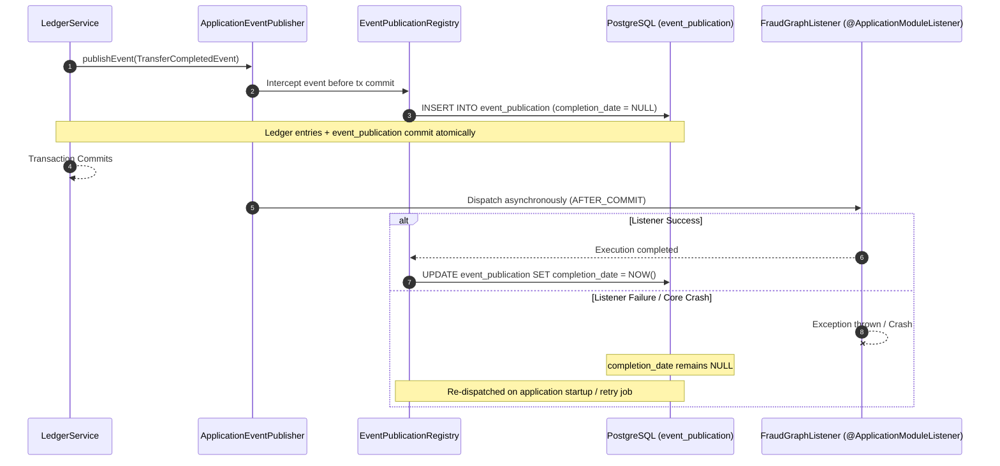

# 📜 Durable Modulith Events & Publication Registry Skill

## 1. Identity & Architectural Mantra

> **"Between processes, stream via NATS JetStream. Within the Core process, publish transactionally via Spring Modulith. The Event Publication Registry makes intra-process delivery durable without external broker hops or internal DLQs."**

This skill governs the architecture, configuration, lifecycle, and verification of **durable in-process domain events** across bounded contexts within Wallet Core (`wallet-core`) using **Spring Modulith Event Publication Registry**.

---

## 2. The Core Separation: Inter-Process vs Intra-Process

```mermaid
flowchart TD
    subgraph InterProcess["Inter-Process Boundary (Governed by SPEC-000.11)"]
        Edge["wallet-edge"] -->|NATS JetStream commands.wallet.*| CoreConsumer["CoreCommandConsumer"]
        CoreConsumer -.->|failed commands| DLQ["commands.dlq.* (DLQ Storage)"]
    end

    subgraph IntraProcess["Intra-Process Bounded Contexts (Governed by SPEC-000.12)"]
        CoreConsumer -->|executes| Tx["Business Transaction (@Transactional)"]
        Tx -->|commit| PG[("PostgreSQL\n(Ledger + event_publication)")]
        Tx -.->|ApplicationEventPublisher| ModulithBus["Spring Modulith Event Bus"]
        ModulithBus -->|@ApplicationModuleListener| Fraud["FraudGraphListener"]
        ModulithBus -->|@ApplicationModuleListener| Savings["SavingsEventListener"]
        Fraud -.->|mark completed| PG
        Savings -.->|mark completed| PG
    end

    subgraph ExternalEgress["External Egress Only"]
        Tx -->|writes outbox| OutboxRelay["OutboxRelayWorker"]
        OutboxRelay -->|NATS JetStream events.*| ExternalConsumers["Audit / Data Lake"]
    end
```

### The DLQ Exception for Internal Bounded Contexts
- **Commands from Edge (`SPEC-000.11`)**: Cross the process boundary over NATS JetStream and route unrecoverable failures to the Dead Letter Queue (`commands.dlq.*`) after retry exhaustion.
- **Events between Internal Modules (`SPEC-000.12`)**: **DO NOT USE DLQ**. The Spring Modulith Event Publication Registry persists event publications directly in PostgreSQL inside the business transaction. Uncompleted publications are retained and automatically re-dispatched upon recovery, rendering internal DLQ broker topics obsolete.

---

## 3. How Event Publication Registry Works ("Automagically")

Spring Modulith makes in-process event delivery durable **automatically ("automagically")**, provided that the system configuration is exact:



---

## 4. Configuration is the Key

Because Spring Modulith handles publication interception, persistence, and completion automatically, **the configuration is the single critical enabler**:

### 4.1 Required Dependencies (`build.gradle`)
```groovy
implementation 'org.springframework.modulith:spring-modulith-starter-core'
implementation 'org.springframework.modulith:spring-modulith-events-api'
implementation 'org.springframework.modulith:spring-modulith-events-jdbc'
implementation 'org.springframework.modulith:spring-modulith-events-jackson'
```

### 4.2 Database DDL Schema (`docker/init/schema.sql`)
Spring Modulith requires the `event_publication` table in PostgreSQL:

```sql
CREATE TABLE IF NOT EXISTS event_publication (
    id UUID NOT NULL,
    listener_id VARCHAR(512) NOT NULL,
    event_type VARCHAR(512) NOT NULL,
    serialized_event TEXT NOT NULL,
    publication_date TIMESTAMP WITH TIME ZONE NOT NULL,
    completion_date TIMESTAMP WITH TIME ZONE,
    PRIMARY KEY (id)
);

CREATE INDEX IF NOT EXISTS idx_event_publication_incomplete
    ON event_publication (listener_id, completion_date)
    WHERE completion_date IS NULL;
```

### 4.3 Application Configuration (`application.properties`)
```properties
# Disable automatic schema generation (managed via docker/init/schema.sql)
spring.modulith.events.jdbc.schema-initialization.enabled=false

# Automatic re-publication of incomplete publications on startup
spring.modulith.events.republish-on-restart=true

# Completion mode: UPDATE (sets completion_date), ARCHIVE, or DELETE
spring.modulith.events.jdbc.completion-mode=UPDATE
```

---

## 5. Listener Implementation Standards

### 5.1 Use `@ApplicationModuleListener` Exclusively
Never use raw `@EventListener` for cross-module business events. `@ApplicationModuleListener` is a Spring Modulith composite annotation that enforces:
- `@Async`: Non-blocking decoupled execution.
- `@TransactionalEventListener(phase = TransactionPhase.AFTER_COMMIT)`: Dispatched only after the publishing business transaction has safely committed.

```java
package br.com.wallet.fraud.internal.listener;

import br.com.wallet.ledger.api.event.TransferCompletedEvent;
import org.springframework.modulith.events.ApplicationModuleListener;
import org.springframework.stereotype.Component;

@Component
public class FraudGraphListener {

    private final RelationalGraphProjector projector;

    public FraudGraphListener(final RelationalGraphProjector projector) {
        this.projector = projector;
    }

    @ApplicationModuleListener
    public void onTransferCompleted(final TransferCompletedEvent event) {
        // Safe idempotent execution
        projector.projectTransfer(event.operationId(), event.from(), event.to(), event.amount());
    }
}
```

### 5.2 Mandatory Idempotency Contract (`I-STREAM-003`)
Because the Event Publication Registry guarantees **at-least-once** delivery across crashes and restarts:
- Every `@ApplicationModuleListener` handler **MUST be idempotent**.
- Use the business event's `operationId` or `eventId` as a deduplication key.
- Re-processing an already completed event must be a deterministic no-op.

---

## 6. Testing & Verification Checklist

1. **Transaction Atomicity Verification**:
   - Assert that if the publishing transaction rolls back, **zero** rows are inserted into `event_publication`.
2. **Completion Verification**:
   - Assert that when all listeners succeed, `completion_date` in `event_publication` is not null.
3. **Incomplete State on Failure**:
   - Simulate a listener exception and assert that `completion_date` remains `NULL`.
4. **Crash Recovery Test**:
   - Populate an incomplete publication in `event_publication`, restart the Spring context, and assert that the listener receives the re-published event.
5. **Modulith Architecture Gate**:
   - Run `ApplicationModules.of(WalletApplication.class).verify()` asserting 0 module violations and clean encapsulation.
