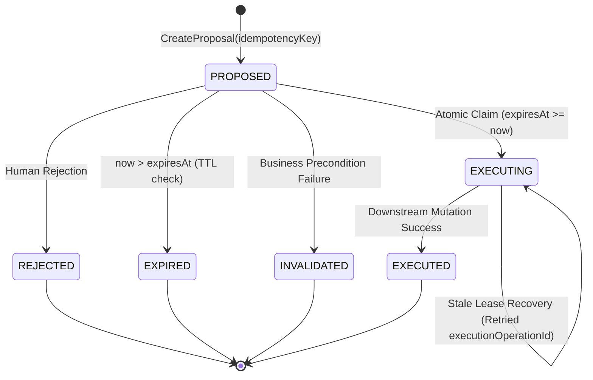

# 🤖 Financial Copilot & Proposal Engine Skill

## 1. Identity & Architectural Mantra

This skill guides the design, implementation, and verification of the **AI Financial Copilot**, the **Financial Proposal Engine**, and the **Model Context Protocol (MCP) Gateway** within the Wallet platform.

> *"AI proposes, humans authorize, and domain use cases execute. The AI Copilot is strictly an asynchronous orchestrator and proposer that never bypasses the human approval gate, never mutates the ledger directly, and never executes without an immutable, idempotent execution lease."*

---

## 2. Core Architectural Invariants

| Invariant ID | Name | Formal Invariant Rule |
| :--- | :--- | :--- |
| **`I-AI-001`** | **Human-in-the-Loop Write Gate** | $\forall \text{m} \in \text{Mutations}, \quad \text{Agent}(\text{m}) \longrightarrow \text{FinancialProposal}(\text{Status} = \text{PROPOSED})$. Execution strictly requires explicit human authorization: $\text{Execute}(p) \iff \text{HumanApprove}(p.\text{id}) \land \text{Status} = \text{PROPOSED} \land \text{now}() \le p.\text{expiresAt}$. |
| **`I-AI-002`** | **Critical Path Isolation** | Core banking transactions and ledger writes MUST NOT depend on AI inference, SLM availability, or MCP transport latency. |
| **`I-AI-003`** | **Modulith Encapsulation Boundary** | Copilot MUST consume downstream capabilities exclusively through public `@NamedInterface("api")` packages (`ledger::api`, `savings::api`, `goals::api`). Direct access to internal DAOs or tables is strictly forbidden (`I-MODULITH-001`). |
| **`I-AI-004`** | **Security Context & 404 Non-Disclosure** | `TenantContext` and user principal MUST be derived strictly from the authenticated security context (`wallet.authenticated_principal`). Cross-tenant access MUST return HTTP 404 Not Found to prevent resource existence enumeration. |
| **`I-AI-005`** | **Atomic Claim Lease & Synchronous TTL** | Transition from `PROPOSED` to execution ownership MUST be atomic and conditional: $\text{Claim}(p) \iff \text{Status} = \text{PROPOSED} \land \text{now}() \le p.\text{expiresAt}$. Synchronous check is authoritative; background sweeper is purely operational housekeeping. |
| **`I-AI-006`** | **Immutable Execution Identity** | Every proposal carries an immutable `executionOperationId`. Retried approvals MUST reuse the exact same `executionOperationId`. Downstream use cases enforce idempotency on this ID. |
| **`I-AI-007`** | **Parameters Snapshot Immutability** | Parameters recorded at creation (`parametersJson`) are frozen with a canonical SHA-256 `parameters_hash`. Execution applies strictly the recorded snapshot. |
| **`I-AI-008`** | **Creation Idempotency & Conflict Gate** | Submitting the same `(tenantId, idempotencyKey)` with an identical payload returns the existing proposal. Reusing the key with a conflicting payload MUST be rejected with HTTP 409 Conflict. |
| **`I-AI-009`** | **Precondition Responsibility Boundary** | Copilot orchestrates coarse preconditions, but authoritative financial rules (balance checks, row locking) remain exclusively owned by downstream use cases. |
| **`I-AI-010`** | **Business Invalidation vs Technical Failure** | Business precondition breaches (insufficient balance, inactive account) transition proposal to `INVALIDATED`. Technical infrastructure failures (timeouts, network drops) MUST NOT invalidate the proposal and remain retryable. |

---

## 3. Triple Identity Taxonomy

To prevent identity coercion and guarantee cross-protocol safety, distinguish three orthogonal identities:

```text
┌───────────────────────────┬─────────────────────────────────────────────────────────────────┐
│ Identity                  │ Semantic Role & Lifecycle                                       │
├───────────────────────────┼─────────────────────────────────────────────────────────────────┤
│ proposalId                │ UUID identifying the persistent FinancialProposal entity.       │
│ executionOperationId      │ Immutable financial operationId passed to ledger/savings/goals. │
│ approvalRequestId         │ Transient request ID of an individual HTTP/MCP approval attempt.│
└───────────────────────────┴─────────────────────────────────────────────────────────────────┘
```

---

## 4. Proposal Lifecycle & Atomic Lease Pattern



### 4.1 Atomic Claim SQL Pattern
```sql
UPDATE copilot_proposals
SET status = 'EXECUTING',
    approved_by = :principal,
    approved_at = :now,
    execution_claimed_at = :now,
    execution_lease_until = :now + INTERVAL '2 minutes'
WHERE id = :id 
  AND tenant_id = :tenantId 
  AND status = 'PROPOSED' 
  AND expires_at >= :now;
```

### 4.2 Stale Lease Recovery Algorithm
When an approval request encounters `status = 'EXECUTING'`:
1. If $\text{now}() \le \text{execution_lease_until}$: return HTTP 409 Conflict ("Proposal execution in progress").
2. If $\text{now}() > \text{execution_lease_until}$: query downstream execution state using `executionOperationId`.
   - If downstream succeeded $\to$ update status to `EXECUTED` with cached execution reference.
   - If downstream was never executed $\to$ re-dispatch with the same `executionOperationId` under renewed lease.

---

## 5. Model Context Protocol (MCP) Integration Guidelines

1. **Adapter Boundary**: The MCP Server (`SPEC-004.1`) is strictly an edge transport adapter implemented via Spring AI MCP with Streamable HTTP on WebFlux.
2. **Read vs Mutation Tool Separation**:
   - Read Tools (`wallet_get_balance`, `wallet_get_cashflow_projections`) invoke public capability use cases directly.
   - Mutation Tools (`copilot_propose_transfer`, `copilot_propose_savings_rule`) invoke `ProposalUseCase.createProposal` returning a `PROPOSED` entity.
3. **Elicitation Protocol**:
   - Compatible clients receive an interactive `Form Elicitation` confirmation dialog (`input_required`).
   - Clients lacking elicitation receive proposal confirmation details and external review instructions. Lack of elicitation support **never** triggers autonomous execution (`I-MCP-002`).
4. **Zero Sensitive Credentials**: Banking PINs, passwords, and card PANs MUST NEVER be requested via MCP forms; sensitive authentication requires URL Elicitation or secure out-of-band channels (`I-MCP-003`).

---

## 6. Testing & Verification Standards (`I-TDD-002`)

Every implementation task must satisfy the **Mandatory Test Triad**:
1. **Canonical Positive Path**: Proposal creation $\to$ atomic claim $\to$ downstream execution with identical `executionOperationId` $\to$ status `EXECUTED`.
2. **Boundary & Validation Gate**: Expired proposal ($\text{now} > \text{expiresAt}$) rejected with HTTP 409; duplicate key with conflicting payload rejected with HTTP 409; cross-tenant request returns HTTP 404.
3. **Concurrency & Resilience Gate**: 100 concurrent approval threads on the same proposal converge on exactly 1 atomic claim and 1 downstream execution. Database timeout leaves proposal retryable without transitioning to `INVALIDATED`.
