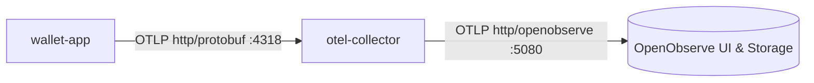

# 🔍 Observability & Tracing Skill

## 1. Identity & Objective

This skill guides end-to-end distributed tracing, metrics collection, and structured logging using **OpenTelemetry (OTel)** and **OpenObserve** in Wallet Service.

---

## 2. Telemetry Architecture

---

## 3. Distributed Tracing & Baggage Propagation

### Baggage Key: `operationId`
- Every request carries `operationId` in W3C Baggage headers (`baggage: operationId=...`).
- The `TracingAspect` (`core/src/main/java/.../TracingAspect.java`) intercepts methods annotated with `@Traceable("span.name")` and injects `operationId` as both a span attribute and baggage.
- Logs format: `%5p [traceId=%X{traceId} spanId=%X{spanId} operationId=%X{operationId}]`

---

## 4. Tracing Conventions

- **Use Case Spans**: Create spans at use case boundaries (e.g. `transfer.execute`, `deposit.execute`, `outbox.process`).
- **Database Spans**: Spring Boot JDBC auto-instrumentation captures SQL statement durations.
- **Attributes to Record**:
  - `wallet.from_id`, `wallet.to_id`
  - `wallet.amount`
  - `fraud.decision`, `fraud.score`
  - `operation.id`

---

## 5. Metrics & Logging Configuration

- Protocol: `OTEL_EXPORTER_OTLP_PROTOCOL=http/protobuf`
- Endpoint: `http://otel-collector:4318/v1/metrics`, `v1/traces`, `v1/logs`
- Collector forwards to OpenObserve at `http://openobserve:5080/api/default` with Basic Auth.
