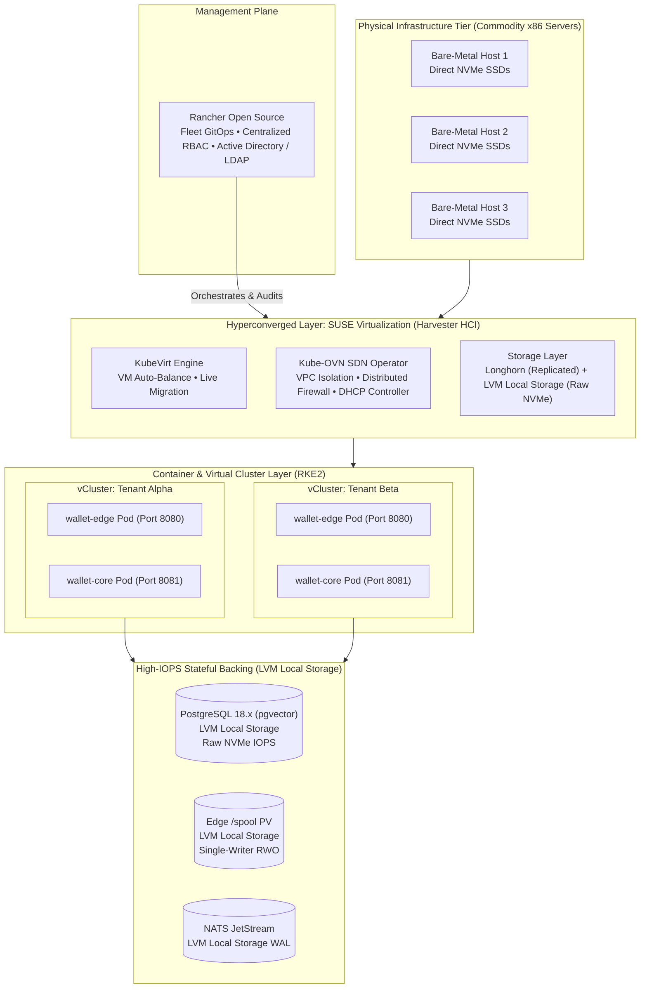

# 🏢 On-Premises Infrastructure & Appliance Topology Skill

## 1. Identity & Architectural Mantra

This skill guides the design, deployment, storage binding, and operational orchestration of the **Wallet Service on modern on-premises enterprise infrastructure**. It formalizes the interplay between **Rancher Open Source**, **SUSE Virtualization (Harvester HCI)**, **vCluster**, and hyperconverged add-ons to deliver a carrier-grade financial appliance without public-cloud vendor lock-in.

> *"Centralize governance with Rancher, virtualize commodity compute with SUSE Virtualization, isolate tenants with vCluster, and bypass network replication latency using LVM Local Storage for high-IOPS financial state."*

---

## 2. Component Comparison & Architectural Role Matrix

| Component | Layer / Architectural Role | Primary On-Premises Use Case | Key Differentiating Features | Integration Touchpoint in Wallet Platform |
| :--- | :--- | :--- | :--- | :--- |
| **Rancher (Open Source)** | **Management Plane / Orchestrator** | Multi-cluster Kubernetes management, centralized RBAC, policy enforcement. | Unified UI/API for managing downstream clusters (RKE2, K3s, Harvester), Fleet GitOps engine, centralized auth (LDAP, Active Directory, OIDC). | Single-pane-of-glass discovering, importing, and orchestrating SUSE Virtualization guest clusters and Wallet deployments. |
| **SUSE Virtualization (Harvester HCI)** | **Infrastructure / Hyperconverged Layer** | Bare-metal HCI turning commodity servers into a virtualized computing pool for VMs and containers. | Built on KubeVirt and Longhorn; live migration, built-in storage/network replication, PXE/ISO bare-metal automated deployment. | Provides the underlying compute, NVMe storage pools, and network bridges consumed by RKE2 guest clusters and database VMs. |
| **vCluster (Virtual Clusters)** | **Multi-Tenancy / Virtualization Plane** | Lightweight, fast Kubernetes multi-tenancy inside a single host Kubernetes cluster. | Runs isolated control planes (API server, etcd) inside worker namespaces; drastically reduces resource overhead vs spinning up full VMs. | Deployed on top of Harvester guest clusters or RKE2 clusters to segment developer, staging, and isolated customer tenant workloads. |
| **VM Auto-Balance** *(Add-on)* | **Workload Scheduling & Optimization** | High availability and automated VM placement across physical bare-metal hosts. | Continuously monitors host CPU/memory pressure; triggers non-disruptive KubeVirt live migration when node thresholds are breached. | Runs as a Harvester operator; balances nodes hosting Core database VMs and NATS clusters without manual intervention. |
| **VM DHCP Controller** *(Add-on)* | **Network Management** | Deterministic Layer-2 network IP allocation for virtual appliances and VMs. | Integrated DHCP server managing IP leases directly over Harvester VLAN networks; binds static MAC-to-IP leases defined in manifests. | Eliminates reliance on external legacy DHCP servers for static internal routing and multi-homed interfaces. |
| **Kube-OVN Operator** *(Add-on)* | **Software-Defined Networking (SDN)** | Enterprise-grade advanced overlay/underlay networking and micro-segmentation. | Subnet isolation, VPC multi-tenancy, distributed firewall / security groups, QoS rate limiting, and BGP/OVS route injection. | Enforces zero-trust isolation around Core port 8081, restricting public traffic and permitting only authenticated Edge ingress and telemetry scrapers. |
| **LVM Local Storage** *(Add-on)* | **High-Performance Node Storage** | Low-latency, direct-attached local disk performance for stateful database and journal workloads. | Dynamic local volume provisioning backed by host Logical Volume Manager (LVM), bypassing network storage replication overhead. | Essential for I/O-intensive state: PostgreSQL 18.x ACID write path, Edge `/spool` binary journals, and NATS JetStream WAL where 3x network storage latency is prohibitive. |

---

## 3. Architectural Mapping to Wallet Service Deployment (Phase 000.9.2)

### 3.1 Edge `/spool` Journal Storage Binding (`I-STORAGE-001`, `I-STORAGE-002`)
- **Problem**: Longhorn 3x network-replicated storage introduces cross-node TCP hops, pushing fsync group-commit latency from $<500\mu s$ to $>30\text{ms}$, saturating the Edge bulkhead under load.
- **Solution**: Edge persistent volume claims bind to the **LVM Local Storage Add-on** (`StorageClass: harv-lvm-local`).
- **Guarantee**: Delivers direct NVMe block I/O performance ($P99 < 500\mu s$ fsync) with single-writer exclusive locking (`.spool.lock`), honoring Option A/B requirements in `SPEC-000.9.2`.

### 3.2 Core PostgreSQL & NATS JetStream WAL
- PostgreSQL and NATS JetStream write paths require sustained high-IOPS random writes.
- Binding them to LVM Local Storage ensures zero write amplification across the storage network fabric.
- High availability is achieved at the application layer (NATS 3-node JetStream cluster, PostgreSQL Patroni/streaming replication) rather than paying a 3x penalty in the block storage layer.

### 3.3 Multi-Tenancy Spectrum: vCluster vs Dedicated VMs
- **Lightweight Multi-Tenancy (Profile P2)**: For standard corporate tenants or staging environments, **vCluster** provisions independent virtual Kubernetes API servers and etcd instances inside a single shared RKE2 guest cluster. Slashes RAM/CPU footprint by $80\%$ compared to spinning up full VMs.
- **Strict Hard Isolation (Profile P1 Dedicated)**: For regulatory or high-volume enterprise partners, provision dedicated guest VMs via SUSE Virtualization, granting dedicated CPU cores, pinned RAM, and dedicated LVM disk partitions.

### 3.4 Network Segmentation & Firewalling via Kube-OVN
- **Perimeter Edge**: Public ingress (HTTP/2 on 8080, HTTP/3 over QUIC on UDP 8443) terminates at the Edge Gateway.
- **Core Management Isolation**: Core management port `8081` is protected by a Kube-OVN `SecurityGroup` allowing traffic only from Edge pods and internal Prometheus monitors. Direct external access to Core is blocked at the Open vSwitch layer. Command flow is strictly NATS JetStream (`I-MESSAGING-001`).

---

## 4. Cost-Conscious Deployment Progression & Tiers

The Wallet Service supports a progressive spectrum of infrastructure footprints, balancing cost, operational complexity, and enterprise governance:

| Dimension | Plan A: Local Dev / CI | Plan B: Low-Cost Lean Appliance | Plan C: Medium-Cost Enterprise On-Prem | Plan D: Public Cloud Elastic Scale |
| :--- | :--- | :--- | :--- | :--- |
| **Primary Target** | Developer workstation, automated CI | Edge branches, retail kiosks, budget-conscious bare-metal | Regional enterprise DCs, regulated private cloud | Global SaaS, hyperscale cloud (GCP / AWS) |
| **Orchestrator** | Docker Compose | Docker Compose + Portainer CE UI (Zero K8s) | Full Rancher Open Source/Prime + RKE2 | Managed Kubernetes (GKE Standard / EKS) |
| **Virtualization** | None (Host OS) | None (Bare-metal Linux or simple hypervisor) | SUSE Virtualization (Harvester HCI / KubeVirt) | Cloud Provider Hypervisor (Borg / Nitro) |
| **Control Plane Tax** | 0 MB / 0 Cores | Negligible (<100MB RAM, 0 CPU tax) | ~8–16 GB RAM, 4–8 Cores (etcd, k8s control plane) | Managed by Cloud Provider (Zero node compute tax) |
| **Total Host Footprint**| 4 vCPU, 8 GB RAM | **4–8 vCPU, 8–16 GB RAM** (~6.38 GB capped) | 3+ Bare-Metal Nodes (32+ Cores, 128+ GB RAM) | Elastic Auto-Scaling Node Pools |
| **Storage Binding** | Docker Named Volumes | Direct HostPath NVMe (`Option A`, `I-STORAGE-002`) | Harvester LVM Local Storage (`Option B`, `I-STORAGE-001`) | Cloud Persistent Disks (RWO Block SSD) |
| **Network & Security**| Docker Bridge Network | Linux UFW / iptables + Host network binding | Kube-OVN SDN Operator + Distributed Firewalls | Cloud VPC, Security Groups, Cloud Armor |
| **Multi-Tenancy** | Single workspace | Process / Container isolation | vCluster (Virtual K8s) + Dedicated Harvester VMs | K8s Namespaces + Cloud IAM / Workload Identity |
| **Infrastructure Cost**| $0 | **Lowest TCO** (Commodity hardware, $0 software license) | Medium (Commodity HCI clusters, open-source or SUSE Prime) | Elastic Usage-Based Cloud Billing |

### 4.1 Plan B Architectural Philosophy: Slashing the Kubernetes Tax
In single-server appliances or distributed retail/branch sites, spinning up a full multi-node Kubernetes cluster (etcd quorum, kube-apiserver, kube-scheduler, ingress controllers) incurs a prohibitive "Kubernetes Tax" consuming 8+ GB RAM and 4+ CPU cores before any application container starts.
Plan B eliminates this overhead:
- Containers run via standard Docker Engine orchestrated by Docker Compose (`docker-compose.appliance.yaml`).
- **Visual Management**: Integrates lightweight **Portainer CE** (~50–128MB RAM) listening on HTTP `9000` / HTTPS `9443` bound to `/var/run/docker.sock`, giving on-site operators visual health inspection, live container log streaming, and single-click stack redeployments without needing command-line access.
- Direct NVMe HostPath bindings provide bare-metal IOPS for Edge `/spool` and PostgreSQL without storage virtualization overhead.
- **GitOps Continuous Deployment**: Portainer exposes stack redeployment webhooks (`http://<appliance>:9000/api/stacks/webhooks/...`) triggered automatically by GitHub Actions (`ci-cd-appliance.yml`) upon publishing new OCI images to GHCR, achieving zero-CLI remote appliance upgrades.
- **Serverless Helm Distribution**: Enterprise Helm charts (`deploy/helm/wallet-platform`) are packaged and published to GitHub Pages (`gh-pages` branch) via `helm-pages.yml`, eliminating the need to host external artifact registries for Plan C (Harvester HCI) and Plan D (GKE) deployments.
- Total memory footprint remains strictly under 8 GB RAM (~5.8 GB allocated with VictoriaLogs/Traces), allowing high-performance transaction processing on low-cost commodity x86 servers.

---

## 5. Storage Topology Decision Guide

| Workload Component | Recommended StorageClass | Underlying Engine | Durability & Performance Rationale |
| :--- | :--- | :--- | :--- |
| **`wallet-edge` `/spool`** | `harv-lvm-local` / `hostpath` | LVM Local Storage | **Sub-millisecond fsync barrier**. Single-writer RWO; avoids 3x network replication latency spikes (`I-STORAGE-001`). |
| **PostgreSQL Data Directory** | `harv-lvm-local` | LVM Local Storage | **Maximum NVMe IOPS**. Eliminates network storage bottlenecks for ACID transaction commit logs. |
| **NATS JetStream WAL** | `harv-lvm-local` | LVM Local Storage | Low-latency message disk queuing and server-side deduplication log. |
| **VictoriaLogs / Traces / OpenObserve** | `longhorn` | Replicated Block | Elastic, distributed storage where multi-node replication is preferred over raw IOPS. |

---

## 6. Implementation Guardrails for On-Premises Platforms

- **NEVER** bind Edge `/spool` or PostgreSQL transaction logs to network-replicated NFS or CephFS filesystems; always use `LVM Local Storage` or direct NVMe block volumes (`I-JOURNAL-001`).
- **NEVER** expose Core port `8081` to external network switches; enforce micro-segmentation using Kube-OVN SecurityGroups or NetworkPolicies.
- **ALWAYS** configure `StorageClass: harv-lvm-local` with `volumeBindingMode: WaitForFirstConsumer` to ensure pods schedule onto the physical host that physically hosts the local LVM volume.
- **ALWAYS** leverage Rancher Fleet GitOps for deploying Helm charts across multiple appliance sites uniformly.
- **ALWAYS** configure VM Auto-Balance thresholds ($\le 80\%$ host memory/CPU) to guarantee sufficient headroom for live migration during physical server maintenance.

