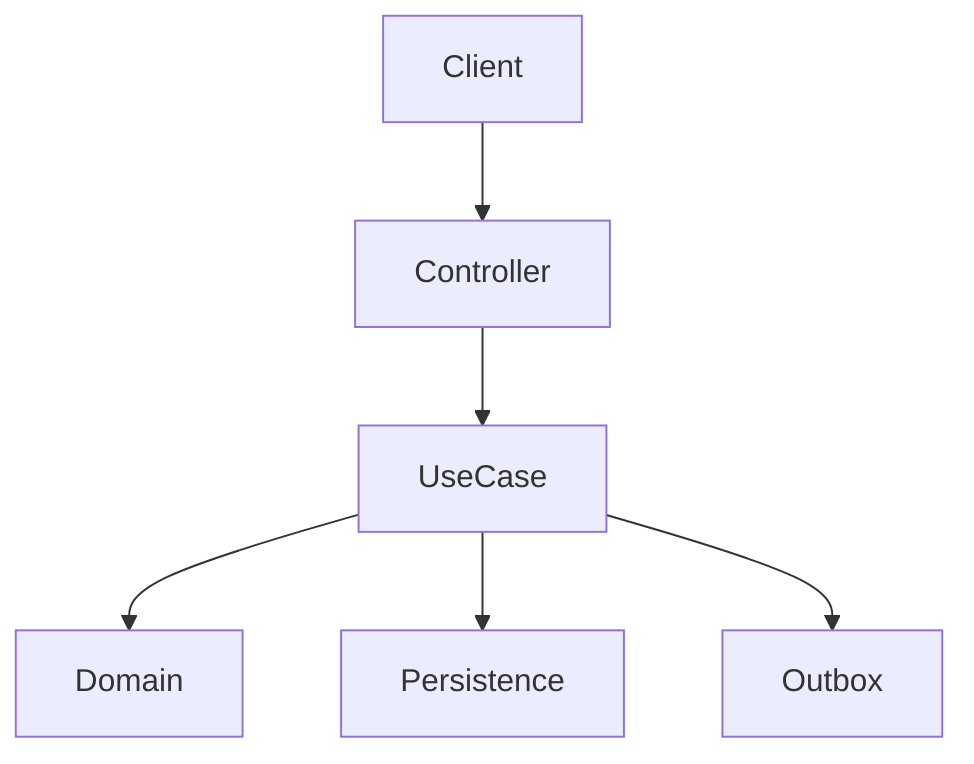

# 📐 Architecture Plan: PLAN-XXX — [Feature Title]

- **Associated Spec**: [`SPEC-XXX.md`](file:///.spec/SPEC-XXX.md)
- **Status**: Draft | Approved | Executed
- **Date**: YYYY-MM-DD

---

## 1. Technical Strategy & Architecture Overview

[High-level overview of the architectural approach, patterns used, and design decisions.]



---

## 2. Module & Layer Boundaries

- **`:core` / Domain**: [Classes, records, domain exceptions to add or modify]
- **`:fraud`**: [Fraud rules, caching policies, or Lua scripts]
- **Application (`:`)**: [Use Cases, DAO interfaces, REST controllers, DTOs]
- **Infrastructure**: [SQL migrations, Redis commands, NATS publisher/listeners]

---

## 3. Data Model & Schema Changes

### Database Tables / SQL
```sql
-- DDL or schema alterations
```

### Redis Keys & Data Structures
- Key pattern: `user:{userId}:...`
- Type: `Hash` | `SortedSet` | `String`
- TTL: `...`

---

## 4. Concurrency & Locking Strategy

- Lock acquisition order: [e.g. ordered by UUID]
- Transaction isolation level: [e.g. Read Committed with SELECT FOR UPDATE]
- Idempotency storage mechanism: [e.g. Redis key TTL / DB outbox unique constraint]

---

## 5. Security & Failure Analysis

- Resilience patterns: [Circuit Breakers, Bulkheads, Fallback caches]
- Fraud evaluation point: [Pre-transaction synchronous evaluation]
- Rollback mechanisms: [Standard Spring @Transactional rollback on unchecked exceptions]
