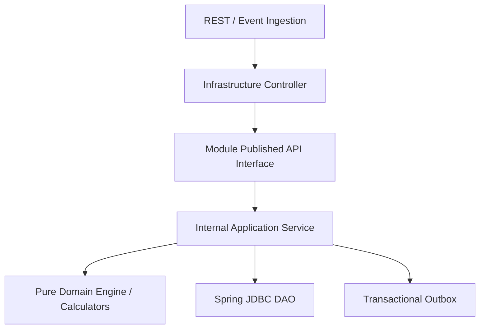

# 📐 Architecture Plan: PLAN-XXX — [Feature Title]

- **Associated Spec**: [`SPEC-XXX.md`](file:///.spec/SPEC-XXX.md)
- **Status**: Draft | Approved | Executed
- **Date**: YYYY-MM-DD
- **Target Module**: [e.g. br.com.wallet.intelligence]
- **Architectural Scope**: Conforms to Spring Modulith boundaries (`I-MODULITH-001`, `I-MODULITH-002`) and Atomic Spec Slicing (`I-SDD-006`).

---

## 1. Architecture Overview & Component Diagram

[High-level overview of the architectural approach, module relationships, and event flows.]



---

## 2. Cross-Feature & Invariant Impact Matrix (`I-SDD-005`)

| Participating Module | Affected Flow / Contract | Potential Side Effect / Failure Mode | Invariant / Mitigation |
| :--- | :--- | :--- | :--- |
| **`ledger`** (Core) | [e.g. Balance checks, transfers] | [e.g. Row lock contention] | `I-CONCURRENCY-001` (Deterministic UUID locking) |
| **`fraud`** (Gate) | [e.g. Pre-execution gate query] | [e.g. Gate query latency] | `I-FRAUD-002` (Dragonfly hot cache P99 < 2ms) |
| **`savings`** (Automation)| [e.g. Event listener triggers] | [e.g. Cascading loops] | `I-SAVINGS-001` (Deterministic SHA-256 operationId) |
| **`goals`** (Strategy) | [e.g. Cashflow profile inputs] | [e.g. Profile out-of-sync] | `I-GOAL-002` (Liquidity safety buffer) |

---

## 3. Spring Modulith Module Topology & Packaging

```text
br.com.wallet.<module>
├── package-info.java                   (@ApplicationModule with allowedDependencies)
├── api/                                (Published Public Contracts - @NamedInterface("api"))
│   ├── <Capability>UseCase.java        (Service Interfaces)
│   ├── dto/                            (Commands, Requests, Responses)
│   └── model/                          (Domain Records, Enums)
└── internal/                           (Sealed Implementation Packages)
    ├── application/                    (Use Case implementations)
    ├── engine/                         (Pure In-Memory Calculators - Zero I/O)
    ├── listener/                       (@ApplicationModuleListener handlers)
    └── persistence/                    (Spring JDBC DAOs, RowMappers)
```

---

## 4. Data Model & Storage Design

### PostgreSQL DDL (`docker/init/schema.sql`)
```sql
-- DDL with check constraints, foreign keys, and indexes
```

### Redis / Dragonfly Hot Cache Keys
- Key Pattern: `[module]:[type]:[id]`
- Data Structure: `Hash` | `String` | `SortedSet`
- TTL: `...`

---

## 5. Concurrency, Locking & Idempotency Strategy

- **Deterministic Lock Ordering (`I-CONCURRENCY-001`)**: `SELECT FOR UPDATE` on accounts sorted by UUID ascending.
- **Idempotency Mechanism (`I-IDEMPOTENCY-001`)**: Client `operation_id` checked before state mutation.
- **Transactional Boundary (`I-ATOMICITY-001`)**: Single atomic Spring `@Transactional` block encompassing account locks, ledger writes, and outbox event persistence.

---

## 6. Failure Modes, Resilience & Observability

- **Graduated Degradation**: Contextual fail-closed on high risk, safe deterministic fallback on cache misses.
- **OpenTelemetry Instrumentation (`I-OBS-001`)**: Baggage propagation of `operation_id` across database, outbox, and messaging boundaries.
- **Zero Spec-Drift Checklist**: Plan must be verified against actual code before convergence.
