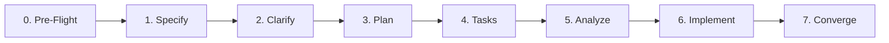

# 🚀 SDD Feature Workflow (V2 Deterministic Edition)

This workflow guides the implementation of a new capability or feature from pre-flight context discovery to bi-directionally verified production code.

---

## 8-Stage Pipeline

### Stage 0: Pre-Flight Audit & Context Hierarchy Check
- Audit `.histories/` and preceding `.spec/summaries/SUMMARY-*.md` for past ADRs, established invariants, and lessons learned.
- Consult the **5-layer context hierarchy**:
  - **L0: Constitution** ([`.agents/rules/constitution.md`](file:///.agents/rules/constitution.md))
  - **L1: Rules** ([`.agents/rules/`](file:///.agents/rules/))
  - **L2: Skills** ([`.agents/skills/`](file:///.agents/skills/))
  - **L3: Specifications** ([`.spec/`](file:///.spec/))
  - **L4: Source Code** (targeted inspection)
- Identify existing capability boundaries, database tables, and published module interfaces.

### Stage 1: Specification (`.spec/SPEC-XXX-<feature>.md`)
- Create `.spec/SPEC-XXX-<feature>.md` using [`.agents/skills/spec-driven-development/templates/spec-template.md`](file:///.agents/skills/spec-driven-development/templates/spec-template.md).
- Enforce **Atomic Slicing (`I-SDD-006`)**: Spec scope must be $\le 250$ lines.
- Tag every requirement with **MoSCoW Prioritization (`I-SDD-004`)**: `[MUST]`, `[SHOULD]`, `[COULD]`, `[WON'T]`.
- Define formal **Mathematical Invariants** (`I-XXX`) and state transition formulas.
- Build the **Cross-Feature Impact Matrix (`I-SDD-005`)**: Evaluate side-effects on ledger concurrency, account lifecycle, fraud gate SLAs, outbox delivery, and downstream modules.
- **GATE 1 (Human Ratification)**: Present specification to the user and request formal ratification before proceeding.

### Stage 2: Clarify & Trade-off Resolution
- Review open questions, edge cases, failure modes, and performance trade-offs with the user.
- Resolve any ambiguities before committing to the architectural plan.

### Stage 3: Architecture Planning (`.spec/plans/PLAN-XXX-<feature>.md`)
- Create `.spec/plans/PLAN-XXX-<feature>.md` using [`.agents/skills/spec-driven-development/templates/plan-template.md`](file:///.agents/skills/spec-driven-development/templates/plan-template.md).
- Document Spring Modulith module boundaries, package visibility (`.api` vs `.internal`), and `@NamedInterface` declarations (`RULE-CAP-001` - `RULE-CAP-007`).
- Define SQL DDL migrations, PostgreSQL/Dragonfly data structures, Lua scripts, and entity relationships.
- Detail concurrency strategy: deterministic locking order (`I-CONCURRENCY-001`), row locks, and idempotency (`I-IDEMPOTENCY-001`).
- Provide ADRs (Architecture Decision Records) with alternatives considered.
- **GATE 2 (Human Sign-off)**: Present architecture plan to the user for formal sign-off.

### Stage 4: Task Breakdown & Active Task Cards (`.spec/tasks/TASKS-XXX-<feature>.md`)
- Create `.spec/tasks/TASKS-XXX-<feature>.md` using [`.agents/skills/spec-driven-development/templates/tasks-template.md`](file:///.agents/skills/spec-driven-development/templates/tasks-template.md).

- Build the **Traceability Matrix**: Map every `REQ-XXX` and `I-XXX` directly to planned verification tests and task IDs.
- Structure tasks strictly in TDD order: Domain Primitives $\rightarrow$ Persistence / DAOs $\rightarrow$ Application Services $\rightarrow$ API / Integration.
- Prioritize all `[MUST]` tasks first (`I-SDD-004`).
- Structure each implementation task with an **Active Task Card**:
  - Context & Focus Files
  - Red / Green / Refactor steps
  - Mathematical Invariant Assertions
  - Modulith Boundary Checks

### Stage 5: Pre-Implementation Consistency Gate (Analyze)
- Delegate to `spec-analyst` subagent or perform rigorous consistency analysis.
- Verify 100% traceability: every `REQ-XXX` has a task, every `I-XXX` has an exact assertion, zero orphan tasks.
- Verify that schema definitions and interface signatures match across Spec, Plan, and Tasks.

### Stage 6: TDD Implementation (Zero Vibe Coding)
- Delegate isolated tasks to `tdd-implementer` subagent or execute incrementally.
- Enforce **Zero Vibe Coding (`I-TDD-002`)**:
  - **Red**: Write failing unit or integration tests first. Assert exact failure cause.
  - **Green**: Write minimal code to pass.
  - **Refactor**: Clean up and optimize while keeping all tests green.
  - **Mandatory Test Triad**: Positive path + Invalid inputs + Domain boundary / rejection.
  - **Exact Monetary Arithmetic**: Canonical `BigDecimal` scale 2 arithmetic using `isEqualByComparingTo()`. Floating-point math is strictly forbidden.

### Stage 7: Verification & Convergence
- Run the full test suite: `./gradlew test`.
- Verify Spring Modulith architectural integrity (`ModulithArchitectureTest.verifyArchitecture()`).
- Verify JaCoCo coverage thresholds ($\ge 70\%$ overall, $\ge 85\%$ domain/fraud).
- Perform **Bi-directional Equivalence Gate (`I-SDD-003`)**: Reconcile implementation code, schemas, and documentation. Backport any technical adjustments immediately to eliminate spec-code drift.
- Author `.spec/summaries/SUMMARY-XXX-<feature>.md` including:
  - Executive summary and architectural delivery.
  - Invariant and governance verification matrix.
  - **Practical Verification Guide & Seed Data Fixtures (`I-SDD-002`)**: Ready-to-execute Docker commands, SQL seeds, cURL requests, state validation queries, and expected outputs.

