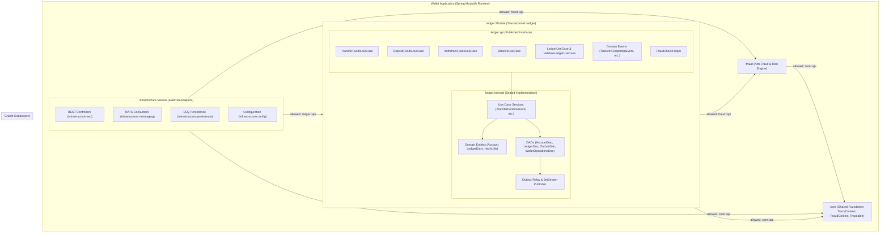

# 📐 Architecture Plan: PLAN-000 — Architecture Alignment & Modulith Core Baseline

- **Associated Spec**: [`SPEC-000-architecture-alignment-modulith-baseline.md`](file:///.spec/SPEC-000-architecture-alignment-modulith-baseline.md)
- **Status**: Approved
- **Date**: 2026-08-22
- **Author**: Antigravity Financial Architecture Team

---

## 1. Technical Strategy & Architecture Overview

The purpose of **`PLAN-000`** is to restructure the existing codebase into a verified **Spring Modulith baseline** with explicit module boundaries before building new business capabilities.

### Architectural Blueprint

### Architectural Blueprint (4-Module DAG)



---

## 2. Spring Modulith Dependency Configuration

We update the root `build.gradle` to import the **Spring Modulith BOM** and starters:

```groovy
ext {
    springModulithVersion = "2.1.0" // Aligned with Spring Boot 4.x
}

dependencyManagement {
    imports {
        mavenBom "org.springframework.modulith:spring-modulith-bom:${springModulithVersion}"
    }
}

dependencies {
    // Spring Modulith Runtime & Test
    implementation 'org.springframework.modulith:spring-modulith-starter-core'
    testImplementation 'org.springframework.modulith:spring-modulith-starter-test'
    testImplementation 'org.springframework.modulith:spring-modulith-docs'
}
```

---

## 3. Detailed Package Migration Mapping

| Current Location | Target Location | Modulith Module & Visibility | Responsibility |
| :--- | :--- | :--- | :--- |
| `fraud.domain.context.FraudContext` | `br.com.wallet.core.context.FraudContext` | `core` (**PUBLIC / API**) | Shared tracing and fraud context model |
| `br.com.wallet.application.usecase.*` | `br.com.wallet.ledger.api.*` | `ledger` (**PUBLIC / API**) | Published Use Case contracts (`TransferFundsUseCase`, etc.) |
| `br.com.wallet.domain.context.*` | `br.com.wallet.ledger.api.context.*` | `ledger` (**PUBLIC / API**) | Context parameters (`Transfer`, `Deposit`, `Withdraw`, `Wallet`) |
| `br.com.wallet.domain.event.*` | `br.com.wallet.ledger.api.event.*` | `ledger` (**PUBLIC / API**) | Published Domain Events (`TransferCompletedEvent`, `EventPublisher`) |
| `br.com.wallet.domain.AccountBalance` | `br.com.wallet.ledger.api.domain.AccountBalance` | `ledger` (**PUBLIC / API**) | Balance snapshot projection model |
| `br.com.wallet.domain.LedgerValidationResult` | `br.com.wallet.ledger.api.domain.LedgerValidationResult` | `ledger` (**PUBLIC / API**) | Ledger integrity result model |
| `br.com.wallet.application.fraud.FraudCheckHelper` | `br.com.wallet.ledger.api.guard.FraudCheckHelper` | `ledger` (**PUBLIC / API**) | Pre-execution fraud check coordination with `:fraud` |
| `br.com.wallet.application.service.*` | `br.com.wallet.ledger.internal.service.*` | `ledger` (**INTERNAL**) | Use Case implementations with `@Transactional` boundaries |
| `br.com.wallet.domain.Account`, `LedgerEntry` | `br.com.wallet.ledger.api.domain.*` | `ledger` (**PUBLIC / API**) | Core entities, SHA-256 hash chaining |
| `br.com.wallet.util.HashUtil` | `br.com.wallet.ledger.internal.utils.HashUtils` | `ledger` (**INTERNAL**) | Deterministic cryptographic hashing |
| `br.com.wallet.infrasctructure.persistence.*` | `br.com.wallet.ledger.internal.persistence.*` | `ledger` (**INTERNAL**) | JDBC DAOs with row-level `SELECT FOR UPDATE` |
| `br.com.wallet.infrasctructure.outbox.*` | `br.com.wallet.ledger.internal.outbox.*` | `ledger` (**INTERNAL**) | Transactional Outbox persistence and publishing |
| `br.com.wallet.interfaces.rest.*` | `br.com.wallet.infrastructure.rest.*` | `infrastructure` (**INTERNAL**) | REST controllers, OpenAPI specs, DTOs, mappers |
| `br.com.wallet.infrasctructure.messaging.*` | `br.com.wallet.infrastructure.messaging.*` | `infrastructure` (**INTERNAL**) | NATS JetStream command workers and DLQ consumers |
| `br.com.wallet.infrasctructure.persistence.DlqOperationsDao` | `br.com.wallet.infrastructure.persistence.DlqOperationsDao` | `infrastructure` (**INTERNAL**) | DLQ persistence operations |
| `br.com.wallet.config.*` | `br.com.wallet.infrastructure.config.*` | `infrastructure` (**INTERNAL**) | Spring configuration beans (OTel, Redis, NATS) |

---

## 4. Automated Architecture Verification Test

We implement `ModulithArchitectureTest` to enforce module encapsulation on every build:

```java
package br.com.wallet;

import org.junit.jupiter.api.DisplayName;
import org.junit.jupiter.api.Test;
import org.springframework.modulith.core.ApplicationModules;
import org.springframework.modulith.docs.Documenter;

@DisplayName("Spring Modulith Architecture Verification")
class ModulithArchitectureTest {

    private final ApplicationModules modules = ApplicationModules.of(WalletApplication.class);

    @Test
    @DisplayName("Verify that all module boundaries and package encapulations are strictly respected")
    void verifyArchitecture() {
        modules.verify();
    }

    @Test
    @DisplayName("Generate PlantUML component diagrams and documentation")
    void generateDocumentation() {
        new Documenter(modules)
            .writeModulesAsPlantUml()
            .writeIndividualFilesAsPlantUml();
    }
}
```

---

## 5. Architectural Decision Records (ADRs)

### 🏛️ ADR-000-1: Spring Modulith for In-Process Modular Architecture
- **Context**: We need modularity for future capabilities (Smart Savings, Goal Engine, AI Copilot) without dynamic JAR or OSGi runtime complexity.
- **Decision**: Adopt Spring Modulith 2.1.x as the architectural framework for in-process application modules and structural verification.
- **Consequences**:
  - Positive: Clean `api` vs `internal` separation, verified by unit tests in $<2\text{s}$.
  - Positive: Ready-to-use `@ApplicationModuleListener` for internal event routing.
  - Neutral: Requires clean package organization under root package `br.com.wallet`.

### 🏛️ ADR-000-2: 4-Module DAG Layout & Namespace Disambiguation (`ledger`)
- **Context**: Gradle already had subprojects `:core` (`br.com.wallet.core`) and `:fraud` (`br.com.wallet.fraud`). To prevent module collision and package stutter (`wallet.wallet`), the root domain is named `ledger` (`br.com.wallet.ledger`).
- **Decision**: Establish a clean 4-module Directed Acyclic Graph (DAG):
  1. `core` (`br.com.wallet.core`): Shared foundational subproject (`TraceContext`, `FraudContext`, `Traceable`, `IdempotencyException`).
  2. `fraud` (`br.com.wallet.fraud`): Anti-Fraud engine depending on `core::api`.
  3. `ledger` (`br.com.wallet.ledger`): Core Banking & Transactional Ledger domain depending on `core::api` and `fraud::api`.
  4. `infrastructure` (`br.com.wallet.infrastructure`): Framework adapters depending on `ledger::api`, `fraud::api`, `core::api`.
- **Consequences**:
  - Positive: Zero module cycles. Complete DAG compliance.
  - Positive: Allows future capability modules (`savings`, `goals`, `intelligence`, `copilot`) to sit symmetrically as peer modules under `br.com.wallet.*`.

### 🏛️ ADR-000-3: JaCoCo Coverage Automation & SDD Enforcement
- **Context**: Invariant verification and code quality require automated coverage monitoring without manual guesswork.
- **Decision**: Configure JaCoCo across root and subprojects, bind `test.finalizedBy jacocoTestReport`, and enforce minimum coverage targets ($\ge 70\%$ overall, $\ge 85\%$ core services & fraud rules) in SDD Stage 7.

---

## 6. Verification and Regression Prevention Strategy

1. **Step-by-Step Migration**:
   - Update `build.gradle` with Modulith dependencies.
   - Refactor packages and update import statements systematically.
   - Run `ModulithArchitectureTest` to assert clean verification.
   - Run existing unit tests (`TransferFundsServiceTest`, `LedgerValidationServiceTest`, `SlidingWindowRuleTest`).
   - Run existing integration tests (`TransferFundsScenarioTest`, `LedgerScenarioTest`, `OutboxPublisherTest`).
2. **Zero Invariant Deviation**:
   - Hash calculations, SQL table structures, and fraud evaluation points remain strictly identical.
