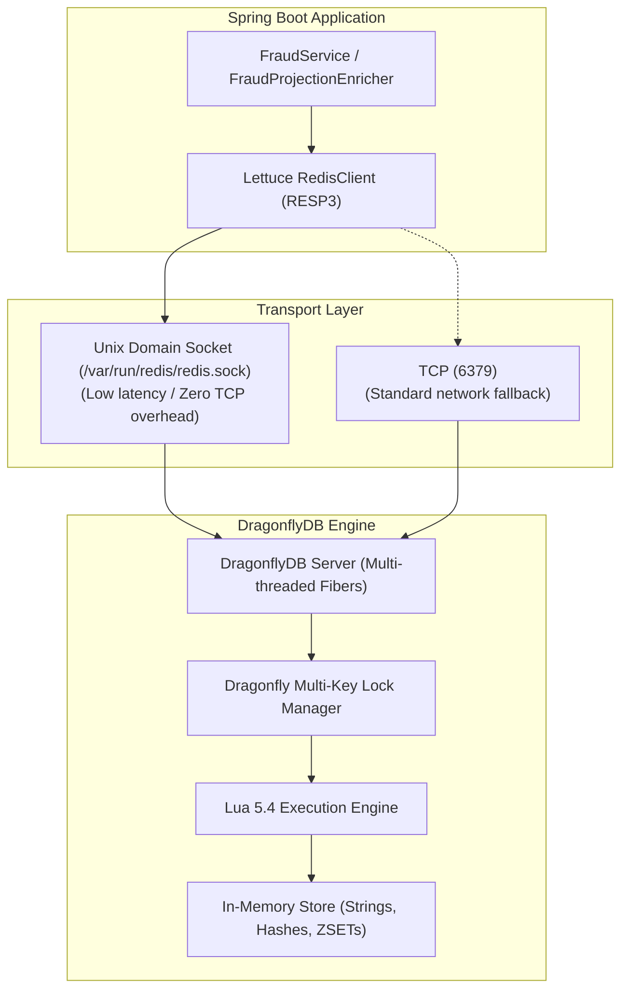

# 📐 Architecture Plan: PLAN-000.1 — In-Memory Store Migration: Redis to DragonflyDB

- **Associated Spec**: [`SPEC-000.1-migrate-redis-to-dragonflydb.md`](file:///.spec/SPEC-000.1-migrate-redis-to-dragonflydb.md)
- **Status**: Executed / Verified
- **Date**: 2026-08-26
- **Author**: Antigravity Financial Architecture Team

---

## 1. Technical Strategy & Architecture Overview

DragonflyDB is an in-memory datastore architecturally redesigned for multi-threaded symmetric multiprocessing (SMP) systems. It utilizes shared-nothing worker threads and lightweight fiber coordination to execute commands in parallel across CPU cores without the single-threaded bottleneck of Redis.



---

## 2. Component & Configuration Changes

### 1. `docker-compose.yaml` Service Upgrade
Replace `redis:8.10.1-alpine` with DragonflyDB:
```yaml
  dragonfly:
    image: docker.dragonflydb.io/dragonflydb/dragonfly:v1.40.1
    container_name: dragonfly
    restart: unless-stopped
    ports:
      - "6379:6379"
    command: >
      dragonfly
      --logtostderr
      --proactor_threads=2
      --unixsocket=/var/run/redis/redis.sock
      --unixsocketperm=777
      --maxmemory=512mb
      --cache_mode=true
    volumes:
      - dragonfly-data:/data
      - redis-socket:/var/run/redis
    networks:
      - wallet-net
```

### 2. Spring & Lettuce Configuration (`RedisConfig.java`)
- Preserves the existing `RedisConfig.java` structure because Lettuce seamlessly communicates with DragonflyDB over both RESP3 and Unix Domain Sockets.
- Ensure `ProtocolVersion.RESP3`, `ClientOptions.DisconnectedBehavior.REJECT_COMMANDS`, and `AutoReconnect` remain enabled.

### 3. Test Infrastructure (`IntegrationTestBase.java` & `DockerProperties.java`)
- Upgrade Testcontainers image from `redis:8.6-alpine` to `docker.dragonflydb.io/dragonflydb/dragonfly:v1.40.1`.
- Provide seamless container startup and dynamic property injection for `spring.data.redis.host` and `spring.data.redis.port`.

---

## 3. Lua Script Compatibility Analysis

Both Lua scripts in [`RedisScripts.java`](file:///home/leandro/Code/wallet/src/main/java/br/com/wallet/infrastructure/config/RedisScripts.java) have been verified against Dragonfly's multi-key atomicity rules:

### Script 1: `REVIEW_COUNT_PROTECTED_SCRIPT`
- **Keys declared**:
  - `KEYS[1]`: `fraud:op:{operationId}`
  - `KEYS[2]`: `user:{userId}:review_count`
  - `KEYS[3]`: `user:{userId}:risk_score`
  - `KEYS[4]`: `user:{userId}:blocked`
- **Dragonfly compatibility**: All accessed keys are passed in `KEYS[...]` array $\rightarrow$ Dragonfly's lock manager acquires locks on all 4 keys across worker threads atomically before executing the script.
- **Commands used**: `exists`, `psetex`, `incr`, `incrby`, `set` $\rightarrow$ 100% supported.

### Script 2: `BLOCK_PROTECTED_SCRIPT`
- **Keys declared**:
  - `KEYS[1]`: `fraud:op:{operationId}`
  - `KEYS[2]`: `user:{userId}:blocked`
- **Dragonfly compatibility**: All accessed keys are passed in `KEYS[...]` array $\rightarrow$ atomic lock acquisition guaranteed.
- **Commands used**: `exists`, `psetex`, `set` $\rightarrow$ 100% supported.

---

## 4. Test Strategy & Test Suite Enhancements

1. **`DragonflyLuaCompatibilityIT` (New Test Suite)**:
   - Dedicated integration test verifying Lua scripts against running DragonflyDB Testcontainer.
   - Tests:
     - `shouldExecuteReviewScriptAndAccumulateRisk()`
     - `shouldBlockUserWhenReviewCountThresholdExceeded()`
     - `shouldBlockUserWhenRiskScoreThresholdExceeded()`
     - `shouldDetectReplayInReviewScript()`
     - `shouldExecuteBlockScriptIdempotently()`
     - `shouldDetectReplayInBlockScript()`
     - `shouldHandleConcurrentScriptExecutionsWithoutDeadlock()`
2. **Regression Test Suites**:
   - `FraudIT` & `FraudReactionIT`: Verify end-to-end fraud reaction and timeline enrichment (`ZADD`, `HSET`).
   - `AccountBlockingIT`: Verify dual-store sync between PostgreSQL and DragonflyDB.
   - `BalanceIT`, `TransferFundsIT`, `DepositFundsIT`, `WithdrawFundsIT`: Verify zero side effects on transaction pipelines.

---

## 5. Security, Concurrency & Rollback Strategy

- **Concurrency**: Dragonfly's lock manager handles transaction serialization with fine-grained lock striping, eliminating global lock contention.
- **Persistence & Eviction**: Configured with `--maxmemory=512mb` and `--cache_mode=true` to automatically evict stale velocity entries under memory pressure using LRU.
- **Zero Rollback Risk**: Because wire protocol is 100% identical, reverting to Redis if ever needed requires only a single line image change in `docker-compose.yaml` with zero application code changes.
