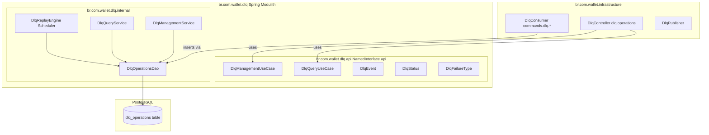
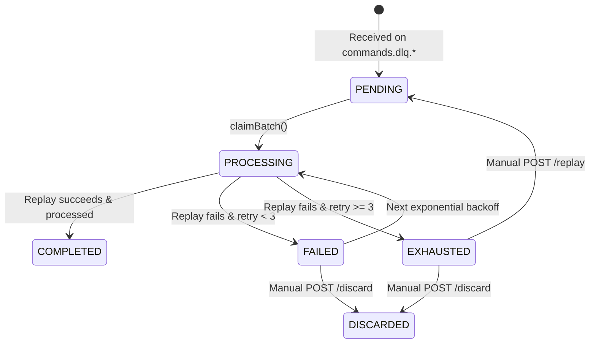

# 📐 Architecture Plan: PLAN-000.2 — DLQ Resilience, EXHAUSTED Status & Spring Modulith Isolation

- **Associated Spec**: [`SPEC-000.2-dlq-resilience-and-exhausted-operations.md`](file:///.spec/SPEC-000.2-dlq-resilience-and-exhausted-operations.md)
- **Status**: Approved
- **Author**: Antigravity Financial Architecture Team
- **Date**: 2026-08-28

---

## 1. Technical Strategy & Architecture Overview

The **Dead Letter Queue (DLQ) & Operational Recovery** capability is promoted from an unstructured set of classes inside `br.com.wallet.infrastructure` to a dedicated **Spring Modulith Capability Module**: `br.com.wallet.dlq`.



### State Machine Lifecycle



---

## 2. Module & Layer Boundaries

### Module: `br.com.wallet.dlq`
- `package-info.java`:
  ```java
  @org.springframework.modulith.ApplicationModule(
      displayName = "DLQ & Operational Recovery",
      allowedDependencies = {"core::api", "core"}
  )
  package br.com.wallet.dlq;
  ```
- **Published API (`br.com.wallet.dlq.api`)**:
  - `DlqManagementUseCase`: Manual replay, discard, batch replay.
  - `DlqQueryUseCase`: Querying by ID, paginated search by status.
  - `DlqEvent`, `DlqStatus`, `DlqFailureType`, DTOs.
- **Internal Implementation (`br.com.wallet.dlq.internal`)**:
  - `DlqOperationsDao`: Partition-aware PostgreSQL DAO using `FOR UPDATE SKIP LOCKED`.
  - `DlqReplayEngine`: Scheduled worker (every 10s) bounded by `retry_count < 3`.
  - `DlqManagementService` & `DlqQueryService`: Application service layer.

### Module: `br.com.wallet.infrastructure`
- `allowedDependencies`: Added `"dlq::api", "dlq"`.
- `DlqController`: Exposes REST management endpoints under `/dlq/operations`.
- `DlqConsumer`: NATS listener consuming from `commands.dlq.*` and saving to `DlqOperationsDao`.

---

## 3. Data Model & Schema Changes

### Schema Alterations in `docker/init/schema.sql`

```sql
ALTER TABLE dlq_operations DROP CONSTRAINT IF EXISTS dlq_status_chk;

ALTER TABLE dlq_operations ADD CONSTRAINT dlq_status_chk
    CHECK (status IN ('PENDING', 'PROCESSING', 'FAILED', 'COMPLETED', 'EXHAUSTED', 'DISCARDED'));

CREATE INDEX IF NOT EXISTS idx_dlq_exhausted
    ON dlq_operations (status, created_at)
    WHERE status = 'EXHAUSTED';
```

---

## 4. Concurrency & Locking Strategy

- **Claiming Batch**: `DlqOperationsDao.claimBatch(now, limit)`:
  ```sql
  WITH claimed AS (
      SELECT id
      FROM dlq_operations
      WHERE status IN ('PENDING', 'FAILED')
        AND retry_count < 3
        AND (next_retry_at IS NULL OR next_retry_at <= ?)
      ORDER BY next_retry_at, created_at
      LIMIT ?
      FOR UPDATE SKIP LOCKED
  )
  UPDATE dlq_operations d
  SET status = 'PROCESSING'
  FROM claimed
  WHERE d.id = claimed.id
  RETURNING ...
  ```
- **Marking Failed**:
  ```sql
  UPDATE dlq_operations
  SET retry_count = retry_count + 1,
      status = CASE WHEN retry_count + 1 >= 3 THEN 'EXHAUSTED' ELSE 'FAILED' END,
      failure_type = ?,
      next_retry_at = CASE WHEN retry_count + 1 >= 3 THEN NULL ELSE ? + (INTERVAL '1 second' * POWER(2, retry_count + 1)) END
  WHERE id = ?;
  ```

---

## 5. Security & Observability

- **Spans**:
  - `dlq.replay` (auto & manual)
  - `dlq.discard`
  - `dlq.batch_claim`
- **Baggage Propagation**: Propagates `operation_id` on replayed NATS messages.
