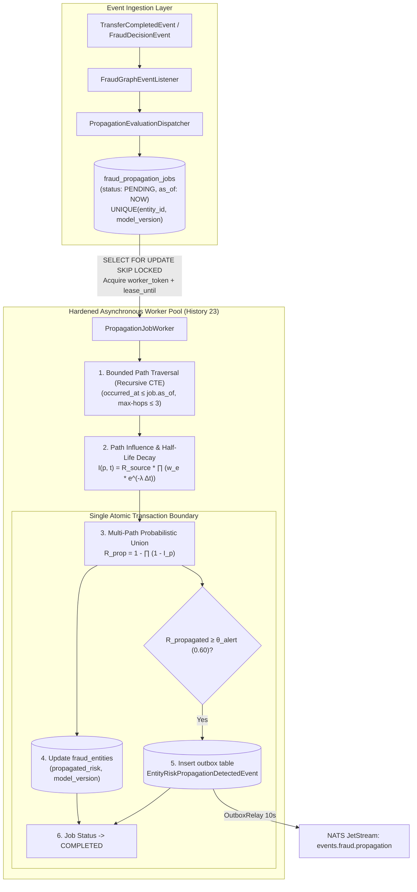

# 📐 Architecture Plan: PLAN-000.6 — Fraud Risk Propagation, Temporal Decay & Hardened Hand-Rolled Job Engine

- **Associated Spec**: [`SPEC-000.6-fraud-risk-propagation-and-temporal-decay.md`](file:///.spec/SPEC-000.6-fraud-risk-propagation-and-temporal-decay.md)
- **Status**: Approved & Hardened (Histories 21, 22 & 23)
- **Author**: Antigravity Financial & Risk Engineering Team
- **Date**: 2026-09-01
- **Domain**: `br.com.wallet.fraud` (Fraud Intelligence & Risk Propagation)
- **Target Release**: Wallet Service V4.x — Phase 0.6

---

## 1. Technical Strategy & Architecture Overview

The **Fraud Risk Propagation & Temporal Decay Engine** transmits risk scores across connected relational graph paths, decaying exponentially with elapsed time. Following the hardening recommendations from **History 23**, the hand-rolled PostgreSQL job engine incorporates **worker token leases**, **deterministic `as_of` timestamps**, **DB-enforced active job uniqueness**, and **transactional outbox alert staging**.



### Key Architectural Refinements (History 23)
1. **Worker Token Leases (`worker_token` + `lease_until`)**:
   - When a worker claims a job, it writes its `worker_token` and `lease_until = now() + interval '2 minutes'`.
   - The worker heartbeats during long traversals.
   - The reaper only recovers jobs where `status = 'RUNNING'` AND `lease_until < now()`, completely eliminating split-brain duplicate execution.
2. **Deterministic `as_of` Historical Reproducibility**:
   - `as_of TIMESTAMPTZ NOT NULL` in `fraud_propagation_jobs`.
   - The recursive CTE path query evaluates historical fact snapshots: `WHERE e.occurred_at <= :asOf`.
3. **Database-Enforced Active Job Uniqueness**:
   - Partial unique index prevents duplicate concurrent executions for the same entity and model version.
4. **Transactional Outbox Alert Staging (`I-OUTBOX-001`)**:
   - Alerts are written to the `outbox` table within the same transaction as the `fraud_entities` update, eliminating message loss on process crashes.

---

## 2. Mathematical Calculation Models

### 2.1. Edge Weight Matrix $w(e)$
| Relationship Type | Weight $w(e)$ | Rationale |
| :--- | :---: | :--- |
| `OWNS` | **0.95** | Direct account / wallet ownership link. |
| `SHARED_DEVICE` | **0.90** | Hardware fingerprint sharing indicates syndicate / ATO. |
| `SHARED_PHONE` | **0.85** | Mobile phone reuse across profiles indicates synthetic identity. |
| `SHARED_EMAIL` | **0.75** | Shared email address or domain. |
| `TRANSFERRED_TO` | **0.60** | Direct monetary flow. |
| `USES` | **0.50** | Active resource / profile usage link. |
| `SHARED_IP` | **0.35** | Network IP association. |
| `LOGGED_FROM` | **0.10** | Baseline weak location / network transitive link. |
| `SHARES` / Default | **0.10** | Unclassified transitive link. |

### 2.2. Temporal Decay Function $D(e, t)$ with Explicit `as_of`
Exponential half-life decay parameterized by $t_{1/2} = 7\text{ days}$ ($168\text{ hours}$):

$$\lambda = \frac{\ln 2}{t_{1/2}} \approx 0.099021 \text{ day}^{-1}$$

$$D(e, t) = e^{-\lambda (\text{as\_of} - t_{\text{event}})}$$

where $t_{\text{event}}$ is the most recent timestamp in `fraud_relationship_events.occurred_at` observable at or before `as_of`.

### 2.3. Path Influence $I(p, t)$
For directed acyclic path $p = (v_0 \xrightarrow{e_1} v_1 \xrightarrow{e_2} \dots \xrightarrow{e_k} v_k)$ originating at $v_0$ with direct risk $R_{\text{source}}(v_0)$:

$$I(p, t) = R_{\text{source}}(v_0) \cdot \prod_{i=1}^k \left( w(e_i) \cdot e^{-\lambda (\text{as\_of} - t_{\text{event}, i})} \right)$$

### 2.4. Multi-Path Probabilistic Union Aggregation
For target entity $u$ with paths $\mathcal{P}(u) = \{p_1, p_2, \dots, p_m\}$ having influences $I_1, I_2, \dots, I_m$:

$$R_{\text{propagated}}(u) = 1 - \prod_{j=1}^m (1 - I_j)$$

Guarantees $R_{\text{propagated}}(u) \in [0.0, 1.0]$ and avoids artificial inflation from duplicate paths.

---

## 3. Module & Package Boundaries (Spring Modulith DAG)

```
┌────────────────────────────────────────────────────────────────────────┐
│                   br.com.wallet.infrastructure                          │
│  (FraudRiskPropagationController, OutboxRelay)                         │
└───────────────────────────────────┬────────────────────────────────────┘
                                    │ depends on
                                    ▼
┌────────────────────────────────────────────────────────────────────────┐
│                      br.com.wallet.fraud                               │
│                                                                        │
│  ┌──────────────────────────────────────────────────────────────────┐  │
│  │ br.com.wallet.fraud.intelligence.propagation (Public API)         │  │
│  │  • RiskPropagationEngine (Interface)                             │  │
│  │  • PropagationEvaluationDispatcher (Interface)                   │  │
│  │  • PropagatedEntityRisk, PropagationResult (Domain Records)       │  │
│  │  • EntityRiskPropagationDetectedEvent (Domain Event)             │  │
│  │  • PropagationConfig (Configuration Record)                       │  │
│  └──────────────────────────────────┬───────────────────────────────┘  │
│                                     │ implemented by                   │
│  ┌──────────────────────────────────▼───────────────────────────────┐  │
│  │ br.com.wallet.fraud.intelligence.internal.propagation            │  │
│  │  • DefaultRiskPropagationEngine                                  │  │
│  │  • PathInfluenceCalculator                                       │  │
│  │  • MultiPathAggregator                                           │  │
│  │  • PostgresRiskPropagationDao                                    │  │
│  │  • DefaultPropagationDispatcher                                  │  │
│  │  • PropagationJobWorker                                          │  │
│  │  • PostgresPropagationJobDao                                     │  │
│  └──────────────────────────────────────────────────────────────────┘  │
└────────────────────────────────────────────────────────────────────────┘
```

---

## 4. Data Model & Database Changes

### 4.1. Hardened Job Queue Table (`fraud_propagation_jobs`)
```sql
CREATE TABLE IF NOT EXISTS fraud_propagation_jobs (
    id UUID PRIMARY KEY,
    entity_id UUID NOT NULL,
    status VARCHAR(32) NOT NULL DEFAULT 'PENDING',
    as_of TIMESTAMPTZ NOT NULL DEFAULT NOW(),
    worker_token UUID,
    lease_until TIMESTAMPTZ,
    attempt_count INTEGER NOT NULL DEFAULT 0,
    available_at TIMESTAMPTZ NOT NULL DEFAULT NOW(),
    started_at TIMESTAMPTZ,
    completed_at TIMESTAMPTZ,
    last_error TEXT,
    model_version VARCHAR(32) NOT NULL DEFAULT 'v1',
    created_at TIMESTAMPTZ NOT NULL DEFAULT NOW(),
    updated_at TIMESTAMPTZ NOT NULL DEFAULT NOW()
);

-- Partial unique index guaranteeing active job uniqueness (History 23)
CREATE UNIQUE INDEX IF NOT EXISTS idx_fraud_prop_active_unique 
ON fraud_propagation_jobs (entity_id, model_version) 
WHERE status IN ('PENDING', 'RUNNING', 'RETRY_WAIT');

-- Index for high-speed worker polling with SKIP LOCKED
CREATE INDEX IF NOT EXISTS idx_fraud_prop_jobs_claim 
ON fraud_propagation_jobs (available_at, created_at) 
WHERE status IN ('PENDING', 'RETRY_WAIT');
```

### 4.2. `fraud_entities` Schema Updates
```sql
ALTER TABLE fraud_entities 
ADD COLUMN IF NOT EXISTS propagation_model_version VARCHAR(32) DEFAULT 'v1',
ADD COLUMN IF NOT EXISTS propagation_evaluated_at TIMESTAMPTZ;

CREATE INDEX IF NOT EXISTS idx_fraud_entities_propagated 
ON fraud_entities (propagated_risk DESC) 
WHERE propagated_risk > 0.0;
```

### 4.3. Atomic Worker Claim & Lease Query
```sql
WITH next_job AS (
    SELECT id
    FROM fraud_propagation_jobs
    WHERE status IN ('PENDING', 'RETRY_WAIT')
      AND available_at <= NOW()
    ORDER BY created_at ASC
    FOR UPDATE SKIP LOCKED
    LIMIT 1
)
UPDATE fraud_propagation_jobs
SET status = 'RUNNING',
    worker_token = :workerToken,
    lease_until = NOW() + INTERVAL '2 minutes',
    started_at = NOW(),
    attempt_count = attempt_count + 1,
    updated_at = NOW()
FROM next_job
WHERE fraud_propagation_jobs.id = next_job.id
RETURNING fraud_propagation_jobs.*;
```

---

## 5. Failure Analysis & Resilience

1. **Worker Token Lease Safety (`I-PROP-008`)**:
   - If a worker becomes unresponsive or GC paused, its lease expires (`lease_until < now()`).
   - The reaper reclaims it to `RETRY_WAIT`.
   - If the old worker wakes up, its update is rejected because `worker_token` or `lease_until` no longer matches.
2. **Transactional Alert Durability (`I-PROP-009`)**:
   - `EntityRiskPropagationDetectedEvent` is staged into the `outbox` table in the same transaction as the `fraud_entities` update.
   - OutboxRelay delivers it to NATS JetStream asynchronously with exponential backoff retries.

---

## 6. Practical Verification Scenarios (Seed Data Gate)

1. **Scenario 1: Single-Hop Device Decay**: Alice (`direct_risk = 0.90`) $\xrightarrow{SHARED\_DEVICE, 7d}$ Bob $\implies I = 0.90 \times 0.90 \times 0.50 = 0.405$.
2. **Scenario 2: Multi-Hop Mule Chain**: Risk cascades across transfer edges with compounding exponential decay evaluated as of deterministic `as_of`.
3. **Scenario 3: Multi-Path Union**: Merges independent device and transfer paths without exceeding $1.0$.
4. **Scenario 4: Token Lease & Uniqueness**: Proves duplicate active jobs are rejected by PostgreSQL and worker token leases prevent duplicate completions.
5. **Scenario 5: Transactional Outbox Alerting**: Verifies `EntityRiskPropagationDetectedEvent` in `outbox` table and publication to NATS `events.fraud.propagation`.
