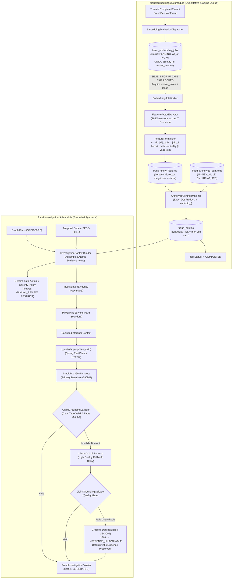

# 📐 Architecture Plan: PLAN-000.7 — Fraud Behavioral Embeddings, Archetype Matching & Evidence-Grounded Investigation Intelligence

- **Associated Spec**: [`SPEC-000.7-fraud-behavioral-embeddings-and-investigation-pgvector.md`](file:///.spec/SPEC-000.7-fraud-behavioral-embeddings-and-investigation-pgvector.md)
- **Status**: Ready for Review & Ratification (Histories 20, 24, 25, 26, 27, 28, 29 & 30)
- **Author**: Antigravity Financial & Risk Engineering Team
- **Date**: 2026-09-03
- **Domain**: `br.com.wallet.fraud` (Fraud Intelligence, Embeddings & Investigation)
- **Target Release**: Wallet Service V4.x — Phase 0.7

---

## 1. Technical Strategy & Architecture Overview

The **Behavioral Embeddings & Investigation Intelligence Engine** is structured into two decoupled, cohesive submodules within `:fraud`:

1. **`:fraud:embeddings` (Quantitative Behavioral Intelligence & Durable Async Queue)**:
   - Computes 16 bounded metrics from a 30-day sliding window organized into 7 semantic domains.
   - Dual representation: unit direction vector ($\|\vec{v}\|_2 = 1.0$) alongside `feature_magnitude` ($\|\vec{d}\|_2$) to retain behavioral intensity.
   - Handles the zero-activity edge case (`I-VEC-008`): when $M = 0.0$, returns inactive vector $\vec{0}$, similarity $0.0$, behavioral risk $0.0$, and top archetype `"NONE"`.
   - Exact dot-product matching against calibrated archetype centroids in PostgreSQL table `fraud_archetype_centroids` ($O(N)$ with $N \le 20$).
   - Returns `ArchetypeMatch` containing both `directionalSimilarity` and `behavioralIntensity` for downstream Phase 0.8 Signal Fusion.
   - Durable asynchronous job engine (`fraud_embedding_jobs`) using `SELECT FOR UPDATE SKIP LOCKED` and worker token leases, ensuring zero hot-path overhead (`I-VEC-007`).
2. **`:fraud:investigation` (Air-Gapped Evidence-Grounded Synthesizer & Benchmark Gate)**:
   - Assembles an atomic, structured `InvestigationEvidence` from deterministic evidence (`GRAPH-001`, `TEMPORAL-014`, `ARCHETYPE-003`).
   - Evaluates `EVIDENCE_POLICY` to determine `RiskClassification` and allowable `RecommendedAction` sets without mutating or anticipating `final_risk` (`I-PROP-005`).
   - **Hard Sanitization Boundary**: Transforms `InvestigationEvidence` into `SanitizedInferenceContext` before invoking the model, ensuring unmasked PII can never reach inference.
   - **Minimum Viable Intelligence Strategy (History 29)**: Adopts compact SLM models (`smollm2:135m` for smoke/CI, `smollm2:360m-instruct-q5_K_M` as default production baseline, `llama3.2:1b` as high-quality fallback).
   - **LLM as Structured Renderer**: 95% of intelligence is deterministic (facts, IDs, and action sets); 5% is language synthesis.
   - **Cascading Fallback Architecture (Histories 27 & 29)**: `360M Default` $\rightarrow$ on validation failure/timeout $\rightarrow$ `Llama 3.2 1B Quality Retry` $\rightarrow$ on failure $\rightarrow$ **Deterministic Evidence-Only Dossier** (`INFERENCE_UNAVAILABLE`).
   - Pluggable `LocalInferenceClient` SPI for local inference using Spring `RestClient` (HTTP/2 with Java 26 Virtual Threads).
   - Programmatic `ClaimGroundingValidator` enforcing structured claims (`ClaimType`, `evidenceReferences`).
   - Three-Tier Testing Architecture: Unit tests (`FakeInferenceClient`), Integration tests (`OllamaInferenceClientIT` with Testcontainers), and Benchmark evaluation gate (`ModelEvaluationHarness`).



---

## 2. Spring Modulith Submodule Topology & Boundaries (Histories 27 & 28)

```
br.com.wallet.fraud.embeddings/
├── api/                                      <-- NamedInterface("embeddings-api")
│   ├── BehavioralEmbeddingEngine.java       <-- Public API: Feature extraction & updates
│   ├── ArchetypeMatchingService.java         <-- Public API: Exact centroid matching & behavioral risk
│   ├── EmbeddingEvaluationDispatcher.java   <-- Public API: Asynchronous job enqueue
│   ├── model/
│   │   ├── BehavioralFeatureVector.java     <-- 16-D vector record + magnitude metadata
│   │   └── ArchetypeMatch.java              <-- Match record (directionalSimilarity & behavioralIntensity)
│   └── package-info.java                    <-- @NamedInterface("embeddings-api")
│
├── spi/                                      <-- NamedInterface("embeddings-spi")
│   └── BehavioralFeatureStore.java          <-- SPI for vector persistence
│
└── internal/                                 <-- Internal encapsulation
    ├── extraction/
    │   └── FeatureVectorExtractor.java      <-- Computes raw 16-D bounded features
    ├── normalization/
    │   └── FeatureNormalizer.java           <-- Computes L2 unit vector, magnitude & zero-neutrality
    ├── matching/
    │   └── DefaultArchetypeMatcher.java     <-- Computes exact dot products & behavioral_risk
    ├── queue/
    │   ├── EmbeddingJobStatus.java          <-- Job lifecycle status enum
    │   ├── EmbeddingJob.java                <-- Job record entity
    │   ├── EmbeddingJobRepository.java      <-- Repository interface
    │   ├── PostgresEmbeddingJobDao.java     <-- SKIP LOCKED JDBC implementation
    │   ├── DefaultEmbeddingDispatcher.java  <-- Implements EmbeddingEvaluationDispatcher
    │   └── EmbeddingJobWorker.java          <-- Background worker with token leases
    └── persistence/
        ├── PostgresEntityFeaturesDao.java   <-- Implements BehavioralFeatureStore
        └── PostgresArchetypeCentroidDao.java<-- JDBC DAO for fraud_archetype_centroids

br.com.wallet.fraud.investigation/
├── api/                                      <-- NamedInterface("investigation-api")
│   ├── InvestigationService.java             <-- Public API: Dossier generation & query
│   ├── model/
│   │   ├── FraudInvestigationDossier.java   <-- Final composite dossier record
│   │   ├── InvestigationEvidence.java       <-- Deterministic evidence record
│   │   ├── InvestigationNarrative.java      <-- SLM generated narrative record
│   │   ├── InvestigationClaim.java          <-- Structured claim with ClaimType
│   │   ├── ClaimType.java                   <-- Enum: SHARED_INFRASTRUCTURE, RAPID_FUND_MOVEMENT, etc.
│   │   ├── FraudRiskSnapshot.java           <-- Multi-dimension risk snapshot
│   │   ├── RiskClassification.java          <-- Enum: LOW, MEDIUM, HIGH, CRITICAL
│   │   ├── RiskClassificationSource.java    <-- Enum: EVIDENCE_POLICY, SIGNAL_FUSION
│   │   ├── RecommendedAction.java           <-- Enum: MANUAL_REVIEW, RESTRICT, etc.
│   │   └── InvestigationGenerationStatus.java<-- Enum: GENERATED, INFERENCE_UNAVAILABLE, etc.
│   └── package-info.java                    <-- @NamedInterface("investigation-api")
│
├── spi/                                      <-- NamedInterface("investigation-spi")
│   ├── LocalInferenceClient.java            <-- Public SPI for local SLM backends
│   ├── StructuredInferenceRequest.java      <-- Request DTO with JSON grammar constraint
│   ├── InferenceCapability.java             <-- Enum: FAST, BALANCED, HIGH_QUALITY
│   ├── InferenceModelProfile.java           <-- Profile record with token limits & timeouts
│   └── InferenceBenchmarkThresholds.java    <-- Benchmark criteria record
│
└── internal/                                 <-- Internal encapsulation
    ├── evidence/
    │   └── InvestigationContextBuilder.java <-- Builds FraudInvestigationContext from DB facts
    ├── policy/
    │   ├── RiskClassificationPolicy.java    <-- Evaluates EVIDENCE_POLICY severity
    │   └── RecommendedActionPolicy.java     <-- Derives deterministic allowed actions
    ├── sanitization/
    │   ├── PiiMaskingService.java           <-- Hard boundary surrogate tokenization
    │   └── SanitizedInferenceContext.java   <-- Sanitized context record for LLM prompt
    ├── grounding/
    │   └── ClaimGroundingValidator.java     <-- Validates claim -> evidence ID linkage & facts
    ├── inference/
    │   ├── OllamaInferenceClient.java       <-- Ollama REST implementation
    │   └── VllmInferenceClient.java         <-- vLLM OpenAI-compatible implementation
    ├── benchmark/
    │   └── ModelEvaluationHarness.java      <-- Evaluates candidate models against gold-standard fixtures
    └── orchestration/
        └── DefaultInvestigationService.java <-- Orchestrates context, inference & graceful degradation
```

---

## 3. Database Schema & Migration Specification

### 3.1. DDL Migration (`docker/init/schema.sql`)
```sql
-- 1. Enable pgvector extension
CREATE EXTENSION IF NOT EXISTS vector;

-- 2. Entity Behavioral Features Table
CREATE TABLE IF NOT EXISTS fraud_entity_features (
    entity_id UUID PRIMARY KEY REFERENCES fraud_entities(entity_id) ON DELETE CASCADE,
    feature_version INT NOT NULL DEFAULT 1,
    behavioral_vector vector(16) NOT NULL,
    feature_magnitude DOUBLE PRECISION NOT NULL,
    transaction_count BIGINT NOT NULL DEFAULT 0,
    transaction_volume NUMERIC(19, 4) NOT NULL DEFAULT 0.0000,
    updated_at TIMESTAMP WITH TIME ZONE DEFAULT CURRENT_TIMESTAMP
);

-- 3. Fraud Archetype Centroids Table
CREATE TABLE IF NOT EXISTS fraud_archetype_centroids (
    archetype_id VARCHAR(64) PRIMARY KEY,
    description TEXT NOT NULL,
    centroid_vector vector(16) NOT NULL,
    risk_weight NUMERIC(3, 2) NOT NULL,
    updated_at TIMESTAMP WITH TIME ZONE DEFAULT CURRENT_TIMESTAMP
);

-- 4. Asynchronous Embedding Jobs Table
CREATE TABLE IF NOT EXISTS fraud_embedding_jobs (
    job_id UUID PRIMARY KEY DEFAULT gen_random_uuid(),
    entity_id UUID NOT NULL REFERENCES fraud_entities(entity_id) ON DELETE CASCADE,
    model_version VARCHAR(32) NOT NULL DEFAULT 'v1',
    as_of TIMESTAMP WITH TIME ZONE NOT NULL,
    status VARCHAR(32) NOT NULL DEFAULT 'PENDING',
    worker_token UUID,
    lease_until TIMESTAMP WITH TIME ZONE,
    attempt_count INT NOT NULL DEFAULT 0,
    max_attempts INT NOT NULL DEFAULT 3,
    error_message TEXT,
    available_at TIMESTAMP WITH TIME ZONE DEFAULT CURRENT_TIMESTAMP,
    created_at TIMESTAMP WITH TIME ZONE DEFAULT CURRENT_TIMESTAMP,
    updated_at TIMESTAMP WITH TIME ZONE DEFAULT CURRENT_TIMESTAMP
);

CREATE UNIQUE INDEX IF NOT EXISTS idx_fraud_emb_active_unique
ON fraud_embedding_jobs (entity_id, model_version)
WHERE status IN ('PENDING', 'RUNNING', 'RETRY_WAIT');

CREATE INDEX IF NOT EXISTS idx_fraud_emb_worker_claim
ON fraud_embedding_jobs (status, available_at)
WHERE status IN ('PENDING', 'RETRY_WAIT');
```

---

## 4. 16-D Feature Taxonomy & Zero-Activity Neutrality

For an entity $u$ over a 30-day sliding window relative to `as_of`:

| Domain | Dim | Feature Name | Bounded Formula $d_i \in [0.0, 1.0]$ |
| :--- | :---: | :--- | :--- |
| **Transactional** | $d_1$ | `tx_frequency` | $\min(1.0, N_{\text{tx\_30d}} / 500.0)$ |
| | $d_2$ | `avg_amount` | $\min(1.0, \bar{A}_{\text{out}} / 50000.0)$ |
| | $d_3$ | `amount_std_dev` | $\min(1.0, \sigma_A / 25000.0)$ |
| | $d_4$ | `velocity_spike_1h` | $\min(1.0, V_{\text{1h\_max}} / 30.0)$ |
| | $d_5$ | `nocturnal_ratio` | $N_{\text{22h-06h}} / \max(1, N_{\text{tx}})$ |
| **Counterparty** | $d_6$ | `unique_counterparties`| $\min(1.0, N_{\text{counterparties}} / 100.0)$ |
| | $d_7$ | `new_counterparties_7d`| $\min(1.0, N_{\text{new\_7d}} / 50.0)$ |
| **Flow** | $d_8$ | `rapid_drain_count` | $\min(1.0, N_{\text{pass\_through}} / 20.0)$ |
| | $d_9$ | `fan_out_ratio` | $\min(1.0, N_{\text{dest}} / \max(1, N_{\text{sent}}))$ |
| | $d_{10}$ | `fan_in_ratio` | $\min(1.0, N_{\text{src}} / \max(1, N_{\text{recv}}))$ |
| **Geographic** | $d_{11}$ | `intl_tx_count` | $\min(1.0, N_{\text{intl}} / 10.0)$ |
| **Auth / Device** | $d_{12}$ | `failed_auth_count` | $\min(1.0, N_{\text{failed\_auth}} / 10.0)$ |
| | $d_{13}$ | `device_switch_count`| $\min(1.0, N_{\text{devices}} / 5.0)$ |
| **Anomaly** | $d_{14}$ | `out_of_pattern_ratio`| $\min(1.0, N_{|z| > 3} / \max(1, N_{\text{tx}}))$ |
| **Dispute & Volume**| $d_{15}$ | `dispute_count` | $\min(1.0, N_{\text{chargebacks}} / 5.0)$ |
| | $d_{16}$ | `total_amount_volume` | $\min(1.0, A_{\text{total\_out}} / 200000.0)$ |

### Normalization Mechanics & Zero-Activity Invariant (`I-VEC-008`)
$$M = \|\vec{d}\|_2 = \sqrt{\sum_{i=1}^{16} d_i^2}$$

- **Active Profile ($M > 0.0$)**:
  $$\vec{v} = \frac{\vec{d}}{M}, \quad \text{feature\_magnitude} = M$$
- **Inactive Profile ($M = 0.0$) (`I-VEC-008`)**:
  $$\vec{v} = \vec{0}, \quad \text{feature\_magnitude} = 0.0$$
  Archetype matching returns $\text{similarity} = 0.0$, $\text{behavioral\_risk} = 0.0$, and $\text{topArchetype} = \text{"NONE"}$.

---

## 5. Exact Archetype Matching & Dual Signal Exposure

Matching is evaluated via **exact dot product** against the small set of centroids ($N \le 20$):

$$\text{similarity}(\vec{v}, \vec{c}_i) = \vec{v} \cdot \vec{c}_i = \sum_{k=1}^{16} v_k \cdot c_{i,k}$$

$$\text{behavioral\_risk}(u) = \max_{i} \Big( \max(0.0, \text{similarity}(\vec{v}, \vec{c}_i)) \times w_i \Big)$$

Record `ArchetypeMatch`:
```java
public record ArchetypeMatch(
    String archetypeId,
    double directionalSimilarity,
    double archetypeWeight,
    double behavioralIntensity, // feature_magnitude
    double weightedSimilarity
) {}
```
Both `directionalSimilarity` and `behavioralIntensity` are preserved for Phase 0.8 Signal Fusion.

---

## 6. Investigation Synthesis, Claim Grounding & Benchmark Gate

### 6.1. Hard Sanitization Boundary
```
Database Facts ──► InvestigationEvidence (raw facts)
                            ├──► Deterministic Dossier
                            └──► PiiMaskingService (Hard Boundary)
                                     └──► SanitizedInferenceContext
                                              └──► LocalInferenceClient
```

### 6.2. Claim Grounding Validator
Validates `InvestigationClaim` against `ClaimType` (`SHARED_INFRASTRUCTURE`, `RAPID_FUND_MOVEMENT`, `ARCHETYPE_SIMILARITY`, `HIGH_VELOCITY`, `DEVICE_ANOMALY`) and asserts that all `evidenceReferences` IDs exist in the context facts.

### 6.3. Graceful Degradation (`I-VEC-009`)
If the SLM backend is unreachable, times out, or fails schema validation:
- The system returns the complete deterministic dossier:
  ```json
  {
    "classification": "HIGH",
    "classificationSource": "EVIDENCE_POLICY",
    "status": "INFERENCE_UNAVAILABLE",
    "allowedActions": ["MANUAL_REVIEW", "TEMPORARY_OUTGOING_RESTRICTION"],
    "evidence": { ... },
    "narrative": null
  }
  ```

### 6.4. Inference Transport & Protocol Architecture (ADR)
- **Phase 0.7 Transport**: `OllamaInferenceClient` uses Spring `RestClient` (HTTP/2 with Java 26 Virtual Threads) communicating with Ollama `/api/chat`.
  - JSON Schema enforcement via Ollama parameter `"format": "json"`.
  - Zero framework version risk with Spring Boot 4.1.1 (avoids Spring AI 1.0 / Spring Boot 3.x dependency clashes).
- **Phase 0.8 Agentic Roadmap**: **Model Context Protocol (MCP)** will be adopted for the LangGraph Agentic Investigation Engine to expose fraud intelligence tools (`graph-neighborhood`, `temporal-trace`, `behavioral-archetype`).
- **GPU Cluster Roadmap**: **Async gRPC** over HTTP/2 with protobuf contracts for high-throughput vLLM / Triton deployments.

### 6.5. Hardware-Aware Model Evaluation Harness & Candidate Models
Configurable benchmark thresholds and model candidate definitions:
```java
public record ModelCandidate(
    String id,
    String backend,
    InferenceCapability capability
) {}

public record InferenceBenchmarkThresholds(
    Duration maxP95Latency,
    Duration maxTimeout,
    double minJsonValidityRate,
    double minGroundingValidityRate
) {}
```
Evaluates candidate models (`smollm2:135m`, `smollm2:360m`, `llama3.2:1b`) against gold-standard fixtures:
- `CASE-001-money-mule`
- `CASE-002-smurfing`
- `CASE-003-account-takeover`
- `CASE-004-low-risk-neutral`

### 6.6. Three-Tier Testing Architecture & Containerized Inference Integration (History 30)

```
┌─────────────────────────────────────────────────────────────┐
│ TIER 1: UNIT TESTS (Zero Docker, Fast, Deterministic)        │
│ FakeInferenceClient / Mocks                                 │
│ - Schema validation, PII masking, deterministic policies    │
│ - ClaimGroundingValidator & Graceful Degradation (I-VEC-009)│
└──────────────────────────────┬──────────────────────────────┘
                               │
┌──────────────────────────────▼──────────────────────────────┐
│ TIER 2: INTEGRATION TESTS (Testcontainers + Real SLM)       │
│ OllamaInferenceClientIT                                     │
│ - Testcontainers Ollama (smollm2:360m-instruct-q5_K_M)      │
│ - Real HTTP RestClient transport over Docker network        │
│ - Real SLM JSON instruction following & grounding check     │
└──────────────────────────────┬──────────────────────────────┘
                               │
┌──────────────────────────────▼──────────────────────────────┐
│ TIER 3: BENCHMARK / QUALITY GATE (Comparative Evaluation)   │
│ ModelEvaluationHarness                                      │
│ - Multi-model comparison: 135M vs 360M vs 1B (Llama 3.2 1B) │
│ - Gold-standard fixtures (CASE-001 to CASE-004)             │
│ - ModelEvaluationReport (schema rate, grounding, P95, RAM)  │
└─────────────────────────────────────────────────────────────┘
```

#### Testcontainers Ollama Strategy:
- **Container Definition**: Isolated `GenericContainer("ollama/ollama:latest")` exposing port 11434.
- **Model Provisioning**:
  - *Option A (Pre-baked test image)*: Custom Docker image caching `smollm2:360m-instruct-q5_K_M` (~290MB) for instantaneous cold starts.
  - *Option B (Dynamic pull with health check)*: Wait strategy polling `GET /api/tags` confirming `smollm2:360m-instruct-q5_K_M` is loaded before executing assertions.
- **Disentangled SLA Policy**:
  - Functional Gate (100% JSON valid, 100% evidence references valid, 0 invented IDs, 0 risk mutation) is mandatory and strictly enforced.
  - Latency benchmarks (P50/P95, tokens/sec) are collected as informative metrics in CPU CI to track regression trends without causing brittle build failures.

---

## 7. REST API Endpoints

### 7.1. Feature Extraction & Archetype Evaluation
- **Endpoint**: `POST /api/v1/fraud/intelligence/embeddings/extract/{entityId}`
- **Response**: `200 OK`

### 7.2. Investigation Dossier Query
- **Endpoint**: `GET /api/v1/fraud/intelligence/investigation/dossier/{entityId}`
- **Query Params**: `?capability=BALANCED&forceRefresh=false`
- **Response**: `200 OK` (Full `FraudInvestigationDossier` JSON)

---

## 8. Verification & Test Plan

1. **Tier 1: Unit Tests (Fast / Zero Docker)**:
   - `FeatureVectorExtractorTest`: 16-D feature calculations across 7 domains.
   - `FeatureNormalizerTest`: Unit $L_2$ normalization, magnitude preservation, distinguishing low/high intensity profiles with identical direction, and zero-activity neutrality (`I-VEC-008`).
   - `ArchetypeCentroidMatcherTest`: Exact dot-product calculations, weight multipliers, exposing directional similarity and intensity.
   - `ClaimGroundingValidatorTest`: Structured `ClaimType` enforcement, reference integrity, rejecting hallucinated claims.
   - `RecommendedActionPolicyTest`: Deterministic action derivation.
   - `DefaultInvestigationServiceTest`: Dossier generation with `FakeInferenceClient`, graceful degradation returning `INFERENCE_UNAVAILABLE` (`I-VEC-009`).
2. **Tier 2: Integration Tests (Testcontainers)**:
   - `PostgresEntityFeaturesDaoIT`: Persistence of `vector(16)`, magnitude, and volumes.
   - `PostgresArchetypeCentroidDaoIT`: Retrieval and SQL dot-product execution with self-healing seeds.
   - `PostgresEmbeddingJobDaoIT`: Idempotent enqueue, `FOR UPDATE SKIP LOCKED` claims, and token lease renewals.
   - `OllamaInferenceClientIT` (`REQ-VEC-012`, `I-VEC-010`): Testcontainers Ollama container validating real HTTP communication, structured generation with `smollm2:360m-instruct-q5_K_M`, JSON parsing, and grounding validation inside Docker network boundaries.
3. **Tier 3: Model Evaluation Harness & Comparative Gate**:
   - `ModelEvaluationHarnessTest`: Automated comparative benchmark across model candidates (`smollm2:135m`, `smollm2:360m`, `llama3.2:1b`) against gold-standard fixtures asserting 100% JSON validity, 100% grounding validity, and reporting P50/P95 latency trends.
