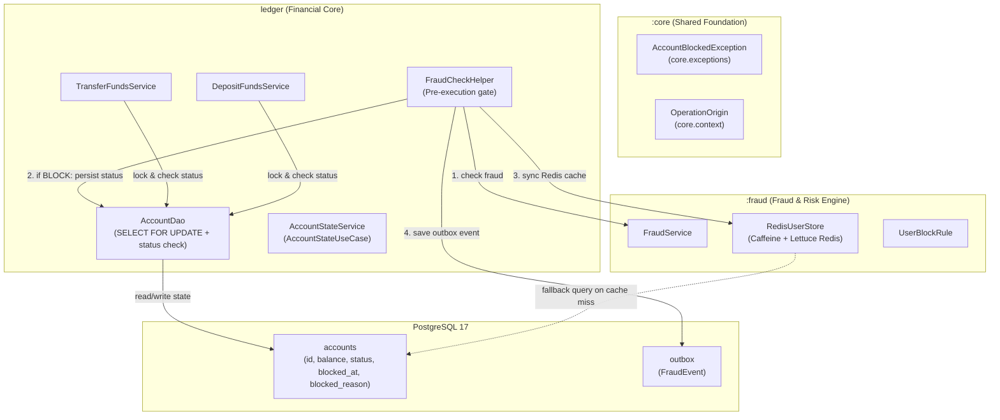
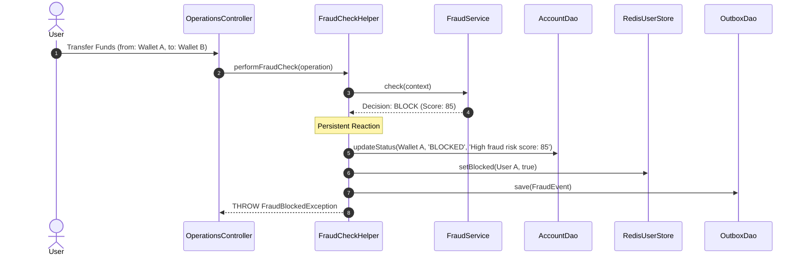
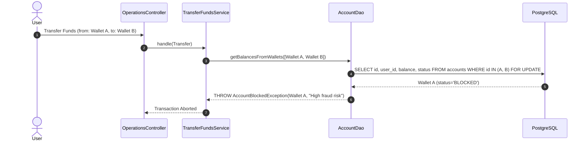

# 🏗️ Architecture Plan: PLAN-001.1 — Account Lifecycle State & Persistent Fraud Blocking Engine

- **Associated Spec**: [`SPEC-001.1-account-lifecycle-state-and-fraud-blocking.md`](file:///.spec/SPEC-001.1-account-lifecycle-state-and-fraud-blocking.md)
- **Status**: Approved / Implemented
- **Author**: Antigravity Financial Architecture Team
- **Date**: 2026-08-23
- **Modules Involved**: `:core`, `:fraud`, `br.com.wallet.ledger`, `br.com.wallet.infrastructure`

---

## 1. Technical Strategy & Architecture

This plan establishes persistent lifecycle state for bank accounts in PostgreSQL and connects the **Fraud & Risk Engine** directly to the account state management subsystem.



---

## 2. Database Schema DDL Migration (`docker/init/schema.sql`)

```sql
-- Migration: Account Lifecycle State & Persistent Blocking Metadata
ALTER TABLE accounts 
    ADD COLUMN IF NOT EXISTS status VARCHAR(32) NOT NULL DEFAULT 'ACTIVE',
    ADD COLUMN IF NOT EXISTS blocked_at TIMESTAMPTZ NULL,
    ADD COLUMN IF NOT EXISTS blocked_reason TEXT NULL;

DO $$ 
BEGIN
    IF NOT EXISTS (
        SELECT 1 FROM pg_constraint WHERE conname = 'chk_account_status'
    ) THEN
        ALTER TABLE accounts ADD CONSTRAINT chk_account_status 
            CHECK (status IN ('ACTIVE', 'BLOCKED', 'SUSPENDED', 'FROZEN'));
    END IF;
END $$;

CREATE INDEX IF NOT EXISTS idx_accounts_status ON accounts(status) WHERE status != 'ACTIVE';
CREATE INDEX IF NOT EXISTS idx_accounts_user_status ON accounts(user_id, status);
```

---

## 3. Architectural Decision Records (ADRs)

### 🏛️ ADR-001.1-1: Persistent Account State in PostgreSQL `accounts` Table
- **Context**: Relying solely on in-memory sliding windows or ephemeral Redis TTL keys for fraud blocking allowed attackers to retry operations once cache entries expired.
- **Decision**: Add `status`, `blocked_at`, and `blocked_reason` columns directly to PostgreSQL `accounts` table. Status defaults to `'ACTIVE'`.
- **Consequences**:
  - *Positive*: Unshakable persistent record of account blocking (`I-ACCOUNT-001`).
  - *Positive*: Account status is locked and checked atomically inside the existing `SELECT FOR UPDATE` transaction.

### 🏛️ ADR-001.1-2: Core Placement of `AccountBlockedException`
- **Context**: Both the Financial Core (`ledger`), the Fraud Engine (`fraud`), and capability modules (`savings`) need to throw or catch `AccountBlockedException`.
- **Decision**: Place `AccountBlockedException` under `br.com.wallet.core.exceptions.AccountBlockedException`.
- **Consequences**:
  - *Positive*: Zero cyclic dependencies between `ledger` and `savings` / `fraud`.
  - *Positive*: Shared across all application modules.

### 🏛️ ADR-001.1-3: Pre-Execution Status Verification in `AccountDao`
- **Context**: We need to guarantee that no debit, credit, or transfer executes against a blocked account.
- **Decision**: When `AccountDao.getBalancesFromWallets` or `findWalletBalanceForUpdate` executes `SELECT ... FOR UPDATE`, it inspects `status`. If any participating account has `status != 'ACTIVE'`, it immediately throws `AccountBlockedException`.
- **Consequences**:
  - *Positive*: Zero overhead ($O(1)$) because status is retrieved in the same SQL row lock query.
  - *Positive*: 100% enforcement across all current and future use cases.

### 🏛️ ADR-001.1-4: Automated Fraud Reaction & Dual-Store Sync
- **Context**: When `FraudCheckHelper` receives `FraudDecision.BLOCK` from `FraudService`, the account must be blocked immediately.
- **Decision**: 
  1. `FraudCheckHelper` invokes `accountDao.blockAccount(walletId, reason)`.
  2. `FraudCheckHelper` updates Redis via `redisUserStore.setBlocked(userId, true)`.
  3. `FraudCheckHelper` emits `FraudEvent` to `outbox`.
  4. Throws `FraudBlockedException`.
- **Consequences**:
  - *Positive*: Immediate, defense-in-depth protection across both PostgreSQL (source of truth) and Redis (fast edge cache).

---

## 4. Sequence Diagrams

### 4.1 Automated Blocking Flow upon High-Risk Fraud



### 4.2 Rejection of Subsequent Transactions on Blocked Account



---

## 5. Threat Modeling & Edge Cases

| Threat / Scenario | Impact | Mitigation Strategy | Invariant |
| :--- | :--- | :--- | :--- |
| **Bypass via Rapid Retry** | Malicious user retries transaction right after fraud block | PostgreSQL `accounts.status = 'BLOCKED'` rejects in $O(1)$ at DB row lock | `I-ACCOUNT-001` |
| **Redis Cache Eviction / Restart** | Redis loses in-memory block flag | `RedisUserStore.getFallbackValue()` queries PostgreSQL `accounts.status` | `I-ACCOUNT-004` |
| **Multi-Party Transfer to Blocked Target** | Sender active, but recipient wallet is blocked | `AccountDao` checks all participating wallets in the batch lock | `I-ACCOUNT-001` |
| **Automated Savings Sweep on Blocked Account** | Savings module attempts sweep | `TransferFundsUseCase` throws `AccountBlockedException`; logged as `REJECTED_BY_FRAUD` | `I-SAVINGS-003` |

---

## 6. Implementation Phasing Strategy

- **Phase 1**: Schema DDL update & `AccountBlockedException` in `core.exceptions`.
- **Phase 2**: `AccountStatus` enum & update `Account` / `AccountBalance` domain models.
- **Phase 3**: Update `AccountDao` with status queries, blocking methods, and pre-execution validation.
- **Phase 4**: Update `FraudCheckHelper` to persist block status and sync Redis.
- **Phase 5**: Implement `AccountStateUseCase` & `AccountStateService` (admin block/unblock).
- **Phase 6**: Unit & Integration Tests (`AccountBlockingIT`, `FraudReactionIT`).
