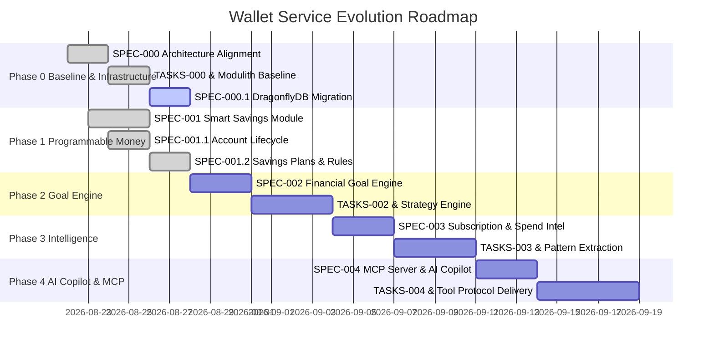

# 🗺️ Wallet Service — Spec Kit & Feature Evolution Roadmap

> **Status**: Approved Foundation & Active Roadmap  
> **Methodology**: Spec-Driven Development (SDD) & GitHub Spec Kit  
> **Baseline Version**: Wallet Service V3 (Transactional Ledger + NATS JetStream + Anti-Fraud Engine)  
> **Target Vision**: Programmable Money & AI-Enabled Financial Platform  
> **Modularity Engine**: Spring Modulith (Application Modules)  
> **Architectural Mantra**: *"Capabilities observe, analyze, decide, and propose. Wallet Core authorizes and executes."*

---

## 🧭 Executive Summary & Architectural Vision

The **Wallet Service** has successfully established a high-integrity core foundation (V1–V3):
- **Core Ledger**: Append-only, cryptographically hash-chained (`SHA-256`), row-level locked (`SELECT FOR UPDATE`), tamper-evident accounting log.
- **Event Streaming**: Transactional Outbox Pattern with NATS JetStream command/event buses.
- **Fraud & Risk Engine**: Pre-execution gate with $O(1)$ Caffeine sliding windows, Redis distributed velocity counters, and async event enrichment.
- **Observability**: OpenTelemetry end-to-end distributed tracing with `operation_id` baggage propagation and OpenObserve OTLP exports.

### Current Codebase Anatomy (The Baseline)
- **Root Application (`:`)**: Spring Boot main application hosting domain use cases, DAOs, REST controllers, Outbox relay, and NATS JetStream consumers.
- **Subproject `:core`**: Shared domain primitives, tracing annotations (`Traceable`, `TracingAspect`), and exceptions.
- **Subproject `:fraud`**: Dedicated Anti-Fraud & Risk Scoring engine (Caffeine sliding window, Redis velocity rules).

### The Evolution: Refactor $\rightarrow$ Modulith Foundation $\rightarrow$ Programmable Capabilities

Before introducing new business capabilities (Smart Savings, Goal Engine, Subscription Intelligence, AI Copilot), we perform a non-breaking architecture alignment (**SPEC-000**) to organize the codebase into a verified **Spring Modulith baseline**.

```
┌─────────────────────────────────────────────────────────────────────────┐
│                     Wallet Monolith Application                         │
│                                                                         │
│  ┌───────────────────────────────────────────────────────────────────┐  │
│  │                            core                                   │  │
│  │  ┌─────────────────────────────────────────────────────────────┐  │  │
│  │  │ core.api (Published API: TransferFunds, GetBalance, Events) │  │  │
│  │  └──────────────────────────────┬──────────────────────────────┘  │  │
│  │  ┌──────────────────────────────┴──────────────────────────────┐  │  │
│  │  │ core.internal (Ledger, Accounts, Fraud Gate, Outbox Relay)  │  │  │
│  │  └─────────────────────────────────────────────────────────────┘  │  │
│  └─────────────────────────────────┬─────────────────────────────────┘  │
│                                    │ Published API & Modulith Events    │
│        ┌───────────────────────────┼───────────────────────────┐        │
│        ▼                           ▼                           ▼        │
│  ┌───────────────┐           ┌───────────────┐           ┌───────────┐  │
│  │    savings    │           │     goals     │           │intel/subs │  │
│  │ (Modulith App)│           │ (Modulith App)│           │ (Modulith)│  │
│  └───────┬───────┘           └───────┬───────┘           └─────┬─────┘  │
│          │                           │                         │        │
│          └───────────────────────────┼─────────────────────────┘        │
│                                      ▼                                  │
│                            ┌───────────────────┐                        │
│                            │      copilot      │                        │
│                            │ (MCP Server Tool) │                        │
│                            └───────────────────┘                        │
└─────────────────────────────────────────────────────────────────────────┘
```

---

## 📐 Conceptual Taxonomy: Capability ≠ Module ≠ Tool

| Concept | Dimension | Implementation Mechanism | Concrete Examples |
| :--- | :--- | :--- | :--- |
| **Capability** | **Business Domain** | Domain logic, financial rules, analysis, proposals. | Smart Savings, Goal Strategy Engine, Subscription Intelligence. |
| **Application Module** | **Modularity / Packaging** | **Spring Modulith Application Module** (package boundaries verified by `ApplicationModules.verify()`). | `br.com.wallet.savings`, `br.com.wallet.goals`. |
| **Tool** | **Interaction Interface** | External contract for users or AI agents. | MCP Tool (`mcp://`), REST Endpoint (`/api/v1/...`), CLI. |

---

## 🔄 Dual-Tier Event Architecture

```text
               IN-PROCESS (Domain Extensions)
       ┌──────────────────────────────────────────────┐
       │             Spring Modulith                  │
       │                                              │
       │ Core.api.WalletEvents ──> @ApplicationModuleListener
       │   • Core ──> savings                         │
       │   • Core ──> goals                           │
       │   • Core ──> intelligence                    │
       └──────────────────────────────────────────────┘

             OUT-OF-PROCESS (Durable & Distributed)
       ┌──────────────────────────────────────────────┐
       │     Transactional Outbox ──> NATS JetStream  │
       │                                              │
       │   • Cross-service integration                │
       │   • Distributed fraud projection enrichers   │
       │   • Audit & analytical pipelines             │
       └──────────────────────────────────────────────┘
```

---

## 🏛️ Core Architectural Invariants

| Invariant ID | Rule Statement | Enforcement Layer |
| :--- | :--- | :--- |
| **`I-MODULITH-001`** | **Internal Encapsulation**: No module outside `ledger` SHALL directly access types contained in `br.com.wallet.ledger.internal.*` or database DAOs directly. | Spring Modulith Architecture Verification (`ApplicationModules.verify()`) |
| **`I-MODULITH-002`** | **Published API Access**: Cross-module interactions with the ledger engine SHALL occur exclusively through `br.com.wallet.ledger.api.*`. | Spring Modulith Architecture Verification (`ApplicationModules.verify()`) |
| **`I-SAVINGS-001`** | **Non-Re-entrant Execution**: Savings sweeps dispatched to `ledger.api.TransferFundsUseCase` MUST carry an idempotent `operation_id` derived deterministically from triggering transaction to prevent loops. | `br.com.wallet.savings` Rule Engine |
| **`I-SAVINGS-002`** | **Zero Direct Ledger Mutation**: The `savings` module MUST NOT access `ledger.internal.*` or mutate `ledger`/`accounts` tables directly. | `br.com.wallet.savings` |
| **`I-AI-001`** | **Human-in-the-Loop for AI Writes**: AI agents MUST NOT unilaterally execute financial transactions without explicit user approval. | AI / MCP Gateway |
| **`I-AI-002`** | **AI Critical Path Isolation**: The AI integration layer SHALL remain strictly outside all synchronous monetary transaction critical paths. Core performance and correctness MUST NOT depend on AI inference or MCP transport. | Protocol Boundary |

---

## 📊 5-Phase SDD Initiative Breakdown



---

### 🔹 Phase 0: Architecture Alignment & Modulith Core Baseline (Refactoring)
**Spec Identifier**: [`SPEC-000-architecture-alignment-modulith-baseline`](file:///.spec/SPEC-000-architecture-alignment-modulith-baseline.md)  
**Status**: 🟢 **Completed & Verified**  
**Core Abstraction**: `Architecture Refactoring & Baseline Verification`

- **Intent**: Refactor and align the existing codebase into a verified Spring Modulith baseline with `ledger.api` (published interface) and `ledger.internal` (sealed implementation), fixing package typos and ensuring zero regression on existing tests.
- **Spec Kit Artifacts**:
  - [`.spec/SPEC-000-architecture-alignment-modulith-baseline.md`](file:///.spec/SPEC-000-architecture-alignment-modulith-baseline.md)
  - [`.spec/PLAN-000-architecture-alignment-modulith-baseline.md`](file:///.spec/PLAN-000-architecture-alignment-modulith-baseline.md)
  - [`.spec/TASKS-000-architecture-alignment-modulith-baseline.md`](file:///.spec/TASKS-000-architecture-alignment-modulith-baseline.md)
  - [`.spec/summaries/SUMMARY-000-architecture-alignment-modulith-baseline.md`](file:///.spec/summaries/SUMMARY-000-architecture-alignment-modulith-baseline.md)

---

### 🔹 Phase 0.1: In-Memory Store Migration: Redis to DragonflyDB
**Spec Identifier**: [`SPEC-000.1-migrate-redis-to-dragonflydb`](file:///.spec/SPEC-000.1-migrate-redis-to-dragonflydb.md)  
**Status**: 🟢 **Completed & Verified**  
**Core Abstraction**: `High-Throughput In-Memory Engine (br.com.wallet.fraud / infrastructure)`

- **Intent**: Migrate the distributed in-memory caching and velocity layer from Redis to multi-threaded **DragonflyDB** (`docker.dragonflydb.io/dragonflydb/dragonfly:v1.40.1`), verifying full Lettuce RESP3 / Unix Domain Socket (UDS) compatibility and atomic Lua script execution (`REVIEW_COUNT_PROTECTED_SCRIPT`, `BLOCK_PROTECTED_SCRIPT`).
- **Capabilities Included**:
  - **DragonflyDB Deployment**: Docker Compose with UDS (`/var/run/redis/redis.sock`) and TCP (`6379`) support.
  - **Lua Multi-Key Atomicity**: Verified lock management across Dragonfly worker threads for all `KEYS[1..N]` pre-declared scripts.
  - **Testcontainers Upgrade**: Upgraded integration test infrastructure in `IntegrationTestBase.java`.
  - **Dedicated Test Suite**: `DragonflyLuaCompatibilityIT` testing replay detection and threshold blocking under concurrency.
- **Spec Kit Artifacts**:
  - [`.spec/SPEC-000.1-migrate-redis-to-dragonflydb.md`](file:///.spec/SPEC-000.1-migrate-redis-to-dragonflydb.md) (Ratified)
  - [`.spec/PLAN-000.1-migrate-redis-to-dragonflydb.md`](file:///.spec/PLAN-000.1-migrate-redis-to-dragonflydb.md) (Approved)
  - [`.spec/TASKS-000.1-migrate-redis-to-dragonflydb.md`](file:///.spec/TASKS-000.1-migrate-redis-to-dragonflydb.md) (Ready for TDD)

---

### 🔹 Phase 0.3: Asynchronous Command Exception Handling & Operation Status Tracking
**Spec Identifier**: [`SPEC-000.3-async-command-exception-handling`](file:///.spec/SPEC-000.3-async-command-exception-handling.md)  
**Status**: 🟢 **Completed & Verified**  
**Core Abstraction**: `Operation Lifecycle & Consumer Resilience (br.com.wallet.ledger / messaging / rest)`

- **Intent**: Capture background consumer business exceptions, persist `FAILED` operation state with diagnostic error messages in PostgreSQL, expose `GET /operations/{operationId}` query API, and preserve `202 ACCEPTED` contracts for command endpoints.
- **Spec Kit Artifacts**:
  - [`.spec/SPEC-000.3-async-command-exception-handling.md`](file:///.spec/SPEC-000.3-async-command-exception-handling.md) (Ratified)
  - [`.spec/PLAN-000.3-async-command-exception-handling.md`](file:///.spec/PLAN-000.3-async-command-exception-handling.md) (Approved)
  - [`.spec/TASKS-000.3-async-command-exception-handling.md`](file:///.spec/TASKS-000.3-async-command-exception-handling.md) (Completed)
  - [`.spec/summaries/SUMMARY-000.3-async-command-exception-handling.md`](file:///.spec/summaries/SUMMARY-000.3-async-command-exception-handling.md) (Verified)

---

### 🔹 Phase 0.4: Outbox Observability & OpenObserve Pipeline Optimization
**Spec Identifier**: [`SPEC-000.4-observability-outbox-and-openobserve-optimization`](file:///.spec/SPEC-000.4-observability-outbox-and-openobserve-optimization.md)  
**Status**: 🟢 **Completed & Verified**  
**Core Abstraction**: `Outbox Baggage Propagation, TracingAspect Lifecycle & OpenObserve Tuning`

- **Intent**: Propagate `operationId` baggage in `OutboxRelay` background processing, eliminate span leak in `TracingAspect`, optimize telemetry at the source (`MeterFilter`, `ObservationPredicate`), and tune OTel Collector batching and OpenObserve storage.
- **Spec Kit Artifacts**:
  - [`.spec/SPEC-000.4-observability-outbox-and-openobserve-optimization.md`](file:///.spec/SPEC-000.4-observability-outbox-and-openobserve-optimization.md) (Ratified)
  - [`.spec/PLAN-000.4-observability-outbox-and-openobserve-optimization.md`](file:///.spec/PLAN-000.4-observability-outbox-and-openobserve-optimization.md) (Approved)
  - [`.spec/TASKS-000.4-observability-outbox-and-openobserve-optimization.md`](file:///.spec/TASKS-000.4-observability-outbox-and-openobserve-optimization.md) (Completed)
  - [`.spec/summaries/SUMMARY-000.4-observability-outbox-and-openobserve-optimization.md`](file:///.spec/summaries/SUMMARY-000.4-observability-outbox-and-openobserve-optimization.md) (Verified)

---

### 🔹 Phase 0.5: Hybrid Fraud Intelligence & Relational Graph Projection
**Spec Identifier**: [`SPEC-000.5-hybrid-fraud-intelligence-and-relational-graph`](file:///.spec/SPEC-000.5-hybrid-fraud-intelligence-and-relational-graph.md)  
**Status**: 🟢 **Completed & Verified**  
**Core Abstraction**: `Two-Tier Graph Ingestion, Topological Patterns & Dragonfly Hot Feature Feedback (br.com.wallet.fraud.intelligence)`

- **Intent**: Capture entities (`USER`, `WALLET`, `DEVICE`, `IP`) and relationships asynchronously via NATS JetStream, project two-tier relational graph facts in PostgreSQL (`fraud_relationships` aggregate + `fraud_relationship_events` temporal evidence), detect circular flows ($A \to B \to C \to A$), fan-in/fan-out, and shared devices, and materialize computed `graph_risk` into DragonflyDB hot cache (`user:{id}:graph_risk`) for synchronous $O(1)$ gate consumption.
- **Spec Kit Artifacts**:
  - [`.spec/SPEC-000.5-hybrid-fraud-intelligence-and-relational-graph.md`](file:///.spec/SPEC-000.5-hybrid-fraud-intelligence-and-relational-graph.md) (Ratified)
  - [`.spec/PLAN-000.5-hybrid-fraud-intelligence-and-relational-graph.md`](file:///.spec/PLAN-000.5-hybrid-fraud-intelligence-and-relational-graph.md) (Approved)
  - [`.spec/TASKS-000.5-hybrid-fraud-intelligence-and-relational-graph.md`](file:///.spec/TASKS-000.5-hybrid-fraud-intelligence-and-relational-graph.md) (Completed)
  - [`.spec/summaries/SUMMARY-000.5-hybrid-fraud-intelligence-and-relational-graph.md`](file:///.spec/summaries/SUMMARY-000.5-hybrid-fraud-intelligence-and-relational-graph.md) (Verified)

---

### 🔹 Phase 0.6: Fraud Risk Propagation, Temporal Decay & Hand-Rolled Job Engine
**Spec Identifier**: [`SPEC-000.6-fraud-risk-propagation-and-temporal-decay`](file:///.spec/SPEC-000.6-fraud-risk-propagation-and-temporal-decay.md)  
**Status**: 🟢 **Completed & Verified**  
**Core Abstraction**: `Path-Influence Risk Propagation, Exponential Temporal Decay & Hand-Rolled PostgreSQL SKIP LOCKED Job Queue (br.com.wallet.fraud.propagation)`

- **Intent**: Propagate risk scores across connected graph paths using temporal evidence from `fraud_relationship_events.occurred_at` and exponential decay ($I(p, t) = R_{\text{source}}(v) \cdot \prod w(e) \cdot \prod e^{-\lambda \Delta t_e}$), resolve multi-path convergence via probabilistic union without double-counting, execute through an idempotent hand-rolled PostgreSQL job queue (`fraud_propagation_jobs` with `FOR UPDATE SKIP LOCKED`), and publish `EntityRiskPropagationDetectedEvent`.
- **Spec Kit Artifacts**:
  - [`.spec/SPEC-000.6-fraud-risk-propagation-and-temporal-decay.md`](file:///.spec/SPEC-000.6-fraud-risk-propagation-and-temporal-decay.md) (Ratified)
  - [`.spec/PLAN-000.6-fraud-risk-propagation-and-temporal-decay.md`](file:///.spec/PLAN-000.6-fraud-risk-propagation-and-temporal-decay.md) (Approved)
  - [`.spec/TASKS-000.6-fraud-risk-propagation-and-temporal-decay.md`](file:///.spec/TASKS-000.6-fraud-risk-propagation-and-temporal-decay.md) (Completed)
  - [`.spec/summaries/SUMMARY-000.6-fraud-risk-propagation-and-temporal-decay.md`](file:///.spec/summaries/SUMMARY-000.6-fraud-risk-propagation-and-temporal-decay.md) (Verified)

---

### 🔹 Phase 0.7: Fraud Behavioral Embeddings & Evidence-Grounded Investigation Synthesizer (pgvector)
**Spec Identifier**: [`SPEC-000.7-fraud-behavioral-embeddings-and-investigation-pgvector`](file:///.spec/SPEC-000.7-fraud-behavioral-embeddings-and-investigation-pgvector.md)  
**Status**: 🟢 **Completed & Verified**  
**Core Abstraction**: `Behavioral Profile Vectors, Exact Archetype Centroid Matching & Evidence-Grounded Investigation Synthesizer (br.com.wallet.fraud.embeddings & br.com.wallet.fraud.investigation)`

- **Intent**: Store $L_2$-normalized behavioral feature vectors with scalar intensity magnitude in PostgreSQL using `pgvector`, match calibrated fraud archetypes via exact dot products ($O(N)$), process updates asynchronously via a durable job queue (`fraud_embedding_jobs`), and synthesize explainable investigation dossiers via a pluggable local inference SPI (`LocalInferenceClient`) using Small Language Models with deterministic risk ownership, zero cloud egress, hard sanitization boundary, claim grounding validation, and graceful degradation.
- **Spec Kit Artifacts**:
  - [`.spec/SPEC-000.7-fraud-behavioral-embeddings-and-investigation-pgvector.md`](file:///.spec/SPEC-000.7-fraud-behavioral-embeddings-and-investigation-pgvector.md) (Ratified)
  - [`.spec/PLAN-000.7-fraud-behavioral-embeddings-and-investigation-pgvector.md`](file:///.spec/PLAN-000.7-fraud-behavioral-embeddings-and-investigation-pgvector.md) (Ratified)
  - [`.spec/TASKS-000.7-fraud-behavioral-embeddings-and-investigation-pgvector.md`](file:///.spec/TASKS-000.7-fraud-behavioral-embeddings-and-investigation-pgvector.md) (Completed)
  - [`summaries/SUMMARY-000.7-fraud-behavioral-embeddings-and-investigation-pgvector.md`](file:///.spec/SUMMARY-000.7-fraud-behavioral-embeddings-and-investigation-pgvector.md) (Verified)

---

### 🔹 Phase 0.8: Fraud Signal Fusion, Micro-ML & LangGraph Agentic Investigation
**Spec Identifier**: [`SPEC-000.8-fraud-signal-fusion-and-micro-ml`](file:///.spec/SPEC-000.8-fraud-signal-fusion-and-micro-ml.md)  
**Status**: 🟢 **Reviewed & Ratified**  
**Core Abstraction**: `Multi-Signal Probabilistic Fusion, Micro-ML ONNX Scoring & LangGraph StateGraph Agentic Workflow (br.com.wallet.fraud.fusion)`

- **Intent**: Fuse deterministic rules, graph topology, temporal risk propagation, behavioral vector anomalies, and micro-ML shadow scores into an explainable final risk score ($R_{\text{final}}$), orchestrate deep asynchronous investigations and analyst reviews via a LangGraph StateGraph workflow, and materialize hot risk state into DragonflyDB for sub-millisecond $O(1)$ Fraud Gate V4 execution.
- **Spec Kit Artifacts**:
  - [`.spec/SPEC-000.8-fraud-signal-fusion-and-micro-ml.md`](file:///.spec/SPEC-000.8-fraud-signal-fusion-and-micro-ml.md) (Ratified)

---

### 🔹 Phase 1: Smart Savings & Programmable Money
**Spec Identifier**: [`SPEC-001-smart-savings-automation`](file:///.spec/SPEC-001-smart-savings-automation.md)  
**Status**: 🟢 **Completed & Verified**  
**Core Abstraction**: `Savings Plan & Rules (br.com.wallet.savings)`

- **Intent**: First production business capability module reacting to `DepositCompletedEvent` and `TransferCompletedEvent` to trigger automated, deterministic savings actions via `ledger.api.TransferFundsUseCase`.
- **Capabilities Included**:
  - **Round-Up Rule**: Micro-savings sweeping transaction round-up deltas (e.g. R$ 47.30 $\rightarrow$ R$ 50.00 = R$ 2.70).
  - **Fixed Percentage Rule**: Automatic allocation of $X\%$ on incoming deposits.
  - **Balance Ceiling Sweep**: Automatic sweeping of funds exceeding target liquidity limits.
- **Spec Kit Artifacts**:
  - [`.spec/SPEC-001-smart-savings-automation.md`](file:///.spec/SPEC-001-smart-savings-automation.md) (Ratified)
  - [`.spec/PLAN-001-smart-savings-automation.md`](file:///.spec/PLAN-001-smart-savings-automation.md) (Approved)
  - [`.spec/TASKS-001-smart-savings-automation.md`](file:///.spec/TASKS-001-smart-savings-automation.md) (Completed)
  - [`.spec/summaries/SUMMARY-001-smart-savings-automation.md`](file:///.spec/summaries/SUMMARY-001-smart-savings-automation.md) (Verified)

---

### 🔹 Phase 1.1: Account Lifecycle State & Persistent Fraud Blocking
**Spec Identifier**: [`SPEC-001.1-account-lifecycle-state-and-fraud-blocking`](file:///.spec/SPEC-001.1-account-lifecycle-state-and-fraud-blocking.md)  
**Status**: 🟢 **Completed & Verified**  
**Core Abstraction**: `Account Lifecycle & Dual-Store Sync (ledger.api / fraud)`

- **Intent**: Close the architectural gap where fraud detection decisions only rejected transient operations without mutating the underlying account state in PostgreSQL.
- **Capabilities Included**:
  - **Account Status**: `ACTIVE`, `BLOCKED`, `SUSPENDED`, `FROZEN` on `accounts` table.
  - **AccountBlockedException**: Shared foundation exception in `core.exceptions`.
  - **Pre-Execution Gate**: Mandatory status check during `SELECT FOR UPDATE` queries.
  - **Dual-Store Sync**: Automated PostgreSQL $\leftrightarrow$ Redis user block state synchronization.
  - **Administrative Management**: `AccountStateUseCase` (`blockAccount`, `unblockAccount`, `getAccountStatus`).
- **Spec Kit Artifacts**:
  - [`.spec/SPEC-001.1-account-lifecycle-state-and-fraud-blocking.md`](file:///.spec/SPEC-001.1-account-lifecycle-state-and-fraud-blocking.md) (Ratified)
  - [`.spec/PLAN-001.1-account-lifecycle-state-and-fraud-blocking.md`](file:///.spec/PLAN-001.1-account-lifecycle-state-and-fraud-blocking.md) (Approved)
  - [`.spec/TASKS-001.1-account-lifecycle-state-and-fraud-blocking.md`](file:///.spec/TASKS-001.1-account-lifecycle-state-and-fraud-blocking.md) (Completed)
  - [`.spec/summaries/SUMMARY-001.1-account-lifecycle-state-and-fraud-blocking.md`](file:///.spec/summaries/SUMMARY-001.1-account-lifecycle-state-and-fraud-blocking.md) (Verified)

---

### 🔹 Phase 1.2: Savings Plans & Dynamic Rules Management
**Spec Identifier**: [`SPEC-001.2-savings-plans-and-rules-management`](file:///.spec/SPEC-001.2-savings-plans-and-rules-management.md)  
**Status**: 🟢 **Completed & Verified**  
**Core Abstraction**: `Dynamic Savings Management & REST API (br.com.wallet.savings / rest)`

- **Intent**: Enable dynamic lifecycle management for Savings Plans and Savings Rules via REST API (`/savings/*`) and Use Case interfaces, enabling rule addition to existing plans at any time.
- **Capabilities Included**:
  - **Dynamic Rule Provisioning**: Add rules (`ROUND_UP`, `PERCENTAGE`, `THRESHOLD`) to existing plans.
  - **Rule Lifecycle**: Enable, disable, query, and delete individual savings rules.
  - **REST Controller (`SavingsController`) & API**: OpenAPI-documented endpoints under `/savings`.
  - **Savings Metrics**: Query aggregated savings metrics and breakdown by rule type.
- **Spec Kit Artifacts**:
  - [`.spec/SPEC-001.2-savings-plans-and-rules-management.md`](file:///.spec/SPEC-001.2-savings-plans-and-rules-management.md) (Ratified)
  - [`.spec/PLAN-001.2-savings-plans-and-rules-management.md`](file:///.spec/PLAN-001.2-savings-plans-and-rules-management.md) (Approved)
  - [`.spec/TASKS-001.2-savings-plans-and-rules-management.md`](file:///.spec/TASKS-001.2-savings-plans-and-rules-management.md) (Completed)
  - [`.spec/summaries/SUMMARY-001.2-savings-plans-and-rules-management.md`](file:///.spec/summaries/SUMMARY-001.2-savings-plans-and-rules-management.md) (Verified)

---

### 🔹 Phase 2: Financial Goal & Cashflow Strategy Engine
**Spec Identifier**: `SPEC-002-financial-goal-engine`  
**Status**: ⚪ Planned  
**Core Abstraction**: `Goals & Strategy (br.com.wallet.goals)`

- **Intent**: Goal-oriented financial strategy calculation utilizing `spring-modulith-moments` (`MonthHasPassed`, `DayHasPassed`).
- **Spec Kit Artifacts**:
  - `.spec/SPEC-002-financial-goal-engine.md`

---

### 🔹 Phase 3: Subscription & Spending Intelligence
**Spec Identifier**: `SPEC-003-spending-and-subscription-intelligence`  
**Status**: ⚪ Planned  
**Core Abstraction**: `Intelligence (br.com.wallet.intelligence)`

- **Intent**: Extract recurring financial patterns, predict upcoming obligations, and alert on fee/rate anomalies without state mutation.
- **Spec Kit Artifacts**:
  - `.spec/SPEC-003-spending-and-subscription-intelligence.md`

---

### 🔹 Phase 4: AI Financial Copilot & Model Context Protocol (MCP)
**Spec Identifier**: `SPEC-004-ai-financial-copilot-mcp`  
**Status**: ⚪ Planned  
**Core Abstraction**: `Agent & Tools (br.com.wallet.copilot)`

- **Intent**: Expose wallet capabilities to AI agents via standardized Model Context Protocol (MCP) with human-in-the-loop approvals.
- **Spec Kit Artifacts**:
  - `.spec/SPEC-004-ai-financial-copilot-mcp.md`

---

## 🛠️ SDD Execution Governance

```text
[1. SPECIFY] ──> [2. CLARIFY] ──> [3. PLAN] ──> [4. TASKS] ──> [5. ANALYZE] ──> [6. IMPLEMENT (TDD)] ──> [7. CONVERGE]
```

1. **Gate 1 (Ratification)**: Spec authoring with formal mathematical invariants $\rightarrow$ Human alignment.
2. **Gate 2 (Architecture Sign-off)**: Plan with ADRs, sequence diagrams, failure modes, and threat modeling (`/threat-model`).
3. **Gate 3 (Pre-Implementation Check)**: Tasks breakdown mapped 1-to-1 to requirement IDs (`REQ-XXX`) and invariants (`I-XXX`).
4. **Gate 4 (Convergence Gate)**: Full test suite (`./gradlew test jacocoTestReport`), Modulith verification (`ModulithArchitectureTest`), Zero Spec-Drift reconciliation, and execution summary.
