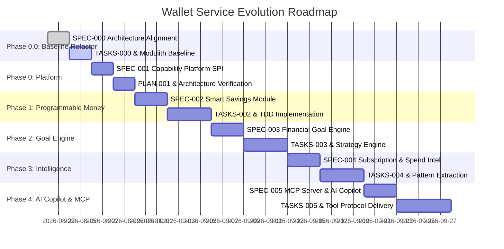

# 🗺️ Wallet Service — Spec Kit & Feature Evolution Roadmap

> **Status**: Approved Foundation & Active Roadmap  
> **Methodology**: Spec-Driven Development (SDD) & GitHub Spec Kit  
> **Baseline Version**: Wallet Service V3 (Transactional Ledger + NATS JetStream + Anti-Fraud Engine)  
> **Target Vision**: Programmable Money & AI-Enabled Financial Platform  
> **Modularity Engine**: Spring Modulith (Application Modules)  
> **Architectural Mantra**: *"Capabilities observe, analyze, decide, and propose. Wallet Core authorizes and executes."*

---

## 🧭 Executive Summary & Architectural Vision

The **Wallet Service** has successfully established a high-integrity core foundation (V1–V3):
- **Core Ledger**: Append-only, cryptographically hash-chained (`SHA-256`), row-level locked (`SELECT FOR UPDATE`), tamper-evident accounting log.
- **Event Streaming**: Transactional Outbox Pattern with NATS JetStream command/event buses.
- **Fraud & Risk Engine**: Pre-execution gate with $O(1)$ Caffeine sliding windows, Redis distributed velocity counters, and async event enrichment.
- **Observability**: OpenTelemetry end-to-end distributed tracing with `operation_id` baggage propagation and OpenObserve OTLP exports.

### Current Codebase Anatomy (The Baseline)
- **Root Application (`:`)**: Spring Boot main application hosting domain use cases, DAOs, REST controllers, Outbox relay, and NATS JetStream consumers.
- **Subproject `:core`**: Shared domain primitives, tracing annotations (`Traceable`, `TracingAspect`), and exceptions.
- **Subproject `:fraud`**: Dedicated Anti-Fraud & Risk Scoring engine (Caffeine sliding window, Redis velocity rules).

### The Evolution: Refactor $\rightarrow$ Modulith Foundation $\rightarrow$ Programmable Capabilities

Before introducing new business capabilities (Smart Savings, Goal Engine, Subscription Intelligence, AI Copilot), we perform a non-breaking architecture alignment (**SPEC-000**) to organize the codebase into a verified **Spring Modulith baseline**.

```
┌─────────────────────────────────────────────────────────────────────────┐
│                     Wallet Monolith Application                         │
│                                                                         │
│  ┌───────────────────────────────────────────────────────────────────┐  │
│  │                            core                                   │  │
│  │  ┌─────────────────────────────────────────────────────────────┐  │  │
│  │  │ core.api (Published API: TransferFunds, GetBalance, Events) │  │  │
│  │  └──────────────────────────────┬──────────────────────────────┘  │  │
│  │  ┌──────────────────────────────┴──────────────────────────────┐  │  │
│  │  │ core.internal (Ledger, Accounts, Fraud Gate, Outbox Relay)  │  │  │
│  │  └─────────────────────────────────────────────────────────────┘  │  │
│  └─────────────────────────────────┬─────────────────────────────────┘  │
│                                    │ Published API & Modulith Events    │
│        ┌───────────────────────────┼───────────────────────────┐        │
│        ▼                           ▼                           ▼        │
│  ┌───────────────┐           ┌───────────────┐           ┌───────────┐  │
│  │    savings    │           │     goals     │           │intel/subs │  │
│  │ (Modulith App)│           │ (Modulith App)│           │ (Modulith)│  │
│  └───────┬───────┘           └───────┬───────┘           └─────┬─────┘  │
│          │                           │                         │        │
│          └───────────────────────────┼─────────────────────────┘        │
│                                      ▼                                  │
│                            ┌───────────────────┐                        │
│                            │      copilot      │                        │
│                            │ (MCP Server Tool) │                        │
│                            └───────────────────┘                        │
└─────────────────────────────────────────────────────────────────────────┘
```

---

## 📐 Conceptual Taxonomy: Capability ≠ Module ≠ Tool

| Concept | Dimension | Implementation Mechanism | Concrete Examples |
| :--- | :--- | :--- | :--- |
| **Capability** | **Business Domain** | Domain logic, financial rules, analysis, proposals. | Smart Savings, Goal Strategy Engine, Subscription Intelligence. |
| **Application Module** | **Modularity / Packaging** | **Spring Modulith Application Module** (package boundaries verified by `ApplicationModules.verify()`). | `br.com.wallet.savings`, `br.com.wallet.goals`. |
| **Tool** | **Interaction Interface** | External contract for users or AI agents. | MCP Tool (`mcp://`), REST Endpoint (`/api/v1/...`), CLI. |

---

## 🔄 Dual-Tier Event Architecture

```text
               IN-PROCESS (Domain Extensions)
       ┌──────────────────────────────────────────────┐
       │             Spring Modulith                  │
       │                                              │
       │ Core.api.WalletEvents ──> @ApplicationModuleListener
       │   • Core ──> savings                         │
       │   • Core ──> goals                           │
       │   • Core ──> intelligence                    │
       └──────────────────────────────────────────────┘

             OUT-OF-PROCESS (Durable & Distributed)
       ┌──────────────────────────────────────────────┐
       │     Transactional Outbox ──> NATS JetStream  │
       │                                              │
       │   • Cross-service integration                │
       │   • Distributed fraud projection enrichers   │
       │   • Audit & analytical pipelines             │
       └──────────────────────────────────────────────┘
```

---

## 🏛️ Core Architectural Invariants

| Invariant ID | Rule Statement | Enforcement Layer |
| :--- | :--- | :--- |
| **`I-CAPABILITY-001`** | **No Direct Ledger/Internal Access**: Application modules (`savings`, `goals`, `intelligence`, `copilot`) MUST NOT import or access `core.internal.*`. They interact exclusively with `core.api.*`. | Spring Modulith Architecture Verification (`ApplicationModules.verify()`) |
| **`I-CAPABILITY-002`** | **Zero Gate Bypass**: Commands submitted through `core.api` MUST NEVER bypass authorization, idempotency validation (`operation_id`), pre-execution fraud scoring, row-level locking, or balance constraints. | Core Use Cases & Pre-Execution Gate |
| **`I-CAPABILITY-003`** | **First-Class Proposal Primitive**: Complex, non-immediate, or AI-suggested financial actions MUST be modeled as `FinancialProposal` instances requiring explicit approval before command execution. | Platform Proposal Lifecycle |
| **`I-AI-001`** | **Human-in-the-Loop for AI Writes**: AI agents MUST NOT unilaterally execute financial transactions without human approval. | AI / MCP Gateway |
| **`I-AI-002`** | **AI Critical Path Isolation**: The AI integration layer SHALL remain strictly outside all synchronous monetary transaction critical paths. Core performance and correctness MUST NOT depend on AI inference or MCP transport. | Protocol Boundary |

---

## 📊 6-Phase SDD Initiative Breakdown



---

### 🔹 Phase 0.0: Architecture Alignment & Modulith Core Baseline (Refactoring)
**Spec Identifier**: [`SPEC-000-architecture-alignment-modulith-baseline`](file:///.spec/SPEC-000-architecture-alignment-modulith-baseline.md)  
**Core Abstraction**: `Architecture Refactoring & Baseline Verification`

- **Intent**: Refactor and align the existing root application, `:core`, and `:fraud` subprojects into a verified Spring Modulith baseline with `core.api` (published interface) and `core.internal` (sealed implementation), fixing package typos and ensuring zero regression on existing tests.
- **Key Deliverables**:
  1. Add `spring-modulith-starter-core` and `spring-modulith-starter-test` to `build.gradle`.
  2. Structure `br.com.wallet.core.api` (`TransferFunds`, `DepositFunds`, `WithdrawFunds`, `GetBalance`, `ValidateLedger`, `ReplayWallet`, `WalletEvents`) and `br.com.wallet.core.internal` (persistence, ledger, account, outbox, guard).
  3. Rename package typo `infrasctructure` $\rightarrow$ `infrastructure`.
  4. Ensure REST controllers and NATS messaging workers consume `core.api`.
  5. Implement `ModulithArchitectureTest` asserting `ApplicationModules.of(WalletApplication.class).verify()`.
- **Spec Kit Artifacts**:
  - [`.spec/SPEC-000-architecture-alignment-modulith-baseline.md`](file:///.spec/SPEC-000-architecture-alignment-modulith-baseline.md)
  - [`.spec/PLAN-000-architecture-alignment-modulith-baseline.md`](file:///.spec/PLAN-000-architecture-alignment-modulith-baseline.md)
  - [`.spec/TASKS-000-architecture-alignment-modulith-baseline.md`](file:///.spec/TASKS-000-architecture-alignment-modulith-baseline.md)

---

### 🔹 Phase 0: Capability Platform Foundation & Proposal Primitive
**Spec Identifier**: [`SPEC-001-wallet-capability-platform`](file:///.spec/SPEC-001-wallet-capability-platform.md)  
**Core Abstraction**: `Application Module & Proposal Lifecycle`

- **Intent**: Build the in-process event dispatching (`@ApplicationModuleListener`), `FinancialProposal` primitive & lifecycle (`ProposalService`), and module-level testing harness.
- **Spec Kit Artifacts**:
  - [`.spec/SPEC-001-wallet-capability-platform.md`](file:///.spec/SPEC-001-wallet-capability-platform.md)
  - [`.spec/PLAN-001-wallet-capability-platform.md`](file:///.spec/PLAN-001-wallet-capability-platform.md)
  - [`.spec/TASKS-001-wallet-capability-platform.md`](file:///.spec/TASKS-001-wallet-capability-platform.md)

---

### 🔹 Phase 1: Smart Savings & Programmable Money
**Spec Identifier**: `SPEC-002-smart-savings-automation`  
**Core Abstraction**: `Rule (br.com.wallet.savings)`

- **Intent**: First production capability module reacting to `MoneyReceivedEvent` and `MoneySentEvent` to trigger automated, deterministic savings actions via `core.api.TransferFunds`.
- **Capabilities Included**:
  - **Fixed Percentage Rule**: Intercept incoming deposits and transfer $X\%$ to a dedicated Savings Wallet.
  - **Round-Up Rule**: Intercept outgoing payments, calculate round-up delta (e.g. R$ 47.30 $\rightarrow$ R$ 50.00 = R$ 2.70), and sweep delta to Savings.
  - **Balance Threshold Sweep**: Sweeping excess funds beyond liquidity limits.
- **Spec Kit Artifacts**:
  - [`.spec/SPEC-002-smart-savings-automation.md`](file:///.spec/SPEC-002-smart-savings-automation.md)
  - [`.spec/PLAN-002-smart-savings-automation.md`](file:///.spec/PLAN-002-smart-savings-automation.md)
  - [`.spec/TASKS-002-smart-savings-automation.md`](file:///.spec/TASKS-002-smart-savings-automation.md)

---

### 🔹 Phase 2: Financial Goal & Cashflow Strategy Engine
**Spec Identifier**: `SPEC-003-financial-goal-engine`  
**Core Abstraction**: `Strategy & Moments (br.com.wallet.goals)`

- **Intent**: Goal-oriented financial strategy calculation utilizing `spring-modulith-moments` (`MonthHasPassed`, `DayHasPassed`, `TimeMachine`).
- **Spec Kit Artifacts**:
  - [`.spec/SPEC-003-financial-goal-engine.md`](file:///.spec/SPEC-003-financial-goal-engine.md)
  - [`.spec/PLAN-003-financial-goal-engine.md`](file:///.spec/PLAN-003-financial-goal-engine.md)
  - [`.spec/TASKS-003-financial-goal-engine.md`](file:///.spec/TASKS-003-financial-goal-engine.md)

---

### 🔹 Phase 3: Subscription & Spending Intelligence
**Spec Identifier**: `SPEC-004-spending-and-subscription-intelligence`  
**Core Abstraction**: `Intelligence (br.com.wallet.intelligence)`

- **Intent**: Extract recurring financial patterns, predict upcoming obligations, and alert on fee/rate anomalies without state mutation.
- **Spec Kit Artifacts**:
  - [`.spec/SPEC-004-spending-and-subscription-intelligence.md`](file:///.spec/SPEC-004-spending-and-subscription-intelligence.md)
  - [`.spec/PLAN-004-spending-and-subscription-intelligence.md`](file:///.spec/PLAN-004-spending-and-subscription-intelligence.md)
  - [`.spec/TASKS-004-spending-and-subscription-intelligence.md`](file:///.spec/TASKS-004-spending-and-subscription-intelligence.md)

---

### 🔹 Phase 4: AI Financial Copilot & Model Context Protocol (MCP)
**Spec Identifier**: `SPEC-005-ai-financial-copilot-mcp`  
**Core Abstraction**: `Agent / Tool (br.com.wallet.copilot)`

- **Intent**: Expose wallet capabilities to AI agents via standardized MCP (Model Context Protocol).
- **Spec Kit Artifacts**:
  - [`.spec/SPEC-005-ai-financial-copilot-mcp.md`](file:///.spec/SPEC-005-ai-financial-copilot-mcp.md)
  - [`.spec/PLAN-005-ai-financial-copilot-mcp.md`](file:///.spec/PLAN-005-ai-financial-copilot-mcp.md)
  - [`.spec/TASKS-005-ai-financial-copilot-mcp.md`](file:///.spec/TASKS-005-ai-financial-copilot-mcp.md)

---

## 🛠️ SDD Execution Governance

```text
[1. SPECIFY] ──> [2. CLARIFY] ──> [3. PLAN] ──> [4. TASKS] ──> [5. ANALYZE] ──> [6. IMPLEMENT (TDD)] ──> [7. CONVERGE]
```

1. **Gate 1 (Ratification)**: Spec authoring with formal mathematical invariants $\rightarrow$ Human alignment.
2. **Gate 2 (Architecture Sign-off)**: Plan with ADRs, sequence diagrams, failure modes, and threat modeling (`/threat-model`).
3. **Gate 3 (Pre-Implementation Check)**: Tasks breakdown mapped 1-to-1 to requirement IDs (`REQ-XXX`) and invariants (`I-XXX`).
4. **Gate 4 (Convergence Gate)**: Full test suite (`./gradlew test`), Modulith verification (`ApplicationModules.verify()`), zero orphan tasks, and traceability report.
