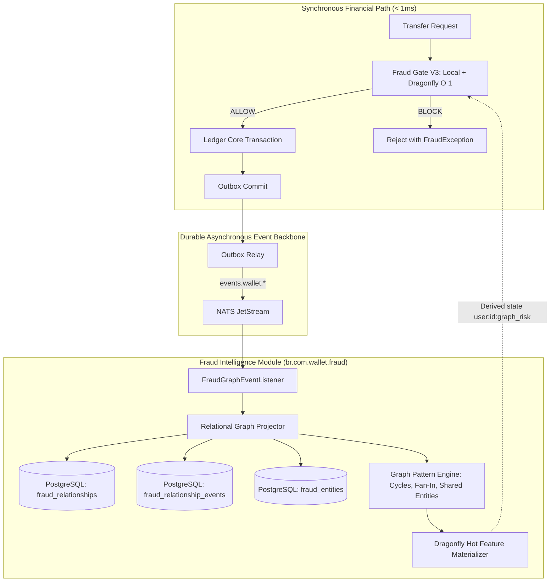

# 📋 Specification: SPEC-000.5 — Hybrid Fraud Intelligence & Relational Graph Projection (Histories 12, 13, 14, 15, 16)

- **Status**: Reviewed & Ratified
- **Author**: Antigravity Financial & Risk Engineering Team
- **Date**: 2026-08-30
- **Source Reference**: [`.histories/history12.txt`](file:///.histories/history12.txt), [`.histories/history13.txt`](file:///.histories/history13.txt), [`.histories/history14.txt`](file:///.histories/history14.txt), [`.histories/history15.txt`](file:///.histories/history15.txt), [`.histories/history16.txt`](file:///.histories/history16.txt)
- **Target Release / Milestone**: Wallet Service V4.x — Fraud Intelligence Evolution (Phase 0.5)
- **Architectural Mantra**: *"Keep the synchronous financial path O(1) and deterministic in DragonflyDB while projecting multi-hop relationship topology and granular temporal graph facts asynchronously in PostgreSQL."*

---

## 1. Intent & Business Value

The existing Anti-Fraud Engine (V3) evaluates transactions via isolated, synchronous rules (sliding window velocity, single-user blocklists, new recipient checks). While highly effective for bounded per-transaction anomalies, it is blind to **structural and relational fraud**:
- **Fraud Rings & Mule Networks**: Complex clusters of accounts funneling illicit funds.
- **Shared Identity & Device Reuse**: Multiple users sharing device fingerprints, IP subnets, phone numbers, or merchant tokens.
- **Topological Patterns**: Rapid pass-throughs, fan-in (many-to-one), fan-out (one-to-many), and circular money loops ($A \to B \to C \to A$).

This specification evolves `br.com.wallet.fraud` into a **Hybrid Fraud Intelligence Engine** by:
1. Introducing an **asynchronous NATS event-driven graph projector** that captures entities and relationships without adding latency to the financial transfer hot path.
2. Establishing a **two-tier Relational Graph storage model in PostgreSQL**:
   - `fraud_relationships`: Aggregated current edge projection (`tx_count`, `total_amount`, `first_seen_at`, `last_seen_at`).
   - `fraud_relationship_events`: Granular, append-only temporal evidence table storing individual transactions/links with timestamps.
3. Defining **technology-agnostic domain interfaces** (`FraudRelationshipStore`, `FraudGraphQuery`, `FraudFeatureProvider`) ensuring zero vendor lock-in.
4. Establishing a **decoupled, multi-dimensional risk taxonomy** (`direct_risk`, `graph_risk`, `behavioral_risk`, `propagated_risk`, `final_risk`) in `fraud_entities`, where `SPEC-000.5` strictly computes `graph_risk`.
5. Defining a **deterministic `GraphRiskSignals` scoring model** combining cycle risk, fan-in/out risk, and shared identity risk into `graph_risk`.
6. Implementing **asynchronous hot feature feedback into DragonflyDB as derived state (`I-FRAUD-007`)**, materializing `user:{id}:graph_risk` for instant $O(1)$ Fraud Gate consumption.



---

## 2. Scope & Non-Goals

### In Scope
- **`REQ-FRAUD-001` (Asynchronous Relationship Projection via NATS JetStream)**: Consume domain events (`TransferCompletedEvent`, `DepositCompletedEvent`, `AccountCreatedEvent`, `DeviceLinkedEvent`) asynchronously without blocking financial transactions.
- **`REQ-FRAUD-002` (Two-Tier Relational Graph Schema in PostgreSQL)**:
  - `fraud_entities` with decomposed risk taxonomy (`direct_risk`, `graph_risk`, `behavioral_risk`, `propagated_risk`, `final_risk`).
  - `fraud_relationships` (aggregate current projection) with composite primary key `(source_id, target_id, relationship_type)`.
  - `fraud_relationship_events` (temporal evidence) with indexes on `(source_id, occurred_at)`, `(target_id, occurred_at)`, and `(relationship_type, occurred_at)`.
- **`REQ-FRAUD-003` (Technology-Agnostic Domain Contracts)**: Abstract graph persistence and querying behind `FraudRelationshipStore`, `FraudGraphQuery`, and `FraudFeatureProvider`.
- **`REQ-FRAUD-004` (Temporal Truth & Zero Future Leakage)**: Queries reconstructing historical topology at time $t$ must strictly query `fraud_relationship_events WHERE occurred_at <= :t`.
- **`REQ-FRAUD-005` (Deterministic Graph Risk Scoring Model)**:
  ```java
  public record GraphRiskSignals(
      double cycleRisk,
      double fanInRisk,
      double fanOutRisk,
      double sharedIdentityRisk,
      double muleHubRisk
  ) {}
  ```
  Calculate `graph_risk = min(1.0, 0.35 * cycleRisk + 0.25 * muleHubRisk + 0.20 * sharedIdentityRisk + 0.10 * fanInRisk + 0.10 * fanOutRisk)`.
- **`REQ-FRAUD-006` (Dragonfly Derived Hot State Feedback)**: Materialize computed `graph_risk` into Dragonfly keys (`user:{userId}:graph_risk`, `wallet:{walletId}:network_risk`) with configurable TTLs.
- **`REQ-FRAUD-007` (Historical Graph Replay & Rebuild)**: Expose `GraphRebuildService` to reconstruct `fraud_relationships` and Dragonfly hot state from `fraud_relationship_events`.

### Non-Goals
- Mandating a dedicated graph database (Neo4j, Memgraph) for V1.
- Calculating `propagated_risk` (covered in `SPEC-000.6`), `behavioral_risk` (covered in `SPEC-000.7`), or `final_risk` (covered in `SPEC-000.8`).
- Executing multi-hop graph traversals on the synchronous $O(1)$ transfer path.

---

## 3. Mathematical & Architectural Invariants

- **`I-FRAUD-001` (Transaction Path Preservation)**: Telemetry, graph ingestion, or database failures in the Fraud Intelligence module MUST NOT block or fail financial transactions in the core ledger.
- **`I-FRAUD-002` ($O(1)$ Synchronous Gate Invariant)**: Synchronous evaluation on the transaction path must remain strictly $O(1)$ bounded time, querying only local Caffeine windows and materialized DragonflyDB keys.
- **`I-FRAUD-003` (Temporal Truth & Zero Future Leakage)**: Feature extraction and historical evaluation at time $t$ must only use information present in `fraud_relationship_events` prior to or at time $t$:
  $$\text{Features}(e, t) = f(G_{\leq t}) \quad \text{where } G_{\leq t} = (V_{\leq t}, E_{\leq t})$$
- **`I-FRAUD-004` (Vendor-Agnostic Core Domain)**: The `br.com.wallet.fraud` domain model must not import third-party graph database drivers directly.
- **`I-FRAUD-005` (Idempotent Event Ingestion)**: Every graph relationship projection must be idempotent using `ON CONFLICT (source_id, target_id, relationship_type) DO UPDATE` for aggregates and deduplicating events by `id` / `operation_id`.
- **`I-FRAUD-006` (Decoupled Risk Score Invariant)**: Computing `graph_risk` must never overwrite or mutate `direct_risk`, `behavioral_risk`, `propagated_risk`, or `final_risk`.
- **`I-FRAUD-007` (Derived Hot State Guarantee)**: DragonflyDB graph-risk values MUST be treated as derived cache state that can be fully reconstructed from PostgreSQL.

---

## 4. Requirements & Acceptance Criteria

### REQ-FRAUD-001: Event-Driven Graph Ingestion
- **Given** a `TransferCompletedEvent` published to NATS JetStream.
- **When** received by `FraudGraphConsumer`.
- **Then** it must insert an immutable record into `fraud_relationship_events` and upsert `fraud_relationships` and `fraud_entities` asynchronously.

### REQ-FRAUD-002: Relational Graph Schema
- **Given** PostgreSQL as the primary durable storage.
- **When** schema migration runs.
- **Then** it must create:
  ```sql
  CREATE TABLE IF NOT EXISTS fraud_entities (
      id UUID PRIMARY KEY,
      entity_type VARCHAR(32) NOT NULL,
      direct_risk DOUBLE PRECISION NOT NULL DEFAULT 0.0,
      graph_risk DOUBLE PRECISION NOT NULL DEFAULT 0.0,
      behavioral_risk DOUBLE PRECISION NOT NULL DEFAULT 0.0,
      propagated_risk DOUBLE PRECISION NOT NULL DEFAULT 0.0,
      final_risk DOUBLE PRECISION NOT NULL DEFAULT 0.0,
      created_at TIMESTAMP WITH TIME ZONE NOT NULL,
      updated_at TIMESTAMP WITH TIME ZONE NOT NULL,
      metadata JSONB
  );

  CREATE TABLE IF NOT EXISTS fraud_relationships (
      source_id UUID NOT NULL,
      target_id UUID NOT NULL,
      relationship_type VARCHAR(32) NOT NULL,
      first_seen_at TIMESTAMP WITH TIME ZONE NOT NULL,
      last_seen_at TIMESTAMP WITH TIME ZONE NOT NULL,
      tx_count BIGINT NOT NULL DEFAULT 1,
      total_amount NUMERIC(19, 4) NOT NULL DEFAULT 0.0000,
      metadata JSONB,
      PRIMARY KEY (source_id, target_id, relationship_type)
  );

  CREATE TABLE IF NOT EXISTS fraud_relationship_events (
      id UUID PRIMARY KEY,
      source_id UUID NOT NULL,
      target_id UUID NOT NULL,
      relationship_type VARCHAR(32) NOT NULL,
      occurred_at TIMESTAMP WITH TIME ZONE NOT NULL,
      operation_id UUID,
      amount NUMERIC(19, 4),
      metadata JSONB
  );

  CREATE INDEX IF NOT EXISTS idx_fraud_rel_source ON fraud_relationships (source_id, relationship_type);
  CREATE INDEX IF NOT EXISTS idx_fraud_rel_target ON fraud_relationships (target_id, relationship_type);
  CREATE INDEX IF NOT EXISTS idx_fraud_rel_last_seen ON fraud_relationships (last_seen_at);
  CREATE INDEX IF NOT EXISTS idx_fraud_rel_events_src_time ON fraud_relationship_events (source_id, occurred_at);
  CREATE INDEX IF NOT EXISTS idx_fraud_rel_events_tgt_time ON fraud_relationship_events (target_id, occurred_at);
  CREATE INDEX IF NOT EXISTS idx_fraud_rel_events_type_time ON fraud_relationship_events (relationship_type, occurred_at);
  ```

### REQ-FRAUD-003: Temporal Circular Flow Detection
- **Given** transfers $A \to B \to C \to A$ recorded in `fraud_relationship_events` within a 60-minute window.
- **When** `FraudGraphQuery.detectCycles(walletA, Duration.ofHours(1), maxHops = 4)` is evaluated.
- **Then** it must return the cycle path `[A, B, C, A]` and calculate `cycleRisk = 1.0`.

### REQ-FRAUD-004: Shared Device / Identity Clustering
- **Given** multiple distinct users $U_1, U_2, U_3$ transacting from the same `deviceId` within 24 hours.
- **When** `FraudGraphQuery.findSharedEntities(deviceId, EntityType.DEVICE, 1)` is executed.
- **Then** it must return the connected user cluster and calculate `shared_identity_count = 3` and `sharedIdentityRisk = 0.75`.

### REQ-FRAUD-005: Hot Cache Materialization in DragonflyDB
- **Given** a detected circular flow for `userA` resulting in `graph_risk = 0.85`.
- **When** `FraudFeatureMaterializer.updateHotFeatures(userA)` executes.
- **Then** it must write `SET user:userA:graph_risk 0.85 EX 3600` in DragonflyDB.
- **And** subsequent transactions for `userA` must incorporate this score in the synchronous Fraud Gate.
