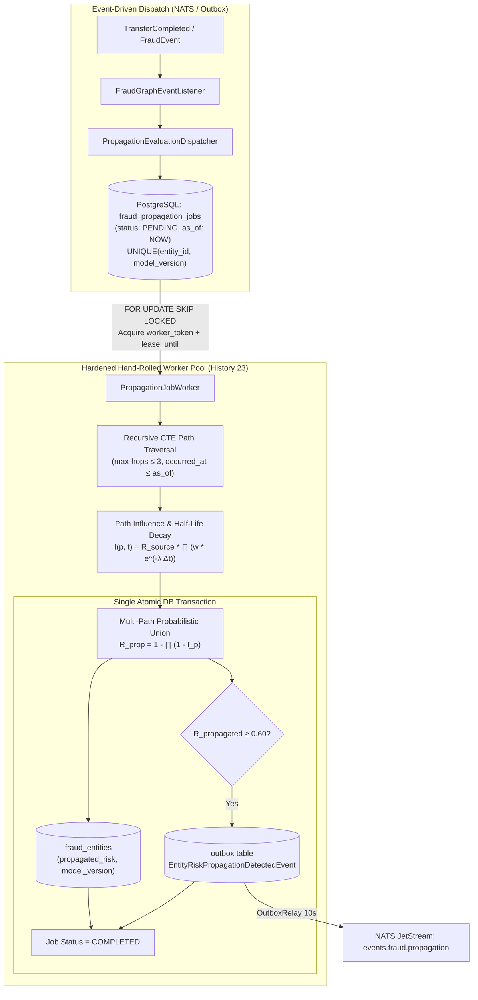

# 📋 Specification: SPEC-000.6 — Fraud Risk Propagation, Temporal Decay & Hardened Hand-Rolled Job Engine (Histories 12, 14, 15, 17, 21, 22, 23)

- **Status**: Reviewed & Ratified
- **Author**: Antigravity Financial & Risk Engineering Team
- **Date**: 2026-09-01
- **Source Reference**: [`.histories/history12.txt`](file:///.histories/history12.txt), [`.histories/history14.txt`](file:///.histories/history14.txt), [`.histories/history15.txt`](file:///.histories/history15.txt), [`.histories/history17.txt`](file:///.histories/history17.txt), [`.histories/history21.txt`](file:///.histories/history21.txt), [`.histories/history22.txt`](file:///.histories/history22.txt), [`.histories/history23.txt`](file:///.histories/history23.txt)
- **Target Release / Milestone**: Wallet Service V4.x — Fraud Intelligence Evolution (Phase 0.6)
- **Architectural Mantra**: *"Risk cascades through relational topology and decays exponentially with elapsed time; coordinate via a hardened, hand-rolled PostgreSQL job engine with token leases, deterministic as_of timestamps, DB-enforced uniqueness, and transactional outbox alerting without external workflow engine overhead."*

---

## 1. Intent & Business Value

When a fraudulent account or high-risk entity (e.g. `User A`) is flagged or blocked, simple blocklists fail against sophisticated syndicates operating through multi-hop mule account chains (`User B`, `User C`) or shared infrastructure (devices, IP subnets, phone numbers).

Following the comprehensive reviews in **Histories 21, 22, and 23**, this specification builds the **Hardened Risk Propagation & Temporal Decay Engine**:
1. **Temporal Evidence Truth**: Calculations draw edge timestamps $\Delta t_e = \text{as\_of} - t_{\text{event}}$ directly from `fraud_relationship_events.occurred_at` (immutable historical evidence), while `fraud_relationships` serves as the aggregate projection (`last_seen_at = MAX(occurred_at)`).
2. **Deterministic `as_of` Historical Evaluation**: Every propagation job carries an explicit `as_of` evaluation timestamp, ensuring calculations are 100% reproducible and backtestable.
3. **Mathematical Path Influence Decay Model**:
   $$I(p, t) = R_{\text{source}}(v) \cdot \prod_{e \in p} w(e) \cdot \prod_{e \in p} e^{-\lambda \Delta t_e}, \quad \lambda = \frac{\ln 2}{t_{1/2}}$$
4. **Multi-Path Probabilistic Union (Anti-Double-Counting)**:
   $$R_{\text{propagated}}(u) = 1 - \prod_{p \in \text{Paths}(u)} (1 - I(p, t))$$
5. **Risk Dimension Isolation (`I-PROP-005`)**: Updates `propagated_risk`, `propagation_model_version`, and `propagation_evaluated_at` on `fraud_entities` with zero mutation to `direct_risk`, `graph_risk`, `behavioral_risk`, or `final_risk`.
6. **Hardened Hand-Rolled Job Queue (`I-PROP-007`, `I-PROP-008`)**:
   - PostgreSQL table `fraud_propagation_jobs` with lifecycle states: `PENDING`, `RUNNING`, `RETRY_WAIT`, `COMPLETED`, `FAILED`.
   - Workers claim work using `SELECT ... FOR UPDATE SKIP LOCKED`.
   - **Token Leases (`worker_token` + `lease_until`)**: Prevents split-brain duplicate worker executions when tasks take longer than default reaper timeouts.
   - **DB-Enforced Active Job Uniqueness**: Partial unique index `(entity_id, model_version)` where `status IN ('PENDING', 'RUNNING', 'RETRY_WAIT')`.
7. **Transactional Outbox Alert Delivery (`I-OUTBOX-001`, `REQ-PROP-007`)**:
   - `EntityRiskPropagationDetectedEvent` is staged into the transactional outbox table in the same database transaction as the `fraud_entities` update when $R_{\text{propagated}} \ge \theta_{\text{alert}}$, guaranteeing delivery to NATS JetStream (`events.fraud.propagation`) with zero event loss.

---

## 2. Scope & Non-Goals

### In Scope
- **`REQ-PROP-001` (Relationship Edge Weight Matrix)**:
  - `OWNS`: $0.95$
  - `SHARED_DEVICE`: $0.90$
  - `SHARED_PHONE`: $0.85$
  - `SHARED_EMAIL`: $0.75$
  - `TRANSFERRED_TO`: $0.60$
  - `USES`: $0.50$
  - `SHARED_IP`: $0.35$
  - `LOGGED_FROM` / `SHARES` / Default: $0.10$
- **`REQ-PROP-002` (Temporal Half-Life Decay Model with Explicit `as_of`)**:
  - $\lambda = \frac{\ln 2}{t_{1/2}}$ with configurable half-life `fraud.propagation.temporal-decay.half-life = 7d`.
  - $\Delta t_e = \text{as\_of} - t_{\text{event}}$, where $t_{\text{event}}$ is the most recent timestamp in `fraud_relationship_events.occurred_at` observable at or before `as_of`.
- **`REQ-PROP-003` (Multi-Hop Traversal & Bounded Limits)**:
  - Compute path influence product: $I(p, t) = R_{\text{source}}(v) \cdot \prod_{i=1}^k (w(e_i) \cdot e^{-\lambda \Delta t_i})$.
  - Traversal bounds: `max-hops = 3`, `max-entities = 1000`, `max-paths = 5000`.
- **`REQ-PROP-004` (Multi-Path Probabilistic Union Aggregation)**:
  - Aggregate independent paths reaching entity $u$: $R_{\text{propagated}}(u) = 1 - \prod_{j=1}^m (1 - I_j)$.
- **`REQ-PROP-005` (Risk Dimension Isolation & Model Versioning)**:
  - Persist `propagated_risk`, `propagation_model_version = 'v1'`, `propagation_evaluated_at = now()` to `fraud_entities`.
  - Zero mutations to `direct_risk`, `graph_risk`, `behavioral_risk`, or `final_risk`.
- **`REQ-PROP-006` (Hardened Hand-Rolled Job Queue with Token Leases)**:
  - Table `fraud_propagation_jobs` carrying `id`, `entity_id`, `status`, `as_of`, `worker_token`, `lease_until`, `attempt_count`, `last_error`, `model_version`.
  - `FOR UPDATE SKIP LOCKED` worker claims and periodic lease renewal.
  - Partial unique index preventing duplicate concurrent jobs for the same entity and model version.
- **`REQ-PROP-007` (Transactional Outbox Alert Delivery)**:
  - Stage `EntityRiskPropagationDetectedEvent` in transactional `outbox` within the same DB transaction when $R_{\text{propagated}} \ge \theta_{\text{alert}}$ (default $0.60$).
  - Relay to NATS JetStream `events.fraud.propagation` via OutboxRelay.

### Non-Goals
- External workflow engines (Temporal / Spring Statemachine) — reserved as an architectural escape hatch for multi-day human-in-the-loop compliance workflows.
- Real-time synchronous calculation on the payment authorization hot path.
- Modifying `final_risk` directly (delegated to Signal Fusion in `SPEC-000.8`).

---

## 3. Mathematical & Architectural Invariants

- **`I-PROP-001` (Bounded Risk Range)**: All path influences and propagated risk scores MUST strictly belong to $[0.0, 1.0]$.
- **`I-PROP-002` (Monotonic Temporal Decay)**: As elapsed time along any edge $\Delta t \to \infty$, path influence MUST strictly approach zero ($I(p, t) \to 0$).
- **`I-PROP-003` (Multi-Path Sub-Linear Saturation)**: Combining multiple paths must never exceed 1.0, adhering to the probabilistic union formula:
  $$R_{\text{propagated}} = 1 - \prod_{i} (1 - I_i)$$
- **`I-PROP-004` (Asynchronous Deep Path Guarantee)**: Propagation execution runs completely inside background worker threads, preserving sub-millisecond financial transfer performance.
- **`I-PROP-005` (Risk Dimension Isolation)**: The engine reads `direct_risk` and graph facts as inputs but strictly writes `propagated_risk`. It MUST NOT calculate or mutate `final_risk`.
- **`I-PROP-006` (Bounded Traversal Invariant)**: Traversal must enforce configured bounds on hops, visited entities, and paths to prevent memory/CPU exhaustion.
- **`I-PROP-007` (DB-Enforced Active Job Uniqueness)**: PostgreSQL MUST reject duplicate active jobs for the same entity and model version via a partial unique index.
- **`I-PROP-008` (Worker Token Lease Safety)**: A worker must only mutate and complete a job if its `worker_token` matches and `lease_until >= now()`.
- **`I-PROP-009` (Transactional Alert Durability)**: Alerts generated from risk propagation must be staged into the `outbox` table inside the same transaction as the `fraud_entities` update per `I-OUTBOX-001`.

---

## 4. Requirements & Acceptance Criteria

### REQ-PROP-001 & REQ-PROP-002: Path Influence with Historical `as_of`
- **Given** source risk $R_{\text{source}}(A) = 1.0$, a 2-hop path $A \xrightarrow{SHARED\_DEVICE} B \xrightarrow{TRANSFERRED\_TO} C$.
- **When** both edges occurred 7 days prior to `as_of` ($t_{1/2} = 7\text{ days} \implies e^{-\lambda \Delta t} = 0.5$).
- **Then** the path influence is:
  $$I(A \to B \to C) = 1.0 \times (0.90 \times 0.5) \times (0.60 \times 0.5) = 0.45 \times 0.30 = 0.135 \pm 0.001$$

### REQ-PROP-003 & REQ-PROP-004: Multi-Path Union Aggregation
- **Given** two paths reaching entity $D$: $I(p_1) = 0.50$ and $I(p_2) = 0.40$.
- **When** multi-path aggregation executes.
- **Then** $R_{\text{propagated}}(D) = 1 - (1 - 0.50)(1 - 0.40) = 1 - (0.50 \times 0.60) = 0.70$.

### REQ-PROP-005: Dimension Isolation & Versioning
- **Given** an updated entity `fraud_entities`.
- **When** the worker finishes.
- **Then** `propagated_risk`, `propagation_model_version = 'v1'`, and `propagation_evaluated_at = now()` are updated, while `direct_risk`, `graph_risk`, `behavioral_risk`, and `final_risk` remain untouched.

### REQ-PROP-006: Token Lease & Uniqueness Enforcement
- **Given** a job claim operation.
- **When** `claimNextJob(workerToken, leaseDuration)` executes with `FOR UPDATE SKIP LOCKED`.
- **Then** the job transitions `PENDING` $\to$ `RUNNING` with `worker_token` and `lease_until = now() + leaseDuration`.
- **And** any attempt to enqueue a duplicate active job for the same entity raises a unique constraint collision handled idempotently.

### REQ-PROP-007: Transactional Outbox Alerting
- **Given** an entity with calculated $R_{\text{propagated}} = 0.75 \ge \theta_{\text{alert}} = 0.60$.
- **When** the transaction commits.
- **Then** both `fraud_entities` and `outbox` records are committed atomically, and OutboxRelay publishes `EntityRiskPropagationDetectedEvent` to NATS.
