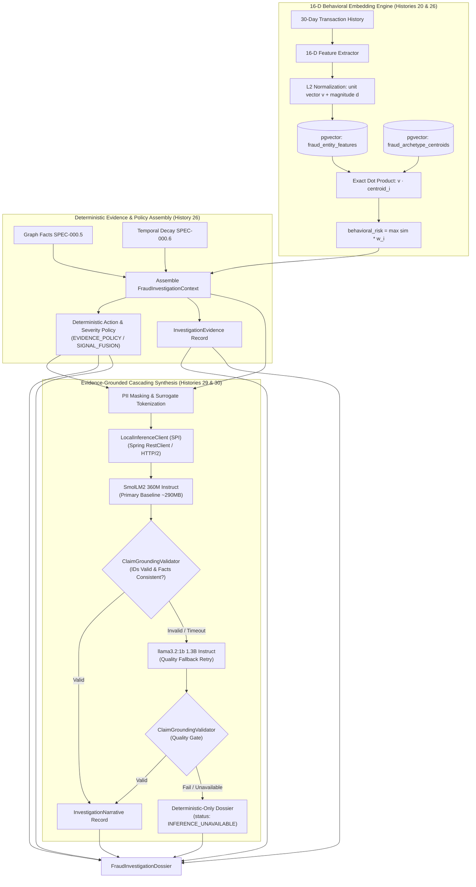

# 📋 Specification: SPEC-000.7 — Fraud Behavioral Embeddings, Archetype Matching & Evidence-Grounded Investigation Intelligence (Histories 12, 13, 14, 15, 18, 19, 20, 24, 25, 26, 27, 28, 29, 30)

- **Status**: Reviewed & Ratified
- **Author**: Antigravity Financial & Risk Engineering Team
- **Date**: 2026-09-03
- **Source Reference**: [`.histories/history12.txt`](file:///.histories/history12.txt), [`.histories/history13.txt`](file:///.histories/history13.txt), [`.histories/history14.txt`](file:///.histories/history14.txt), [`.histories/history15.txt`](file:///.histories/history15.txt), [`.histories/history18.txt`](file:///.histories/history18.txt), [`.histories/history19.txt`](file:///.histories/history19.txt), [`.histories/history20.txt`](file:///.histories/history20.txt), [`.histories/history24.txt`](file:///.histories/history24.txt), [`.histories/history25.txt`](file:///.histories/history25.txt), [`.histories/history26.txt`](file:///.histories/history26.txt), [`.histories/history27.txt`](file:///.histories/history27.txt), [`.histories/history28.txt`](file:///.histories/history28.txt), [`.histories/history29.txt`](file:///.histories/history29.txt), [`.histories/history30.txt`](file:///.histories/history30.txt)
- **Target Release / Milestone**: Wallet Service V4.x — Fraud Intelligence Evolution (Phase 0.7)
- **Architectural Mantra**: *"Use deterministic behavioral embeddings and pgvector for quantitative fraud intelligence, with a pluggable local Small Language Model for constrained, evidence-grounded investigation synthesis."*

---

## 1. Intent & Business Value

Graph topology identifies *who is connected to whom*, while **Behavioral Vector Embeddings** identify *who acts like a fraudster*.

Following the architectural consensus refined across **Histories 20, 24, 25, 26, 27, 28, 29, and 30**, this specification defines:
1. **Behavioral Profile Feature Extraction (16-D Grouped, Bounded & Magnitude-Preserved)**:
   - Extracting 16 normalized transactional metrics organized into 7 semantic feature groups.
   - Dual representation: unit direction vector ($\|\vec{v}\|_2 = 1.0$) for directional similarity alongside `feature_magnitude` ($\|\vec{d}\|_2$) to retain behavioral intensity.
2. **PostgreSQL + `pgvector` Storage & Matching (`fraud_entity_features`)**:
   - In-database storage of compact `vector(16)`.
   - **Exact Centroid Dot-Product** for calibrated fraud archetypes ($O(N)$ for small $N \le 20$).
   - Exposes both `directionalSimilarity` and `behavioralIntensity` in `ArchetypeMatch` for Phase 0.8 Signal Fusion.
3. **Asynchronous Embedding Job Queue (`fraud_embedding_jobs`)**:
   - Hardened worker pool with `SELECT FOR UPDATE SKIP LOCKED`, worker token leases, and active job deduplication, ensuring zero hot-path overhead (`I-VEC-007`).
4. **Decoupled Risk Classification (Pre-Fusion vs Post-Fusion)**:
   - Respects boundary isolation (`I-PROP-005`): SPEC-000.7 does **not** mutate or compute `final_risk` (reserved for Phase 0.8 Signal Fusion).
   - Pre-fusion mode derives classification from `EVIDENCE_POLICY` over known risk dimensions (`direct_risk`, `graph_risk`, `propagated_risk`, `behavioral_risk`).
5. **Hard Sanitization Boundary & Evidence Grounding**:
   - `SanitizedInferenceContext` acts as an architectural air-gap preventing unmasked PII from ever reaching inference models.
   - Programmatic `ClaimGroundingValidator` verifies that every narrative claim maps to atomic evidence IDs (`GRAPH-001`, `TEMPORAL-014`).
6. **Minimum Viable Intelligence Strategy & Compact SLM Hierarchy (History 29)**:
   - Start with the smallest model capable of meeting the contract, scaling only if benchmarks prove necessity.
   - LLM operates strictly as a **Structured Renderer**: 95% of intelligence is deterministic (risk calculation, feature extraction, graph traversal, action policy ownership); 5% is language generation (human-readable grounded investigation narrative).
   - Calibrated SLM ladder using the compact [SmolLM2](https://github.com/huggingface/smollm) family:
     - `smollm2:135m`: Smoke tests, CI fast contract verification, prompt boundary stress testing.
     - `smollm2:360m-instruct-q5_K_M` (🥇 **Default Production Baseline & Integration Target**): ~290MB footprint, capable instruction follower, strict JSON adherence, zero hallucinated IDs.
     - `llama3.2:1b`: Quality fallback for complex multi-claim cases or grounding validation retries.
     - `3B–7B`: Deferred until benchmark empirical evidence justifies the footprint.
7. **Resilient Cascading Fallback Flow (Histories 27 & 29)**:
   - `360M Default` $\rightarrow$ on timeout, schema violation, or ungrounded claims $\rightarrow$ `1.7B Quality Retry` $\rightarrow$ on failure $\rightarrow$ **Deterministic Evidence-Only Dossier** (`status = INFERENCE_UNAVAILABLE`).
   - Investigation generation is **never blocked** by generative model downtime or generation failures.
8. **Three-Tier Testing Taxonomy & Real Runtime Verification (Histories 29 & 30)**:
   - **Tier 1 (Unit Tests)**: Fast, deterministic, zero Docker, using `FakeInferenceClient` to validate JSON schemas, grounding rules, action ownership, and degradation.
   - **Tier 2 (Integration Tests with Testcontainers)**: Validates `OllamaInferenceClientIT` inside Docker network against real containerized Ollama running `smollm2:360m-instruct-q5_K_M`.
   - **Tier 3 (Benchmark / Evaluation Gate)**: `ModelEvaluationHarness` executing comparative benchmarks across candidate models (`ModelCandidate`) against gold-standard fixtures.
9. **Disentangled SLA Philosophy (History 30)**:
   - **Functional Gates (Strict)**: 100% JSON Schema validity, 100% evidence reference fidelity, 0 invented IDs, 0 risk score mutation.
   - **Performance Benchmarks (Informative in CPU CI)**: P50/P95 latency, tokens/sec, and RSS memory tracked for regression analysis without failing builds unless reference hardware is provisioned.



---

## 2. Scope & Non-Goals

### In Scope
- **`REQ-VEC-001` (pgvector Extension, Archetypes & Vector Schema)**:
  - `fraud_entity_features` storing $L_2$-normalized `vector(16)` with magnitude metadata.
  - `fraud_archetype_centroids` storing reference vectors for known fraud archetypes.
  - Optional HNSW index for entity-to-entity similarity search.
- **`REQ-VEC-002` (Exact 16-D Feature Taxonomy & Groups - Histories 20 & 26)**:
  - 16 normalized transactional metrics classified into 7 semantic feature groups.
- **`REQ-VEC-003` (Exact Dot-Product Archetype Matching & Decoupled Risk Classification - History 26)**:
  - Compute exact dot-product similarity: $\vec{u} \cdot \vec{c}_i$.
  - Derive `behavioral_risk = \max_{i} (\max(0.0, (\vec{u} \cdot \vec{c}_i)) \times w_i)$.
  - Decouple classification source via `FraudRiskSnapshot` (`EVIDENCE_POLICY` vs `SIGNAL_FUSION`).
- **`REQ-VEC-004` (PII Masking & Tokenization Layer)**:
  - Tokenize CPF, names, and Pix keys into deterministic surrogate tokens (`MASK_USER_TARGET`, `COUNTERPARTY_A`).
- **`REQ-VEC-005` (Pluggable Local Inference Client SPI - History 25)**:
  - Model-agnostic `LocalInferenceClient` interface with configurable profiles (`efficient`, `balanced`, `quality`).
- **`REQ-VEC-006` (Evidence-Grounded Dossier Record Assembly - History 25)**:
  - Partition dossier into deterministic `InvestigationEvidence`, deterministic `RiskClassification`, allowed `RecommendedAction`, and SLM-generated `InvestigationNarrative`.
- **`REQ-VEC-007` (Hardware-Aware Model Benchmark Gate - Histories 24, 25, 26)**:
  - Benchmarks measuring Time to First Token (TTFT), total completion time, 100% JSON validity, and 100% claim grounding validity across hardware profiles.
- **`REQ-VEC-008` (Feature Magnitude Preservation - History 26)**:
  - Persist `feature_magnitude`, `transaction_count`, and `transaction_volume` alongside the unit vector.
- **`REQ-VEC-009` (Formal Claim Grounding Validator - History 26)**:
  - Automated validator verifying all narrative claims link to existing, valid evidence IDs with consistent numeric facts.
- **`REQ-VEC-010` (Deterministic Action Policy - History 26)**:
  - Closed enum `RecommendedAction` derived via deterministic policy before inference.
- **`REQ-VEC-011` (Asynchronous Embedding Job Queue & Worker Pool - History 28)**:
  - Durable PostgreSQL job queue `fraud_embedding_jobs` (`status`, `as_of`, `worker_token`, `lease_until`, `available_at`) claimed via `SELECT ... FOR UPDATE SKIP LOCKED` by `EmbeddingJobWorker`, guaranteeing zero hot-path overhead (`I-VEC-007`).
- **`REQ-VEC-012` (Containerized Local SLM Integration Testing with Testcontainers - History 30)**:
  - Containerized integration test validating the real end-to-end inference path (`InvestigationContextBuilder` $\rightarrow$ `PiiMaskingService` $\rightarrow$ `StructuredInferenceRequest` $\rightarrow$ `OllamaInferenceClient` $\rightarrow$ Containerized Ollama `smollm2:360m-instruct-q5_K_M` $\rightarrow$ `ClaimGroundingValidator` $\rightarrow$ `FraudInvestigationDossier`) inside Docker network boundaries.

### Non-Goals
- Allowing the LLM to classify risk scores, authorize transactions, or invent operational actions.
- Calculating or mutating `final_risk` inside SPEC-000.7 (reserved for SPEC-000.8).
- Synchronous LLM execution during payment transaction authorization.
- Sending unmasked PII or transacting financial data to public cloud AI APIs (zero cloud egress).

---

## 3. Mathematical & Architectural Invariants

- **`I-VEC-001` (Normalized Vector Space & Magnitude Preservation)**: All entity feature vectors and archetype centroids MUST be strictly $L_2$-normalized ($\|\vec{v}\|_2 = 1.0$) for similarity calculations, while the original raw feature vector magnitude $\|\vec{d}\|_2$ MUST be preserved as `feature_magnitude`:
  $$\vec{v}_{\text{norm}} = \frac{\vec{d}}{\|\vec{d}\|_2}, \quad M = \|\vec{d}\|_2 = \sqrt{\sum_{i=1}^{16} d_i^2}$$
- **`I-VEC-002` (Durable Co-Location)**: Vector state MUST reside inside PostgreSQL (`pgvector`) to guarantee transactional consistency without managing a separate vector database cluster.
- **`I-VEC-003` (Deterministic Risk & Action Ownership)**: Risk classifications (`LOW`, `MEDIUM`, `HIGH`, `CRITICAL`) and allowable `RecommendedAction` sets MUST be derived exclusively by deterministic business rules. The LLM MUST NOT mutate risk scores, classifications, or allowable actions.
- **`I-VEC-004` (Air-Gapped Local Inference & Zero Cloud Egress)**: All investigation narrative synthesis MUST execute against local inference infrastructure with zero external network egress.
- **`I-VEC-005` (Strict Schema Adherence)**: The LLM output MUST adhere strictly to a predefined JSON Schema validated programmatically prior to analyst presentation.
- **`I-VEC-006` (Evidence Grounding & Zero Hallucination)**: Every factual assertion presented in `InvestigationNarrative` MUST be traceable to one or more deterministic evidence items in `FraudInvestigationContext` (`evidenceReferences: ["GRAPH-001", "TEMPORAL-014"]`). Any assertion lacking evidence backing MUST fail validation.
- **`I-VEC-007` (Zero Hot-Path Impact)**: Embedding extraction, centroid matching, and dossier generation MUST NOT execute in the synchronous transfer path.
- **`I-VEC-008` (Zero Activity Neutrality - History 27)**: When an entity has zero transactional activity in the observation window ($M = \|\vec{d}\|_2 = 0.0$), the behavioral vector MUST evaluate to the inactive zero vector ($\vec{0}$), archetype matching MUST yield $\text{similarity} = 0.0$ and $\text{behavioral\_risk} = 0.0$, and the top archetype MUST be reported as `"NONE"`.
- **`I-VEC-009` (Investigation Resilience & Graceful Degradation - History 27)**: If the local SLM is offline, times out, or fails schema validation, the system MUST still return the complete deterministic dossier (`evidence`, `classification`, `allowedActions`) with `status = INFERENCE_UNAVAILABLE` or `VALIDATION_FAILED`, guaranteeing that investigation availability is never blocked by generative model failures.
- **`I-VEC-010` (Real Inference Path Verification - History 30)**: The production inference adapter MUST be verified against a real local inference runtime in an integration environment. Mock-based tests alone are insufficient to validate structured output, transport serialization, model instruction following, or grounding behavior.

---

## 4. Requirements & Acceptance Criteria

### REQ-VEC-001 & REQ-VEC-008: Schema, Magnitude Preservation & Indexing
```sql
CREATE EXTENSION IF NOT EXISTS vector;

CREATE TABLE IF NOT EXISTS fraud_entity_features (
    entity_id UUID PRIMARY KEY,
    feature_version INT NOT NULL,
    behavioral_vector vector(16) NOT NULL,
    feature_magnitude DOUBLE PRECISION NOT NULL,
    transaction_count BIGINT NOT NULL DEFAULT 0,
    transaction_volume NUMERIC(19, 4) NOT NULL DEFAULT 0.0000,
    updated_at TIMESTAMP WITH TIME ZONE DEFAULT CURRENT_TIMESTAMP
);

CREATE TABLE IF NOT EXISTS fraud_archetype_centroids (
    archetype_id VARCHAR(64) PRIMARY KEY, -- e.g. 'MONEY_MULE_RAPID_DRAIN'
    centroid_vector vector(16) NOT NULL,
    risk_weight NUMERIC(3, 2) NOT NULL,
    updated_at TIMESTAMP WITH TIME ZONE DEFAULT CURRENT_TIMESTAMP
);

-- Optional HNSW index for entity-to-entity nearest neighbor similarity search
CREATE INDEX IF NOT EXISTS idx_fraud_features_hnsw 
ON fraud_entity_features USING hnsw (behavioral_vector vector_ip_ops)
WITH (m = 16, ef_construction = 64);
```

### REQ-VEC-002: 16-D Feature Taxonomy & Semantic Groups (Histories 20 & 26)
Given aggregated metrics across a 30-day sliding window, compute each raw dimension $d_i \in [0.0, 1.0]$:

#### Group 1: Transactional Behavior
- **$d_1$ (`tx_frequency`)**: $\text{clamp}(N_{\text{tx\_30d}} / 500, 0, 1)$ — Monthly transaction count.
- **$d_2$ (`avg_amount`)**: $\text{clamp}(\bar{A}_{\text{out}} / 50000, 0, 1)$ — Normalized average outgoing ticket.
- **$d_3$ (`amount_std_dev`)**: $\text{clamp}(\sigma_A / 25000, 0, 1)$ — Volatility / amount standard deviation.
- **$d_4$ (`velocity_spike_1h`)**: $\text{clamp}(V_{\text{1h\_max}} / 30, 0, 1)$ — Maximum transactions within a 1-hour window.
- **$d_5$ (`nocturnal_ratio`)**: $N_{\text{22h-06h}} / \max(N_{\text{tx}}, 1)$ — Ratio of transactions during night hours.

#### Group 2: Counterparty Behavior
- **$d_6$ (`unique_counterparties`)**: $\text{clamp}(N_{\text{counterparties}} / 100, 0, 1)$ — Unique destination counterparties.
- **$d_7$ (`new_counterparties_7d`)**: $\text{clamp}(N_{\text{new\_7d}} / 50, 0, 1)$ — Distinct new counterparties in last 7 days.

#### Group 3: Flow Behavior
- **$d_8$ (`rapid_drain_count`)**: $\text{clamp}(N_{\text{pass\_through}} / 20, 0, 1)$ — Deposit followed by immediate withdrawal.
- **$d_9$ (`fan_out_ratio`)**: $\text{clamp}(N_{\text{dest}} / N_{\text{sent}}, 0, 1)$ — Outbound dispersion ratio.
- **$d_{10}$ (`fan_in_ratio`)**: $\text{clamp}(N_{\text{src}} / N_{\text{recv}}, 0, 1)$ — Inbound concentration ratio.

#### Group 4: Geographic / Context
- **$d_{11}$ (`intl_tx_count`)**: $\text{clamp}(N_{\text{intl}} / 10, 0, 1)$ — International transaction count.

#### Group 5: Authentication / Device
- **$d_{12}$ (`failed_auth_count`)**: $\text{clamp}(N_{\text{failed\_auth}} / 10, 0, 1)$ — Biometric / auth failure count.
- **$d_{13}$ (`device_switch_count`)**: $\text{clamp}(N_{\text{devices}} / 5, 0, 1)$ — Distinct hardware/devices used.

#### Group 6: Statistical Anomaly
- **$d_{14}$ (`out_of_pattern_ratio`)**: $\text{clamp}(N_{|z| > 3} / N_{\text{tx}}, 0, 1)$ — Ratio of transactions with $Z\text{-Score} > 3$.

#### Group 7: Dispute History & Volume
- **$d_{15}$ (`dispute_count`)**: $\text{clamp}(N_{\text{chargebacks}} / 5, 0, 1)$ — Disputed / chargeback transaction count.
- **$d_{16}$ (`total_amount_volume`)**: $\text{clamp}(A_{\text{total\_out}} / 200000, 0, 1)$ — Total monthly outgoing volume.

Vector Normalization:
$$M = \|\vec{d}\|_2 = \sqrt{\sum_{i=1}^{16} d_i^2}, \quad \vec{v} = \frac{\vec{d}}{M}$$

### REQ-VEC-003: Exact Centroid Dot-Product & Decoupled Risk Classification (History 26)
1. **Exact Centroid Dot-Product**:
   ```sql
   SELECT 
       archetype_id, 
       risk_weight, 
       (centroid_vector <#> :entityVector) * -1 AS cosine_similarity
   FROM fraud_archetype_centroids;
   ```
2. **Behavioral Risk Score**:
   $$\text{behavioral\_risk} = \max_i (\max(0.0, \text{sim}_i) \times w_i)$$
3. **Decoupled Risk Snapshot**:
   ```java
   public record FraudRiskSnapshot(
       double directRisk,
       double graphRisk,
       double propagatedRisk,
       double behavioralRisk,
       Optional<Double> finalRisk
   ) {}
   
   public enum RiskClassificationSource {
       EVIDENCE_POLICY,  // Pre-Fusion (SPEC-000.7)
       SIGNAL_FUSION     // Post-Fusion (SPEC-000.8)
   }
   ```

### REQ-VEC-004: PII Masking & Tokenization
- Replace CPF, recipient names, and Pix keys with deterministic surrogate tokens (`MASK_USER_TARGET`, `COUNTERPARTY_A`).

### REQ-VEC-005: Pluggable Local Inference Client SPI & Communication Protocol (Histories 25, 27, 28)
```java
public interface LocalInferenceClient {
    Optional<InvestigationNarrative> generateNarrative(StructuredInferenceRequest request);
}
```

#### Protocol Decision Record (ADR):
1. **Phase 0.7 Implementation (Selected)**:
   - Implementation: `OllamaInferenceClient` using Spring `RestClient` (HTTP/2 with Virtual Threads).
   - Endpoint: `POST /api/chat` with `"format": "json"` to enforce grammar constraints.
   - Resilience: Network/server failures return `Optional.empty()`, cleanly triggering Graceful Degradation (`I-VEC-009`).
2. **Phase 0.8 Agentic Roadmap**:
   - **Model Context Protocol (MCP)**: In Phase 0.8 (LangGraph Agentic Investigation), domain capabilities (graph query, ledger timeline, blocklist inspection) will be exposed as **MCP Tools** for dynamic model agent tool calling.
3. **Production GPU Clusters**:
   - **Async gRPC**: For high-throughput inference backends (vLLM, Triton), gRPC over HTTP/2 will serve as the binary transport alternative behind `LocalInferenceClient`.

Configured via profiles:
```yaml
fraud:
  investigation:
    inference:
      profile: balanced
      profiles:
        efficient:
          model: smollm2:135m
          max-context-tokens: 2048
          max-output-tokens: 384
          temperature: 0.0
          timeout: 1s
        balanced:
          model: smollm2:360m-instruct-q5_K_M
          max-context-tokens: 4096
          max-output-tokens: 512
          temperature: 0.0
          timeout: 3s
        quality:
          model: llama3.2:1b
          max-context-tokens: 8192
          max-output-tokens: 768
          temperature: 0.0
          timeout: 8s
```

### REQ-VEC-006 & REQ-VEC-010: Dossier Assembly, Graceful Degradation & Deterministic Actions (Histories 25, 26, 27)
```java
public enum RecommendedAction {
    MANUAL_REVIEW,
    REQUEST_ADDITIONAL_VERIFICATION,
    INCREASE_MONITORING,
    TEMPORARY_OUTGOING_RESTRICTION,
    ESCALATE_TO_COMPLIANCE
}

public enum InvestigationGenerationStatus {
    GENERATED,
    GENERATED_WITH_FALLBACK,
    VALIDATION_FAILED,
    INFERENCE_UNAVAILABLE
}

public enum ClaimType {
    SHARED_INFRASTRUCTURE,
    RAPID_FUND_MOVEMENT,
    ARCHETYPE_SIMILARITY,
    HIGH_VELOCITY,
    DEVICE_ANOMALY
}

public record InvestigationClaim(
    ClaimType type,
    String summary,
    List<String> evidenceReferences
) {}

public record FraudInvestigationDossier(
    InvestigationEvidence evidence,
    Optional<InvestigationNarrative> narrative,
    RiskClassification classification,
    RiskClassificationSource classificationSource,
    List<RecommendedAction> allowedActions,
    InvestigationGenerationStatus status
) {}
```

Sample Structured Output:
```json
{
  "classification": "HIGH",
  "classificationSource": "EVIDENCE_POLICY",
  "status": "GENERATED",
  "allowedActions": ["MANUAL_REVIEW", "TEMPORARY_OUTGOING_RESTRICTION"],
  "evidence": {
    "directRisk": 0.72,
    "graphRisk": 0.81,
    "propagatedRisk": 0.64,
    "behavioralRisk": 0.77,
    "featureMagnitude": 1.842,
    "topArchetype": "MONEY_MULE_RAPID_DRAIN",
    "similarity": 0.91,
    "evidenceItems": [
      {
        "id": "GRAPH-001",
        "type": "SHARED_DEVICE_CLUSTER",
        "subject": "MASK_USER_TARGET",
        "facts": { "sharedAccountCount": 4, "windowHours": 24 }
      },
      {
        "id": "TEMPORAL-014",
        "type": "RAPID_PASS_THROUGH",
        "subject": "MASK_USER_TARGET",
        "facts": { "transactionCount": 12, "windowHours": 2 }
      }
    ]
  },
  "narrative": {
    "executiveSummary": "Entity exhibits high behavioral similarity to known money-mule archetypes combined with shared hardware clustering.",
    "claims": [
      {
        "type": "SHARED_INFRASTRUCTURE",
        "summary": "Account functions as an intermediary node sharing hardware with multiple suspicious profiles.",
        "evidenceReferences": ["GRAPH-001"]
      },
      {
        "type": "RAPID_FUND_MOVEMENT",
        "summary": "Pass-through pattern observed where funds are drained within 2 hours of receipt.",
        "evidenceReferences": ["TEMPORAL-014"]
      }
    ],
    "actionRationale": "Temporary outgoing transfer restrictions are recommended pending analyst review due to rapid drain indicators."
  }
}
```

### REQ-VEC-009: Formal Claim Grounding Validator (History 26)
- Validates the generated narrative against the evidence bundle:
  1. **Reference Existence**: Every ID in `evidenceReferences` MUST exist in `evidence.evidenceItems`.
  2. **Fact Consistency**: Statements referring to counts, windows, or archetypes must match the atomic attributes in `evidenceItems[id].facts`.
  3. Rejects hallucinated claims and triggers regeneration or fallback to quality profile.

### REQ-VEC-007: Hardware-Aware Benchmark Gate & Model Candidates (Histories 24, 25, 26, 29, 30)
- Evaluates configurable candidate models:
  ```java
  public record ModelCandidate(
      String id,
      String backend,
      InferenceCapability capability
  ) {}
  ```
- Evaluates candidate models against gold-standard fixtures (`CASE-001` through `CASE-004`).
- **Disentangled SLA Philosophy (History 30)**:
  - **Functional Gates (Mandatory / Build-Breaking)**:
    - **JSON Schema Validity**: 100%.
    - **Evidence Grounding Validity**: 100% (zero invented IDs or ungrounded claims).
    - **Deterministic Boundary Invariant**: Zero mutation of risk classifications, scores, or allowed action sets.
  - **Performance Benchmarks (Informative in CPU CI / Gated on Reference Hardware)**:
    - P50 and P95 latency.
    - Tokens per second.
    - Cold-start time and RSS memory footprint.
    - On provisioned reference hardware: P95 $< 1000\text{ms}$ (interactive) / P95 $< 5000\text{ms}$ (async dossier generation).

### REQ-VEC-012: Containerized Local SLM Integration Testing with Testcontainers (History 30)
- The system MUST provide an integration-test suite validating the complete local inference pipeline against a real containerized Small Language Model (SLM) executing inside Docker network boundaries.
- **End-to-End Verification Pipeline**:
  ```text
  FraudInvestigationContext
          ↓
  PiiMaskingService
          ↓
  StructuredInferenceRequest
          ↓
  LocalInferenceClient (RestClient)
          ↓
  Containerized Ollama (smollm2:360m-instruct-q5_K_M)
          ↓
  Structured JSON Response
          ↓
  JSON Schema Validation
          ↓
  ClaimGroundingValidator
          ↓
  FraudInvestigationDossier
  ```
- **Three-Tier Testing Taxonomy**:
  1. **Tier 1 (Unit Tests)**: Uses `FakeInferenceClient` (fast, deterministic, zero Docker) to test claim validation, prompt sanitization, action policies, and graceful degradation.
  2. **Tier 2 (Integration Tests with Testcontainers)**: `OllamaInferenceClientIT` starts an isolated Ollama container, verifies model availability (`smollm2:360m-instruct-q5_K_M`), issues real HTTP requests, and validates schema compliance and grounding.
  3. **Tier 3 (Benchmark / Evaluation Gate)**: `ModelEvaluationHarness` runs comparative evaluation across candidates (`smollm2:135m`, `smollm2:360m`, `llama3.2:1b`), producing a structured `BenchmarkReport`.
- Configurable Integration Test Profiles:
  ```yaml
  fraud:
    investigation:
      integration-test:
        enabled: true
        runtime: ollama
        model: smollm2:360m-instruct-q5_K_M
  ```
