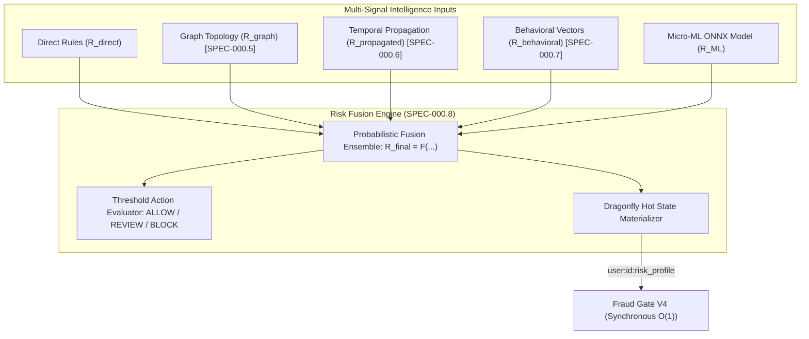

# 📋 Specification: SPEC-000.8 — Fraud Signal Fusion & Micro-ML Risk Engine (Histories 15, 19)

- **Status**: Reviewed & Ratified
- **Author**: Antigravity Financial & Risk Engineering Team
- **Date**: 2026-08-30
- **Source Reference**: [`.histories/history15.txt`](file:///.histories/history15.txt), [`.histories/history19.txt`](file:///.histories/history19.txt)
- **Target Release / Milestone**: Wallet Service V4.x — Fraud Intelligence Evolution (Phase 0.8)
- **Architectural Mantra**: *"Never let a single rule or ML model decide alone: fuse deterministic rules, graph topology, behavioral vectors, and temporal risk propagation into an explainable, probabilistic final risk score."*

---

## 1. Intent & Business Value

Financial fraud evolves dynamically across multiple vectors simultaneously. Relying exclusively on rules causes false negatives for novel attack patterns, while relying exclusively on black-box Machine Learning causes explainability loss and dangerous false positives for legitimate users.

Following the roadmap established in `History 15` and `History 19`, this specification introduces the **Fraud Signal Fusion & Micro-ML Engine**:
1. **Multi-Signal Risk Fusion**: Unifies independent risk signals computed across previous phases:
   - $R_{\text{direct}}$: Deterministic rules (sliding window velocity, account state, known blocklists).
   - $R_{\text{graph}}$: Graph topological patterns (circular flows, fan-in/fan-out, shared device clusters — `SPEC-000.5`).
   - $R_{\text{propagated}}$: Network risk propagated with exponential temporal decay (`SPEC-000.6`).
   - $R_{\text{behavioral}}$: Behavioral profile anomaly distance via `pgvector` (`SPEC-000.7`).
   - $R_{\text{ML}}$: Micro-ML / Shadow Scoring ensemble model.
2. **Micro-ML Shadow Scoring via Embedded ONNX Runtime**: Lightweight, sub-millisecond ($< 2\text{ms}$) embedded tabular inference engine (e.g. XGBoost / TabNet classifier compiled to ONNX) scoring transactions asynchronously in shadow mode.
3. **Probabilistic Risk Fusion Formulation**:
   $$R_{\text{final}} = 1 - (1 - R_{\text{direct}}) \cdot \prod_{s \in \{\text{graph}, \text{propagated}, \text{behavioral}, \text{ML}\}} (1 - w_s R_s)$$
4. **Actionable Decision Thresholds**:
   - $R_{\text{final}} < 0.50 \implies \textbf{ALLOW}$
   - $0.50 \le R_{\text{final}} < 0.85 \implies \textbf{REVIEW / STEP\_UP\_AUTH}$
   - $R_{\text{final}} \ge 0.85 \implies \textbf{BLOCK}$
5. **Dragonfly Hot Risk State Materialization**: Asynchronous write-back to `user:{userId}:risk_profile` and `wallet:{walletId}:risk_profile` in DragonflyDB for sub-millisecond $O(1)$ lookups by Fraud Gate V4.

---

## 2. Scope & Non-Goals

### In Scope
- **`REQ-FUSION-001` (Multi-Signal Risk Fusion Model)**: Mathematical aggregation of $R_{\text{direct}}$, $R_{\text{graph}}$, $R_{\text{propagated}}$, $R_{\text{behavioral}}$, and $R_{\text{ML}}$ into $R_{\text{final}} \in [0.0, 1.0]$.
- **`REQ-FUSION-002` (Explainable Risk Attribution)**: Persisting the contribution of each signal component to `fraud_entities.metadata` for full auditability and regulatory compliance.
- **`REQ-FUSION-003` (Embedded ONNX Runtime Micro-ML Scoring)**: Lightweight tabular inference using Microsoft ONNX Runtime Java binding, evaluating pre-trained models asynchronously on NATS transaction events.
- **`REQ-FUSION-004` (Dragonfly Hot State Profile)**: Storing structured hash in Dragonfly:
  `HSET user:{userId}:risk_profile direct 0.1 graph 0.8 propagated 0.4 behavioral 0.2 final 0.87 status BLOCK`
- **`REQ-FUSION-005` (Fraud Gate V4 Integration)**: Synchronous $O(1)$ Fraud Gate reads the cached `final` score and `status` from DragonflyDB, enforcing sub-millisecond payment decisions.

### Non-Goals
- Running generative LLMs on ONNX Runtime (LLM text synthesis is specialized in vLLM/Ollama under `SPEC-000.7`).
- Synchronous ML model training inside the transaction path.
- Blocking transfers on slow third-party API calls.

---

## 3. Mathematical & Architectural Invariants

- **`I-FUSION-001` (Direct Rule Primacy)**: If a deterministic hard rule evaluates to `BLOCK` ($R_{\text{direct}} = 1.0$), $R_{\text{final}}$ MUST equal $1.0$ regardless of other model outputs.
- **`I-FUSION-002` (Monotonic Risk Bounding)**: $R_{\text{final}}$ must be mathematically bounded to $[0.0, 1.0]$ with monotonic non-decreasing sensitivity to any individual signal increase.
- **`I-FUSION-003` (Full Explainability Guarantee)**: Every non-zero $R_{\text{final}}$ must be accompanied by decomposed attribute weights explaining the top contributing factors (e.g. `TOP_FACTOR: CIRCULAR_FLOW_DETECTED (0.45)`).
- **`I-FUSION-004` (Zero Hot-Path ML Training)**: All model scoring and weight retraining MUST execute asynchronously or offline.

---

## 4. Requirements & Acceptance Criteria

### REQ-FUSION-001: Probabilistic Signal Fusion
- **Given** signal scores $R_{\text{direct}} = 0.20$, $R_{\text{graph}} = 0.80$, $R_{\text{propagated}} = 0.50$, $R_{\text{behavioral}} = 0.30$, $R_{\text{ML}} = 0.40$ with weights $w_{\text{graph}} = 0.9, w_{\text{propagated}} = 0.8, w_{\text{behavioral}} = 0.6, w_{\text{ML}} = 0.5$.
- **When** `RiskFusionEngine.fuse(signals)` is evaluated.
- **Then** $R_{\text{final}}$ is calculated probabilistically and returned in $[0.0, 1.0]$.

### REQ-FUSION-002: Hard Rule Primacy
- **Given** $R_{\text{direct}} = 1.0$ (known stolen card / blacklisted user).
- **When** fused with other low signals ($R_{\text{graph}} = 0.0, R_{\text{ML}} = 0.0$).
- **Then** $R_{\text{final}}$ must strictly equal $1.0$ and action must be `BLOCK`.

### REQ-FUSION-003: Embedded ONNX Tabular Inference
- **Given** an incoming transaction event.
- **When** `OnnxRiskModelEvaluator.evaluate(features)` runs on a background worker.
- **Then** it produces $R_{\text{ML}} \in [0.0, 1.0]$ in $< 2\text{ms}$ execution time.

### REQ-FUSION-004: Dragonfly Hot Risk State Sync
- **Given** an updated $R_{\text{final}} = 0.88$ for `user123`.
- **When** `HotRiskStatePublisher.publish(user123, riskProfile)` executes.
- **Then** DragonflyDB is updated with `HSET user:user123:risk_profile ... EX 3600`.
- **And** Fraud Gate V4 evaluates `BLOCK` in $< 0.5\text{ ms}$ on the next transfer attempt.
