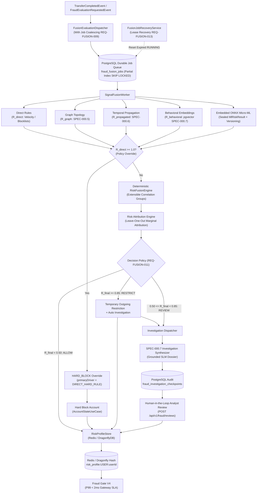

# 📋 Specification: SPEC-000.8 — Fraud Signal Fusion, Micro-ML & Hand-Rolled Investigation Orchestration (Histories 15, 19, 21, 22, 31, 32, 33, 34)

- **Status**: Reviewed & Ratified (Evolution per Histories 31, 32, 33 & 34)
- **Author**: Antigravity Financial & Risk Engineering Team
- **Date**: 2026-09-08
- **Source Reference**: [`.histories/history15.txt`](file:///.histories/history15.txt), [`.histories/history19.txt`](file:///.histories/history19.txt), [`.histories/history21.txt`](file:///.histories/history21.txt), [`.histories/history22.txt`](file:///.histories/history22.txt), [`.histories/history31.txt`](file:///.histories/history31.txt), [`.histories/history32.txt`](file:///.histories/history32.txt), [`.histories/history33.txt`](file:///.histories/history33.txt), [`.histories/history34.txt`](file:///.histories/history34.txt)
- **Target Release / Milestone**: Wallet Service V4.x — Fraud Intelligence Evolution (Phase 0.8)
- **Architectural Mantra**: *"Never let a single rule or model decide alone. Separate deterministic signal fusion and embedded micro-ML from deep agentic investigation: fuse multi-source signals via correlation groups, evaluate tabular models via pure Java ONNX Runtime with strict feature versioning and observable degradation, and conditionally trigger Phase 0.7 grounded investigations for human review."*

---

## 1. Intent & Architectural Rationale

Financial fraud operates across multiple dimensions simultaneously. Static rules miss novel topological schemes; monolithic black-box ML models suffer from explainability loss and silent schema drift; and complex agent frameworks add unnecessary operational friction when applied to deterministic calculations.

Following the architectural consensus refined across **Histories 15, 19, 21, 22, 31, 32, 33, and 34**, this specification establishes the **Fraud Signal Fusion & Investigation Orchestration Engine**:

1. **Deterministic Multi-Signal Fusion with Correlation Groups (`Histories 31, 32, 33, 34`)**:
   - Signal fusion is purely mathematical, deterministic, auditable, and sub-millisecond.
   - Sinais are grouped via extensible `RiskCorrelationGroup` contracts to prevent **double-counting** between correlated sources:
     - **Deterministic Rules ($R_{\text{direct}}$)**: Sliding window velocity, account status, known blocklists.
     - **Graph Intelligence Group ($R_{\text{graph-group}}$)**: Topological loops/fan-in/fan-out (`SPEC-000.5`) fused with path-decayed propagation (`SPEC-000.6`).
     - **Behavioral Embeddings ($R_{\text{behavioral}}$)**: $L_2$-normalized profile anomaly distance against archetype centroids via `pgvector` (`SPEC-000.7`).
     - **Statistical Micro-ML ($R_{\text{ML}}$)**: Tabular inference score computed by an embedded ONNX Runtime evaluator.
2. **Direct Rule Primacy as Policy Override (`History 34`)**:
   - When $R_{\text{direct}} \ge 1.0$ (sanctioned account, stolen credentials, explicit block), the engine triggers an immediate **`HARD_BLOCK` policy override** before mathematical fusion, assigning `primaryDriver = "DIRECT_HARD_RULE"`.
3. **Embedded Micro-ML Inference with Strict Feature Versioning & Sealed Result (`Histories 19, 32, 33, 34`)**:
   - **Zero Python Runtime at Execution Time**: Evaluates pre-trained tabular models (e.g. XGBoost / LightGBM exported to `.onnx`) using pure Java ONNX Runtime (`OrtSession`).
   - **Feature Contract Versioning (`I-FUSION-008`)**: Both the model artifact (`OnnxModelMetadata`) and feature vector (`MlFeatureVector`) carry explicit `featureVersion` and canonical ordered `featureNames`. Incompatible feature schemas reject execution before inference.
   - **Observable Degradation via Sealed `MlRiskResult` (`I-FUSION-010`)**: If ONNX fails or the model is missing, returns `MlRiskResult.Unavailable(reason)`. Fusion degrades gracefully by omitting the ML factor and records `degradedReason = "ONNX_MODEL_UNAVAILABLE"` in the attribution audit trail. No synthetic heuristic proxies are produced.
4. **PostgreSQL Durable Job Queue with Partial Unique Index, Coalescing & Bounded Leases (`Histories 22, 32, 33, 34`)**:
   - Table `fraud_fusion_jobs` uses a **Partial Unique Index** (`WHERE status = 'PENDING'`) guaranteeing at most one pending evaluation per entity while preserving full historical audit logs (`COMPLETED`, `FAILED`).
   - **Job Coalescing (`REQ-FUSION-009`)**: Successive events arriving while a job is `PENDING` coalesce into that job (`ON CONFLICT (entity_id) WHERE status = 'PENDING' DO UPDATE SET as_of = EXCLUDED.as_of, payload = EXCLUDED.payload`).
   - **Events During RUNNING**: Events arriving while a job is actively executing (`status = 'RUNNING'`) insert a clean new `PENDING` job, ensuring immediate re-evaluation of the latest state without mutating running calculations.
   - **Lease Recovery Service with Bounded Backoff (`REQ-FUSION-013`)**: Automatically detects abandoned jobs (`status = 'RUNNING' AND lease_expires_at < NOW()`). Retries with exponential backoff (`5s`, `30s`, `2m`, `10m`) up to `MAX_ATTEMPTS = 5` before transitioning to `FAILED`.
5. **Leave-One-Out Marginal Risk Attribution (`Histories 32, 33, 34`)**:
   - Computes exact factor contributions via marginal difference:
     $$C_s = \max(0.0, R_{\text{final}} - R_{\text{final without } s}), \quad C'_s = \frac{C_s}{\sum_k C_k} \times 100\%$$
   - Records factors as non-causal marginal score contributions for compliance and auditability.
6. **Differentiated Decision Policy: Hard Block vs. Statistical Restriction (`Histories 32, 33, 34`)**:
   - `HARD_BLOCK`: $R_{\text{direct}} = 1.0$ (sanctioned account, compromised credentials).
   - `RESTRICT`: $R_{\text{final}} \ge 0.85$ (high statistical / graph risk) $\to$ temporary outgoing restrictions + automatic compliance investigation.
   - `REVIEW`: $0.50 \le R_{\text{final}} < 0.85$ $\to$ asynchronous investigation job invoking Phase 0.7 `InvestigationService` and recording an audit checkpoint in `fraud_investigation_checkpoints`.
   - `ALLOW`: $R_{\text{final}} < 0.50$ $\to$ normal execution.
7. **Typed `RiskSubject` & Contextual Gate Degradation Policy (`Histories 31, 32, 33, 34`)**:
   - Keyed by `RiskSubject(RiskSubjectType type, UUID id)`: `risk_profile:{entityType}:{entityId}`.
   - Contextual degradation policy: If cache is unavailable, runs fast fallback deterministic evaluation (fail-closed for high risk, fallback to deterministic status check for low risk).
   - Operational SLA: Fraud Gate evaluation P99 $< 2\text{ms}$ at gateway application boundary; cache lookup P99 $< 0.5\text{ms}$ in local network.

---

## 2. Scope & Non-Goals

### In Scope
- **`REQ-FUSION-001` (Multi-Signal Probabilistic Risk Fusion with Correlation Groups)**:
  - Eliminate double-counting between correlated topological and temporal signals via extensible `RiskCorrelationGroup` interface.
  - Enforce Direct Rule Primacy override ($R_{\text{direct}} \ge 1.0 \implies \text{HARD\_BLOCK}$).
  - Monotonically bound $R_{\text{final}} \in [0.0, 1.0]$.
- **`REQ-FUSION-002` & `REQ-FUSION-010` (Leave-One-Out Marginal Risk Attribution & Factor Ranking)**:
  - Compute normalized marginal contributions: $C_s = \max(0.0, R_{\text{final}} - R_{\text{final without } s})$ with $\sum C'_s = 100\%$.
  - Record decomposed factors as non-causal score attribution and identify `primaryDriver`.
- **`REQ-FUSION-003` & `REQ-FUSION-012` (Embedded ONNX Micro-ML Evaluator & Artifact Verification)**:
  - Pure Java ONNX Runtime execution (`OrtSession`) of tabular fraud model.
  - Startup verification of model artifact SHA-256 checksum, feature schema version, and ordered feature names.
  - Latency SLA target: P95 $< 2\text{ms}$, hard ceiling P99 $< 10\text{ms}$ (measured via dedicated performance benchmark).
- **`REQ-FUSION-004` & `REQ-FUSION-009` (Hand-Rolled PostgreSQL Durable Fusion Job Queue with Coalescing)**:
  - Table `fraud_fusion_jobs` with partial unique index `(entity_id) WHERE status = 'PENDING'`.
  - Coalesces rapid events arriving for `PENDING` entities into a single latest-state job (`shouldCoalesceMultiplePendingEventsIntoLatestAsOf`).
  - Inserts a clean new `PENDING` job if events arrive while an entity is actively `RUNNING`.
- **`REQ-FUSION-005` & `REQ-FUSION-011` (Differentiated Decision Policy & Phase 0.7 Investigation Integration)**:
  - Branching into `ALLOW`, `REVIEW`, `RESTRICT`, and `HARD_BLOCK`.
  - Under `REVIEW` and `RESTRICT`, invoke Phase 0.7 `InvestigationService` and record audit checkpoint in `fraud_investigation_checkpoints`.
- **`REQ-FUSION-006` (Typed Subject Hot Risk Profile Storage)**:
  - Storage-agnostic `RiskProfileStore` interface (`RedisRiskProfileStore` implementation) keyed by `RiskSubject(RiskSubjectType type, UUID id)`.
  - Structured Hash `risk_profile:{entityType}:{entityId}` with 1-hour TTL.
- **`REQ-FUSION-007` (Fraud Gate V4 Authorization SLA, Public SPI & Critical Path Integration)**:
  - Public `FraudGate` interface in `br.com.wallet.fraud.fusion.api` (`@NamedInterface("fusion-api")`) with contract `GateAuthorizationResult authorize(RiskSubject subject, BigDecimal amount)`.
  - Implemented by `FraudGateV4` providing synchronous payment authorization check with P99 $< 2\text{ms}$ gateway SLA (P99 $< 0.5\text{ms}$ DragonflyDB cache lookup).
  - Wired directly into `FraudCheckHelper` on the transaction critical path before legacy velocity evaluation:
    - `HARD_BLOCK`: Sets `accounts.status = 'BLOCKED'` in PostgreSQL (`I-ACCOUNT-001`), synchronizes Redis/Dragonfly (`I-ACCOUNT-002`), and throws `FraudBlockedException`.
    - `RESTRICT`: Rejects the active transaction with `FraudBlockedException` without modifying the persistent account lifecycle status in PostgreSQL.
  - Contextual degradation policy when cache is offline (fail-closed for known high risk $\ge 5000.00$, deterministic fallback allow for lower amounts).
- **`REQ-FUSION-008` (Human-in-the-Loop Analyst Feedback)**:
  - Compliance review endpoint and use case for analyst overrides (`CONFIRMED_FRAUD`, `FALSE_POSITIVE`, `ALLOW_WITH_EXCEPTION`).
- **`REQ-FUSION-013` (Fusion Job Lease Recovery with Bounded Backoff)**:
  - Background recovery service identifying abandoned jobs (`status = 'RUNNING' AND lease_expires_at < NOW()`) and retrying up to `MAX_ATTEMPTS = 5` with exponential backoff (`5s`, `30s`, `2m`, `10m`).

### Non-Goals
- Introducing Python runtimes, FastAPI sidecars, or external microservices into the core payment or fraud path.
- Using Python LangGraph or external agent workflow engines for deterministic signal aggregation.
- Silent fallback to synthetic linear heuristics in production when ONNX fails.
- Online or continuous model training in production (training is offline; production loads read-only ONNX artifacts).
- Running generative LLMs or SLMs in the synchronous payment path (synthesis runs strictly asynchronously under `REVIEW` / `RESTRICT`).

---

## 3. Mathematical & Architectural Invariants

- **`I-FUSION-001` (Direct Rule Primacy)**: If any deterministic hard rule evaluates to `BLOCK` ($R_{\text{direct}} \ge 1.0$), the system MUST execute an immediate `HARD_BLOCK` policy override, setting $R_{\text{final}} \equiv 1.0$ and `primaryDriver = "DIRECT_HARD_RULE"`, short-circuiting multiplicative fusion.
- **`I-FUSION-002` (Monotonic Correlated Risk Bounding)**: $R_{\text{final}}$ must be mathematically bounded to $[0.0, 1.0]$ with monotonic non-decreasing sensitivity to all signal components. Correlated topological and temporal signals ($R_{\text{graph}}$ and $R_{\text{propagated}}$) must be combined into $R_{\text{graph-group}}$ prior to master fusion to prevent double-counting.
- **`I-FUSION-003` (Explainable Risk Attribution)**: Every fusion calculation MUST produce normalized relative contribution percentages ($\sum C'_s = 100\%$) based on Leave-One-Out marginal impact and record the `primaryDriver`.
- **`I-FUSION-004` (Pure Java Air-Gapped Micro-ML)**: Micro-ML scoring must execute entirely within the JVM via Java ONNX Runtime. Zero external HTTP calls or Python dependencies are permitted during transaction evaluation.
- **`I-FUSION-005` (Zero Hot-Path ML Training or Investigation)**: All feature extraction, ONNX scoring, and LLM narrative synthesis execute asynchronously through the PostgreSQL durable job queue (`fraud_fusion_jobs`).
- **`I-FUSION-006` (Storage-Agnostic Hot State Abstraction)**: Hot risk profiles must be accessed through the `RiskProfileStore` abstraction, ensuring compatibility across Redis, DragonflyDB, and Valkey without domain changes.
- **`I-FUSION-007` (Investigation Reuse Gate)**: The `REVIEW` and `RESTRICT` branches must delegate investigation narrative synthesis to the existing Phase 0.7 `InvestigationService` (`SPEC-000.7`), avoiding duplicate investigation abstractions.
- **`I-FUSION-008` (ML Feature Contract Compatibility)**: An ONNX model MUST NOT execute when its expected feature schema version differs from the supplied feature vector version (`model.featureVersion != vector.featureVersion`).
- **`I-FUSION-009` (Durable Job Lease Enforcement & Bounded Recovery)**: Workers must operate with bounded leases (`lease_expires_at`). Any job remaining in `RUNNING` past its lease expiration MUST be reclaimed and retried with exponential backoff up to `MAX_ATTEMPTS = 5`.
- **`I-FUSION-010` (Observable ML Degradation)**: In the event of ONNX model failure or schema incompatibility, the engine MUST NOT fall back to silent synthetic heuristic scores. It must evaluate fusion with the ML signal marked unavailable (`MlRiskResult.Unavailable`), record degradation metadata, and log an operational alert.

---

## 4. Probabilistic Fusion Formulation with Correlation Groups

### 4.1 Signal Sources & Weights

Signals are defined in $[0.0, 1.0]$ with calibrated sensitivity weights:

| Signal | Source Domain | Default Weight | Range |
| :--- | :--- | :--- | :--- |
| $R_{\text{direct}}$ | Deterministic Rules (Velocity, Account State, Blocklist) | $1.00$ (Primacy) | $[0.0, 1.0]$ |
| $R_{\text{graph}}$ | Graph Topology Patterns (SPEC-000.5) | $w_g = 0.85$ | $[0.0, 1.0]$ |
| $R_{\text{propagated}}$ | Exponential Temporal Path Decay (SPEC-000.6) | $w_p = 0.75$ | $[0.0, 1.0]$ |
| $R_{\text{behavioral}}$ | Profile Anomaly Vector Dot-Product (SPEC-000.7) | $w_b = 0.70$ | $[0.0, 1.0]$ |
| $R_{\text{ML}}$ | Embedded ONNX Tabular Classifier | $w_m = 0.60$ | $[0.0, 1.0]$ (when available) |

### 4.2 Grouping Correlated Signals (Preventing Double Counting)

Correlated topological and temporal signals are combined via the `GraphIntelligenceCorrelationGroup`:

$$R_{\text{graph-group}} = 1 - (1 - R_{\text{graph}}) \cdot (1 - w_p R_{\text{propagated}})$$

### 4.3 Master Probabilistic Risk Fusion

The final risk score is computed by combining independent signal groups with direct rule primacy. When $R_{\text{ML}}$ is available:

$$R_{\text{final}} = 1 - (1 - R_{\text{direct}}) \cdot (1 - w_g R_{\text{graph-group}}) \cdot (1 - w_b R_{\text{behavioral}}) \cdot (1 - w_m R_{\text{ML}})$$

When $R_{\text{ML}}$ is unavailable (degradation mode `I-FUSION-010`):

$$R_{\text{final}} = 1 - (1 - R_{\text{direct}}) \cdot (1 - w_g R_{\text{graph-group}}) \cdot (1 - w_b R_{\text{behavioral}})$$

### 4.4 Leave-One-Out Marginal Risk Attribution

To accurately attribute risk without assuming additivity on a multiplicative function:

1. For each active signal $s$, compute $R_{\text{final without } s}$ by setting $R_s = 0.0$.
2. Marginal impact:
   $$C_s = \max(0.0, R_{\text{final}} - R_{\text{final without } s})$$
3. Normalized percentage:
   $$C'_s = \begin{cases} \frac{C_s}{\sum_k C_k} \times 100\%, & \text{if } \sum C_k > 0 \\ 0\%, & \text{otherwise} \end{cases}$$
4. The signal with the highest $C'_s$ is designated as `primaryDriver`.

---

## 5. Requirements & Acceptance Criteria

### REQ-FUSION-001: Correlated Multi-Signal Fusion Engine
- **Given** signal scores $R_{\text{direct}} = 0.20$, $R_{\text{graph}} = 0.80$, $R_{\text{propagated}} = 0.50$, $R_{\text{behavioral}} = 0.30$, $R_{\text{ML}} = 0.40$.
- **When** `RiskFusionEngine.fuse(signals, weights)` is evaluated.
- **Then** $R_{\text{graph-group}} = 1 - (1 - 0.80) \cdot (1 - 0.75 \times 0.50) = 0.875$.
- **And** $R_{\text{final}} \approx 0.878$ (bounded strictly in $[0.0, 1.0]$).

### REQ-FUSION-002 & REQ-FUSION-010: Leave-One-Out Marginal Risk Attribution
- **Given** an evaluated `RiskFusionResult`.
- **When** `RiskAttributionCalculator.calculate(signals, weights, finalRisk)` is invoked.
- **Then** it calculates Leave-One-Out marginal impacts, returns normalized percentages with $\sum C'_s = 100\%$, and assigns `primaryDriver = "GRAPH_INTELLIGENCE"`.

### REQ-FUSION-003, REQ-FUSION-012 & I-FUSION-010: Embedded ONNX Evaluator & Observable Degradation
- **Given** a pre-trained tabular ONNX model and feature metrics matching `featureVersion = 1`.
- **When** `OnnxRiskModelEvaluator.evaluate(features)` executes.
- **Then** it scores the tabular model using Java `OrtSession` without external network calls.
- **And** if `features.featureVersion() != model.featureVersion()`, execution throws `IncompatibleFeatureSchemaException`.
- **And** if ONNX model is missing or unreadable, returns `MlRiskResult.Unavailable(reason)`, causing fusion to evaluate without ML and record `degradedReason = "ONNX_MODEL_UNAVAILABLE"`.

### REQ-FUSION-004 & REQ-FUSION-009: Durable Job Queue & Evaluation Coalescing
- **Given** an entity with a job currently in status `PENDING`.
- **When** `FusionEvaluationDispatcher.dispatch(entityId)` is called with a new event.
- **Then** it coalesces into the existing `PENDING` job via `ON CONFLICT (entity_id) WHERE status = 'PENDING' DO UPDATE SET as_of = EXCLUDED.as_of`.
- **And** if the entity's job is currently `RUNNING`, a new `PENDING` job is inserted cleanly to schedule immediate re-evaluation after the current run finishes.

### REQ-FUSION-005 & REQ-FUSION-011: Differentiated Decision Policy & Investigation Integration
- **Given** evaluation results:
  - If $R_{\text{direct}} \ge 1.0 \implies \text{HARD\_BLOCK}$ (immediate policy override).
  - If $R_{\text{final}} \ge 0.85$ and $R_{\text{direct}} < 1.0 \implies \text{RESTRICT}$ (temporary restrictions + auto investigation).
  - If $0.50 \le R_{\text{final}} < 0.85 \implies \text{REVIEW}$ (auto investigation).
  - If $R_{\text{final}} < 0.50 \implies \text{ALLOW}$.
- **When** `REVIEW` or `RESTRICT` triggers.
- **Then** `InvestigationDispatcher` enqueues an asynchronous investigation that invokes Phase 0.7 `InvestigationService.generateDossier(entityId)`.
- **And** a checkpoint is created in `fraud_investigation_checkpoints` with status `PENDING_ANALYST`.

### REQ-FUSION-006 & REQ-FUSION-007: Typed Subject Hot State & Gateway SLA
- **Given** an updated risk profile for user entity `user123`.
- **When** `RiskProfileStore.save(profile)` executes.
- **Then** Redis/Dragonfly Hash `risk_profile:USER:user123` is updated with TTL 3600 seconds.
- **And** `fraudGate.authorize(new RiskSubject(RiskSubjectType.USER, userId), amount)` evaluates authorization with P99 $< 2\text{ms}$ gateway SLA (P99 $< 0.5\text{ms}$ cache lookup).

### REQ-FUSION-008: Human-in-the-Loop Analyst Feedback
- **Given** an investigation checkpoint in `PENDING_ANALYST`.
- **When** a compliance analyst submits a review verdict via `POST /api/v1/fraud/intelligence/fusion/reviews/{checkpointId}`.
- **Then** `fraud_analyst_reviews` records the audit trail, updates checkpoint status to `ANALYST_REVIEWED`, and updates `RiskProfileStore`.

### REQ-FUSION-013 & I-FUSION-009: Lease Recovery Service
- **Given** a job in `RUNNING` status whose `lease_expires_at` is older than current time.
- **When** `FusionJobRecoveryService.recoverOrphanedJobs()` executes.
- **Then** it transitions the job to `RETRY_WAIT` with exponential backoff (`attempt_count < MAX_ATTEMPTS`), or `FAILED` if `attempt_count >= 5`.
