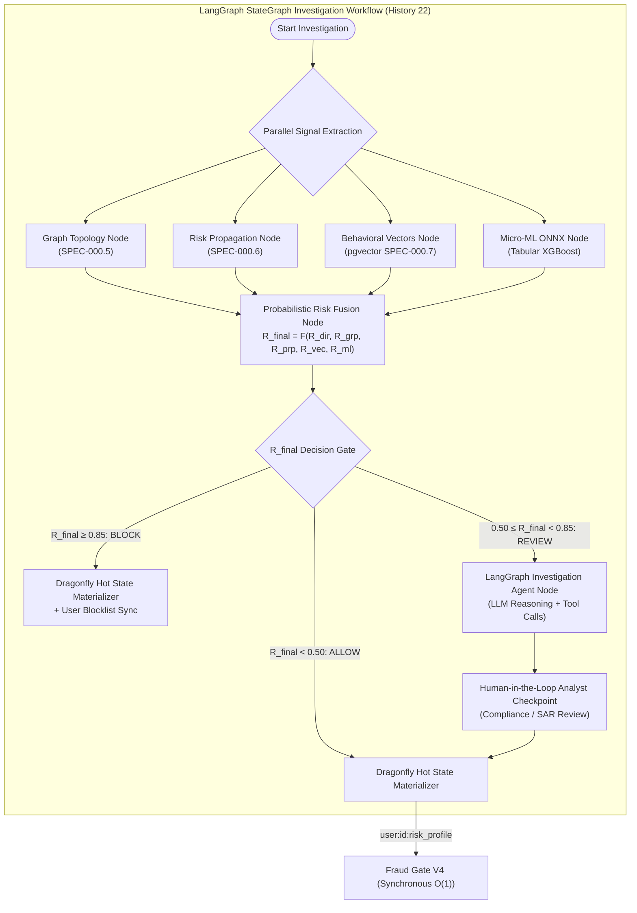

# 📋 Specification: SPEC-000.8 — Fraud Signal Fusion, Micro-ML & LangGraph Agentic Investigation (Histories 15, 19, 21, 22)

- **Status**: Reviewed & Ratified
- **Author**: Antigravity Financial & Risk Engineering Team
- **Date**: 2026-09-01
- **Source Reference**: [`.histories/history15.txt`](file:///.histories/history15.txt), [`.histories/history19.txt`](file:///.histories/history19.txt), [`.histories/history21.txt`](file:///.histories/history21.txt), [`.histories/history22.txt`](file:///.histories/history22.txt)
- **Target Release / Milestone**: Wallet Service V4.x — Fraud Intelligence Evolution (Phase 0.8)
- **Architectural Mantra**: *"Never let a single rule or model decide alone: fuse deterministic rules, graph topology, behavioral vectors, temporal propagation, and micro-ML via a LangGraph StateGraph agentic investigation pipeline."*

---

## 1. Intent & Business Value

Financial fraud operates across multiple dimensions simultaneously. Relying solely on static rules produces false negatives for novel attack patterns, while relying on monolithic black-box ML models introduces explainability loss and dangerous false positives.

Following the roadmap established across **Histories 15, 19, 21, and 22**, this specification defines the **Fraud Signal Fusion & LangGraph Agentic Investigation Engine**:
1. **Multi-Signal Risk Fusion**: Unifies independent risk signals computed across all intelligence layers:
   - $R_{\text{direct}}$: Deterministic rules (sliding window velocity, account status, known blocklists).
   - $R_{\text{graph}}$: Graph topological patterns (circular loops, fan-in/fan-out, shared device clusters — `SPEC-000.5`).
   - $R_{\text{propagated}}$: Network risk propagated with exponential temporal decay (`SPEC-000.6`).
   - $R_{\text{behavioral}}$: Behavioral profile anomaly distance via `pgvector` (`SPEC-000.7`).
   - $R_{\text{ML}}$: Micro-ML tabular inference score (ONNX Runtime).
2. **LangGraph StateGraph Agentic Workflow**: Orchestrates deep asynchronous investigation, multi-agent evidence gathering, LLM reasoning, and human-in-the-loop review.
3. **Embedded ONNX Runtime Micro-ML Scoring**: Sub-millisecond ($< 2\text{ms}$) tabular classifier scoring transactions asynchronously in shadow/active mode.
4. **Probabilistic Risk Fusion Formulation**:
   $$R_{\text{final}} = 1 - (1 - R_{\text{direct}}) \cdot \prod_{s \in \{\text{graph}, \text{propagated}, \text{behavioral}, \text{ML}\}} (1 - w_s R_s)$$
5. **Dragonfly Hot Risk State Materialization**: Asynchronous write-back to `user:{userId}:risk_profile` in DragonflyDB for sub-millisecond $O(1)$ Fraud Gate V4 lookups.

---

## 2. Scope & Non-Goals

### In Scope
- **`REQ-FUSION-001` (Multi-Signal Probabilistic Risk Fusion Model)**:
  - Aggregate $R_{\text{direct}}$, $R_{\text{graph}}$, $R_{\text{propagated}}$, $R_{\text{behavioral}}$, and $R_{\text{ML}}$ into $R_{\text{final}} \in [0.0, 1.0]$.
  - Formulate hard rule primacy ($R_{\text{direct}} = 1.0 \implies R_{\text{final}} = 1.0$).
- **`REQ-FUSION-002` (LangGraph StateGraph Agentic Investigation Workflow)**:
  - State definition: `InvestigationState` tracking raw features, sub-scores, reasoning trail, and analyst decision.
  - Nodes: `GraphNode`, `PropagationNode`, `VectorNode`, `MLNode`, `FusionNode`, `InvestigationAgentNode`, `AnalystCheckpointNode`, `MaterializerNode`.
  - Conditional routing based on risk score thresholds.
- **`REQ-FUSION-003` (Embedded ONNX Runtime Micro-ML Scoring)**:
  - Lightweight embedded ONNX Runtime evaluator executing pre-trained tabular models in $< 2\text{ms}$.
- **`REQ-FUSION-004` (Dragonfly Hot State Profile & Invalidation)**:
  - Structured hash: `HSET user:{userId}:risk_profile direct 0.1 graph 0.8 propagated 0.4 behavioral 0.2 ml 0.35 final 0.87 status BLOCK`.
- **`REQ-FUSION-005` (Fraud Gate V4 Integration)**:
  - Synchronous $O(1)$ gate evaluates payment authorization in $< 0.5\text{ms}$ by reading DragonflyDB profile.
- **`REQ-FUSION-006` (Human-in-the-Loop Analyst Feedback)**:
  - Analyst overrides (false positive / confirmed fraud) update entity labels and feed back into feature stores.

### Non-Goals
- Running generative LLMs in the synchronous payment path (LLM reasoning executes only during async investigation).
- Online reinforcement learning on production financial transactions.
- Blocking transfers on slow third-party KYC/AML networks.

---

## 3. Mathematical & Architectural Invariants

- **`I-FUSION-001` (Direct Rule Primacy)**: If a deterministic hard rule evaluates to `BLOCK` ($R_{\text{direct}} = 1.0$), $R_{\text{final}}$ MUST strictly equal $1.0$ regardless of ML or vector outputs.
- **`I-FUSION-002` (Monotonic Risk Bounding)**: $R_{\text{final}}$ must be mathematically bounded to $[0.0, 1.0]$ with monotonic non-decreasing sensitivity to any individual signal component.
- **`I-FUSION-003` (Explainable Risk Attribution)**: Every decision MUST record decomposed weights and top contributing factors in `fraud_entities.metadata`.
- **`I-FUSION-004` (StateGraph State Immutability)**: Each node transition in the `StateGraph` produces an immutable state snapshot with checkpoint persistence for replayability and audit compliance.
- **`I-FUSION-005` (Zero Hot-Path ML Training)**: All model retraining and deep agentic investigations execute asynchronously.

---

## 4. Requirements & Acceptance Criteria

### REQ-FUSION-001: Probabilistic Signal Fusion Formulation
- **Given** signal scores $R_{\text{direct}} = 0.20$, $R_{\text{graph}} = 0.80$, $R_{\text{propagated}} = 0.50$, $R_{\text{behavioral}} = 0.30$, $R_{\text{ML}} = 0.40$ with weights $w_{\text{graph}} = 0.9, w_{\text{propagated}} = 0.8, w_{\text{behavioral}} = 0.6, w_{\text{ML}} = 0.5$.
- **When** `RiskFusionEngine.fuse(signals)` is evaluated.
- **Then** $R_{\text{final}}$ is calculated and returned in $[0.0, 1.0]$.

### REQ-FUSION-002: LangGraph StateGraph Routing
- **Given** an entity with evaluated $R_{\text{final}} = 0.65$ (in the range $[0.50, 0.85)$).
- **When** the `StateGraph` runs.
- **Then** it transitions to `InvestigationAgentNode`, synthesizes a `FraudInvestigationDossier`, and creates an `AnalystCheckpoint` for compliance review.

### REQ-FUSION-003: Embedded ONNX Tabular Inference
- **Given** extracted transactional feature metrics.
- **When** `OnnxRiskModelEvaluator.evaluate(features)` executes.
- **Then** it computes $R_{\text{ML}}$ in $< 2\text{ms}$ execution latency.

### REQ-FUSION-004: Dragonfly Hot State Materialization
- **Given** an updated risk profile for `user123` with $R_{\text{final}} = 0.88$.
- **When** `MaterializerNode` executes.
- **Then** DragonflyDB is updated with `HSET user:user123:risk_profile ... EX 3600`, enabling $O(1)$ Fraud Gate V4 authorization.
