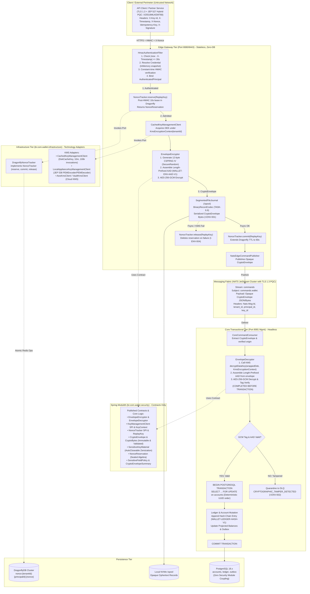

# 🏛️ System Architecture: ARCH-000.10 — Financial Security & Payload Cryptographic Protection

- **Status**: 🟡 **Architecture Review Passed — Rev. 2.2 (Aligned with Histories 71-74 & JDK 27 PQC Review)**
- **Author**: Antigravity Platform Security & Financial Systems Guild
- **Date**: 2026-09-29
- **Target Systems / Subprojects**: `:edge` (`br.com.wallet.edge`), `:core` (`br.com.wallet.core`), Spring Modulith Security (`br.com.wallet.security`), and Infrastructure (`br.com.wallet.infrastructure`)
- **Governing Skills**:
  - [`financial-cryptographic-security`](file:///.agents/skills/financial-cryptographic-security/SKILL.md) (Envelope Encryption, Key Lifecycle, AEAD & Modulith Isolation)
  - [`perimeter-security`](file:///.agents/skills/perimeter-security/SKILL.md) (Perimeter HMAC Ingress & Tenant Boundaries)
  - [`spec-driven-development`](file:///.agents/skills/spec-driven-development/SKILL.md) (Spec Kit Orchestrator)
- **Governing Specs**:
  - [`../SPEC-000.10-financial-security.md`](file:///.spec/SPEC-000.10-financial-security.md) (Financial Security & Payload Cryptographic Protection)
  - [`../SPEC-000.9.3-hmac-signed-ingress-and-tenant-boundaries.md`](file:///.spec/SPEC-000.9.3-hmac-signed-ingress-and-tenant-boundaries.md) (Perimeter HMAC Ingress & Tenant Boundaries)
  - [`../SPEC-000.9-reactive-edge-gateway-and-ingress-resilience.md`](file:///.spec/SPEC-000.9-reactive-edge-gateway-and-ingress-resilience.md) (Reactive Edge Gateway, Segmented Spool Journal & Recovery)
  - [`.histories/history71.txt`](file:///.histories/history71.txt) (Decrypt-Before-Transaction, AAD Binding, IV vs Nonce)
  - [`.histories/history72.txt`](file:///.histories/history72.txt) (Spring Modulith Isolation, Provider Neutrality, KMS Separation)
  - [`.histories/history73.txt`](file:///.histories/history73.txt) (Dual Boundary Enforcement, Immutable CryptoBytes, SensitiveKeyMaterial, Canonical AAD)
  - [`.histories/history74.txt`](file:///.histories/history74.txt) (Two-Phase Replay Reservation, DEK Cache Lifecycle, KMS Encryption Context, Failure Recovery)

---

## 1. Executive Summary & Architectural Mantra

> *"Financial Security protects financial data; it does not own financial state. Cryptographic authentication and payload confidentiality must complete before the financial database transaction begins. Security owns the security contracts; infrastructure owns technology adapters."*

Following the establishment of perimeter authentication and verified tenant identity in **SPEC-000.9.3**, financial command payloads (`amount`, `sourceAccountId`, `targetAccountId`, metadata, PII) remained potentially exposed if flushed to disk journals, messaging fabrics, crash dumps, or observability streams in plaintext.

**ARCH-000.10** closes this attack surface by formalizing an application-layer envelope encryption architecture between Edge persistence/transport and Core:
1. **Application-Layer Envelope Encryption**: Edge authenticates the ingress request via TLS + HMAC (`WALLET-HMAC-V1`), reserves the replay nonce, acquires a Data Encryption Key (DEK), and encrypts the command payload using AES-256-GCM (`WALLET-ENV-V1`) before writing to disk or network.
2. **Two-Tier Cryptographic Binding (`I-ENV-002`)**:
   - **Tier 1 (KMS Encryption Context)**: Cryptographically binds the KMS-wrapped DEK to `tenant_id` and `key_domain`.
   - **Tier 2 (Canonical AAD)**: Length-prefixed binary AAD (`WALLET-ENV-AAD-V1`) binds `version`, `tenantId`, `operationId`, `keyId`, and `algorithm` to the GCM ciphertext. Delimiter collisions and metadata substitution are eliminated.
3. **Two-Phase Replay Reservation (`I-ENV-004`)**:
   - Solves the failure-recovery 401 bug: Nonce is **reserved** post-HMAC with a short lease (10s), **committed** upon durable journal fsync with full TTL (60s), or **released** on pre-journal failure (KMS timeout, encryption error), ensuring legitimate retries succeed cleanly.
4. **Cryptographic Spool Protection (`TASK-6.6`, `I-ENV-001`)**: All commands written to the Edge `SegmentedFileJournal` (`/spool`) and published over NATS JetStream are strictly length-prefixed `CryptoEnvelope` byte sequences. Zero plaintext financial data resides at rest in journal segments.
5. **Decrypt-Before-Transaction (`I-ENV-003`, `I-ATOMICITY-001`)**: Core unwraps the DEK and authenticates/decrypts the payload **strictly before** opening the PostgreSQL transaction (`BEGIN TX`). Zero external KMS network calls, Dragonfly lookups, or cipher operations may block while holding database row-level locks on `accounts`.
6. **JDK 27 Cryptographic Runtime & Post-Quantum Preparedness**:
   - Ingress and IPC benefit from native **JEP 527 Post-Quantum Hybrid TLS 1.3 (`X25519MLKEM768`)**, defeating "Harvest Now, Decrypt Later" (HNDL) attacks.
   - Symmetrically, 256-bit AES-GCM retains $2^{128}$ effective quantum strength against Grover's algorithm.
   - JEP 538 `PEMEncoder`/`PEMDecoder` provides standard zero-dependency key serialization for appliance deployments.
7. **Dual Boundary Enforcement & Modular Isolation (`I-SEC-013`, `I-SEC-014`, `I-SEC-015`)**:
   - **Layer 1 (Gradle)**: Root `:ledger` has zero compile-time dependencies on `:security`. Technology adapters (`DragonflyNonceTracker`, Cloud KMS, `LocalApplianceKeyManagementClient`, `CachedKeyManagementClient`) reside strictly in `:infrastructure`. `InMemoryKeyManagementClient` is test-scoped (`src/test/java`).
   - **Layer 2 (Spring Modulith)**: `br.com.wallet.security` encapsulates pure contracts, verified via `ApplicationModules.of(WalletApplication.class).verify()`.

---

## 2. Macro Topology & Cryptographic Trust Boundaries



---

## 3. Cryptographic Domain Separation

| Domain Identifier | Target Purpose | Primitive & Key Material | Governing Scope |
| :--- | :--- | :--- | :--- |
| **`WALLET-HMAC-V1`** | Perimeter request authentication & perimeter integrity | HMAC-SHA-256 with long-lived Tenant API Secret (`javax.crypto.Mac`) | Client $\to$ Edge Perimeter |
| **`WALLET-NONCE-V1`** | Ingress replay protection key namespace | String composite `nonce:{tenantId}:{principalId}:{nonce}` in DragonflyDB (TTL 60s) | Edge $\to$ DragonflyDB |
| **`WALLET-ENV-V1`** | Application-layer payload confidentiality & authenticity | AES-256-GCM with Ephemeral DEK wrapped by Tenant KEK in KMS | Edge Spool $\to$ NATS $\to$ Core |
| **`WALLET-LEDGER-HASH-V1`**| Immutable accounting tamper detection & audit chain | SHA-256 sequential hash-chaining ($\text{hash}_n = \text{SHA256}(\dots)$) | Core $\to$ PostgreSQL `ledger` |

---

## 4. Detailed Subsystem Specifications

### 4.1 Immutable Envelope & Structural Validation (`I-SEC-016`)

#### 4.1.1 Immutable Binary Value (`CryptoBytes`)
```java
package br.com.wallet.security.envelope;

public record CryptoBytes(byte[] value) {
    public CryptoBytes {
        Objects.requireNonNull(value, "value must not be null");
        value = value.clone(); // Defensive copy on construction
    }

    @Override
    public byte[] value() {
        return value.clone(); // Defensive copy on access
    }

    public int length() {
        return value.length;
    }
}
```

#### 4.1.2 The Strongly Validated `CryptoEnvelope`
```java
package br.com.wallet.security.envelope;

public record CryptoEnvelope(
    EnvelopeVersion version,           // WALLET_ENV_V1
    TenantId tenantId,                 // Derived from authenticated principal
    OperationId operationId,           // Client Idempotency-Key UUID
    KeyId keyId,                       // KMS Key Identifier for Tenant KEK
    EncryptionAlgorithm algorithm,     // AES_256_GCM
    CryptoBytes iv,                    // Exactly 12-byte CSPRNG initialization vector
    CryptoBytes wrappedDek,            // Ciphertext of DEK wrapped by KMS KEK
    CryptoBytes ciphertext             // Payload ciphertext + 16-byte GCM authentication tag
) {
    public CryptoEnvelope {
        Objects.requireNonNull(version, "version must not be null");
        Objects.requireNonNull(tenantId, "tenantId must not be null");
        Objects.requireNonNull(operationId, "operationId must not be null");
        Objects.requireNonNull(keyId, "keyId must not be null");
        Objects.requireNonNull(algorithm, "algorithm must not be null");
        Objects.requireNonNull(iv, "iv must not be null");
        Objects.requireNonNull(wrappedDek, "wrappedDek must not be null");
        Objects.requireNonNull(ciphertext, "ciphertext must not be null");
        if (iv.length() != 12) {
            throw new IllegalArgumentException("GCM IV must be exactly 12 bytes (96 bits)");
        }
        if (wrappedDek.length() == 0) {
            throw new IllegalArgumentException("wrappedDek must not be empty");
        }
        if (ciphertext.length() < 16) {
            throw new IllegalArgumentException("ciphertext must be at least 16 bytes (auth tag)");
        }
    }
}
```

#### 4.1.3 Two-Tier Cryptographic Binding (`I-ENV-002`)
1. **Tier 1: KMS Encryption Context**:
   - Passed to KMS `generateDataKey` and `decryptDataKey`:
     $$\text{KmsEncryptionContext} = \{\text{"WALLET-ENV-V1"}, \text{"tenant\_id"}: \text{tenantId}, \text{"key\_domain"}: \text{"WALLET-ENV-V1"}\}$$
   - Ensures wrapped DEKs cannot be unwrapped under a different tenant's context.
2. **Tier 2: Length-Prefixed Canonical AAD (`WALLET-ENV-AAD-V1`)**:
   - Constructed with explicit 32-bit field lengths and pre-calculated exact buffer size:
     $$\text{AAD} = \text{Bytes}(\text{"WALLET-ENV-AAD-V1"} \,\|\, \text{Len}(v) \,\|\, v \,\|\, \text{Len}(t) \,\|\, t \,\|\, \text{Len}(op) \,\|\, op \,\|\, \text{Len}(k) \,\|\, k \,\|\, \text{Len}(alg) \,\|\, alg)$$

---

### 4.2 Two-Phase Replay Reservation Pattern (`I-ENV-004`)

```text
Sequence Flow:
1. Client sends request with X-Nonce
2. HmacAuthenticationFilter validates HMAC-SHA256 signature
3. NonceTracker.reserve(ReplayKey)
   ├── Dragonfly: SET nonce:{tenantId}:{principalId}:{nonce} "RESERVED" NX EX 10
   ├── If NIL (Already exists) -> Return HTTP 401 (DUPLICATE_NONCE)
   └── If OK -> NonceReservation.Admitted
4. Edge acquires DEK from cache & executes AES-256-GCM encryption
5. Edge appends CryptoEnvelope to SegmentedFileJournal and fsyncs
   ├── ON SUCCESS:
   │     NonceTracker.commit(ReplayKey)
   │     Dragonfly: SET nonce:{tenantId}:{principalId}:{nonce} "COMMITTED" XX EX 60
   │     Publish to NATS & Return HTTP 202 ACCEPTED
   └── ON FAILURE (KMS timeout / Journal disk error):
         NonceTracker.release(ReplayKey)
         Dragonfly: DEL nonce:{tenantId}:{principalId}:{nonce}
         Return HTTP 500 / 503 (Client can now safely retry with SAME nonce)
```

---

### 4.3 Key Management Service (KMS) & Plaintext DEK Cache Lifecycle

#### 4.3.1 Bounded Plaintext DEK Cache Semantics (`REQ-SEC-026`)
Technology implementation residing in `br.com.wallet.infrastructure.security.keymanagement.CachedKeyManagementClient`:
- **Cache Key**: `DekCacheKey(TenantId tenantId, KeyId keyId)`
- **Cache Entry**:
  ```java
  public record DekCacheEntry(
      TenantId tenantId,
      KeyId keyId,
      CryptoBytes wrappedDek,
      SensitiveKeyMaterial plaintextDek,
      Instant createdAt,
      Instant expiresAt,
      AtomicLong encryptionCount
  ) {}
  ```
- **Lifecycle Constraints**:
  - `maxAge`: 10 minutes (`expireAfterWrite`).
  - `maxUses`: 100,000 encryptions per DEK before mandatory eviction (`I-ENV-006`).
  - `eviction`: Cache removal listener invokes `plaintextDek.close()` (`Arrays.fill(material, 0)`).
  - `ivGeneration`: Every encryption generates a fresh 12-byte CSPRNG IV via `SecureRandom` (`I-ENV-006`).

#### 4.3.2 Strongly Typed Key Management SPI (`REQ-SEC-024`)
Resides in `br.com.wallet.security.keymanagement`:
```java
public interface KeyManagementClient {
    GeneratedDataKey generateDataKey(TenantId tenantId, KeyId keyId, KeyContext context);
    SensitiveKeyMaterial decryptDataKey(TenantId tenantId, KeyId keyId, CryptoBytes wrappedDek, KeyContext context);
}
```

---

### 4.4 Decrypt-Before-Transaction Subsystem (`I-ENV-003`)

Core ingestion strictly isolates external cryptographic I/O from database transactions:
```text
NATS Command Ingestion
       │
       ▼
1. Extract CryptoEnvelope from NATS JetStream Message
       │
       ▼
2. Call KeyManagementClient.decryptDataKey(tenantId, keyId, wrappedDek, KmsEncryptionContext)
   [Network I/O to KMS executed WITHOUT holding database locks]
       │
       ▼
3. Reconstruct Length-Prefixed Canonical AAD from Envelope fields
       │
       ▼
4. Execute AES-256-GCM Decryption & Authenticate Tag
   [If tag mismatch -> Quarantine to DLQ (CRYPTOGRAPHIC_TAMPER_DETECTED) & NATS ACK]
       │
       ▼
5. Deserialize clean Domain Command (TransferCommand / DepositCommand)
       │
       ▼
6. BEGIN PostgreSQL Transaction (@Transactional)
   ├── Acquire Row-Level Locks: SELECT FOR UPDATE on accounts (ordered by UUID)
   ├── Check Account Lifecycle Status (I-ACCOUNT-001)
   ├── Check Balance Sufficiency & Update Projected Balances
   ├── Insert Hash-Chained Ledger Entry (I-LEDGER-001, I-LEDGER-002)
   ├── Insert Transactional Outbox Event (I-OUTBOX-001)
   └── COMMIT TRANSACTION
```

---

### 4.5 Dual Boundary Architecture & Modulith Isolation (`I-SEC-013`, `I-SEC-014`, `I-SEC-015`)

```text
Layer 1: Gradle Build Boundaries
┌────────────────────────────────────────────────────────┐
│ :ledger (Zero dependencies on :security)               │
└────────────────────────────────────────────────────────┘
┌────────────────────────────────────────────────────────┐
│ :security (Domain contracts & pure crypto engine)      │
│   └── Zero dependencies on :edge, :core, :ledger       │
└──────────────────────────┬─────────────────────────────┘
                           ▲
             ┌─────────────┴─────────────┐
             │                           │
     ┌───────┴────────┐          ┌───────┴────────┐
     │ :edge          │          │ :core          │
     │ (Encryptor)    │          │ (Decryptor)    │
     └────────────────┘          └────────────────┘
                           ▲
             ┌─────────────┴─────────────┐
             │ :infrastructure           │
             │ (DragonflyNonceTracker)   │
             │ (CachedKeyManagementClient)
             │ (LocalApplianceKmsClient) │
             │ (CloudKmsClient adapters) │
             └───────────────────────────┘

Layer 2: Spring Modulith Boundary
br.com.wallet.security (Verified via ApplicationModules.verify())
├── envelope/          (CryptoEnvelope, CryptoBytes, EnvelopeEncryptor, EnvelopeDecryptor, CanonicalAad)
├── keymanagement/     (KeyManagementClient SPI, SensitiveKeyMaterial, GeneratedDataKey, KeyContext)
├── replay/            (NonceTracker SPI, ReplayKey, NonceReservation)
├── telemetry/         (SensitiveFieldPolicy, TelemetrySanitizer, CryptoEnvelopeSummary)
└── failure/           (CryptographicIntegrityException, SecurityFailureCategory)
```

---

### 4.6 Telemetry Protection & Failure Taxonomy (`I-SEC-012`, `REQ-SEC-031`)

#### 4.6.1 Structured Safe Representation (`CryptoEnvelopeSummary`)
Logging and diagnostics use a safe summary record:
```java
public record CryptoEnvelopeSummary(
    EnvelopeVersion version,
    TenantId tenantId,
    OperationId operationId,
    KeyId keyId,
    int ciphertextLength
) {}
```
Sensitive materials (`SensitiveKeyMaterial`, raw plaintexts, `CryptoBytes.value`) have zero generic serialization paths.

#### 4.6.2 Fine-Grained Failure Taxonomy

| Failure Event | Layer Detected | Internal Classification | Retryable? | DLQ? | External Handling |
| :--- | :--- | :--- | :--- | :--- | :--- |
| **Invalid HMAC Signature** | Edge Ingress | `PERIMETER_AUTH_FAILURE` | No | No | HTTP 401 Unauthorized |
| **Replayed Nonce** | Edge Ingress | `REPLAY_ATTACK_DETECTED` | No | No | HTTP 401 Unauthorized |
| **Nonce Storage Down** | Edge Ingress | `REPLAY_STORAGE_UNAVAILABLE` | Yes | No | HTTP 503 Service Unavailable |
| **Malformed Envelope** | Core Consumer | `MALFORMED_ENVELOPE` | No | Yes | Quarantine to DLQ |
| **GCM Tag Mismatch** | Core Consumer | `CRYPTOGRAPHIC_TAMPER_DETECTED` | No | Yes | Quarantine to DLQ + Alert |
| **KMS Encryption Context Mismatch** | Core Consumer | `CRYPTOGRAPHIC_TAMPER_DETECTED` | No | Yes | Quarantine to DLQ + Alert |
| **KMS Transient Timeout** | Edge / Core | `KEY_MANAGEMENT_UNAVAILABLE` | Yes | No | Retry Backoff / HTTP 503 |
| **Security Config Error** | Edge / Core | `SECURITY_CONFIG_FAILURE` | No | Alert | HTTP 503 / Alert |

---

## 5. Failure Modes, Resilience & Disaster Recovery Matrix

| Failure Scenario | Immediate Detection | System Impact | Automated Recovery / Mitigation |
| :--- | :--- | :--- | :--- |
| **KMS Provider Outage** | `KeyManagementUnavailableException` | Edge cannot generate DEKs; Core cannot decrypt | Edge serves cached DEKs if lease valid; Core pauses NATS consumer via backoff (zero DB lock contention). |
| **Pre-Journal Edge Crash** | Client retry with same nonce | Previously reserved nonce released or expired (10s) | Two-phase reservation allows legitimate client retry to succeed (`I-ENV-004`). |
| **Spool Disk Bit Rot / Tamper** | CRC32C failure in `BinaryRecordCodec` or GCM auth tag failure | Record cannot be deserialized or decrypted | Spool recovery skips corrupted record to dead-letter storage; alerts security operations. |
| **Cross-Tenant Substitution Attempt** | KMS context mismatch or GCM tag mismatch | Ciphertext fails decryption | Command quarantined to DLQ under `CRYPTOGRAPHIC_TAMPER_DETECTED`; consumer thread remains healthy. |

---

## 6. Deployment Topology & Scaling Matrix

| Deployment Tier | Infrastructure Target | KMS Backend | Nonce Storage | Edge Replicas | Core Replicas | Storage Binding |
| :--- | :--- | :--- | :--- | :--- | :--- | :--- |
| **Tier 0 (Dev / Test)** | Docker Compose / CLI | `InMemoryKeyManagementClient` (Test) | Dragonfly (Container TCP) | 1 | 1 | Named Volume (`/spool`) |
| **Tier 1 (Small Appliance)**| Single-Node RKE2 | `LocalApplianceKeyManagementClient` (PEM) | Dragonfly (Unix Domain Socket) | 2 | 2 | HostPath NVMe |
| **Tier 2 (Enterprise)** | Multi-Node RKE2 / Rancher | AWS KMS / Vault Cluster | Dragonfly HA Cluster | 4+ (HPA) | 2+ (HPA) | CSI Block Volume (RWO) |
| **Tier 3 (Multi-Tenant)** | RKE2 + vCluster | Multi-Tenant Vault / Cloud KMS | Dragonfly (Tenant-Partitioned)| Asymmetric | Asymmetric | CSI Block Volume (RWO) |
| **Tier 4 (Cloud Native)** | GKE / EKS Standard | Cloud KMS (AWS / GCP KMS) | Dragonfly / Managed Redis Cluster| Auto (HPA) | Auto (HPA) | Regional SSD Persistent Disk |

---

## 7. JDK 27 Cryptographic Runtime Alignment & Post-Quantum Cryptography (PQC)

1. **JEP 527: Post-Quantum Hybrid TLS 1.3 (`X25519MLKEM768`)**:
   - Released in JDK 27 (September 15, 2026), native hybrid key exchange combines classical X25519 with ML-KEM-768 (NIST FIPS 203 / Kyber) under IETF RFC 10024.
   - **Ingress Shielding**: Client-to-Edge HTTPS/TLS 1.3 connections and HTTP/3 over QUIC on UDP 8443 automatically negotiate `X25519MLKEM768` by default, protecting financial payloads against "Harvest Now, Decrypt Later" (HNDL) attacks.
   - **IPC Messaging**: Edge-to-Core NATS JetStream TLS connections benefit from default quantum resistance.
2. **Symmetric AES-256 Quantum Resilience**:
   - Grover's algorithm provides a quadratic speedup ($2^{k/2}$), reducing AES-256 brute-force to $2^{128}$ operations. This remains computationally impossible, making `AES_256_GCM` mathematically quantum-safe for all payloads at rest in `/spool` and in-flight over NATS.
3. **JEP 538: Native PEM API (`PEMEncoder` / `PEMDecoder`)**:
   - Replaces external BouncyCastle dependencies in `LocalApplianceKeyManagementClient`. Appliance root KEKs and certificates are encrypted, encoded, and decoded using JDK 27 standard `PEMEncoder.of().withEncryption(password)` and `PEMDecoder.of().withDecryption(password)`.
4. **KeyStore `Instant` Lifecycle API (JDK-8374808)**:
   - Eliminates legacy mutable `java.util.Date` across `KeyManagementClient` and `DekCacheEntry`, standardizing on immutable `java.time.Instant`.
5. **Operational Diagnostics (`jcmd VM.security_properties`)**:
   - Operators can audit containerized runtime properties (`jcmd 1 VM.security_properties`), verifying `crypto.policy=unlimited`, `jdk.tls.keyLimits` ($2^{37}$ GCM limit), and `securerandom.strongAlgorithms`.

---

## 8. Authoritative Invariants Registry

| Invariant ID | Invariant Name | Mathematical / Formal Definition | Enforcement Mechanism |
| :--- | :--- | :--- | :--- |
| **`I-ENV-001`** | **Zero Plaintext at Rest & In-Transit** | $\text{Payload}_{\text{spool}} = \text{AES-GCM-256}(K_{\text{DEK}}, \text{Plaintext}, \text{IV}, \text{AAD}) \implies \text{Plaintext} \cap \text{SpoolDiskBytes} = \emptyset$ | `SegmentedFileJournal`, `BinaryRecordCodec`, `ZeroPlaintextSpoolTest` |
| **`I-ENV-002`** | **Two-Tier Cryptographic Binding** | $\text{KmsContext} = \{\text{tenantId}, \text{keyDomain}\}, \quad \text{AAD} = \text{Bytes}(\text{"WALLET-ENV-AAD-V1"} \,\|\, \dots)$ | `CanonicalAad`, KMS Context, `CrossTenantEnvelopeSubstitutionTest` |
| **`I-ENV-003`** | **Decrypt-Before-Transaction** | $\text{BeginTx}() \succ \text{EnvelopeDecryptor.decrypt}(\text{CryptoEnvelope})$ | `CoreCommandConsumer`, `DecryptBeforeTransactionTest` |
| **`I-ENV-004`** | **Two-Phase Replay Reservation** | $\text{Reserve}(\text{Key}) \to \text{Fsync}(\text{Spool}) \to \text{Commit}(\text{Key}) \lor \text{Release}(\text{Key})$ | `DragonflyNonceTracker`, `NonceAdmissionFailureRecoveryTest` |
| **`I-ENV-005`** | **Benchmark Latency Envelope** | Target: $P99(\text{Cipher}) \le 10\mu\text{s}, \quad P99(\text{EdgePipeline}) \le 50\mu\text{s}$ (256B to 64KB) | Micro-benchmark JMH test suite |
| **`I-ENV-006`** | **GCM IV Uniqueness & Invocation Budget** | $\forall \text{encryptions under } K_{\text{DEK}}, \quad \text{IV}_i \ne \text{IV}_j, \quad N_{\text{uses}} \le 100{,}000$ | `GcmIvUniquenessTest`, `CachedKeyManagementClient` |
| **`I-SEC-011`** | **KMS Air-Gap & Key Isolation** | $\text{Perm}(\text{Edge}) \subseteq \{\text{generateDataKey}\}, \quad \text{Perm}(\text{Core}) \subseteq \{\text{decryptDataKey}\}$ | IAM Policy & Architecture Unit Test |
| **`I-SEC-012`** | **Non-Emission First Telemetry** | $\text{Telemetry}(\text{Req}) \cap \text{SensitiveFields}(\text{Req}) = \emptyset$ | `CryptoEnvelopeSummary`, `TelemetrySanitizationTest` |
| **`I-SEC-013`** | **Financial Security Encapsulation** | $\forall c \in \text{SecurityContracts}: c \in \text{br.com.wallet.security}$ | Spring Modulith `ApplicationModules.verify()` |
| **`I-SEC-014`** | **Ledger Architectural Isolation** | $\text{Deps}(\text{br.com.wallet.ledger}) \cap \text{Deps}(\text{br.com.wallet.security}) = \emptyset$ | Spring Modulith ArchUnit Architecture Test |
| **`I-SEC-015`** | **Dual Boundary & Provider Isolation** | Layer 1 Gradle + Layer 2 Spring Modulith; Adapters in `:infrastructure` | Gradle subprojects & Architecture Unit Tests |
| **`I-SEC-016`** | **Value Immutability & Key Zeroization** | $\text{CryptoBytes.clone}(), \quad \text{SensitiveKeyMaterial.close}() \to \text{Arrays.fill}(0)$ | `CryptoEnvelopeImmutabilityTest`, Unit Tests |
