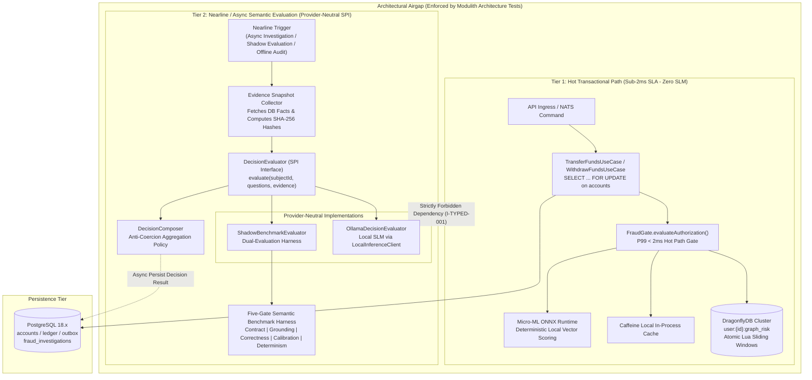
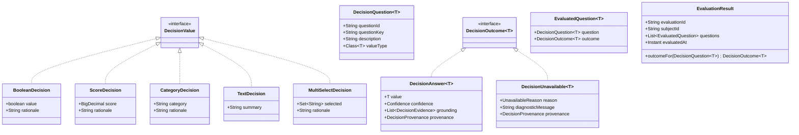

# 🏛️ System Architecture: ARCH-000.8.1 — Native Typed AI Decision Algebra & Grounded Evaluation Topology

- **Status**: 🟢 **Ratified**
- **Author**: Antigravity Platform Architecture Guild
- **Date**: 2026-09-22
- **Target Systems / Subprojects**: `:fraud` (`br.com.wallet.fraud.decision`), `:core` (`br.com.wallet.core`), and Root Transactional Ledger (`br.com.wallet.ledger`)
- **Governing Specs**:
  - [`../SPEC-000.8.1-typed-ai-decision-evaluation.md`](file:///.spec/SPEC-000.8.1-typed-ai-decision-evaluation.md) (Typed AI Decision Evaluation & Structural Binding)
  - [`../plans/PLAN-000.8.1-typed-ai-decision-evaluation.md`](file:///.spec/plans/PLAN-000.8.1-typed-ai-decision-evaluation.md) (Implementation Plan & Modulith Packaging)

---

## 1. Executive Summary & Architectural Mantra

> *"Steal the architecture, not the library. The hot transaction path remains sub-2ms, deterministic, and air-gapped from semantic evaluation. AI decision evaluation is modeled as pure-Java algebraic types with compile-time generic binding, machine-verifiable evidence hashing, and an absolute anti-coercion gate: unavailable decisions can never be coerced into false, zero, or synthetic scores."*

Recent industry attempts to introduce type-safety into LLM/SLM workflows (such as `spring-ai-typesafe`) revealed valuable architectural concepts—generic question-answer binding, calibrated confidence, machine-readable evidence, and candidate benchmarking. However, adopting unproven snapshot dependencies into a mission-critical core banking system violates platform invariants (`I-TDD-002`, `REQ-TYPED-010`).

**ARCH-000.8.1** formalizes a native, pure-Java 27 typed decision algebra tailored to the Wallet Service:
1. **Architectural Airgap**: Hot-path Core transfers ($<15\text{ms}$) and fraud authorizations ($P99 < 2\text{ms}$) execute exclusively against DragonflyDB, local Caffeine sliding windows, and in-process ONNX micro-models. Semantic decision evaluation runs exclusively nearline or asynchronously.
2. **Generic Type Binding**: `DecisionQuestion<T extends DecisionValue>` guarantees compile-time and runtime type equivalence with `DecisionOutcome<T>`.
3. **Structural Anti-Coercion Gate**: `DecisionOutcome<T>` is an algebraic sealed hierarchy permitting `DecisionAnswer<T>` or `DecisionUnavailable<T>`. `DecisionUnavailable<T>` structurally exposes neither score nor confidence, preventing downstream composers from fabricating synthetic results.
4. **Machine-Verifiable Evidence**: Evidence snapshots compute canonical JSON SHA-256 hashes, ensuring deterministic auditability and tamper-detection.
5. **Five-Gate Evaluation Protocol**: Upgrades and candidate evaluators must clear five explicit quality gates (Contract, Grounding, Directed Task Correctness, Calibration, and Performance/Determinism) before deployment.

---

## 2. Macro Topology & System Isolation



### 2.1 Architectural Invariant Enforcement
- `I-TYPED-001` (Hot-Path Airgap): `br.com.wallet.ledger` and `br.com.wallet.fraud.fusion.gate` MUST NOT import or invoke any class from `br.com.wallet.fraud.decision.*`.
- `I-TYPED-002` (Latency Non-Degradation): The fraud gate authorization budget ($P99 < 2\text{ms}$) is strictly isolated; SLM calls must never execute on the transaction path.

---

## 3. Native Generic Decision Type System

The typed decision algebra utilizes Java 27 records and sealed interfaces to model decision requests, outcomes, evidence, and values.



### 3.1 Decision Values (`DecisionValue`)
All decision payloads implement `DecisionValue`. Each concrete value represents a validated semantic dimension:
- `BooleanDecision`: Binary verdict (e.g. `isStructuringDetected`) with domain rationale.
- `ScoreDecision`: Normalized scalar score ($\text{scale} = 2, 0.00 \le \text{score} \le 1.00$) representing calibrated risk intensity.
- `CategoryDecision`: Categorical classification matching pre-declared enum/string domain taxonomies.
- `TextDecision`: Unstructured synthetic investigation summaries.
- `MultiSelectDecision`: Set-based categorization (e.g. triggered anomaly vectors).

### 3.2 Question Definition & Type Witness
```java
public record DecisionQuestion<T extends DecisionValue>(
    String questionId,
    String questionKey,
    String description,
    Class<T> valueType
) {
    public DecisionQuestion {
        Objects.requireNonNull(questionId, "questionId must not be null");
        Objects.requireNonNull(questionKey, "questionKey must not be null");
        Objects.requireNonNull(description, "description must not be null");
        Objects.requireNonNull(valueType, "valueType must not be null");
    }
}
```
The `Class<T> valueType` serves as a runtime type witness, allowing safe casting and structural validation during evaluation parsing.

### 3.3 Algebraic Outcome Hierarchy & Structural Absence
```java
public sealed interface DecisionOutcome<T extends DecisionValue>
    permits DecisionAnswer, DecisionUnavailable {
}

public record DecisionAnswer<T extends DecisionValue>(
    T value,
    Confidence confidence,
    List<DecisionEvidence> grounding,
    DecisionProvenance provenance
) implements DecisionOutcome<T> {  }

public record DecisionUnavailable<T extends DecisionValue>(
    UnavailableReason reason,
    String diagnosticMessage,
    DecisionProvenance provenance
) implements DecisionOutcome<T> {  }
```

> **Critical Design Principle**: `DecisionUnavailable<T>` structurally defines **no** `score()`, `value()`, or `confidence()` accessors. It does not return `Optional.empty()` on a shared interface method. Downstream code cannot accidentally read an absent value as a valid numerical or boolean verdict.

---

## 4. Machine-Verifiable Grounding & Evidence Model

Semantic evaluations must be grounded in immutable, tamper-evident evidence snapshots (`I-TYPED-004`).

### 4.1 Evidence Structure & Canonical Hashing
```java
public record DecisionEvidence(
    String evidenceKey,
    String summary,
    Map<String, Object> facts,
    String contentHash
) {
    public static DecisionEvidence of(String key, String summary, Map<String, Object> facts) {
        String canonicalJson = CanonicalJsonSerializer.serialize(facts);
        String hash = Hashing.sha256Hex(canonicalJson);
        return new DecisionEvidence(key, summary, Map.copyOf(facts), hash);
    }
}
```
1. `CanonicalJsonSerializer` sorts map keys alphabetically and normalizes formatting.
2. `contentHash` is the SHA-256 digest of the canonical string.
3. Every `DecisionAnswer<T>` carries the list of `DecisionEvidence` items utilized during inference, enabling instant independent verification of claim grounding.

---

## 5. Anti-Coercion Composition Architecture (`I-TYPED-006`)

`DecisionComposer` provides composable domain logic to aggregate individual question outcomes into risk actions.

```
                    ┌──────────────────────────────┐
                    │       EvaluationResult       │
                    └──────────────┬───────────────┘
                                   │
              ┌────────────────────┴────────────────────┐
              ▼                                         ▼
   DecisionAnswer<T>                          DecisionUnavailable<T>
(value, confidence, grounding)               (reason, diagnosticMsg)
              │                                         │
              │                                         │
              ▼                                         ▼
   ┌─────────────────────────────────────────────────────────────┐
   │                       DecisionComposer                      │
   │                                                             │
   │  Policy: FAIL_CLOSED | DEGRADE_TO_UNVERIFIED                │
   │                                                             │
   │  [ANTI-COERCION RULE]                                       │
   │  DecisionUnavailable CANNOT become:                         │
   │    ❌ false                                                 │
   │    ❌ 0.00                                                  │
   │    ❌ Synthetic default score                               │
   └──────────────────────────────┬──────────────────────────────┘
                                  │
                                  ▼
                     SynthesizedDomainDecision
                     (status, confidence, actions)
```

### 5.1 Anti-Coercion Invariant (`I-TYPED-006`)
- Converting `DecisionUnavailable<BooleanDecision>` to `false` is prohibited (unavailable evidence is not evidence of absence).
- Converting `DecisionUnavailable<ScoreDecision>` to `0.00` or a neutral heuristic score is prohibited.
- When a required question is unavailable, the composer must either:
  1. Halt execution and return an unverified/inconclusive compound decision.
  2. Follow an explicit domain fallback policy registered specifically for unavailable inputs.

---

## 6. Provider-Neutral Evaluator SPI

```java
public interface DecisionEvaluator {
    CompletableFuture<EvaluationResult> evaluate(
        String subjectId,
        List<DecisionQuestion<?>> questions,
        Map<String, DecisionEvidence> evidence
    );
}
```

### 6.1 Resilience & Timeout Encapsulation (`I-TYPED-005`)
- When the underlying inference engine (e.g. Ollama SLM, HTTP endpoint) fails or times out:
  - The evaluator catch-block MUST map unfulfilled questions to `DecisionUnavailable<T>(UnavailableReason.TIMEOUT, ...)`.
  - The evaluator MUST NOT throw unchecked exceptions that abort the caller's pipeline.
  - The evaluator MUST NOT populate default synthetic answers.

---

## 7. Five-Gate Evaluation Protocol & Directed Margins

Upgrading inference models, prompt templates, or inference parameters requires passing the Five-Gate Semantic Evaluation Protocol:

```
[Candidate Model / Prompt]
            │
            ▼
    ┌───────────────┐
    │ Gate 1: Match │  --> 100% Schema & Type Witness Match (Zero Malformed JSON)
    └───────┬───────┘
            ▼
    ┌───────────────┐
    │ Gate 2: Ground│  --> 100% Grounding Verification (Claims Map to Evidence Hashes)
    └───────┬───────┘
            ▼
    ┌───────────────┐
    │ Gate 3: Task  │  --> F1(cand) >= F1(base) - ε_workload (Directed Non-Inferiority)
    └───────┬───────┘
            ▼
    ┌───────────────┐
    │ Gate 4: Calib │  --> ECE(cand) <= ECE(base) + ε_calib (Expected Calibration Error)
    └───────┬───────┘
            ▼
    ┌───────────────┐
    │ Gate 5: Perf  │  --> Throughput >= Target, Latency P95 <= Budget, Deterministic Replay
    └───────┬───────┘
            ▼
    [Certified Candidate]
```

### 7.1 Directed Margin Formulation
1. **Gate 3 (Task Correctness)**:
   $$\text{Metric}_{\text{candidate}} \ge \text{Metric}_{\text{baseline}} - \epsilon_{\text{workload}}$$
   where $\epsilon_{\text{workload}}$ is pre-declared (e.g., $\epsilon = 0.02$ for fraud anomaly detection).
2. **Gate 4 (Calibration Error)**:
   $$\text{ECE}_{\text{candidate}} \le \text{ECE}_{\text{baseline}} + \epsilon_{\text{calib}}$$
   where Expected Calibration Error ($\text{ECE}$) measures confidence reliability against observed empirical accuracy across probability bins.
3. **Gate 5 (Determinism & Performance)**:
   - Zero-temperature inference must produce 100% identical decision answers across repeated benchmark iterations.
   - P95 latency and memory footprint must satisfy nearline capacity envelopes.

---

## 8. Package Structure & Modulith Boundaries

```
br.com.wallet.fraud.decision/
├── model/
│   ├── DecisionValue.java (sealed marker)
│   ├── BooleanDecision.java
│   ├── ScoreDecision.java
│   ├── CategoryDecision.java
│   ├── TextDecision.java
│   ├── MultiSelectDecision.java
│   ├── DecisionQuestion.java (generic record with valueType witness)
│   ├── DecisionOutcome.java (sealed interface)
│   ├── DecisionAnswer.java
│   ├── DecisionUnavailable.java (structurally absent score/confidence)
│   ├── EvaluatedQuestion.java (strongly typed pair)
│   ├── EvaluationResult.java (type-safe outcome lookup)
│   ├── DecisionEvidence.java (hash-grounded evidence)
│   ├── Confidence.java (HIGH, MEDIUM, LOW)
│   ├── UnavailableReason.java
│   └── DecisionProvenance.java
├── evaluator/
│   ├── DecisionEvaluator.java (SPI)
│   ├── OllamaDecisionEvaluator.java (local SLM implementation)
│   └── MismatchedDecisionTypeException.java
├── composition/
│   ├── DecisionComposer.java (anti-coercion composer)
│   └── CompositionPolicy.java
├── catalog/
│   └── FraudDecisionQuestions.java (standard domain catalog)
└── benchmark/
    ├── FiveGateBenchmarkHarness.java
    ├── EvaluationMetrics.java
    └── BenchmarkDataset.java
```

### 8.1 Architecture Verification Gate
`ModulithArchitectureTest` and `DecisionBoundaryArchitectureTest` assert:
1. `br.com.wallet.ledger..*` has 0 references to `br.com.wallet.fraud.decision..*`.
2. `br.com.wallet.fraud.fusion.gate..*` has 0 references to `br.com.wallet.fraud.decision..*`.
3. `br.com.wallet.fraud.decision..*` has 0 dependencies on external third-party AI frameworks (pure Java 27).
