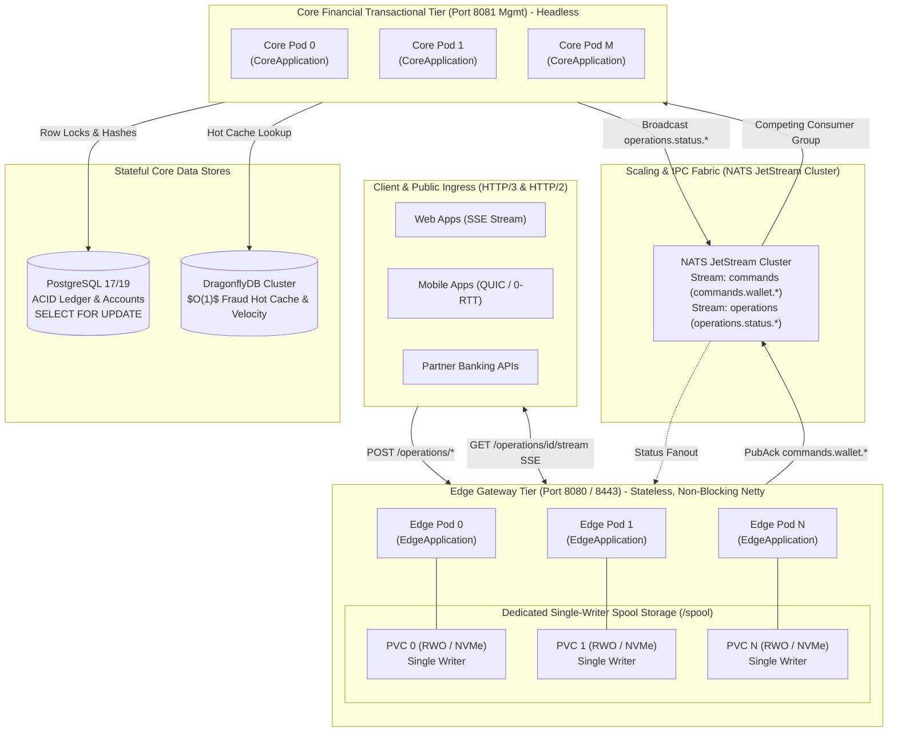
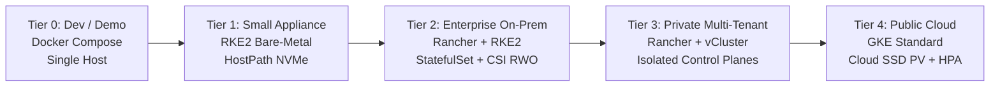

# 🏛️ System Architecture: ARCH-000.9 — Reactive Edge Gateway & Multi-Process Platform Topology

- **Status**: 🟢 **Ratified**
- **Author**: Antigravity Core & Edge Architecture Guild
- **Date**: 2026-09-10
- **Target Systems / Subprojects**: `:edge` (`br.com.wallet.edge`), `:core` (`br.com.wallet.core`), Root Monolith Orchestration, and Platform Packaging
- **Governing Specs**:
  - [`../SPEC-000.9-reactive-edge-gateway-and-ingress-resilience.md`](file:///.spec/SPEC-000.9-reactive-edge-gateway-and-ingress-resilience.md) (Reactive Ingress, Journal Fsync & SSE)
  - [`../SPEC-000.9.1-edge-core-independent-runtimes.md`](file:///.spec/SPEC-000.9.1-edge-core-independent-runtimes.md) (Independent Runtimes & Process Separation)
  - [`../SPEC-000.9.2-containerized-multi-process-topology.md`](file:///.spec/SPEC-000.9.2-containerized-multi-process-topology.md) (Container Packaging, StatefulSet & Scaling Topology)

---

## 1. Executive Summary & Architectural Mantra

> *"Edge accepts financial liability durably in sub-millisecond time and spools without relational state. Core authorizes and executes single-boundary ACID ledger mutations. NATS JetStream decouples their scaling, crash lifecycles, and failure domains."*

The **Reactive Edge Gateway & Multi-Process Architecture** solves the critical operational coupling of the monolithic banking platform. By establishing separate OS runtimes (`EdgeApplication` and `CoreApplication`) sharing a contract boundary over NATS JetStream, a crash, garbage collection freeze, database connection starvation, or high write load in the Core transactional engine cannot terminate perimeter command acceptance.

---

## 2. Macro Topology & System Boundary



---

## 3. Detailed Subsystem Specifications

### 3.1 Subsystem A: Process & Runtime Separation
- **Independent Entry Points**:
  - `EdgeApplication` (`br.com.wallet.edge.EdgeApplication`): Spring Boot WebFlux on Netty. Classpath strictly excludes `spring-boot-starter-data-jpa`, `org.postgresql:postgresql`, and HikariCP. Relational database auto-configuration is disabled.
  - `CoreApplication` (`br.com.wallet.WalletApplication`): Spring Boot transactional service. Runs headless with public HTTP routes disabled, exposing only `/actuator/health` and metrics on internal port `8081`.
- **Port & Network Segregation (`I-PORT-001`)**:
  - Ingress: Public HTTP `8080` (REST & SSE), UDP `8443` (HTTP/3 over QUIC with `Alt-Svc: h3=":8443"; ma=86400`).
  - Core: Internal management port `8081`. Public financial mutations on port `8081` return `404 Not Found`.
- **Dual-Profile Runtime (`I-RUNTIME-001`)**:
  - `multi-process` (Production Default): Edge and Core execute in discrete JVM processes / containers communicating over NATS JetStream.
  - `monolith` (Local Dev / CI Profile): Both runtimes boot in a single JVM for rapid integration testing. Emits an explicit warning log upon startup to prevent accidental production usage.

### 3.2 Subsystem B: Storage Architecture & The Lifeboat Principle
- **The Lifeboat Principle**: The Edge journal is an air-gapped fallback for when the distributed messaging broker is down. It must never depend on distributed consensus or network filesystems.
- **Single-Writer Isolation (`I-JOURNAL-001`)**:
  - Each Edge instance strictly owns its own isolated directory (`/spool/edge-{instanceId}/`).
  - Concurrent multi-node writes to the same segment file are strictly forbidden (`ConcurrentWriters = 1`). Shared filesystems (NFS, EFS, CephFS) are rejected due to POSIX lock failures, split-brain write interleaving, and $P99$ latency collapse ($50\text{ms}$ vs $0.5\text{ms}$).
- **Dual-Storage Profile Support (`I-STORAGE-001`)**:
  - **Option A (Node-Local NVMe / HostPath)**: Mounted directly from host fast storage. Provides maximum performance ($P99 < 500\mu s$ fsync, $50,000+$ ops/sec). Ideal for bare-metal, high-throughput on-prem appliances (Tier 0 & 1).
  - **Option B (Dedicated CSI Block Volume `ReadWriteOnce` via StatefulSet)**: Dedicated cloud/SAN block volume (AWS EBS gp3, GCP PD-SSD, Longhorn, Ceph RBD) attached exclusively to a single pod. If an Edge pod is rescheduled due to host failure, Kubernetes unmounts the volume and remounts it to the replacement pod. Zero concurrent-locking overhead, sub-millisecond block sync, and complete pod-migration recovery (Tier 2, 3, & 4).
- **Segment Framing & Group Commit**:
  - Preallocated 64MB binary segments:
    ```text
    Segment Header (32B): [Magic: 0x57414C4A][Version: 2B][SegmentId: 8B][CreatedAt: 8B][CRC32C: 4B][Padding: 6B]
    Record Frame   (54B): [Magic: 0x57414C52][Version: 2B][Flags: 2B][Length: 4B][CRC32C: 4B][SeqNo: 8B][OpId: 16B][Timestamp: 8B][CmdType: 2B][PayloadLen: 4B][Payload: NB]
    ```
  - Batching: `FileChannel.force(false)` flushes when `batchSize >= 100` OR `elapsed >= 1ms`.
  - Hysteresis Gate (`I-EDGE-005`): Rejects degraded acceptance at $\ge 95\%$ disk capacity (`HTTP 503`), resumes below $85\%$.

### 3.3 Subsystem C: Asynchronous IPC & Scaling Fabric
- **Broker Quorum**: Client receives `202 ACCEPTED` only upon JetStream durable PUBACK or local segment `force(false)` (`I-EDGE-001`).
- **Independent Horizontal Scaling (`I-TOPOLOGY-001`)**:
  - Edge scales horizontally ($N \ge 1$) based on perimeter network concurrency, active connections, and RPS.
  - Core scales independently ($M \ge 1$) based on database thread pools, consumer lag, and fraud computation limits.
  - Core instances join a durable JetStream competing consumer group on `commands.wallet.*`. JetStream dynamically load-balances across all healthy Core replicas without peer service discovery or process affinity.
- **Traceability & Deduplication (`I-IDEMPOTENCY-001`, `I-DEDUP-001`, `I-OBS-001`)**:
  - Every message carries `Nats-Msg-Id: <operationId>`, traceparent, and baggage headers. Duplicate replays are silently discarded by JetStream or handled idempotently by Core.

---

## 4. Failure Modes, Resilience & Disaster Recovery

| Failure Scenario | Immediate Detection | System Impact | Automated Recovery / Mitigation |
| :--- | :--- | :--- | :--- |
| **Core Process Crash / OOM** | NATS consumer heartbeats drop | Zero impact on Edge ingress | Edge continues accepting commands while broker/spool capacity permits. Core pod restarts and resumes consumer group (`I-PROCESS-001`). |
| **NATS JetStream Outage** | `BrokerCircuitBreaker` trips `OPEN` ($>10\%$ errors or $P99 > 50\text{ms}$) | Edge switches to local degraded journal | Edge appends commands to preallocated 64MB segment with group-commit `fsync`, returns `202 ACCEPTED` (`I-EDGE-001`). |
| **Edge Host VM Destruction (Option B)** | K8s node failure detector | Pod terminated | K8s StatefulSet schedules replacement pod on healthy node, re-attaches same `ReadWriteOnce` PV. `JournalRecoveryWorker` scans spool and replays to NATS. |
| **Journal File Corruption** | CRC32C checksum mismatch during recovery scan | Recovery scan halted on corrupted segment | Segment moved to `.corrupt` forensic isolation; critical alert raised. Corrupt bytes NEVER enter application DLQ (`I-EDGE-018`). |
| **Database Pool Exhaustion** | HikariCP checkout timeout in Core | Core command processing backs up | JetStream buffers backlog without Edge ingress backpressure. Bulkhead protects Edge memory. |

---

## 5. Deployment Tier Matrix



| Profile | Environment | Edge Model | Core Model | Storage Profile | Target Scenario |
| :--- | :--- | :--- | :--- | :--- | :--- |
| **Profile D0** | Docker Compose | Single container (8080) | Single container (8081) | Named Volume / Local Directory | Local Dev / Small Appliance |
| **Profile P1** | Kubernetes / RKE2 | $N$ replicas (`Deployment`) | $M$ replicas (`Deployment`) | Dedicated Volume per Pod | Private Enterprise On-Prem |
| **Profile P2** | vCluster | $N$ replicas (`Deployment`) | $M$ replicas (`Deployment`) | Dedicated CSI RWO Block Volume | Multi-Tenant Appliance |
| **Profile P3** | Public Cloud GKE | HPA (RPS/connections) | HPA (Consumer Lag) | Dedicated Cloud Persistent Disk | Public Cloud Elastic Scale |

---

## 6. Comprehensive Invariants Registry

| Invariant ID | Name | Formal Statement |
| :--- | :--- | :--- |
| **`I-EDGE-001`** | Durable Acceptance | $\text{Response}(202) \iff \text{Ack}_{\text{broker}}(\text{DurabilityPolicy}) \lor \text{force}(\text{Batch}(\text{command}))$ |
| **`I-EDGE-002`** | Bounded Bulkheading | $\text{inflightCommands} \le \text{MAX\_INFLIGHT} \implies \text{Reject} \to \text{HTTP } 429/503$ |
| **`I-EDGE-005`** | Spool Hysteresis | $\text{Usage} \ge 95\% \implies \text{RejectDegraded}; \quad \text{Resume} \iff \text{Usage} < 85\%$ |
| **`I-PROCESS-001`**| Crash Isolation | $\text{Crash}(\text{Core}) \not\to \text{Crash}(\text{Edge})$ |
| **`I-CONTRACT-001`**| Contract Decoupling | $\text{Deps}(\text{Edge}) \cap \{\text{ledger.internal}, \text{fraud.internal}, \text{persistence}, \text{JDBC}\} = \emptyset$ |
| **`I-JOURNAL-001`**| Single-Writer Spool | $\text{ConcurrentWriters}(\text{SpoolSegment}) = 1, \quad \text{Spool}(\text{Pod}_i) \cap \text{Spool}(\text{Pod}_j) = \emptyset$ |
| **`I-STORAGE-001`**| Volume Isolation | $\text{Storage}(\text{Spool}) \cap \text{Storage}(\text{PostgreSQL}) = \emptyset$ |
| **`I-STORAGE-002`**| Explicit Durability Scope | $\text{HostPath}=\text{NodeLocalRestartOnly}; \quad \text{CSI RWO}=\text{PodRescheduleDurability}$ |
| **`I-TOPOLOGY-001`**| Independent Scaling | $\text{Replicas}(\text{Edge}) = N, \quad \text{Replicas}(\text{Core}) = M \quad (N \ge 1, M \ge 1; N, M \text{ independent})$ |
| **`I-MESSAGING-001`**| Broker-Mediated IPC | $\text{DirectCalls}(\text{Edge} \to \text{Core}) = \emptyset; \quad \text{IPC} \subset \text{NATS}(\text{commands.wallet.*})$ |
| **`I-PLATFORM-001`**| Orchestrator Neutrality| $\text{Deps}(\text{Runtime}) \cap \{\text{KubernetesClient}, \text{vClusterAPI}\} = \emptyset$ |
| **`I-GRACEFUL-001`**| Coordinated Edge Drain | $\text{SIGTERM} \to \text{Readiness}=\text{OUT\_OF\_SERVICE} \to \text{force}(\text{Batch}) \to \text{Exit}(0)$ |
| **`I-LIFECYCLE-002`**| Core ACK Safety | $\text{ACK}(\text{NATS}) \iff \text{Commit}(\text{PostgreSQL Transaction})$ |
