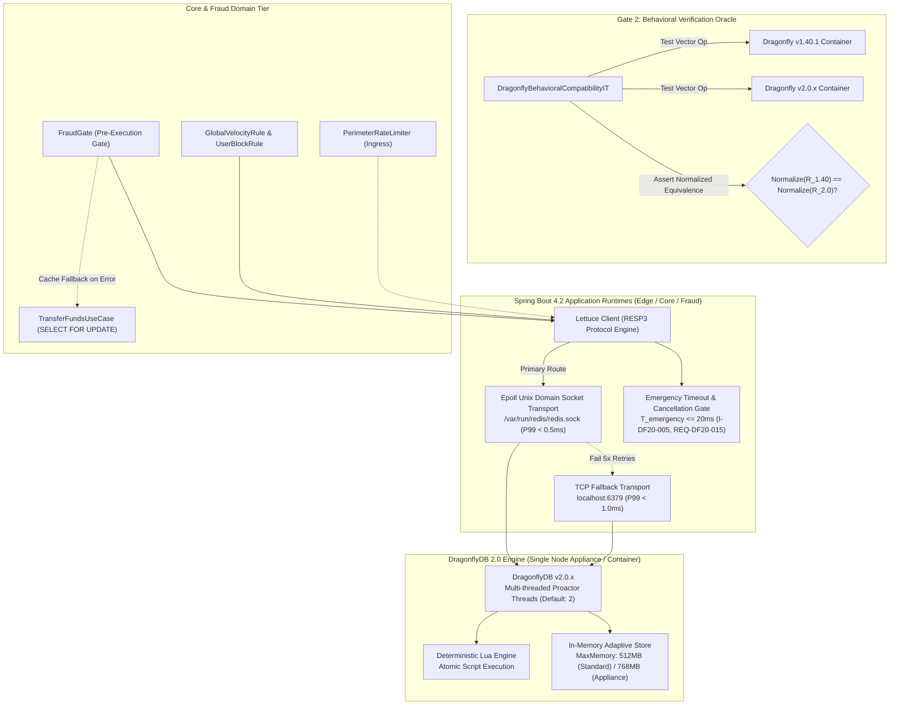

# 🏛️ System Architecture: ARCH-000.9.4 — DragonflyDB 2.0 Migration & Codebase State Audit

- **Status**: 🟢 **Ratified (Rev. 1 per History 69)**
- **Author**: Antigravity Platform Infrastructure & Distributed Systems Guild
- **Date**: 2026-09-22
- **Target Systems / Subprojects**: Distributed State, Ingress Rate Limiting & Anti-Fraud Caching (`:fraud`, `:edge`, `:core`, Appliance Stack)
- **Governing Specs**:
  - [`../SPEC-000.9.4-dragonfly-2.0-migration-and-codebase-audit.md`](file:///.spec/SPEC-000.9.4-dragonfly-2.0-migration-and-codebase-audit.md) (Dragonfly 2.0 Migration & Codebase-Wide State Audit)
  - [`../SPEC-000.9.3-hmac-signed-ingress-and-tenant-boundaries.md`](file:///.spec/SPEC-000.9.3-hmac-signed-ingress-and-tenant-boundaries.md) (Tenant Boundary & Canonical Encoding)
  - [`../SPEC-000.1-migrate-redis-to-dragonflydb.md`](file:///.spec/SPEC-000.1-migrate-redis-to-dragonflydb.md) (Initial Dragonfly UDS & RESP3 Baseline)
- **Source Reference**: [`.histories/history61.txt`](file:///.histories/history61.txt), [`.histories/history62.txt`](file:///.histories/history62.txt), [`.histories/history69.txt`](file:///.histories/history69.txt)

---

## 1. Executive Summary & Architectural Mantra

> *"Fast ephemeral state is a primary multiplier of system throughput, but only if its atomicity is provable, its keys are strictly tenant-isolated, and its degradation modes are structurally airgapped from ACID database transactions."*

DragonflyDB powers hot-path velocity counters, tenant risk profiles, sliding windows, and rate limiters. Simply bumping container tags from `1.40.1` to `2.0.x` ("blind upgrade") violates financial engineering principles due to potential changes in Lua atomicity, connection pooling, epoll UDS permissions, and TTL expiration semantics.

**ARCH-000.9.4** establishes:
1. **3 Migration Gates + Cross-Cutting DF20-AUDIT**:
   - **Gate 1 (Compatibility & Infrastructure)**: Lettuce client RESP3 protocol negotiation, epoll Unix Domain Socket (`/var/run/redis/redis.sock`) transport with TCP fallback (`6379`), and command set validation.
   - **Gate 2 (Behavioral Correctness & Oracle)**: Automated dual-version behavioral oracle (`DragonflyBehavioralCompatibilityIT`) asserting normalized semantic equivalence ($\text{Normalize}(\text{Result}_{1.40}) \equiv \text{Normalize}(\text{Result}_{2.0})$) across Lua scripts, continuous sliding windows, TTL expiry, and canonical tenant keys.
   - **Gate 3 (Performance & Non-Regression)**: Verification that Dragonfly 2.0 exhibits zero statistically significant regression in latency, throughput, or memory under production load, while measuring against vendor efficiency targets ($\ge 30\%$ memory reduction).
   - **Cross-Cutting `DF20-AUDIT` State Inventory**: Audits every state store across `:fraud`, `:edge`, and `:core`. Enforces multi-tenant key namespacing (`I-DF20-004`, `I-SEC-010`) and authority boundaries across all stores and scripts.
2. **Cache-Before-Transaction Ordering & Non-Blocking Resilience (`I-DF20-005`, `REQ-DF20-014`, `REQ-DF20-015`)**: All Dragonfly operations execute strictly *before* database transactions (`SELECT FOR UPDATE`). Bounded emergency timeouts ($T_{\text{emergency}} \le 20\text{ms}$) cancel in-flight cache operations without leaking threads or blocking database connections.
3. **Non-Authoritative Degradation (`I-DF20-006`)**: Dragonfly is non-authoritative ephemeral state; cache miss or eviction falls back to deterministic local rules and never bypasses fraud verification.

---

## 2. Macro Topology & State Transport Architecture



---

## 3. Mathematical & System Invariants

### `I-DF20-001` (Hot-Path Latency Envelope)
DragonflyDB operations on the authorization hot path under the V4 appliance profile MUST complete within component latency envelopes, bounded upstream by Fraud Gate SLA `I-FRAUD-002` ($P99 < 2.0\text{ms}$):
$$P99(\text{Dragonfly}_{\text{UDS}}) < 0.5\text{ms}, \quad P99(\text{Dragonfly}_{\text{TCP}}) < 1.0\text{ms}$$

### `I-DF20-002` (Non-Regression Against Baseline & Target Goals)
Vendor efficiency claims are benchmark targets, not dogmatic invariants. Dragonfly 2.0 MUST NOT exhibit statistically significant performance regression against 1.40 under identical production workloads:
$$\text{Latency}_{P99}(DF_{2.0}) \le \text{Latency}_{P99}(DF_{1.40}), \quad \text{Throughput}(DF_{2.0}) \ge \text{Throughput}(DF_{1.40}), \quad \text{Mem}(DF_{2.0}) \le \text{Mem}(DF_{1.40})$$
- *Optimization Targets*: $\text{Mem}(DF_{2.0}) \le 0.70 \times \text{Mem}(DF_{1.40})$, $\text{Throughput}(DF_{2.0}) \ge 1.30 \times \text{Throughput}(DF_{1.40})$.

### `I-DF20-003` (Atomic Continuous Sliding Window Consistency)
Velocity evaluations MUST execute atomically over sorted continuous timestamp sets without window skew:
$$\text{Count}(W, t) = |\{ \text{tx} \mid t - W < \text{occurredAt} \le t \}|, \quad \text{Amount}(W, t) = \sum_{t - W < \text{occurredAt}_i \le t} \text{amount}_i$$

### `I-DF20-004` (Canonical Tenant Key Namespacing)
Every tenant-scoped key written to or queried from DragonflyDB MUST include the canonical `tenantId` (`I-SEC-010`). Keys are explicitly partitioned:
$$\forall k \in \text{Keys}_{\text{tenant}}, \quad k \in \{\text{"fraud:velocity:"} + \tau + ":" + u, \quad \text{"risk_profile:"} + \tau + ":" + e + ":" + i\}, \quad \tau = \text{tenantId}$$
Global infrastructure keys (e.g. `system:version`) SHALL NOT require tenant scoping and are explicitly classified `GLOBAL`. Missing tenant context on tenant-scoped operations throws `TenantContextMissingException`.

### `I-DF20-005` (Emergency Timeout & Zero DB-Thread Blocking)
Cache degradation timeout is bounded ($T_{\text{emergency}} \le 20\text{ms}$). Cache operations MUST NEVER block inside database transaction threads:
$$\text{DBTxBlockedByCache} = 0, \quad \text{ThreadLeak}(\text{Fallback}) = 0$$

### `I-DF20-006` (Cache Degradation & Non-Authoritative Semantics)
DragonflyDB is strictly ephemeral and non-authoritative. A cache miss or evicted entry MUST degrade to deterministic rule evaluation and MUST NEVER be implicitly interpreted as an authorization to bypass fraud checks.

### `I-DF20-007` (Global Replay Key Uniqueness Contract)
Global replay protection keys (`fraud:op:{operationId}`) MUST use cryptographically random, globally unique UUID/ULID values (`I-SEC-006`). Global keys are strictly prohibited from holding tenant-specific business state without explicit namespacing.

---

## 4. `DF20-AUDIT`: Codebase State Access Inventory

The codebase-wide state audit classifies every access pattern into standardized quality tiers:
- **Grade A (Optimal)**: Atomic single-command or Lua execution, properly tenant-scoped, optimal latency.
- **Grade B (Improvable)**: Safe but improvable (e.g. sequential calls that can be batched or pipelined).
- **Grade C (Redundant)**: Duplicate lookups or unnecessary round-trips.
- **Grade D (Race-Prone)**: Non-atomic multi-step read-modify-write patterns.
- **Grade E (Incorrectly Scoped)**: Missing mandatory canonical `tenantId` in key namespace (`I-DF20-004`, `I-SEC-010`).
- **Grade F (Obsolete)**: Dead code or deprecated keys.

### Comprehensive Access Audit & Authority Map

| Store Component | Logical Key Pattern | Type / Atomicity | Authority | Current Grade | Audit Assessment & Refactoring Directive |
| :--- | :--- | :--- | :--- | :---: | :--- |
| **`RedisVelocityStore`** | `fraud:velocity:{userId}` | Sorted Set via Lua (`zadd NX`, `zremrangebyscore`, `zcard`, `pexpire`) | **Non-authoritative** | **E** | **Defect**: Missing tenant ID. **Action**: Refactor key pattern to `fraud:velocity:{tenantId}:{userId}`. |
| **`RedisRiskProfileStore`** | `risk_profile:USER:{id}` | Hash (`hset`, `hgetall`, `del`) | **Non-authoritative** | **E** | **Defect**: Missing tenant ID. **Action**: Refactor to `risk_profile:{tenantId}:USER:{id}`. Pipeline `HSET` + `EXPIRE` to reduce round trips (pipelining batches operations, does not guarantee read-modify-write atomicity). |
| **`RedisUserStore` / `AsyncUserCache`** | `user:{tenantId}:{userId}:blocked` | String / Boolean (`set`, `get`) with Caffeine L1 | **Non-authoritative** | **A** | **Optimal**: Fully tenant-scoped, negative caching TTLs, non-blocking fallback. |
| **`RedisScripts` (Legacy)** | `fraud:op:{opId}`, `user:{userId}:blocked` | Lua scripts (`REVIEW_COUNT_PROTECTED_SCRIPT`, `BLOCK_PROTECTED_SCRIPT`) | **Replay Guard / Non-authoritative** | **E** | **Defect**: Unscoped user keys cause cross-tenant collisions. **Action**: Update script signatures to accept tenant prefix `user:{tenantId}:{userId}:*`. Replay key `fraud:op:{opId}` confirmed globally unique UUID. |
| **`NewRecipientStore`** | `recipient:{userId}`, `sender:{userId}` | Set + Sorted Set via Lua | **Non-authoritative** | **E** | **Defect**: Missing tenant ID. **Action**: Refactor to `tenant:{tenantId}:recipient:{userId}`. |
| **Graph Hot State** | `user:{id}:graph_risk`, `user:{id}:temporal_risk` | String / Float (`SET`, `GET`) | **Non-authoritative** | **E** | **Defect**: Missing tenant ID. **Action**: Standardize to `risk:{tenantId}:user:{id}:graph_risk`. |
| **`PerimeterRateLimiter`** | In-Memory Token Bucket | Memory (Local) | **Non-authoritative** | **B** | **Future**: Retain local token bucket as primary; specify distributed Dragonfly token bucket fallback for multi-node Edge deployments (`REQ-DF20-010`). |
| **Ledger & Balances** | `accounts`, `ledger` | PostgreSQL ACID (`SELECT FOR UPDATE`) | **Authoritative (Source of Truth)** | **A** | Zero cache dependency for balance state; strictly governed by `I-LEDGER-001`. |

---

## 5. The 3 Verification Gates & Promotion Protocol

### Gate 1: Compatibility & Infrastructure
1. **Container Image**: Upgrade `docker-compose.yaml`, `docker-compose.appliance.yaml`, and test fixtures to `docker.dragonflydb.io/dragonflydb/dragonfly:v2.0.x`.
2. **Lettuce Client Protocol**: Verify RESP3 negotiation (`ProtocolVersion.RESP3`). Validate command parsing across all audited command types.
3. **Transport Resilience**: Maintain epoll Unix Domain Socket (`/var/run/redis/redis.sock`) as primary transport, with 5-attempt retry and seamless TCP fallback to port 6379.

### Gate 2: Behavioral Correctness & Dual-Version Oracle
`DragonflyBehavioralCompatibilityIT` runs identical operations concurrently across Dragonfly 1.40.1 and 2.0.x containers:
1. **Lua Script Parity**: Verify normalized semantic equivalence ($\text{Normalize}(R_{1.40}) \equiv \text{Normalize}(R_{2.0})$) for `RedisVelocityStore` and `RedisScripts`.
2. **Sliding Window Math**: Assert identical window eviction, item counting, and cardinality under continuous temporal boundaries:
   $$t - W \implies \text{excluded}, \quad t - W + \epsilon \implies \text{included}, \quad t \implies \text{included}, \quad t + \epsilon \implies \text{excluded}$$
3. **TTL Expiration vs. Eviction**: Keys with second and millisecond TTLs expire deterministically; memory eviction falls back safely to deterministic rules (`I-DF20-006`).
4. **Tenant Scoping Enforcement**: Verify that attempts to persist tenant-scoped state without canonical `tenantId` throw `TenantContextMissingException`.

### Gate 3: Performance & Non-Regression Benchmark
Benchmark harness runs concurrent workloads simulating peak authorization traffic (10,000 req/sec over 16 virtual threads):
- Assert $P99(\text{UDS}) < 0.5\text{ms}$ and $P99(\text{TCP}) < 1.0\text{ms}$ (`I-DF20-001`).
- Assert zero statistically significant performance regression against 1.40 baseline (`I-DF20-002`).
- Track progress against optimization targets ($\ge 30\%$ throughput increase, $\ge 30\%$ memory reduction).

### Gate Promotion Rule
$$\text{PROMOTION} \iff \text{Gate 1} = \text{PASS} \land \text{Gate 2} = \text{PASS} \land \text{Gate 3} = \text{PASS}$$

---

## 6. Failure Domains & Non-Blocking Transaction Boundary

```mermaid
sequenceDiagram
    autonumber
    participant Client as API Client / Edge
    participant Gate as FraudGate (Pre-Execution)
    participant Cache as DragonflyDB 2.0 (UDS)
    participant Core as Use Case (TransferFundsUseCase)
    participant DB as PostgreSQL 18 (SELECT FOR UPDATE)

    Note over Client,Cache: Stage 1: Pre-Execution Gate (Strictly Out of DB Tx - REQ-DF20-014)
    Client->>Gate: evaluateAuthorization(tenantId, userId, amount)
    Gate->>Cache: Query Velocity & Risk Profile (T_emergency <= 20ms)
    alt Cache Responds < 0.5ms
        Cache-->>Gate: Risk Profile & Velocity OK
    else Cache Timeout or Unreachable (> 20ms)
        Gate-->>Cache: Cancel In-Flight Operation (REQ-DF20-015)
        Gate-->>Gate: Fallback to Local Caffeine / Deterministic Rules (I-DF20-006)
        Note over Gate: I-DF20-005: Zero DB Tx Threads Blocked
    end

    Note over Core,DB: Stage 2: Core ACID Transaction (Zero Cache I/O)
    Gate->>Core: Proceed to Execution
    Core->>DB: BEGIN TX; SELECT ... FOR UPDATE accounts
    Core->>DB: INSERT INTO ledger ... UPDATE accounts
    Core->>DB: COMMIT TX
    Core-->>Client: 200 OK (Transfer Success)
```

1. **Strict Cache-Before-Transaction Ordering (`REQ-DF20-014`)**: Cache operations MUST complete *before* acquiring database transaction locks. No Dragonfly I/O may occur inside the DB transaction.
2. **In-Flight Cancellation Boundedness (`REQ-DF20-015`)**: If Dragonfly operations exceed $20\text{ms}$, the request aborts the cache lookup and cancels in-flight operations without thread leaks.
3. **Pipelining vs. Atomicity Contract (`REQ-DF20-008`)**: Pipelining is strictly a network batching optimization. True read-modify-write atomicity is achieved exclusively via single commands or Lua scripts.
