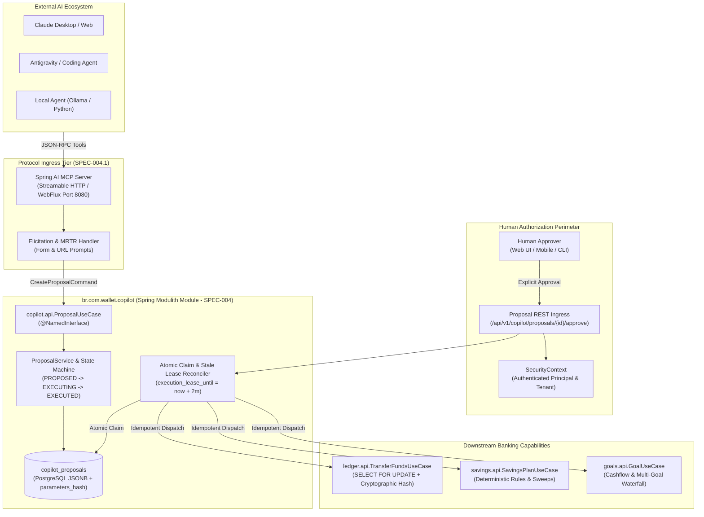

# 🏛️ System Architecture: ARCH-004 — AI Financial Copilot & MCP Gateway Platform Topology

- **Status**: 🟢 **Ratified**
- **Author**: Antigravity Architecture Team & Financial Platform Guild
- **Date**: 2026-10-08
- **Target Systems / Subprojects**: `br.com.wallet.copilot`, Spring AI MCP Edge, Root Monolith Modulith Packaging
- **Governing Specs**:
  - [`../SPEC-004-ai-financial-copilot-and-proposal-domain.md`](file:///.spec/SPEC-004-ai-financial-copilot-and-proposal-domain.md) (Proposal Domain & Lifecycle)
  - [`../SPEC-004.1-mcp-gateway-and-human-interaction.md`](file:///.spec/SPEC-004.1-mcp-gateway-and-human-interaction.md) (MCP Gateway & Interaction)
  - [`../plans/PLAN-004-ai-financial-copilot-and-proposal-domain.md`](file:///.spec/plans/PLAN-004-ai-financial-copilot-and-proposal-domain.md) (Modulith Architecture Plan)

---

## 1. Executive Summary & Architectural Mantra

> *"AI proposes, humans authorize, and domain use cases execute. The AI Financial Copilot and MCP Gateway act strictly as an asynchronous orchestrator and protocol adapter that never bypasses the human authorization gate, never mutates the ledger directly, and guarantees single-boundary financial execution via atomic claim leases and stable execution identities."*

`ARCH-004` establishes the macro-topology and failure boundaries for Phase 4. It isolates external AI interactions, agent tool schemas, and MCP transport semantics from core financial accounting. By introducing `FinancialProposal` as a first-class domain primitive with atomic execution leases and creation idempotency, the platform guarantees that agent-driven interactions cannot produce duplicate disbursements, race conditions, or unverified ledger state mutations.

---

## 2. Macro Topology & System Boundary



---

## 3. Detailed Subsystem Specifications

### 3.1 Subsystem A: Spring AI MCP Edge Gateway (`SPEC-004.1`)
- **Protocol & Transport**: Streamable HTTP on reactive WebFlux replacing legacy SSE; optional server-sent events for long-running streaming. Conforms to Spring Boot 4.2.0-M2 baseline.
- **Tool Segregation**: Read tools query downstream APIs directly via non-locking reads. Mutation tools generate a `FinancialProposal` with status `PROPOSED`.
- **Elicitation Fabric**: Supports interactive `Form Elicitation` for proposal confirmation and `URL Elicitation` for sensitive out-of-band flows (`I-MCP-003`). Lacking elicitation in clients never triggers auto-execution (`I-MCP-002`).

### 3.2 Subsystem B: Financial Proposal Domain & Lifecycle (`SPEC-004`)
- **Persistent State Machine**:
  $$\text{PROPOSED} \xrightarrow[\text{TTL valid}]{\text{atomic claim}} \text{EXECUTING} \xrightarrow[\text{downstream ok}]{\text{synchronous}} \text{EXECUTED}$$
  Terminal rejection/failure branches: `REJECTED`, `EXPIRED`, `INVALIDATED`.
- **Snapshot Immutability**: `parameters_json` frozen with `parameters_hash` (SHA-256). Creation is idempotent on `(tenant_id, idempotency_key)`; payload conflicts yield HTTP 409 (`I-AI-008`).

### 3.3 Subsystem C: Atomic Lease & Crash Recovery Engine
- **Atomic Claim with Lease**:
  ```sql
  UPDATE copilot_proposals 
  SET status = 'EXECUTING', approved_by = :principal, approved_at = :now,
      execution_claimed_at = :now, execution_lease_until = :now + INTERVAL '2 minutes'
  WHERE id = :id AND tenant_id = :tenantId AND status = 'PROPOSED' AND expires_at >= :now;
  ```
- **Crash Recovery**: If the node crashes during downstream execution, the proposal remains in `EXECUTING` until `now > execution_lease_until`. Retried approval or recovery workers consult downstream with the immutable `executionOperationId`. If already completed downstream, status updates to `EXECUTED`; otherwise, it safely re-executes (`I-AI-010`).

### 3.4 Subsystem D: Downstream Bridge & Idempotency Boundary
- Downstream use cases (`TransferFundsUseCase`, `SavingsPlanUseCase`, `GoalUseCase`) execute inside their authoritative transaction boundaries.
- Copilot enforces coarse eligibility, but double-entry accounting, balance consistency, and row locking are owned strictly by downstream domains (`I-AI-009`).

---

## 4. Failure Modes, Resilience & Disaster Recovery

| Failure Scenario | Detection Mechanism | Immediate System Impact | Automated Recovery / Mitigation |
| :--- | :--- | :--- | :--- |
| **Node Crash during Execution** | Proposal remains `EXECUTING` past lease expiration | Approval thread dies before recording `EXECUTED` | Recovery reconciles downstream via stable `executionOperationId`; marks `EXECUTED` or re-dispatches. |
| **Duplicate Agent Tool Retry** | Key collision on `(tenant_id, idempotency_key)` | Agent resends proposal prompt upon network timeout | Returns existing proposal if `parameters_hash` matches; rejects with 409 if payload diverged. |
| **TTL Expired before Approval** | Synchronous check `now > expires_at` on approval | User approves proposal after 15 minutes TTL | Synchronously rejects with HTTP 409 / `ProposalExpiredException`; transitions proposal to `EXPIRED`. |
| **Business Precondition Breach** | Downstream rejects (e.g. `InsufficientBalanceException`) | Account balance changed between proposal and approval | Proposal transitions to `INVALIDATED` and records reason. No ledger mutation occurs. |
| **Technical Downstream Outage** | JDBC timeout or connection pool exhaustion | Downstream use case fails transiently | Proposal claim reverts to retryable state; remains NOT `INVALIDATED` (`I-AI-010`). |
| **Cross-Tenant Probe** | SecurityContext tenant $\ne$ proposal tenant | Malicious or buggy cross-tenant ID access | Controller returns HTTP 404 Not Found to prevent resource existence enumeration (`I-AI-004`). |

---

## 5. Deployment Topology & Scaling Matrix

| Deployment Tier | Infrastructure Target | MCP Transport | Proposal Persistence | Downstream Dispatch | High Availability |
| :--- | :--- | :--- | :--- | :--- | :--- |
| **Tier 0 (Dev)** | Docker Compose | Local WebFlux Port 8080 | PostgreSQL 18 Local | In-Process Spring Modulith | Single Instance |
| **Tier 1 (Small)** | Bare-Metal Kubernetes | Streamable HTTP Ingress | PostgreSQL Primary + Replica | In-Process Spring Modulith | 2 Replicas, Lease-Protected |
| **Tier 2 (Enterprise)** | RKE2 / Rancher Managed | Alt-Svc Ingress / Envoy Gateway | HA PostgreSQL Cluster (Patroni) | In-Process Modulith + Registry | 3+ Pods, OTel Baggage Trace |
| **Tier 3 (Multi-Tenant)** | vCluster per Tenant | Dedicated Tenant Ingress | Schema/Row Isolated Postgres | Tenant SecurityContext Enforced | Asymmetric Tenant Pods |

---

## 6. Authoritative Invariants Registry

| Invariant ID | Name | Formal Rule Statement | Enforcement Layer |
| :--- | :--- | :--- | :--- |
| **`I-AI-001`** | **Human Authorization Gate** | $\text{ClaimExecution}(p) \iff \text{HumanApprove}(p.\text{id}) \land \text{Status} = \text{PROPOSED} \land \text{now}() \le p.\text{expiresAt}$; recovery reuses claim authorization. | `ProposalService` |
| **`I-AI-002`** | **Critical Path Isolation** | Core banking transaction SLAs must not depend on AI inference or MCP transport latency. | Architecture Boundary |
| **`I-AI-003`** | **Modulith Encapsulation** | Copilot consumes downstream strictly through published `.api` packages. Direct DAO access forbidden. | `ApplicationModules.verify()` |
| **`I-AI-004`** | **Tenant Non-Disclosure** | Cross-tenant access attempts MUST return HTTP 404 Not Found to prevent resource existence enumeration. | `ProposalController` |
| **`I-AI-005`** | **Atomic Claim Lease** | Only one approval request may claim execution ownership. Expired proposals transition to `EXPIRED`. | `ProposalDao` Conditional SQL |
| **`I-AI-006`** | **Execution Idempotency** | Stable `executionOperationId` reused across retries. Downstream use cases enforce idempotency. | `DownstreamBridge` |
| **`I-AI-007`** | **Snapshot Immutability** | Parameters recorded at creation are frozen with SHA-256 `parameters_hash`. Tampering rejected. | `ProposalDao` |
| **`I-AI-008`** | **Creation Idempotency** | Duplicate `(tenantId, idempotencyKey)` returns existing proposal; conflicting payload yields 409. | `ProposalDao` Unique Constraint |
| **`I-AI-009`** | **Financial Ownership** | Copilot never reimplements balance math or double-entry accounting; owned by downstream. | Domain Boundary |
| **`I-AI-010`** | **Failure Segregation** | Precondition failures $\to$ `INVALIDATED`. Infrastructure timeouts remain retryable under lease. | `DownstreamBridge` |
| **`I-MCP-001`** | **Adapter Isolation** | MCP transport is strictly an external edge adapter. Domain types must not depend on MCP. | Module Packaging |
| **`I-MCP-002`** | **Elicitation Non-Bypass**| Inability of client to process elicitation yields external review; NEVER triggers auto-execution. | `McpGateway` |
