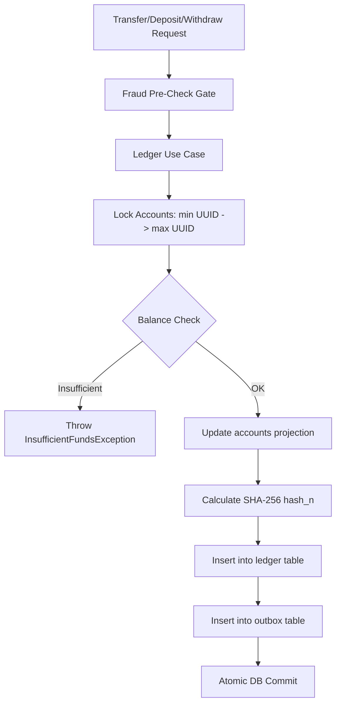

# 📐 Architecture Plan: PLAN-000.01 — Core Transactional Ledger & Double-Entry Engine

- **Associated Spec**: [`../SPEC-000.01-core-transactional-ledger-and-double-entry.md`](file:///.spec/SPEC-000.01-core-transactional-ledger-and-double-entry.md)
- **Status**: 🟢 **Implemented & Verified (Reverse-Engineered)**
- **Author**: Antigravity Financial Architecture Team

---

## 1. Technical Strategy & Architecture Overview

The Core Ledger module (`br.com.wallet.ledger`) implements a **CQRS-inspired double-entry bookkeeping architecture**:
- **Write Model**: Append-only `ledger` entries with cryptographic SHA-256 hash chains.
- **Read / Projection Model**: `accounts` table storing current projected balance, row version, and lifecycle status.
- **Audit & Reconstruction**: Direct query of historical entries via `ledger` table with client-driven replay verification.



---

## 2. Spring Modulith Module Topology

```text
br.com.wallet.ledger
├── api (Published Interface)
│   ├── BalanceUseCase.java
│   ├── CreateWalletUseCase.java
│   ├── DepositFundsUseCase.java
│   ├── WithdrawFundsUseCase.java
│   ├── TransferFundsUseCase.java
│   ├── ValidateLedgerUseCase.java
│   ├── ReplayWalletUseCase.java
│   ├── AccountUseCase.java
│   └── domain (Account, LedgerEntry, LedgerType, OperationStatus)
└── internal (Encapsulated)
    ├── service (TransferFundsService, DepositFundsService, WithdrawFundsService, BalanceService)
    ├── persistence (AccountDao, LedgerDao, WalletOperationsDao, OutboxDao)
    └── utils (HashUtil, Validations)
```

---

## 3. Storage Model & Schemas

### 3.1 `accounts` Table (Fast Projection)
```sql
CREATE TABLE IF NOT EXISTS accounts (
    id UUID PRIMARY KEY,
    balance NUMERIC(19, 4) NOT NULL CHECK (balance >= 0),
    version BIGINT NOT NULL DEFAULT 0,
    user_id UUID NOT NULL,
    status VARCHAR(20) NOT NULL DEFAULT 'ACTIVE',
    blocked_reason TEXT,
    created_at TIMESTAMP WITH TIME ZONE DEFAULT CURRENT_TIMESTAMP,
    updated_at TIMESTAMP WITH TIME ZONE DEFAULT CURRENT_TIMESTAMP
);
```

### 3.2 `ledger` Table (Append-Only Cryptographic Log)
```sql
CREATE TABLE IF NOT EXISTS ledger (
    id UUID PRIMARY KEY,
    wallet_id UUID NOT NULL REFERENCES accounts(id),
    amount NUMERIC(19, 4) NOT NULL CHECK (amount > 0),
    type VARCHAR(20) NOT NULL CHECK (type IN ('CREDIT', 'DEBIT')),
    operation_id UUID NOT NULL,
    sequence BIGINT NOT NULL,
    previous_hash VARCHAR(64) NOT NULL,
    hash VARCHAR(64) NOT NULL,
    created_at TIMESTAMP WITH TIME ZONE DEFAULT CURRENT_TIMESTAMP,
    CONSTRAINT uq_wallet_sequence UNIQUE (wallet_id, sequence)
);
```

---

## 4. Concurrency & Deadlock Prevention Strategy

Multi-party transfers between `from` and `to` acquire row locks using `SELECT FOR UPDATE` strictly ordered by UUID:
```java
final var ordered = Stream.of(transfer.from(), transfer.to())
        .sorted()
        .toList();
final var accountBalances = accountDao.getBalancesFromWallets(ordered);
```
Since every transaction acquires locks in the same global order ($\min(\text{UUID}_A, \text{UUID}_B) \to \max(\text{UUID}_A, \text{UUID}_B)$), circular wait is mathematically impossible, eliminating deadlocks.
