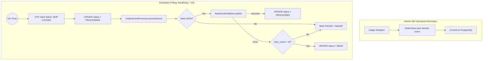

# 📐 Architecture Plan: PLAN-000.02 — Transactional Outbox Pattern & Event Streaming

- **Associated Spec**: [`../SPEC-000.02-transactional-outbox-and-event-streaming.md`](file:///.spec/SPEC-000.02-transactional-outbox-and-event-streaming.md)
- **Status**: 🟢 **Implemented & Verified (Reverse-Engineered)**
- **Author**: Antigravity Messaging & Reliability Engineering Team

---

## 1. Technical Strategy & Architecture Overview

The Transactional Outbox module ensures **zero dual-write data loss** between the relational database and NATS JetStream:
- **Write Path**: Core use cases persist the domain event directly into `outbox` within the existing `@Transactional` boundary.
- **Relay Worker**: Background scheduled runner (`OutboxRelay`) claims batches using a non-blocking PostgreSQL CTE with `SKIP LOCKED`.
- **Publisher**: `OutboxEventProcessor` delegates to `NatsEventPublisher`, injecting `Nats-Msg-Id` headers for server-side deduplication.



---

## 2. Component Topology

```text
br.com.wallet.ledger.internal.outbox
├── OutboxEvent.java                (Record: id, eventType, payload, retryCount, aggregateId, aggregateType, partitionKey)
├── OutboxStatus.java               (Enum: PENDING, FAILED, PROCESSING, PROCESSED, DEAD)
├── OutboxRelay.java                (Scheduled background runner with fixed delay 10s)
└── OutboxEventProcessor.java       (Event handler with retry calculation and status transitions)

br.com.wallet.ledger.internal.persistence
└── OutboxDao.java                  (JdbcTemplate queries for save, claimBatch, markAsProcessed, markFailed, markAsDead)

br.com.wallet.infrastructure.messaging.publisher
└── NatsEventPublisher.java         (JetStream publisher with Nats-Msg-Id deduplication)
```

---

## 3. Storage Model: `outbox` Table

```sql
CREATE TABLE IF NOT EXISTS outbox (
    id UUID PRIMARY KEY,
    aggregate_type VARCHAR(255) NOT NULL,
    aggregate_id UUID NOT NULL,
    event_type VARCHAR(255) NOT NULL,
    payload JSONB NOT NULL,
    partition_key UUID,
    status VARCHAR(50) NOT NULL DEFAULT 'PENDING',
    retry_count INT NOT NULL DEFAULT 0,
    next_retry_at TIMESTAMP WITH TIME ZONE,
    processed_at TIMESTAMP WITH TIME ZONE,
    created_at TIMESTAMP WITH TIME ZONE NOT NULL DEFAULT CURRENT_TIMESTAMP
);

CREATE INDEX IF NOT EXISTS idx_outbox_claim 
ON outbox (created_at) 
WHERE status IN ('PENDING', 'FAILED');
```

---

## 4. Batch Claiming & Concurrency Safety

Batch claiming uses a single round-trip atomic CTE preventing race conditions among multiple relay instances:
```sql
WITH claimed AS (
    SELECT id
    FROM outbox
    WHERE status IN ('PENDING', 'FAILED')
      AND (next_retry_at IS NULL OR next_retry_at <= ?)
    ORDER BY created_at
    LIMIT ?
    FOR UPDATE SKIP LOCKED
)
UPDATE outbox o
SET status = 'PROCESSING'
FROM claimed
WHERE o.id = claimed.id
RETURNING o.id, o.event_type, o.payload, o.retry_count, o.aggregate_id, o.aggregate_type, o.partition_key;
```

---

## 5. NATS Deduplication Protocol

Every domain event is published to subject `eventType.getSubject()` with `expectedStream("events")` and message header:
```text
Nats-Msg-Id: <eventType.name()>-<aggregateId>
```
If NATS JetStream receives a duplicate message within its configured deduplication window, it responds with an acknowledgement indicating deduplication without storing or propagating duplicate messages.
