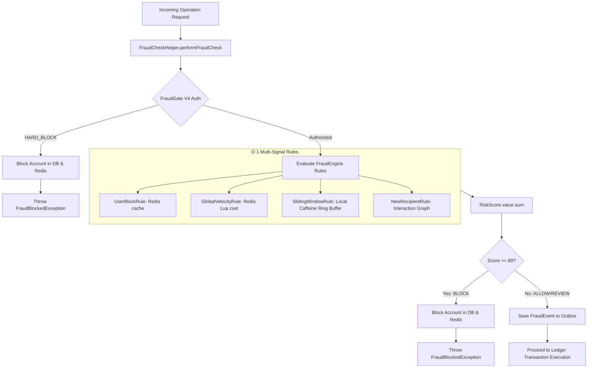

# 📐 Architecture Plan: PLAN-000.03 — Deterministic Anti-Fraud Pre-Execution Gate & Velocity Rules

- **Associated Spec**: [`../SPEC-000.03-deterministic-anti-fraud-and-velocity-rules.md`](file:///.spec/SPEC-000.03-deterministic-anti-fraud-and-velocity-rules.md)
- **Status**: 🟢 **Implemented & Verified (Reverse-Engineered)**
- **Author**: Antigravity Anti-Fraud & Risk Engineering Team

---

## 1. Technical Strategy & Architecture Overview

The Deterministic Anti-Fraud Engine acts as a **strict pre-execution gate** guarding core banking operations:
- **Zero Ledger Mutation**: Fraud evaluation takes place prior to transaction establishment and database lock acquisition.
- **Two-Tier Architecture**:
  1. **Fraud Gate V4**: Rapid hot cache authorization ($P99 < 2\text{ms}$) against materialized risk profiles in DragonflyDB.
  2. **Rule Engine (`FraudEngine`)**: Multi-rule evaluator aggregating real-time velocity, local sliding window volume, user block status, and recipient interaction topology.
- **Fail-Closed Account Blocking**: Any `BLOCK` / `HARD_BLOCK` decision immediately locks the user account in both PostgreSQL (`accounts.status = 'BLOCKED'`) and DragonflyDB (`RedisUserStore.setBlocked(userId, true)`).



---

## 2. Component Topology

```text
br.com.wallet.ledger.api.guard
└── FraudCheckHelper.java             (Pre-execution orchestrator; bridges ledger domain and fraud engine)

br.com.wallet.fraud
├── application
│   └── FraudService.java             (Application facade for fraud checks and dual-store blocking)
├── domain
│   ├── FraudEngine.java              (Iterates active rules and aggregates scores)
│   ├── FraudRule.java                (SPI interface for individual rule evaluation)
│   ├── FraudDecision.java            (Enum: ALLOW, REVIEW, BLOCK)
│   ├── RiskScore.java                (Accumulator with deterministic threshold boundaries)
│   ├── SlidingAmountWindow.java      (Thread-safe O 1 ring buffer with LongAdder running total)
│   └── VelocityResult.java           (Sealed interface: Ok, Exceeded, Replay)
├── rules
│   ├── UserBlockRule.java            (Checks blocked flag in cache: +30)
│   ├── GlobalVelocityRule.java       (Redis sliding window: > 10 tx in 30s -> +30)
│   ├── SlidingWindowRule.java        (Local sliding amount: > 10,000.00 -> +10)
│   └── NewRecipientRule.java         (Graph topological analysis: Ring +50, Mule +20, FanOut +15)
└── infrastructure
    ├── RedisUserStore.java           (Asymmetric TTL cache: 10m blocked, 30s active)
    ├── RedisVelocityStore.java       (Atomic Lua script running on DragonflyDB / Redis)
    └── LocalStateStore.java          (Caffeine cache housing SlidingAmountWindow per user)
```

---

## 3. Storage & State Model

### 3.1 PostgreSQL Persistent Account Status (`accounts`)
```sql
ALTER TABLE accounts ADD COLUMN IF NOT EXISTS status VARCHAR(20) NOT NULL DEFAULT 'ACTIVE';
ALTER TABLE accounts ADD COLUMN IF NOT EXISTS blocked_reason TEXT;
```

### 3.2 Redis / DragonflyDB Ephemeral Structures
1. **`user:{userId}:blocked`**: String key (`"true"` / `"false"`), TTL 10m when blocked, 30s when active.
2. **`user:{userId}:tx_window`**: Sorted Set containing timestamps as score, `operationId` as member.

---

## 4. Atomic Lua Velocity Evaluation Script

```lua
-- KEYS[1] = user:{userId}:tx_window
-- ARGV[1] = now (ms), ARGV[2] = window (ms), ARGV[3] = operationId, ARGV[4] = threshold

-- 1. Check idempotency / replay
local added = redis.call("zadd", KEYS[1], "NX", ARGV[1], ARGV[3])
if added == 0 then
    return {-1, redis.call("zcard", KEYS[1])} -- Replay detected: 0 score impact
end

-- 2. Prune obsolete events
local min = 0
local max = ARGV[1] - ARGV[2]
redis.call("zremrangebyscore", KEYS[1], min, max)

-- 3. Calculate sliding count & enforce memory safety
local count = redis.call("zcard", KEYS[1])
if redis.call("ttl", KEYS[1]) == -1 then
    redis.call("pexpire", KEYS[1], ARGV[2])
end

-- 4. Check threshold
if count > tonumber(ARGV[4]) then
    return {1, count} -- Exceeded (+30 points)
end
return {0, count}     -- Ok (0 points)
```
