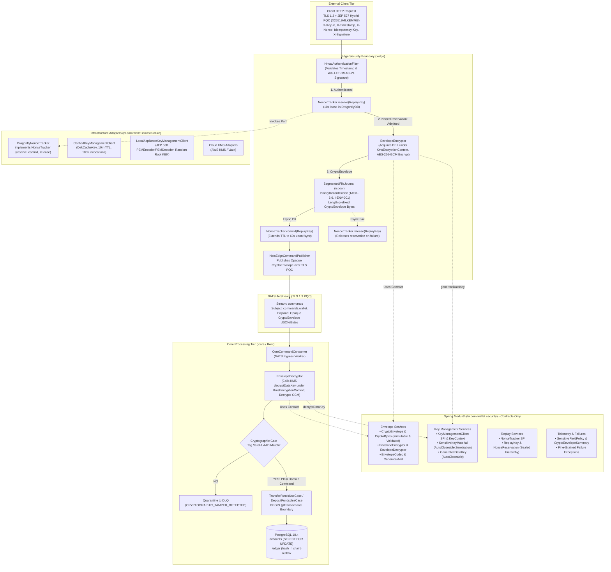

# 📐 Architecture Plan: PLAN-000.10 — Financial Security & Payload Cryptographic Protection

- **Associated Spec**: [`../SPEC-000.10-financial-security.md`](file:///.spec/SPEC-000.10-financial-security.md)
- **Governing Architecture**: [`../architecture/ARCH-000.10-financial-security.md`](file:///.spec/architecture/ARCH-000.10-financial-security.md)
- **Status**: 🟡 **Architecture Review Passed — Rev. 2.2 (Aligned with Histories 71-74 & JDK 27 PQC Review)**
- **Author**: Antigravity Platform Security & Financial Systems Guild
- **Date**: 2026-09-29
- **Target Modules**: Spring Modulith Security (`br.com.wallet.security`), Reactive Edge Gateway (`:edge`), Core Domain (`:core`), and Infrastructure (`br.com.wallet.infrastructure`)
- **Governing Skills**:
  - [`financial-cryptographic-security`](file:///.agents/skills/financial-cryptographic-security/SKILL.md) (Envelope Encryption, Key Lifecycle, AEAD & Modulith Isolation)
  - [`perimeter-security`](file:///.agents/skills/perimeter-security/SKILL.md) (Perimeter HMAC Ingress & Tenant Boundaries)
  - [`capability-driven-development`](file:///.agents/skills/capability-driven-development/SKILL.md) (Modulith Capabilities & Lifecycle)
  - [`spec-driven-development`](file:///.agents/skills/spec-driven-development/SKILL.md) (Spec Kit Orchestrator)

---

## 1. Technical Strategy & Component Architecture

`PLAN-000.10` enforces payload cryptographic protection, zero plaintext at rest in Edge journals, two-phase replay nonce reservation, and pre-transaction decryption gating. Security contracts reside in `br.com.wallet.security`, while technology adapters reside in `br.com.wallet.infrastructure`:



---

## 2. Cross-Feature & Invariant Impact Matrix (`I-SDD-005`)

| Participating Module | Affected Flow / Contract | Potential Side Effect / Failure Mode | Invariant / Mitigation |
| :--- | :--- | :--- | :--- |
| **`:edge` (Journal)** | `SegmentedFileJournal` flush | Plaintext leakage during crash dumps | `I-ENV-001` (BinaryRecordCodec persists serialized `CryptoEnvelope` bytes; zero plaintext on disk; `TASK-6.6`). |
| **`:edge` (Ingress)** | `HmacAuthenticationFilter` pipeline | Transient KMS/Journal error causes permanent 401 | `I-ENV-004` (Two-phase replay reservation: `reserve()` $\to$ `commit()` / `release()`). |
| **`:edge` (Performance)**| Ingress admission hot path | KMS latency degrading throughput | `REQ-SEC-026` / `I-ENV-005` (Bounded plaintext DEK cache with 10m TTL, 100k invocations, benchmark targets across 256B to 64KB). |
| **`:core` (Consumer)**| `CoreCommandConsumer` loop | Decryption or KMS latency holding database locks | `I-ENV-003` (Decrypt payload strictly *prior* to `BEGIN TRANSACTION`; zero external I/O while holding DB locks). |
| **`ledger`** (Core) | `TransferFundsUseCase` / DAOs | Accidental architectural coupling to crypto libraries | `I-SEC-014` (`br.com.wallet.ledger` has zero imports or dependencies on `br.com.wallet.security`). |
| **`infrastructure`** | Dragonfly cluster interaction | Connection timeout causing silent replay admission | `I-ENV-004` (Fails closed with `NonceReservation.Unavailable` $\to$ HTTP 503). |
| **Observability** | OpenTelemetry spans & logs | Accidental PII/account leaks in spans or exception traces | `I-SEC-012` (Non-emission first; `CryptoEnvelopeSummary`). |

---

## 3. Dual Boundary Architecture & Modulith Packaging

### 3.1 Dual Boundary Enforcement (`I-SEC-013`, `I-SEC-014`, `I-SEC-015`)
1. **Layer 1: Gradle Build Dependencies**:
   - `:ledger` CANNOT depend on `:security`.
   - `:security` CANNOT depend on `:edge`, `:core`, `:ledger`, or `:fraud`.
   - `:edge` and `:core` depend on `:security` contracts only.
   - Technology adapters (`DragonflyNonceTracker`, `CachedKeyManagementClient`, `LocalApplianceKeyManagementClient`, Cloud KMS) reside in `:infrastructure`.
   - `InMemoryKeyManagementClient` resides strictly in `src/test/java` (test-scoped).
2. **Layer 2: Spring Modulith Verification**:
   - `br.com.wallet.security` is annotated with `@ApplicationModule(displayName = "Financial Security")`.
   - Verified via `ApplicationModules.of(WalletApplication.class).verify()`.

### 3.2 Package Hierarchy

```text
br.com.wallet.security (Pure Contracts & Engines)
├── package-info.java                   (@ApplicationModule(displayName = "Financial Security"))
├── envelope/
│   ├── CryptoEnvelope.java             (Public immutable record with strict structural validation)
│   ├── CryptoBytes.java                (Immutable byte[] wrapper with defensive copying)
│   ├── EnvelopeEncryptor.java          (Public encryption interface for Edge)
│   ├── EnvelopeDecryptor.java          (Public decryption interface for Core)
│   ├── EnvelopeCodec.java              (Public binary/JSON serialization contract)
│   ├── CanonicalAad.java               (Length-prefixed binary AAD builder)
│   └── internal/
│       ├── AesGcmEnvelopeEncryptor.java
│       └── AesGcmEnvelopeDecryptor.java
├── keymanagement/
│   ├── KeyManagementClient.java        (Public SPI)
│   ├── GeneratedDataKey.java           (AutoCloseable record holding SensitiveKeyMaterial & wrapped DEK)
│   ├── SensitiveKeyMaterial.java       (AutoCloseable key material with memory zeroization)
│   └── KeyContext.java                 (Typed KMS Encryption Context value object)
├── replay/
│   ├── NonceTracker.java               (Public SPI with reserve, commit, release)
│   ├── ReplayKey.java                  (Value object: tenantId, principalId, nonce)
│   └── NonceReservation.java           (Sealed hierarchy: Admitted, Rejected, Unavailable)
├── telemetry/
│   ├── SensitiveFieldPolicy.java       (Public SPI)
│   ├── CryptoEnvelopeSummary.java      (Safe diagnostic record)
│   └── internal/
│       └── TelemetrySanitizer.java     (Scrubbing utilities)
└── failure/
    ├── CryptographicIntegrityException.java
    ├── KeyManagementUnavailableException.java
    ├── ReplayDetectedException.java
    ├── MalformedEnvelopeException.java
    └── SecurityFailureCategory.java

br.com.wallet.infrastructure.security (Technology Adapters)
├── replay/
│   └── DragonflyNonceTracker.java      (Implements NonceTracker via atomic Redis ops)
└── keymanagement/
    ├── CachedKeyManagementClient.java  (Bounded plaintext DEK cache: 10m TTL, 100k uses)
    ├── LocalApplianceKeyManagementClient.java (JEP 538 PEMEncoder/PEMDecoder, Random Root KEK)
    └── adapters/                       (AwsKmsClient, VaultKmsClient)

src/test/java (Test Support Only)
└── br.com.wallet.security.testsupport/
    └── InMemoryKeyManagementClient.java(Deterministic test KMS)
```

---

## 4. Interface Contracts & Component Specifications

### 4.1 Immutable Binary Value (`CryptoBytes`) (`I-SEC-016`)

```java
package br.com.wallet.security.envelope;

public record CryptoBytes(byte[] value) {
    public CryptoBytes {
        Objects.requireNonNull(value, "value must not be null");
        value = value.clone();
    }

    @Override
    public byte[] value() {
        return value.clone();
    }

    public int length() {
        return value.length;
    }
}
```

### 4.2 Strongly Validated `CryptoEnvelope` (`REQ-SEC-020`)

```java
package br.com.wallet.security.envelope;

public record CryptoEnvelope(
    EnvelopeVersion version,           // WALLET_ENV_V1
    TenantId tenantId,                 // Derived from authenticated principal
    OperationId operationId,           // Client Idempotency-Key UUID
    KeyId keyId,                       // KMS KEK identifier
    EncryptionAlgorithm algorithm,     // Constant: AES_256_GCM
    CryptoBytes iv,                    // Exactly 12 bytes CSPRNG
    CryptoBytes wrappedDek,            // Wrapped DEK ciphertext
    CryptoBytes ciphertext             // Payload ciphertext + 16 bytes GCM auth tag
) {
    public CryptoEnvelope {
        Objects.requireNonNull(version, "version must not be null");
        Objects.requireNonNull(tenantId, "tenantId must not be null");
        Objects.requireNonNull(operationId, "operationId must not be null");
        Objects.requireNonNull(keyId, "keyId must not be null");
        Objects.requireNonNull(algorithm, "algorithm must not be null");
        Objects.requireNonNull(iv, "iv must not be null");
        Objects.requireNonNull(wrappedDek, "wrappedDek must not be null");
        Objects.requireNonNull(ciphertext, "ciphertext must not be null");
        if (iv.length() != 12) {
            throw new IllegalArgumentException("GCM IV must be exactly 12 bytes (96 bits)");
        }
        if (wrappedDek.length() == 0) {
            throw new IllegalArgumentException("wrappedDek must not be empty");
        }
        if (ciphertext.length() < 16) {
            throw new IllegalArgumentException("ciphertext must be at least 16 bytes (auth tag)");
        }
    }
}
```

### 4.3 Two-Tier Binding: KMS Context + Canonical AAD (`I-ENV-002`, `REQ-SEC-023`)

```java
package br.com.wallet.security.envelope;

public final class CanonicalAad {
    private static final String PROTOCOL_VERSION = "WALLET-ENV-AAD-V1";

    public static byte[] compute(CryptoEnvelope envelope) {
        byte[] verBytes = envelope.version().code().getBytes(StandardCharsets.UTF_8);
        byte[] tenantBytes = envelope.tenantId().value().getBytes(StandardCharsets.UTF_8);
        byte[] opBytes = envelope.operationId().value().toString().getBytes(StandardCharsets.UTF_8);
        byte[] keyBytes = envelope.keyId().value().getBytes(StandardCharsets.UTF_8);
        byte[] algBytes = envelope.algorithm().code().getBytes(StandardCharsets.UTF_8);
        byte[] protoBytes = PROTOCOL_VERSION.getBytes(StandardCharsets.UTF_8);

        int totalLen = 4 + protoBytes.length + 4 + verBytes.length + 4 + tenantBytes.length
                     + 4 + opBytes.length + 4 + keyBytes.length + 4 + algBytes.length;

        ByteBuffer buffer = ByteBuffer.allocate(totalLen);
        writeField(buffer, protoBytes);
        writeField(buffer, verBytes);
        writeField(buffer, tenantBytes);
        writeField(buffer, opBytes);
        writeField(buffer, keyBytes);
        writeField(buffer, algBytes);
        return buffer.array();
    }

    private static void writeField(ByteBuffer buffer, byte[] bytes) {
        buffer.putInt(bytes.length);
        buffer.put(bytes);
    }
}
```

### 4.4 Sensitive Key Material & AutoCloseable `GeneratedDataKey` (`REQ-SEC-024`)

```java
package br.com.wallet.security.keymanagement;

public final class SensitiveKeyMaterial implements AutoCloseable {
    private final byte[] material;
    private final AtomicBoolean destroyed = new AtomicBoolean(false);

    public SensitiveKeyMaterial(byte[] rawKey) {
        this.material = rawKey.clone();
    }

    public byte[] getEncoded() {
        if (destroyed.get()) throw new IllegalStateException("Key material destroyed");
        return material.clone();
    }

    @Override
    public void close() {
        if (destroyed.compareAndSet(false, true)) {
            Arrays.fill(material, (byte) 0);
        }
    }
}

public record GeneratedDataKey(
    SensitiveKeyMaterial plaintextDek,
    CryptoBytes wrappedDek
) implements AutoCloseable {
    @Override
    public void close() {
        if (plaintextDek != null) plaintextDek.close();
    }
}

public interface KeyManagementClient {
    GeneratedDataKey generateDataKey(TenantId tenantId, KeyId keyId, KeyContext context);
    SensitiveKeyMaterial decryptDataKey(TenantId tenantId, KeyId keyId, CryptoBytes wrappedDek, KeyContext context);
}
```

### 4.5 Two-Phase Nonce Tracker SPI (`I-ENV-004`, `REQ-SEC-028`, `REQ-SEC-029`)

```java
package br.com.wallet.security.replay;

public sealed interface NonceReservation {
    record Admitted() implements NonceReservation {}
    record Rejected(ReplayRejectionReason reason) implements NonceReservation {}
    record Unavailable(ReplayAvailabilityReason reason) implements NonceReservation {}
}

public interface NonceTracker {
    NonceReservation reserve(ReplayKey key);
    void commit(ReplayKey key);
    void release(ReplayKey key);
}
```

### 4.6 Bounded Plaintext DEK Cache Semantics (`REQ-SEC-026`)

Implemented in `br.com.wallet.infrastructure.security.keymanagement.CachedKeyManagementClient`:
```java
public record DekCacheKey(TenantId tenantId, KeyId keyId) {}

public record DekCacheEntry(
    TenantId tenantId,
    KeyId keyId,
    CryptoBytes wrappedDek,
    SensitiveKeyMaterial plaintextDek,
    Instant createdAt,
    Instant expiresAt,
    AtomicLong encryptionCount
) {}
```
- Caffeine cache configuration: `.expireAfterWrite(Duration.ofMinutes(10)).maximumSize(1000)`.
- Eviction listener calls `entry.plaintextDek().close()`.
- Maximum invocations: 100,000 encryptions per entry before forced eviction.
- Each encryption draws a fresh 12-byte CSPRNG IV via `SecureRandom` (`I-ENV-006`).

---

## 5. Pre-Transaction Execution Workflow (`I-ENV-003`)

The ingestion sequence in `CoreCommandConsumer` strictly isolates cryptographic I/O from database transactions:

```java
public void onMessage(NatsMessage message) {
    // 1. Deserialize message payload to CryptoEnvelope
    CryptoEnvelope envelope = envelopeCodec.deserialize(message.getData());

    // 2. Cryptographic Gate (Zero DB locks, Zero JDBC connection acquisition)
    FinancialCommand command;
    try (SensitiveKeyMaterial dek = keyManagementClient.decryptDataKey(
            envelope.tenantId(), envelope.keyId(), envelope.wrappedDek(), KeyContext.forTenant(envelope.tenantId()))) {
        
        byte[] plaintextBytes = envelopeDecryptor.decrypt(envelope, dek);
        command = commandSerializer.deserialize(plaintextBytes);
    } catch (CryptographicIntegrityException ex) {
        log.error("Cryptographic tamper detected for opId: {}", envelope.operationId(), ex);
        dlqPublisher.quarantine(envelope, SecurityFailureCategory.CRYPTOGRAPHIC_TAMPER_DETECTED);
        message.ack();
        return;
    } catch (KeyManagementUnavailableException ex) {
        log.warn("KMS unavailable during unwrap for opId: {}", envelope.operationId(), ex);
        message.nack(Duration.ofSeconds(2)); // Retryable backoff
        return;
    }

    // 3. Dispatch to transactional use case (Only NOW is DB transaction initiated)
    transactionalExecutor.executeInTransaction(() -> {
        // SELECT FOR UPDATE on accounts (ordered by UUID)
        // Ledger entry appended (WALLET-LEDGER-HASH-V1)
        // Outbox event stored (I-OUTBOX-001)
        dispatchUseCase(command);
    });

    message.ack();
}
```

---

## 6. Telemetry & Data Leakage Protection (`I-SEC-012`)

1. **Structured Safe Representation**:
   - `CryptoEnvelopeSummary(version, tenantId, operationId, keyId, ciphertextLength)` is used for all structured logging and tracing spans.
   - `SensitiveKeyMaterial`, raw plaintexts, and `CryptoBytes.value` have zero generic serialization paths.
2. **Sanitized Exceptions**:
   - Exception messages suppress all payload and key bytes, containing only `operationId`, `tenantId`, and failure category.

---

## 7. Concurrency, Locking & Performance Benchmark Envelope (`I-ENV-005`)

1. **Benchmark Envelope Targets**:
   - Primitive cipher overhead target: $P99 \le 10\mu\text{s}$ for AES-256-GCM.
   - Total Edge cryptographic pipeline target: $P99 \le 50\mu\text{s}$ (including DEK cache lookup, CSPRNG IV generation, canonical AAD assembly, GCM encryption, and framing).
   - Measured across payload sizes: 256B, 1KB, 2KB, 8KB, 64KB.
2. **PostgreSQL Concurrency**:
   - Database row-level locks on `accounts` are held exclusively during ledger mutations, completely insulated from KMS and crypto latency jitter.

---

## 8. Test Strategy & Verification Triads (`I-TDD-002`)

| Requirement | Test Class / Suite | Triad Verification & Invariant Asserted |
| :--- | :--- | :--- |
| **`REQ-SEC-020`**, **`I-SEC-016`** | `CryptoEnvelopeImmutabilityTest` | **Positive**: Construct envelope with `CryptoBytes` $\to$ assert correct values.<br/>**Negative**: Mutate input array after passing to constructor OR mutate array returned from `.value()` $\to$ assert envelope remains unaltered.<br/>**Boundary**: Validate IV $\ne$ 12B, wrappedDek empty, ciphertext $< 16$B throw `IllegalArgumentException`. |
| **`REQ-SEC-023`**, **`I-ENV-002`** | `CanonicalAadGoldenVectorTest` | **Positive**: Canonical length-prefixed AAD matches bitwise against golden hex vectors (`WALLET-ENV-AAD-V1`).<br/>**Negative**: Tamper 1 bit $\to$ GCM tag mismatch.<br/>**Boundary**: Identifiers containing delimiter characters serialize unambiguously. |
| **`REQ-SEC-023`**, **`I-ENV-002`** | `CrossTenantEnvelopeSubstitutionTest` | **Positive**: Decrypt succeeds under correct tenant context.<br/>**Negative**: Present Tenant A wrapped DEK under Tenant B KMS context $\to$ fails unwrap; Swap `tenantId` in AAD $\to$ fails GCM tag verification. |
| **`REQ-SEC-020`**, **`I-ENV-002`** | `CryptoEnvelopeSubstitutionTest` | **Positive**: Authentic envelope decrypts cleanly.<br/>**Negative**: Swap ciphertext from Envelope B into Envelope A $\to$ fails tag check; Swap wrapped DEK $\to$ fails decryption. |
| **`REQ-SEC-021`**, `TASK-6.6` | `ZeroPlaintextSpoolJournalTest` | **Positive**: Write command to `SegmentedFileJournal` $\to$ read raw `.journal` bytes $\to$ verify zero occurrences of account IDs or amounts (`I-ENV-001`).<br/>**Negative**: Corrupt journal payload $\to$ recover safely skipping invalid record.<br/>**Boundary**: Spool file rotation across segment boundary with encrypted records. |
| **`REQ-SEC-022`**, **`I-ENV-003`** | `CoreDecryptBeforeTransactionTest` | **Positive**: Core consumer decrypts before initiating `@Transactional` boundary.<br/>**Negative**: Mock KMS latency (500ms) $\to$ assert zero DB connection pool acquisition and zero row-level locks held.<br/>**Boundary**: Concurrent ingestion under simulated KMS latency without DB connection pool exhaustion. |
| **`REQ-SEC-024`**, **`REQ-SEC-026`** | `CachedKeyManagementClientTest` | **Positive**: Cache hit returns active DEK; unique IV per encryption.<br/>**Negative**: Exceed 100,000 uses $\to$ forced eviction and re-generation (`I-ENV-006`). Accessing DEK after eviction throws `IllegalStateException`.<br/>**Boundary**: Concurrent threads access cache without lock contention. |
| **`REQ-SEC-028`**, **`REQ-SEC-029`** | `NonceAdmissionFailureRecoveryTest` | **Positive**: Nonce reserved $\to$ journal fsync $\to$ committed. Duplicate retry $\to$ rejected ($401$).<br/>**Negative**: Nonce reserved $\to$ simulated KMS or journal failure $\to$ nonce released $\to$ client retry with same nonce succeeds (`I-ENV-004`).<br/>**Boundary**: Concurrent requests with same nonce serialize cleanly. |
| **`I-ENV-006`** | `GcmIvUniquenessTest` | **Positive**: 1,000,000 generated IVs under same key yield zero collisions.<br/>**Negative**: Verify multi-instance Edge simulation generates non-overlapping CSPRNG IV streams. |
| **`REQ-SEC-030`**, **`REQ-SEC-031`** | `TelemetrySanitizationTest` | **Positive**: `CryptoEnvelopeSummary` contains zero sensitive plaintexts (`I-SEC-012`).<br/>**Negative**: Intentionally thrown `CryptographicIntegrityException` contains no sensitive payload bytes. |
| **`REQ-SEC-025`**, **JEP 538** | `LocalApplianceKmsPemTest` | **Positive**: Encrypt and encode root appliance KEK to PEM using JDK 27 standard `PEMEncoder`/`PEMDecoder`.<br/>**Negative**: Tampered PEM string throws decode exception.<br/>**Boundary**: KeyStore instant retrieval verified via `KeyStore.getCreationInstant()`. |
| **`REQ-SEC-035`**, **`REQ-SEC-037`** | `SecurityModulithArchitectureTest` | **Positive**: `ApplicationModules.verify()` passes for `br.com.wallet.security` (`I-SEC-013`).<br/>**Negative**: ArchUnit rule fails if `br.com.wallet.ledger` imports `br.com.wallet.security` (`I-SEC-014`).<br/>**Boundary**: Dual boundary: technology adapters reside in `infrastructure`; `:edge` and `:core` import zero `javax.crypto.*` classes (`I-SEC-015`). |
