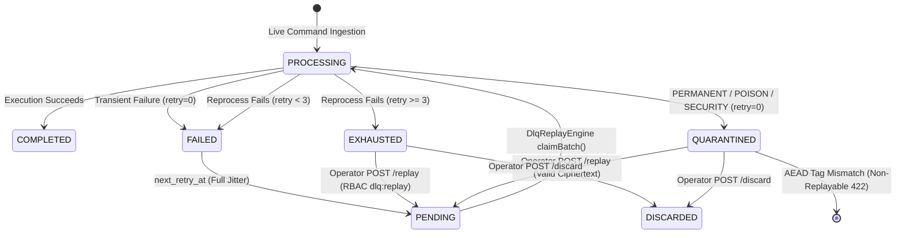

# 📐 Architecture Plan: PLAN-000.11 — Edge-to-Core Command Reliability, Retry & Reprocessing

- **Associated Spec**: [`../SPEC-000.11-tiered-dlq-and-recovery.md`](file:///.spec/SPEC-000.11-tiered-dlq-and-recovery.md)
- **Status**: 📝 **Draft**
- **Author**: Antigravity Platform Resilience & Financial Systems Guild
- **Date**: 2026-10-02
- **Target Module**: Spring Modulith `br.com.wallet.dlq` (collaborating with `:core` ingress and `:edge`)
- **Architectural Scope**: Pure Edge-to-Core command reprocessing, live traffic unblocking (Uber pattern), bounded full-jitter retries, and quarantine governance.

---

## 1. Technical Strategy & Architectural Overview

`PLAN-000.11` implements the **Process Reliability** boundary governing commands crossing from Edge Gateway to Wallet Core over NATS JetStream:
1. **Live Traffic Isolation (Uber Pattern)**: When an ingress financial command (`Transfer`, `Deposit`, `Withdraw`) fails during Core execution, the consumer immediately transfers the command to the durable reprocessing store (`dlq_operations`) and acknowledges the NATS message (`I-TDLQ-002`, `I-TDLQ-009`). Live traffic on NATS is never blocked by failing commands.
2. **Pre-Persistence Failure Classification**: Exceptions are classified into `TRANSIENT`, `PERMANENT`, `POISON`, and `SECURITY`.
3. **Bounded Jittered Reprocessing**: Transient errors are retried up to 3 times via scheduled batch claims (`FOR UPDATE SKIP LOCKED`) with decorrelated full jitter (`I-TDLQ-003`). Exceeding 3 retries transitions the record irreversibly to `EXHAUSTED`.
4. **Immediate Quarantine**: Non-transient errors bypass retries completely and transition to `QUARANTINED` with `retry_count = 0` (`I-TDLQ-004`).
5. **Cryptographic Opacity & Identity Preservation**: Opaque `CryptoEnvelope` bytes are stored without plaintext exposure (`I-TDLQ-006`). Manual or automated replays preserve the immutable `operationId` (`I-TDLQ-005`).

```mermaid
flowchart TD
    subgraph Ingress["Edge Gateway (wallet-edge)"]
        Edge["NatsEdgeCommandPublisher"]
    end

    subgraph Broker["NATS JetStream (Inter-Process)"]
        CmdStream["WALLET_COMMANDS (commands.ledger.*)"]
    end

    subgraph CoreConsumer["Wallet Core Ingress"]
        Consumer["Ingress Command Consumer"]
        Classifier["FailureClassifier"]
    end

    subgraph DLQModule["br.com.wallet.dlq (Spring Modulith)"]
        DlqService["DlqManagementService"]
        DlqDao["DlqOperationsDao"]
        DlqEngine["DlqReplayEngine (Scheduled)"]
        DlqTable[("PostgreSQL dlq_operations")]
    end

    Edge -->|publishes command| CmdStream
    CmdStream -->|consumes| Consumer
    Consumer -->|on exception| Classifier
    Classifier -->|TRANSIENT| DlqService
    Classifier -->|PERMANENT / POISON / SEC| DlqService
    
    DlqService -->|save failure| DlqDao
    DlqDao -->|persist FAILED / QUARANTINED| DlqTable
    DlqDao -->|committed| Consumer
    Consumer -->|ACK message (I-TDLQ-009)| CmdStream
    
    DlqEngine -->|claimBatch SKIP LOCKED (retry < 3)| DlqDao
    DlqEngine -->|publish reprocess attempt| CmdStream
```

---

## 2. State Machine & Lifecycle Transitions



### Transition Validation Rules
| From State | To State | Trigger / Condition | Invariant |
| :--- | :--- | :--- | :--- |
| `PROCESSING` | `FAILED` | Transient error; sets `next_retry_at = now() + jitter` | `I-TDLQ-003` |
| `PROCESSING` | `QUARANTINED` | Non-transient error (`PERM`/`POISON`/`SEC`); `retry_count=0` | `I-TDLQ-004` |
| `FAILED` | `PENDING` | `next_retry_at <= now()`; eligible for batch claim | `I-TDLQ-003` |
| `PENDING` | `PROCESSING` | Claimed via PostgreSQL `FOR UPDATE SKIP LOCKED` | Concurrency |
| `PROCESSING` | `EXHAUSTED` | Retry attempt failed and `retry_count >= 3` | `I-TDLQ-003` |
| `EXHAUSTED` / `QUARANTINED` | `PENDING` | Manual operator replay; preserves `operationId` | `I-TDLQ-005` |
| `EXHAUSTED` / `QUARANTINED` | `DISCARDED` | Manual operator discard with audit reason | Auditability |

---

## 3. Spring Modulith Module Topology & Packaging

```text
br.com.wallet.dlq
├── package-info.java                   (@ApplicationModule: allowedDependencies = {"core::api", "core", "security::api"})
├── api/                                (Published Public Contracts - @NamedInterface("api"))
│   ├── DlqManagementUseCase.java       (Record failure, manual replay, discard)
│   ├── DlqQueryUseCase.java            (Find by filter, get by ID)
│   ├── dto/
│   │   ├── DlqCommandFailure.java      (Input: operationId, tenantId, subject, payload, error)
│   │   ├── DlqQueryFilter.java         (Filter: status, failureType, tenantId, pageable)
│   │   ├── DlqOperationResponse.java   (Sanitized response DTO)
│   │   └── ReplayOperationResult.java  (Result: operationId, replayId, status)
│   └── model/
│       ├── DlqStatus.java              (PENDING, PROCESSING, COMPLETED, FAILED, EXHAUSTED, QUARANTINED, DISCARDED)
│       ├── DlqFailureType.java         (TRANSIENT, PERMANENT, POISON, SECURITY)
│       └── DlqRecord.java              (Immutable domain record representation)
└── internal/                           (Sealed Implementation Packages)
    ├── engine/
    │   ├── DlqReplayEngine.java        (@Scheduled reprocess worker using SKIP LOCKED)
    │   └── FullJitterBackoffCalculator.java (Pure jitter calculator Uniform(0, min(60, 2*2^r)))
    ├── persistence/
    │   └── DlqOperationsDao.java       (PostgreSQL JDBC DAO with SKIP LOCKED claiming)
    └── service/
        ├── DlqManagementService.java   (Implements DlqManagementUseCase)
        └── DlqQueryService.java        (Implements DlqQueryUseCase)
```

### Module Boundary Guarantees
- **`br.com.wallet.dlq`**: Zero dependencies on `ledger`, `fraud`, `savings`, or `goals`. Relies solely on `:core` and `:security` (for `CryptoEnvelope`).
- **`infrastructure`**: Exposes REST endpoints (`DlqController`) under `/dlq/operations` and provides `FailureClassifier`.

---

## 4. Data Model & Database Schema Changes

### Schema Updates in `docker/init/schema.sql`
```sql
ALTER TABLE dlq_operations
    ADD COLUMN IF NOT EXISTS tenant_id VARCHAR(64) NOT NULL DEFAULT 'default',
    DROP CONSTRAINT IF EXISTS chk_dlq_status,
    DROP CONSTRAINT IF EXISTS chk_dlq_failure_type;

ALTER TABLE dlq_operations
    ADD CONSTRAINT chk_dlq_status
    CHECK (status IN ('PENDING', 'PROCESSING', 'COMPLETED', 'FAILED', 'EXHAUSTED', 'QUARANTINED', 'DISCARDED')),
    ADD CONSTRAINT chk_dlq_failure_type 
    CHECK (failure_type IN ('TRANSIENT', 'PERMANENT', 'POISON', 'SECURITY'));

-- Dedicated claim index following the query predicate
CREATE INDEX IF NOT EXISTS idx_dlq_operations_claim 
    ON dlq_operations (status, next_retry_at) 
    WHERE status IN ('PENDING', 'FAILED');

-- Operator query index scoped by tenant and status
CREATE INDEX IF NOT EXISTS idx_dlq_operations_tenant_query 
    ON dlq_operations (tenant_id, status, failure_type, created_at DESC);
```

---

## 5. Invariants Enforcement & Detailed Mechanics

### 5.1 Durable Handoff Before ACK (`I-TDLQ-009`)
To eliminate the dual risk of **lost messages** (ACK before DB commit) and **spurious redeliveries**:
```java
public void onMessage(Message msg) {
    try {
        executeCommand(msg);
        msg.ack();
    } catch (Exception ex) {
        DlqFailureType failureType = failureClassifier.classify(ex);
        dlqManagementUseCase.recordFailure(toDlqCommandFailure(msg, failureType, ex));
        // ACK ONLY after the DB transaction has committed
        msg.ack();
    }
}
```

### 5.2 Full-Jitter Exponential Backoff Calculation (`I-TDLQ-003`)
```java
public final class FullJitterBackoffCalculator {
    private static final long BASE_DELAY_SECONDS = 2L;
    private static final long MAX_DELAY_SECONDS = 60L;

    public static Duration calculateDelay(int retryCount, RandomGenerator random) {
        long ceiling = Math.min(MAX_DELAY_SECONDS, BASE_DELAY_SECONDS * (1L << retryCount));
        long delaySeconds = random.nextLong(0, ceiling + 1);
        return Duration.ofSeconds(delaySeconds);
    }
}
```

### 5.3 Financial Identity Preservation (`I-TDLQ-005`)
When replaying a failed command (manually or automatically):
- Original `operation_id` is preserved in the NATS header and message context.
- A new operational `replay_id = UUID.randomUUID()` is generated and attached as header `X-Replay-Id`.
- Header `X-Replayed: true` is attached.
- Client `X-Nonce` is NOT reused (Core unwrap uses internal replay authorization).

### 5.4 Cryptographic Integrity Replay Prohibition (`I-TDLQ-007`)
```java
if (record.failureType() == DlqFailureType.SECURITY && record.errorMessage().contains("AEAD tag mismatch")) {
    throw new NonReplayableOperationException("Cryptographically corrupted ciphertext cannot be replayed");
}
```

---

## 6. Failure Modes, Resilience & Observability

- **Database Degradation on Handoff**: If PostgreSQL `dlq_operations` fails to persist, the consumer does NOT ACK NATS. NATS redelivers the command according to JetStream consumer ack-wait.
- **OpenTelemetry Instrumentation (`I-OBS-001`)**:
  - Span: `dlq.record_failure` with tags `failure.type`, `tenant.id`, `operation.id`.
  - Span: `dlq.claim_batch` with count of claimed records.
  - Span: `dlq.auto_replay` with `operation.id`, `replay.id`.
  - Non-emission: Zero PII or plaintext financial amounts in MDC or span attributes (`I-SEC-012`).
