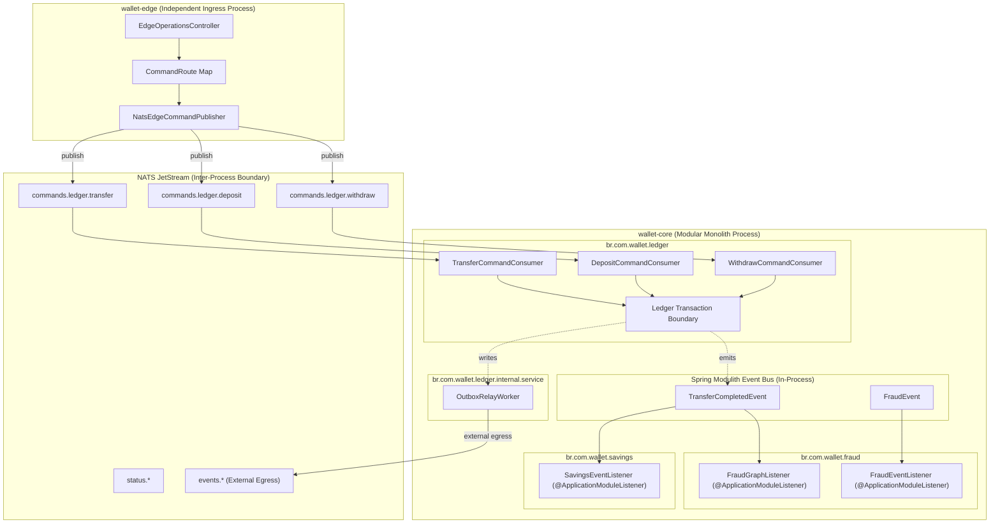

# 📐 Architecture Plan: PLAN-000.12 — Modulith Ingress Decentralization & Intra-Core Event Alignment

- **Associated Spec**: [`../SPEC-000.12-modulith-bounded-context-streaming.md`](file:///.spec/SPEC-000.12-modulith-bounded-context-streaming.md)
- **Status**: 📝 **Draft**
- **Author**: Antigravity Platform Architecture & Messaging Guild
- **Date**: 2026-10-03
- **Target Modules**:
  - `:edge` (`br.com.wallet.edge.ingress`, `br.com.wallet.edge.command`)
  - `ledger` (`br.com.wallet.ledger.internal.messaging.consumer`)
  - `fraud` (`br.com.wallet.fraud.internal.listener`)
  - `infrastructure` (`br.com.wallet.infrastructure.messaging`)
- **Architectural Scope**: Pure refactoring of ingress command routing and intra-core event propagation; zero new business features.

---

## 1. Technical Strategy & Architectural Overview

`PLAN-000.12` establishes the **Process Structure** boundary for the Wallet platform, demarcating inter-process communications over NATS JetStream from intra-process events over Spring Modulith:



### Core Design Decisions
1. **Demarcation Rule**: NATS JetStream is strictly reserved for crossing OS process boundaries (Edge $\to$ Core ingress, Core $\to$ Edge status, and Outbox $\to$ External egress).
2. **Intra-Core Elimination of NATS Boomerang**: `FraudGraphConsumer` and `FraudConsumer` are migrated to native Spring Modulith `@ApplicationModuleListener` listeners reacting directly to in-process domain events, eliminating double serialization, network roundtrips, and broker overhead.
3. **Decentralized Ingress Consumers**: The monolithic `CoreCommandConsumer` is replaced by dedicated, single-responsibility consumers located inside the owning capability (`br.com.wallet.ledger.internal.messaging.consumer.*`).
4. **Durable Handoff Preservation**: Ingress consumers continue to obey the normative durable handoff contract from `SPEC-000.11` (`I-TDLQ-009`):
   $$\text{ACK}(m) \implies \text{DurableHandoff}(m) = \text{committed}$$

---

## 2. Ingress Command Routing Architecture (Pillar A)

### 2.1 Canonical CommandRoute Specification
Located in `br.com.wallet.edge.command`:

```java
public record CommandRoute(
        @NonNull CommandType type,
        @NonNull String capability,
        @NonNull String subject,
        @NonNull String durableName
) {
    public static final CommandRoute TRANSFER = new CommandRoute(
            CommandType.TRANSFER, "ledger", "commands.ledger.transfer", "ledger-transfer-consumer");
    public static final CommandRoute DEPOSIT = new CommandRoute(
            CommandType.DEPOSIT, "ledger", "commands.ledger.deposit", "ledger-deposit-consumer");
    public static final CommandRoute WITHDRAW = new CommandRoute(
            CommandType.WITHDRAW, "ledger", "commands.ledger.withdraw", "ledger-withdraw-consumer");

    public static CommandRoute forType(@NonNull CommandType type) {
        return switch (type) {
            case TRANSFER -> TRANSFER;
            case DEPOSIT -> DEPOSIT;
            case WITHDRAW -> WITHDRAW;
        };
    }
}
```

### 2.2 Decentralized Ingress Consumer Hierarchy
Located in `br.com.wallet.ledger.internal.messaging.consumer`:

```text
br.com.wallet.ledger.internal.messaging.consumer
├── AbstractLedgerCommandConsumer (Shared transport security, crypto unwrap, DLQ handoff)
├── TransferCommandConsumer (Subject: commands.ledger.transfer, Consumer: ledger-transfer-consumer)
├── DepositCommandConsumer (Subject: commands.ledger.deposit, Consumer: ledger-deposit-consumer)
└── WithdrawCommandConsumer (Subject: commands.ledger.withdraw, Consumer: ledger-withdraw-consumer)
```

Each consumer:
- Extends `AbstractLedgerCommandConsumer` (or injects a shared `CommandIngressSupport` delegate).
- Validates transport security (`tenant_id`, `principal_id`, `key_id`, `publisher_id`).
- Unwraps `CryptoEnvelope` via KMS.
- Dispatches strictly to its own dedicated use case (`TransferFundsUseCase`, `DepositFundsUseCase`, `WithdrawFundsUseCase`).
- On failure, commits durable DLQ handoff before ACKing NATS (`I-TDLQ-009`).

---

## 3. Intra-Core Event Alignment (Pillar B)

### 3.1 Domain Event Flow
Within the single JVM process of `wallet-core`:

| Event Symbol | Emitting Module | Listener Symbol | Listening Module | Execution Mode |
| :--- | :--- | :--- | :--- | :--- |
| `TransferCompletedEvent` | `br.com.wallet.ledger` | `FraudGraphListener` | `br.com.wallet.fraud` | Async (`@ApplicationModuleListener`) |
| `TransferCompletedEvent` | `br.com.wallet.ledger` | `SavingsEventListener` | `br.com.wallet.savings` | Async (`@ApplicationModuleListener`) |
| `FraudEvent` | `br.com.wallet.fraud` | `FraudEventListener` | `br.com.wallet.fraud` | Async (`@ApplicationModuleListener`) |

### 3.2 Removal of NATS Consumers for Internal Events
The following classes in `br.com.wallet.infrastructure.messaging.consumer` are decommissioned:
- `FraudGraphConsumer` (previously subscribed to NATS `events.transfer.completed`).
- `FraudConsumer` (previously subscribed to NATS `events.fraud`).
- Legacy duplicate consumers under `infrastructure.messaging.consumer.business.*`.

Outbox Relay continues to publish domain events to NATS JetStream, serving purely as an **External Egress Bridge** for off-cluster audit systems, data lakes, or partner integrations.

---

## 4. Decommissioning & Cleanup Strategy

| Target Artifact | Action | Justification |
| :--- | :--- | :--- |
| `CoreCommandConsumer` | **Delete** | Replaced by `TransferCommandConsumer`, `DepositCommandConsumer`, `WithdrawCommandConsumer`. |
| `FraudGraphConsumer` | **Delete** | Replaced by `FraudGraphListener` (`@ApplicationModuleListener`). |
| `FraudConsumer` | **Delete** | Replaced by `FraudEventListener` (`@ApplicationModuleListener`). |
| `br.com.wallet.infrastructure.messaging.consumer.business.*` | **Delete** | Obsolete legacy consumer shims. |
| `commands_dlq` Stream Subject Shims | **Clean** | Standardized to `commands.dlq.*`. |

---

## 5. Architectural Invariants Verification (`I-SDD-003`)

1. **Spring Modulith DAG Integrity**:
   - Running `./gradlew test --tests ModulithArchitectureTest` asserts:
     - `ledger.internal.messaging.consumer` depends only on `ledger` use cases, `dlq.api`, `core`, and `security`.
     - `fraud.internal.listener` depends only on `fraud` and published domain events.
     - Zero circular dependencies.
2. **Bi-directional Equivalence**:
   - 100% compliance with `I-STREAM-001` through `I-STREAM-008`.
   - Zero spec drift between `SPEC-000.12`, `PLAN-000.12`, and implementation.
