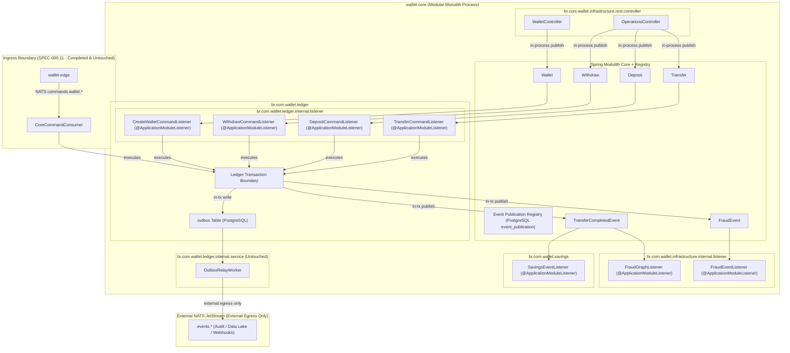

# 📐 Architecture Plan: PLAN-000.12 — Intra-Core Bounded Context Event Alignment & Modulith Streaming

- **Associated Spec**: [`../SPEC-000.12-modulith-bounded-context-streaming.md`](file:///.spec/SPEC-000.12-modulith-bounded-context-streaming.md)
- **Status**: 📝 **Draft (Rev. 7 — Aligned with AbstractCommandsConsumer Bounded Contexts)**
- **Author**: Antigravity Platform Architecture & Messaging Guild
- **Date**: 2026-10-06
- **Target Modules**:
  - `ledger` (`br.com.wallet.ledger.internal.listener`, `br.com.wallet.ledger.internal.service`, `br.com.wallet.ledger.api.context`, `br.com.wallet.ledger.api.event`)
  - `infrastructure` (`br.com.wallet.infrastructure.internal.listener`, `br.com.wallet.infrastructure.rest.controller`, `br.com.wallet.infrastructure.messaging.consumer.business` — decommissioning legacy NATS consumers)
  - `savings` (`br.com.wallet.savings.internal.listener` — existing baseline)
  - `fraud` (retained pure risk engine, dependency-free from ledger)
- **Strictly Out of Scope**: Edge Gateway, `commands.wallet.*`, `CoreCommandConsumer`, external command DLQ, and `OutboxRelayWorker` (remain untouched).

---

## 1. Technical Strategy & Architectural Overview

`PLAN-000.12` addresses all internal bounded context communication within `wallet-core`, eliminating the NATS boomerang anti-pattern for both intra-process domain events and bounded context commands while preserving Outbox Relay for external egress:

### Core Architectural Decisions (ADRs)

1. **ADR-1: Intra-Core Event & Command Transport via Spring Modulith**:
   - Intra-Core bounded context communication (`ledger` $\to$ `fraud`, `ledger` $\to$ `savings`, and `rest` $\to$ `ledger` bounded context commands) is handled exclusively via Spring Modulith in-process events (`@ApplicationModuleListener`).
   - Network hops through NATS for intra-process events and commands are strictly eliminated.
2. **ADR-2: Event Durability via PostgreSQL Event Publication Registry**:
   - Event durability inside `wallet-core` is provided by Spring Modulith's **Event Publication Registry** with PostgreSQL persistence (`event_publication` table).
   - Incomplete publications remain in PostgreSQL and are eligible for republication/recovery according to the Registry lifecycle.
3. **ADR-3: At-Least-Once Delivery & Event Identity Idempotency (`I-STREAM-003`)**:
   - Delivery semantics are at-least-once; exactly-once processing MUST NOT be assumed.
   - Listeners MUST be idempotent based on canonical event identity (`eventId` / `operationId`).
4. **ADR-4: Dual Durability Demarcation — Registry $\neq$ Outbox (Outbox Relay Untouched)**:
   - Event Publication Registry guarantees **intra-Core event/command delivery**.
   - Outbox guarantees **external process/system egress**. `OutboxRelayWorker` is strictly untouched.
5. **ADR-5: The DLQ Exception for Internal Bounded Context Events & Commands (Registry $\neq$ DLQ)**:
   - Internal NATS DLQ topics (`commands.dlq.transfer`, `commands.dlq.deposit`, `commands.dlq.withdraw`, `commands.dlq.wallet`) are **explicitly removed**.
   - Persistent listener failures remain observable as incomplete publications in `event_publication` with diagnostic metadata.
6. **ADR-6: Behavioral Preservation Guarantee (`I-STREAM-005`)**:
   - Existing externally observable business semantics MUST be preserved.
7. **ADR-7: Spring Modulith & Spring Boot Compatibility Evolution Clause (`I-STREAM-006`)**:
   - Baseline is 2.2.0-M2, revalidated before final Wallet V4 release.
8. **ADR-8: Migration of Bounded Context Commands (`AbstractCommandsConsumer` Extensions)**:
   - All extensions of `AbstractCommandsConsumer` (`TransferCommandConsumer`, `DepositCommandConsumer`, `WithdrawCommandConsumer`, `CreateWalletCommandConsumer`) are decommissioned from NATS and replaced with in-process `@ApplicationModuleListener` components in `br.com.wallet.ledger.internal.listener`.
   - `OperationsController` and `WalletController` publish in-process via `ApplicationEventPublisher`.

---

## 2. Intra-Core Messaging Alignment & Modulith Listeners

### 2.1 Bounded Context Commands & Domain Events Flow

| Symbol / Message | Emitting Component | Listener Component | Target Module | Mode | Durability Mechanism |
| :--- | :--- | :--- | :--- | :--- | :--- |
| `Transfer` | `OperationsController` | `TransferCommandListener` | `ledger` | `@ApplicationModuleListener` | Event Publication Registry |
| `Deposit` | `OperationsController` | `DepositCommandListener` | `ledger` | `@ApplicationModuleListener` | Event Publication Registry |
| `Withdraw` | `OperationsController` | `WithdrawCommandListener` | `ledger` | `@ApplicationModuleListener` | Event Publication Registry |
| `Wallet` | `WalletController` | `CreateWalletCommandListener` | `ledger` | `@ApplicationModuleListener` | Event Publication Registry |
| `TransferCompletedEvent` | `TransferFundsService` | `FraudGraphListener` | `infrastructure` | `@ApplicationModuleListener` | Event Publication Registry |
| `TransferCompletedEvent` | `TransferFundsService` | `SavingsEventListener` | `savings` | `@ApplicationModuleListener` | Event Publication Registry |
| `FraudEvent` | `FraudCheckHelper` | `FraudEventListener` | `infrastructure` | `@ApplicationModuleListener` | Event Publication Registry |

### 2.2 Listener Implementation Details

#### Bounded Context Command Listeners (`br.com.wallet.ledger.internal.listener`)
- `TransferCommandListener`: Consumes `Transfer`, invokes `TransferFundsUseCase.handle(transfer)`.
- `DepositCommandListener`: Consumes `Deposit`, invokes `DepositFundsUseCase.handle(deposit)`.
- `WithdrawCommandListener`: Consumes `Withdraw`, invokes `WithdrawFundsUseCase.handle(withdraw)`.
- `CreateWalletCommandListener`: Consumes `Wallet`, invokes `CreateWalletUseCase.handle(wallet)`.

#### Domain Event Listeners (`br.com.wallet.infrastructure.internal.listener` & `br.com.wallet.savings.internal.listener`)
- `FraudGraphListener`: Consumes `TransferCompletedEvent`, projects relational graph (`infrastructure.internal.listener`).
- `FraudEventListener`: Consumes `FraudEvent`, enriches short-term timeline memory (`infrastructure.internal.listener`).
- `SavingsEventListener`: Consumes `TransferCompletedEvent` and `DepositCompletedEvent`, executes savings sweep rules (`savings.internal.listener`).

---

## 3. Decommissioning & Cleanup Strategy

| Target Artifact | Action | Justification |
| :--- | :--- | :--- |
| `TransferCommandConsumer` | **Delete** | Replaced by `TransferCommandListener` (`@ApplicationModuleListener`). |
| `DepositCommandConsumer` | **Delete** | Replaced by `DepositCommandListener` (`@ApplicationModuleListener`). |
| `WithdrawCommandConsumer` | **Delete** | Replaced by `WithdrawCommandListener` (`@ApplicationModuleListener`). |
| `CreateWalletCommandConsumer` | **Delete** | Replaced by `CreateWalletCommandListener` (`@ApplicationModuleListener`). |
| `AbstractCommandsConsumer` | **Delete** | All extensions migrated to Spring Modulith; no longer needed. |
| `FraudGraphConsumer` | **Delete** | Replaced by `FraudGraphListener` (`@ApplicationModuleListener`). |
| `FraudConsumer` | **Delete** | Replaced by `FraudEventListener` (`@ApplicationModuleListener`). |
| Internal DLQ topics (`commands.dlq.*`) | **Delete** | Handled exclusively by PostgreSQL Event Publication Registry. |
| `OutboxRelayWorker` | **Untouched** | Continues publishing external egress to NATS `events.*`. |

---

## 4. Architectural Invariants Verification (`I-SDD-003`)

1. **Spring Modulith DAG Integrity**:
   - `ModulithArchitectureTest.verifyArchitecture()` asserts zero violations, zero cycles, clean DAG.
   - `FraudGraphListener` & `FraudEventListener` reside in `infrastructure.internal.listener` to preserve the acyclic dependency structure `infrastructure -> ledger -> fraud -> core` without introducing cycles between `fraud` and `ledger`.
2. **Negative Architectural Tests**:
   - `NoInternalEventNatsDependencyTest` asserts zero dependencies on NATS classes in internal listeners.
3. **Integration Verification**:
   - `EventPublicationRegistryIT`: in-process publications committed and completed in PostgreSQL.
   - `EventPublicationRecoveryIT`: failure retention (`completion_date IS NULL`) and idempotent replay.
   - `LedgerCommandListenersIT`: in-process execution of `Transfer`, `Deposit`, `Withdraw`, `Wallet` commands with PostgreSQL registry tracking.
   - `ExternalOutboxIsolationIT`: isolated registry vs outbox lifecycles.
