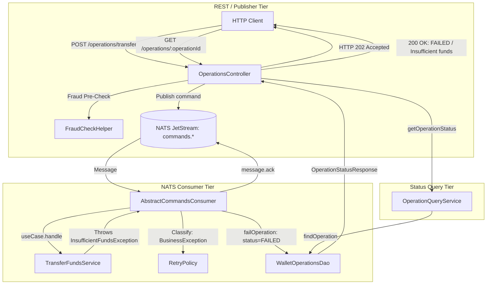

# 📐 Architecture Plan: PLAN-000.3 — Asynchronous Command Exception Handling & Operation Status Tracking

- **Associated Spec**: [`../SPEC-000.3-async-command-exception-handling.md`](file:///.spec/SPEC-000.3-async-command-exception-handling.md)
- **Status**: Approved
- **Date**: 2026-08-29

---

## 1. Technical Strategy & Architecture Overview

The system processes commands via an asynchronous event-driven model:



### Key Design Decisions
1. **Separation of Transactions**: When a Use Case (e.g. `TransferFundsService`) encounters a business rule violation (`InsufficientFundsException`), the Spring `@Transactional` transaction rolls back, reverting any account balance alterations. The consumer catches this exception outside the transaction and calls `WalletOperationsDao.failOperation(operationId, message, failureType)`, executing in its own JDBC connection to persist the failure status in `wallet_operations`.
2. **Spring Modulith Compliance**: The REST controller interacts with the ledger module strictly via `br.com.wallet.ledger.api.OperationQueryUseCase` and `br.com.wallet.ledger.api.dto.OperationStatusResponse` (`I-MODULITH-001`, `I-MODULITH-002`).
3. **HTTP 202 Guarantee**: Command submission endpoints (`POST /operations/transfer`, `/deposit`, `/withdraw`, `/wallets/deposit`) return `202 ACCEPTED` immediately upon successful NATS publish acknowledgment.

---

## 2. Module & Layer Boundaries

- **`br.com.wallet.ledger.api` (Published API)**:
  - `OperationQueryUseCase`: Interface to retrieve operation status.
  - `OperationStatusResponse`: Immutable record containing `operationId`, `status`, `errorMessage`, `failureType`, `createdAt`, `updatedAt`.
- **`br.com.wallet.ledger.internal` (Internal Engine)**:
  - `WalletOperationsDao`: Methods `failOperation(UUID, String, String)` and `findOperation(UUID)`.
  - `OperationQueryService`: Implements `OperationQueryUseCase`.
- **`br.com.wallet.infrastructure.messaging.consumer` (Messaging)**:
  - `AbstractCommandsConsumer`: Injects `WalletOperationsDao` (or failure callback) to record `FAILED` status on non-retriable exceptions and DLQ exhaustion before ACKing.
- **`br.com.wallet.infrastructure.rest` (REST API)**:
  - `OperationsApi` & `OperationsController`: Endpoint `GET /operations/{operationId}` returning `200 OK` or `404 NOT_FOUND`.

---

## 3. Data Model & Schema Changes

### Database Tables / SQL (`schema.sql`)
```sql
CREATE TABLE IF NOT EXISTS wallet_operations (
    operation_id UUID PRIMARY KEY,
    created_at TIMESTAMPTZ NOT NULL DEFAULT NOW(),
    updated_at TIMESTAMPTZ NOT NULL DEFAULT NOW(),
    status VARCHAR(20) NOT NULL DEFAULT 'PROCESSING',
    error_message TEXT NULL,
    failure_type VARCHAR(32) NULL,
    CONSTRAINT wallet_operations_status_chk
        CHECK (status IN ('FAILED', 'COMPLETED', 'PROCESSING'))
);
```

---

## 4. Concurrency & Locking Strategy

- **Operation State Transitions**:
  - `startOperation`: `INSERT INTO wallet_operations (operation_id, status) VALUES (?, 'PROCESSING') ON CONFLICT DO NOTHING;`
  - `completeOperation`: `UPDATE wallet_operations SET status = 'COMPLETED', updated_at = NOW() WHERE operation_id = ?;`
  - `failOperation`: `UPDATE wallet_operations SET status = 'FAILED', error_message = ?, failure_type = ?, updated_at = NOW() WHERE operation_id = ?;`
- **Idempotency**: `operation_id` acts as the primary key. Once transitioned to `COMPLETED` or `FAILED`, subsequent duplicate consumer attempts skip idempotently.

---

## 5. Security & Failure Analysis

- **Rollback Isolation**: `failOperation` executes after the use case rollback, ensuring the failure reason is recorded in PostgreSQL even if the transfer transaction rolled back.
- **DLQ Escalation**: If retries are exhausted ($deliveries \ge 5$), `dlqPublisher` forwards the event to `commands.dlq.*` and marks `wallet_operations` with `status = 'FAILED'`, `failure_type = 'TRANSIENT'`.
