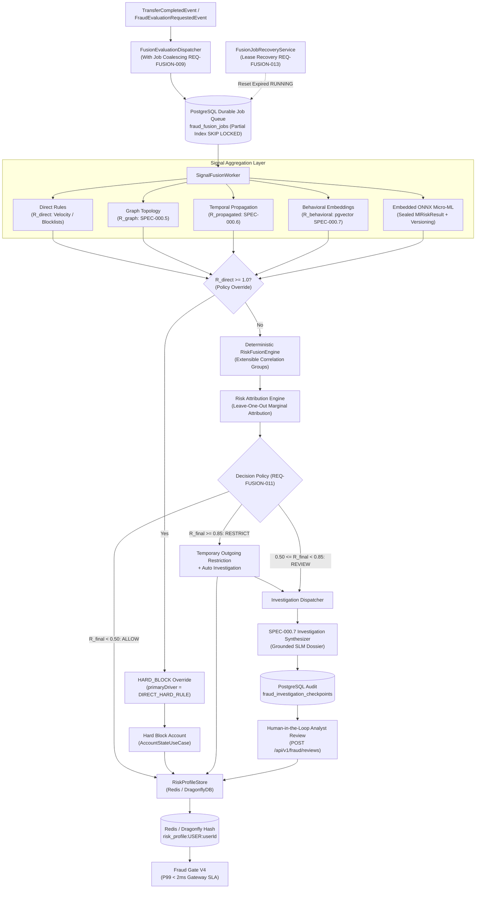

# 📐 Architecture Plan: PLAN-000.8 — Fraud Signal Fusion, Micro-ML & Hand-Rolled Investigation Orchestration

- **Associated Spec**: [`../SPEC-000.8-fraud-signal-fusion-and-micro-ml.md`](file:///.spec/SPEC-000.8-fraud-signal-fusion-and-micro-ml.md)
- **Status**: Ready for Implementation (Histories 15, 19, 21, 22, 31, 32, 33, 34)
- **Author**: Antigravity Financial & Risk Engineering Team
- **Date**: 2026-09-08
- **Domain**: `br.com.wallet.fraud.fusion` (Signal Fusion, Micro-ML, Durable Job Queue & Risk Profile Store)
- **Target Release**: Wallet Service V4.x — Phase 0.8

---

## 1. Technical Strategy & Architecture Overview

The **Fraud Signal Fusion & Investigation Orchestration Engine** unifies all quantitative risk intelligence produced across Phases 0.1 through 0.7 into a cohesive, auditable, and sub-millisecond decision pipeline. Following **Histories 31, 32, 33, and 34**, this architecture avoids external Python runtimes or heavy agent workflow frameworks for deterministic calculations, and instead implements:

1. **Direct Rule Primacy as Policy Override (`History 34`)**: If $R_{\text{direct}} \ge 1.0$ (hard rule violation, sanctioned entity), `HardRulePolicy` executes an immediate policy override, returning `FraudDecision.HARD_BLOCK` with `primaryDriver = "DIRECT_HARD_RULE"`, short-circuiting multiplicative fusion.
2. **Extensible Correlation Groups (`RiskCorrelationGroup`)**: Combines graph structure and temporal propagation (`GraphIntelligenceCorrelationGroup`) before master fusion to eliminate double-counting.
3. **Embedded Pure Java ONNX Runtime with Sealed `MlRiskResult` (`Histories 32, 33, 34`)**:
   - Evaluates pre-trained tabular models using pure Java ONNX Runtime (`OrtSession`).
   - Feature contract versioning (`I-FUSION-008`): Validates `featureVersion` and canonical ordered `featureNames`.
   - Observable degradation (`I-FUSION-010`): Emits `MlRiskResult.Unavailable(reason)` on model or IO failure, allowing fusion to degrade gracefully without synthetic proxy hallucinations.
   - Benchmark evaluation separated into dedicated performance suite (`OnnxRiskModelBenchmark`).
4. **Hand-Rolled PostgreSQL Durable Job Queue with Partial Index Coalescing (`REQ-FUSION-004 & REQ-FUSION-009`)**:
   - `CREATE UNIQUE INDEX ... ON fraud_fusion_jobs (entity_id) WHERE status = 'PENDING'`.
   - Coalesces rapid successive events while `PENDING` (`ON CONFLICT (entity_id) WHERE status = 'PENDING' DO UPDATE SET ...`).
   - When events arrive while an entity is actively `RUNNING`, inserts a clean new `PENDING` job so the latest state is re-evaluated immediately after the current run completes.
5. **Lease Recovery Service with Bounded Backoff (`FusionJobRecoveryService`, `REQ-FUSION-013`)**: Scans for abandoned `RUNNING` jobs (`lease_expires_at < NOW()`). Retries with exponential backoff (`5s`, `30s`, `2m`, `10m`) up to `MAX_ATTEMPTS = 5` before transitioning to `FAILED`.
6. **Leave-One-Out Marginal Risk Attribution (`REQ-FUSION-010`)**: Quantifies non-linear factor contributions faithfully: $C_s = \max(0.0, R_{\text{final}} - R_{\text{final without } s})$, normalized such that $\sum C'_s = 100\%$.
7. **Differentiated Decision Policy (`REQ-FUSION-011`)**: Distinguishes `HARD_BLOCK` ($R_{\text{direct}} \ge 1.0$) from `RESTRICT` ($R_{\text{final}} \ge 0.85$), `REVIEW` ($[0.50, 0.85)$), and `ALLOW` ($< 0.50$).
8. **Typed `RiskSubject` & Contextual Gate Degradation Policy (`Histories 33 & 34`)**:
   - Keyed by `RiskSubject(RiskSubjectType type, UUID id)`: `risk_profile:{entityType}:{entityId}`.
   - If cache is unavailable, runs fast fallback deterministic evaluation (fail-closed for high risk, deterministic checks for low risk).
   - Operational SLA: Fraud Gate evaluation P99 $< 2\text{ms}$ at gateway application boundary; cache lookup P99 $< 0.5\text{ms}$ in local network.



---

## 2. Spring Modulith Architecture & Package Boundaries

The fusion engine resides in `br.com.wallet.fraud.fusion` within `:fraud`, encapsulating internal logic and exposing public API contracts:

```text
br.com.wallet.fraud.fusion
│
├── api/                                      <-- @NamedInterface("fusion-api")
│   ├── RiskFusionEngine.java                 <-- Core mathematical contract
│   ├── FraudSignalFusionService.java         <-- High-level evaluation use case
│   └── model/
│       ├── FraudSignalSet.java               <-- Input multi-signal value object
│       ├── RiskFusionWeights.java            <-- Tunable sensitivity weights
│       ├── RiskFusionResult.java             <-- Fused score + attribution
│       ├── RiskAttribution.java              <-- Factor ranking & percentage share
│       ├── FactorContribution.java           <-- Marginal impact & normalized %
│       ├── FraudDecision.java                <-- ALLOW, REVIEW, RESTRICT, HARD_BLOCK
│       ├── RiskSubject.java                  <-- Typed entity subject (type, id)
│       ├── RiskSubjectType.java              <-- USER, ACCOUNT, DEVICE, PIX_KEY
│       ├── RiskProfile.java                  <-- Complete materialized profile
│       ├── MlFeatureVector.java              <-- Versioned ML feature tensor
│       ├── OnnxModelMetadata.java            <-- Model artifact manifest
│       └── MlRiskResult.java                 <-- Sealed interface: Available / Unavailable
│
└── internal/
    ├── fusion/
    │   ├── ProbabilisticRiskFusionEngine.java<-- Master fusion implementation
    │   ├── RiskCorrelationGroup.java         <-- Extensible correlation contract
    │   ├── GraphIntelligenceCorrelationGroup.java <-- Combines graph + propagation
    │   └── RiskAttributionCalculator.java    <-- Leave-One-Out marginal calculator
    │
    ├── ml/
    │   ├── OnnxRiskModelEvaluator.java       <-- Java OrtSession inference engine
    │   ├── OnnxModelLoader.java              <-- Classpath artifact reader + checksum verifier
    │   ├── FraudFeatureMapper.java           <-- Normalizes metrics into MlFeatureVector
    │   └── IncompatibleFeatureSchemaException.java <-- I-FUSION-008 schema barrier
    │
    ├── orchestration/
    │   ├── FusionEvaluationDispatcher.java   <-- Enqueues & coalesces jobs
    │   ├── FusionJobWorker.java              <-- Hand-rolled SKIP LOCKED processor
    │   ├── FusionJobRecoveryService.java     <-- Bounded lease recovery poller
    │   └── InvestigationDispatcher.java      <-- Enqueues SPEC-000.7 dossier generation
    │
    ├── persistence/
    │   ├── RiskProfileStore.java             <-- Storage abstraction (Redis/Dragonfly/Valkey)
    │   ├── RedisRiskProfileStore.java        <-- Lettuce client implementation
    │   ├── PostgresFusionJobDao.java         <-- Durable jobs DAO with partial index coalescing
    │   └── PostgresCheckpointDao.java        <-- Checkpoints & reviews DAO
    │
    └── policy/
        ├── RiskDecisionPolicy.java           <-- 4-state threshold router
        └── HardRulePolicy.java               <-- Direct rule primacy override enforcer
```

---

## 3. Data Model & Schema Changes

### PostgreSQL Schema (`../../docker/init/schema.sql`)

```sql
-- 1. Hand-Rolled Durable Job Queue with Partial Unique Index Coalescing (REQ-FUSION-004, REQ-FUSION-009, REQ-FUSION-013)
CREATE TABLE IF NOT EXISTS fraud_fusion_jobs (
    job_id UUID PRIMARY KEY,
    entity_id UUID NOT NULL,
    model_version VARCHAR(32) NOT NULL,
    status VARCHAR(32) NOT NULL, -- 'PENDING', 'RUNNING', 'COMPLETED', 'RETRY_WAIT', 'FAILED'
    as_of TIMESTAMP WITH TIME ZONE NOT NULL,
    attempt_count INT NOT NULL DEFAULT 0,
    worker_token UUID,
    lease_expires_at TIMESTAMP WITH TIME ZONE,
    next_attempt_at TIMESTAMP WITH TIME ZONE,
    idempotency_key VARCHAR(128),
    payload JSONB,
    last_error TEXT,
    created_at TIMESTAMP WITH TIME ZONE DEFAULT NOW(),
    updated_at TIMESTAMP WITH TIME ZONE DEFAULT NOW()
);

-- Partial Unique Index: Guarantees at most ONE pending job per entity, while preserving full execution history
CREATE UNIQUE INDEX IF NOT EXISTS uq_fusion_job_pending_entity
    ON fraud_fusion_jobs (entity_id)
    WHERE status = 'PENDING';

CREATE INDEX IF NOT EXISTS idx_fusion_jobs_poll 
    ON fraud_fusion_jobs (status, as_of, lease_expires_at);

-- 2. Checkpoints for Human-in-the-Loop Compliance Review (Under REVIEW / RESTRICT)
CREATE TABLE IF NOT EXISTS fraud_investigation_checkpoints (
    checkpoint_id UUID PRIMARY KEY,
    entity_id UUID NOT NULL,
    status VARCHAR(32) NOT NULL, -- 'PENDING_ANALYST', 'AUTO_APPROVED', 'AUTO_BLOCKED', 'ANALYST_REVIEWED'
    state_payload JSONB NOT NULL,
    final_risk NUMERIC(4, 3) NOT NULL,
    risk_classification VARCHAR(32) NOT NULL,
    created_at TIMESTAMP WITH TIME ZONE DEFAULT NOW(),
    updated_at TIMESTAMP WITH TIME ZONE DEFAULT NOW()
);

CREATE INDEX IF NOT EXISTS idx_fraud_checkpoints_entity 
    ON fraud_investigation_checkpoints (entity_id, status);

-- 3. Audit Log for Human-in-the-Loop Analyst Decisions (REQ-FUSION-008)
CREATE TABLE IF NOT EXISTS fraud_analyst_reviews (
    review_id UUID PRIMARY KEY,
    checkpoint_id UUID NOT NULL REFERENCES fraud_investigation_checkpoints(checkpoint_id),
    entity_id UUID NOT NULL,
    analyst_id VARCHAR(64) NOT NULL,
    verdict VARCHAR(32) NOT NULL, -- 'CONFIRMED_FRAUD', 'FALSE_POSITIVE', 'ALLOW_WITH_EXCEPTION'
    notes TEXT,
    reviewed_at TIMESTAMP WITH TIME ZONE DEFAULT NOW()
);

CREATE INDEX IF NOT EXISTS idx_fraud_reviews_checkpoint 
    ON fraud_analyst_reviews (checkpoint_id);
```

### Redis / DragonflyDB Hot Cache Structure

- **Key**: `risk_profile:{entityType}:{entityId}` (e.g. `risk_profile:USER:01918a5...`)
- **Type**: `Hash`
- **TTL**: 3600 seconds (1 hour)
- **Hash Fields**:
  ```text
  direct:         "0.10"
  graph:          "0.75"
  propagated:     "0.50"
  behavioral:     "0.85"
  ml:             "0.65"
  final:          "0.88"
  status:         "RESTRICT"
  primary_driver: "BEHAVIORAL_ANOMALY"
  degraded:       "false"
  updated_at:     "1725800000000"
  ```

---

## 4. Probabilistic Fusion with Correlation Groups & Leave-One-Out Attribution

### Step 1: Direct Rule Primacy Check
If $R_{\text{direct}} \ge 1.0$:
- Short-circuit all multiplicative fusion.
- Return `RiskFusionResult.hardBlocked(signals)` with `FraudDecision.HARD_BLOCK`, `finalRisk = 1.0`, and `primaryDriver = "DIRECT_HARD_RULE"`.

### Step 2: Graph Correlation Group
$$R_{\text{graph-group}} = 1 - (1 - R_{\text{graph}}) \cdot (1 - w_p R_{\text{propagated}})$$

### Step 3: Master Probabilistic Fusion
When $R_{\text{ML}}$ is available:
$$R_{\text{final}} = 1 - (1 - R_{\text{direct}}) \cdot (1 - w_g R_{\text{graph-group}}) \cdot (1 - w_b R_{\text{behavioral}}) \cdot (1 - w_m R_{\text{ML}})$$
When $R_{\text{ML}}$ is degraded/unavailable (`I-FUSION-010`):
$$R_{\text{final}} = 1 - (1 - R_{\text{direct}}) \cdot (1 - w_g R_{\text{graph-group}}) \cdot (1 - w_b R_{\text{behavioral}})$$

### Step 4: Leave-One-Out (LOO) Marginal Attribution Algorithm
For each active signal group $s \in \{\text{direct}, \text{graph-group}, \text{behavioral}, \text{ML}\}$:
1. Re-evaluate fusion with signal $s$ removed ($R_s = 0.0$), yielding $R_{\text{final without } s}$.
2. Marginal impact:
   $$C_s = \max(0.0, R_{\text{final}} - R_{\text{final without } s})$$
3. Normalized percentage:
   $$C'_s = \frac{C_s}{\sum_k C_k} \times 100\%$$
4. Highest $C'_s$ designates `primaryDriver`.

---

## 5. Pure Java Embedded Micro-ML Architecture & Feature Versioning

- **Dependency**: `com.microsoft.onnxruntime:onnxruntime` in `../../fraud/build.gradle`.
- **Feature Contract Versioning (`I-FUSION-008`)**:
  ```java
  public record MlFeatureVector(int featureVersion, List<String> featureNames, float[] values) {}
  public record OnnxModelMetadata(String modelId, String modelVersion, int featureVersion, List<String> featureNames, String checksum) {}
  ```
- **Sealed Result Model**:
  ```java
  public sealed interface MlRiskResult {
      record Available(double score, String modelVersion, long inferenceNanos) implements MlRiskResult {}
      record Unavailable(String reason) implements MlRiskResult {}
  }
  ```
- **Observable Degradation (`I-FUSION-010`)**:
  If the model fails to load or inference fails, `OnnxRiskModelEvaluator` returns `new MlRiskResult.Unavailable(reason)`. Fusion proceeds gracefully without the ML component.

---

## 6. Testing & Verification Strategy (3-Tier Architecture)

1. **Tier 1 — Unit Tests (Zero Docker, Fast Feedback < 500ms)**:
   - `RiskFusionEngineTest`: Tests direct rule primacy override, correlation groups, monotonicity bounds, Leave-One-Out attribution, and graceful degradation when ML is missing.
   - `OnnxRiskModelEvaluatorTest`: Tests feature vector schema validation (`I-FUSION-008`), observable degradation (`I-FUSION-010`), and basic inference.
   - `RiskDecisionPolicyTest`: Tests 4-state routing (`ALLOW`, `REVIEW`, `RESTRICT`, `HARD_BLOCK`).
2. **Tier 2 — Integration Tests (Testcontainers PostgreSQL & Redis)**:
   - `PostgresFusionJobDaoIT`: Validates partial index coalescing (`shouldCoalesceMultiplePendingEventsIntoLatestAsOf`), `SELECT FOR UPDATE SKIP LOCKED`, worker lease acquisition, and lease recovery (`FusionJobRecoveryService`).
   - `PostgresCheckpointDaoIT`: Tests JSONB checkpoint persistence and analyst review submission.
   - `RedisRiskProfileStoreIT`: Tests typed `RiskSubject` key generation, Redis/Dragonfly Hash serialization, TTL, and cache invalidation.
   - `FraudGateV4IT`: Validates authorization check under P99 $< 2\text{ms}$ gateway boundary SLA and contextual degradation.
3. **Tier 3 — E2E & Verification Tests**:
   - `FraudSignalFusionWorkflowIT`: Complete pipeline execution from event to worker, ONNX inference, fusion, decision, Phase 0.7 investigation dispatch, and hot cache storage.
   - `OnnxRiskModelBenchmark`: Performance verification task reporting P50, P95, and P99 execution metrics.
   - `ModulithArchitectureTest`: Verifies Spring Modulith boundaries with zero cycle violations.
