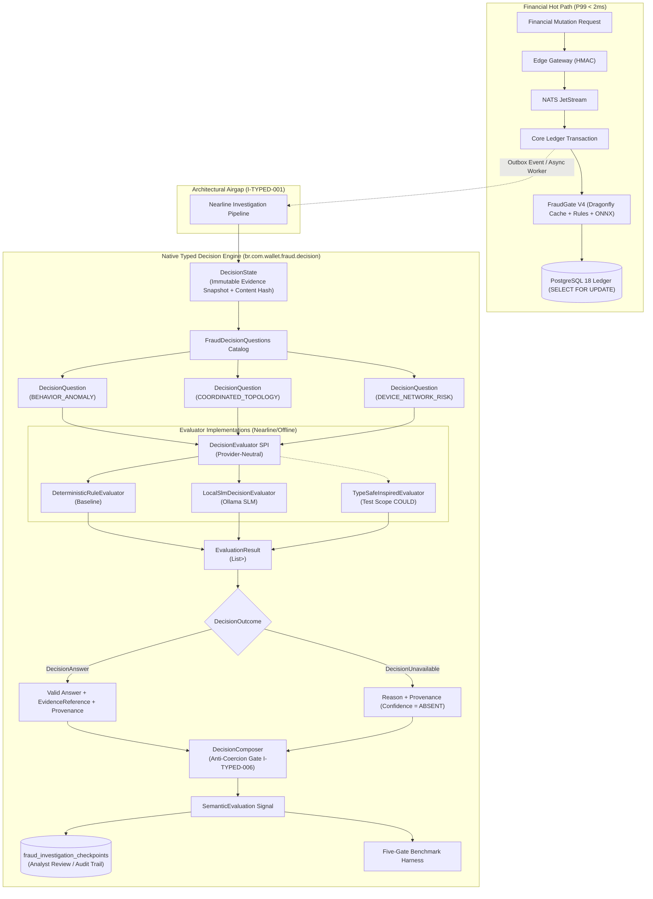

# 📐 Architecture Plan: PLAN-000.8.1 — Native Typed Decision Algebra & Semantic Evaluation Engine

- **Associated Spec**: [`../SPEC-000.8.1-typed-ai-decision-evaluation.md`](file:///.spec/SPEC-000.8.1-typed-ai-decision-evaluation.md)
- **Status**: 🟢 **Ready for Implementation** (Ratified per Histories 61, 62, 63, 64, 65 & 66)
- **Author**: Antigravity Financial AI & Risk Intelligence Guild
- **Date**: 2026-09-22
- **Domain**: `br.com.wallet.fraud.decision` (within `:fraud` subproject)
- **Target Release**: Wallet Service V4 — Phase 000.8.1

---

## 1. Technical Strategy & Architecture Overview

Following the architectural consensus ratified across **Histories 61 through 66**, this plan realizes the **"steal the architecture, not the library"** principle (`History 64`). Rather than coupling Wallet V4 to an early `0.1.0-SNAPSHOT` external framework (`spring-ai-typesafe`), this engine implements a **Native Typed Decision Algebra** in pure Java:

1. **Native Pure-Java Domain Algebra (`REQ-TYPED-001`, `REQ-TYPED-002`)**: Zero external AI framework imports (Spring AI, Ollama, ONNX Runtime) in domain core.
2. **Generic Structural Binding (`REQ-TYPED-001`, `REQ-TYPED-015`, `I-TYPED-003`)**: `EvaluatedQuestion<T>` binds `DecisionQuestion<T extends DecisionValue>` to `DecisionOutcome<T>` at compile time and runtime via `Class<T>` type witnesses.
3. **Partitioned Outcomes & Absent Confidence (`I-TYPED-005`)**: Decouples `DecisionAnswer<T>` from `DecisionUnavailable<T>`. When an evaluator times out or fails, confidence is strictly absent (`Confidence = ABSENT`).
4. **Anti-Coercion Composition Gate (`I-TYPED-006`, `REQ-TYPED-006`)**: `DecisionComposer` combines atomic question outcomes into `SemanticEvaluation` signals. Implicit coercion of `DecisionUnavailable` into false, zero, or default scores is strictly prohibited.
5. **Constitutional Hot-Path Airgap (`I-TYPED-001`, `I-TYPED-002`, `REQ-TYPED-007`)**: The synchronous write path ($P99 < 2\text{ms}$) remains strictly Rules + ONNX Micro-ML + DragonflyDB hot cache. `DecisionEvaluator` executes strictly nearline (investigations, analyst checkpoints) or offline benchmarks.
6. **Five-Gate Evaluation Protocol (`REQ-TYPED-009`, `I-TYPED-004`)**: Candidate engines are evaluated against baselines on identical labeled tasks across Contract Validity, Evidence Grounding, Predictive Correctness (with directed margin $\epsilon_{\text{workload}}$), Calibration, and Operational Performance/Determinism.



---

## 2. Spring Modulith Architecture & Package Boundaries

The engine resides in subproject `:fraud` under `br.com.wallet.fraud.decision`:

```text
br.com.wallet.fraud.decision
│
├── api/                                          <-- @NamedInterface("decision-api")
│   ├── DecisionState.java                        <-- Immutable evidence snapshot record
│   ├── DecisionQuestion.java                     <-- Typed question contract with Class<T>
│   ├── DecisionValue.java                        <-- Sealed interface for decision values
│   ├── BooleanDecision.java                      <-- boolean value record
│   ├── ScoreDecision.java                        <-- double value + ScoreCalibration record
│   ├── ChoiceDecision.java                       <-- String value + double confidence record
│   ├── ScoreCalibration.java                     <-- Calibration metadata record
│   ├── DecisionOutcome.java                      <-- Sealed interface: DecisionAnswer | DecisionUnavailable
│   ├── DecisionAnswer.java                       <-- Answer record carrying T, evidence, provenance
│   ├── DecisionUnavailable.java                  <-- Unavailable record carrying QuestionId, reason, provenance
│   ├── EvaluatedQuestion.java                    <-- Typed pair: (DecisionQuestion<T>, DecisionOutcome<T>)
│   ├── EvaluationResult.java                     <-- Immutable container with outcomeFor(question)
│   ├── EvidenceReference.java                    <-- Machine-verifiable (type, id, contentHash)
│   ├── DecisionProvenance.java                   <-- Provenance with rubricVersion & model metadata
│   ├── FraudDecisionQuestions.java               <-- Static catalog of versioned questions
│   ├── DecisionEvaluator.java                    <-- Provider-neutral domain SPI
│   ├── DecisionComposer.java                     <-- Deterministic composition contract
│   ├── SemanticEvaluation.java                   <-- Composed signal output record
│   └── MismatchedDecisionTypeException.java      <-- Runtime type witness mismatch error
│
└── internal/                                     <-- Package-private implementation
    ├── DefaultDecisionComposer.java              <-- Composition engine enforcing I-TYPED-006
    ├── DeterministicRuleEvaluator.java           <-- Production baseline evaluator
    └── validation/
        └── DecisionTypeValidator.java            <-- Validates Class<T> against runtime outcomes
```

### Module Boundary Enforcement (`RULE-CAP-001` through `RULE-CAP-008`)
- `:core`: Zero dependency on `:fraud.decision`.
- `:edge`: Zero dependency on `:fraud.decision`.
- `br.com.wallet.ledger`: Zero dependency on `:fraud.decision` (`I-TYPED-001`).
- `br.com.wallet.fraud.fusion`: Consumes `@NamedInterface("decision-api")` in nearline worker jobs only.
- `br.com.wallet.fraud.decision.internal.*`: Sealed; zero exports to external packages.

---

## 3. Architecture Decision Records (ADRs)

### ADR-TYPED-001: Native Pure-Java Domain Algebra vs. External Frameworks
- **Context**: `History 63` evaluated `spring-ai-typesafe` for structured decisions. `History 64` noted the project is in `0.1.0-SNAPSHOT` with 8 commits.
- **Decision**: Adopt the architecture (atomic questions over shared evidence state), but reject the library dependency. Implement pure-Java domain records without Spring AI or Jev imports.
- **Consequences**: Zero supply-chain risk; 100% control over domain semantics; completely decoupled from vendor iterations.

### ADR-TYPED-002: Structural Generic Type Binding via `EvaluatedQuestion<T>`
- **Context**: `History 65` noted `DecisionQuestion<T>` lost generic binding when passed as `Collection<DecisionQuestion<?>>` to SPI.
- **Decision**: Introduce `EvaluatedQuestion<T extends DecisionValue>` pairing `DecisionQuestion<T>` directly with `DecisionOutcome<T>`. `EvaluationResult` provides typed lookup `outcomeFor(DecisionQuestion<T>) -> Optional<DecisionOutcome<T>>`, backed by runtime type-witness validation (`Class<T> valueType()`).
- **Consequences**: Eliminates unsafe casts; guarantees compile-time and runtime type safety.

### ADR-TYPED-003: Outcome Partitioning (`DecisionAnswer<T>` vs. `DecisionUnavailable<T>`)
- **Context**: `History 65` critiqued treating `UNAVAILABLE` as a decision value alongside `BooleanDecision` or `ScoreDecision`.
- **Decision**: Model `DecisionOutcome<T>` as a sealed interface permitted only to `DecisionAnswer<T>` and `DecisionUnavailable<T>`. Unavailable outcomes strictly lack a confidence score (`Confidence = ABSENT`).
- **Consequences**: Downstream composers cannot mistake an evaluation failure for an affirmative decision or zero confidence.

### ADR-TYPED-004: Anti-Coercion Invariant in `DecisionComposer` (`I-TYPED-006`)
- **Context**: `History 66` warned that composers could accidentally convert `Unavailable` into `false` or `0.0`, reintroducing fabricated confidence.
- **Decision**: Formalize `I-TYPED-006`: `DecisionComposer` is strictly prohibited from coercing `DecisionUnavailable<T>` into synthetic defaults. Composition policies must define explicit handling (e.g. skip optional factors or refuse composition for required factors).
- **Consequences**: Clean, unpolluted audit trails for compliance analysts.

### ADR-TYPED-005: Strict Hot-Path Airgap Invariant (`I-TYPED-001`, `I-TYPED-002`)
- **Context**: Financial transactions require deterministic $P99 < 2\text{ms}$ fraud authorization.
- **Decision**: `DecisionEvaluator` is strictly airgapped from the financial transaction write path. Hot path utilizes DragonflyDB cached profiles, deterministic rules, and sub-millisecond ONNX micro-ML.
- **Consequences**: Core banking availability and latency SLAs are completely immune to model inference degradation or timeouts.

---

## 4. Concurrency Strategy & Lifecycle Management

1. **Evidence State Immutability**: `DecisionState` is instantiated as a deeply immutable record. A cryptographic SHA-256 hash (`snapshotHash`) is computed at creation over canonical UTF-8 bytes of all evidence references.
2. **Evaluator Concurrency Model**:
   - `DecisionEvaluator` evaluates multiple questions independently against the same immutable `DecisionState` snapshot.
   - Evaluator implementations MAY execute questions in parallel (e.g. using Java 27 virtual threads via `StructuredTaskScope`) or as a provider-native batch request.
   - Cross-question state mutation is strictly forbidden (`REQ-TYPED-004`).
3. **Bounded Timeout & Failure Isolation**:
   - Nearline evaluations enforce a strict timeout budget ($T_{\text{eval}} \le 500\text{ms}$).
   - On timeout or thread interruption, the evaluator immediately emits `DecisionUnavailable<T>(questionId, "TIMEOUT", provenance)` without throwing uncaught exceptions.
   - Core outbox and transactional workers never block on decision evaluations (`I-TYPED-005`).

---

## 5. Five-Gate Benchmark & Verification Protocol

The benchmark harness evaluates candidate evaluators against production baselines:

| Gate | Name | Metric / Assertion | Acceptance Threshold |
| :--- | :--- | :--- | :--- |
| **G1** | **Contract Validity** | `EvaluatedQuestion<T>` type safety, valid fields, outcome schema compliance | $100\%$ valid, 0 schema violations |
| **G2** | **Evidence Grounding** | Machine-verifiable `EvidenceReference` content hash verification | $100\%$ valid cryptographic citations |
| **G3** | **Predictive Correctness** | Precision, Recall, F1, AUROC on historical labeled fraud dataset | $\text{Cand} \ge \text{Base} - \epsilon_{\text{workload}}$ |
| **G4** | **Calibration** | Brier score & reliability curves (strictly for `ScoreDecision`) | $\text{Cand} \le \text{Base} + \epsilon_{\text{workload}}$ |
| **G5** | **Operational Performance & Determinism** | $P50/P95/P99$ latency, throughput (evals/s), CPU/RSS memory ceiling, test-retest semantic variance | Latency $P99 \le T_{\text{budget}}$, Zero variance in deterministic mode |

---

## 6. Deterministic Test Plan & Triads

### Triad 1: Architectural Hot-Path Airgap (`REQ-TYPED-007`, `I-TYPED-001`, `I-TYPED-002`)
- **Positive**: Core transfer completes in $<15\text{ms}$ with fraud authorization $P99 < 2\text{ms}$; zero invocation of `DecisionEvaluator`.
- **Negative / Boundary**: Architectural test asserts `br.com.wallet.ledger` and `br.com.wallet.fraud.fusion.gate` have zero imports of `br.com.wallet.fraud.decision.*`.

### Triad 2: Strongly Typed Generic Question-Outcome Binding (`REQ-TYPED-001`, `REQ-TYPED-015`, `I-TYPED-003`)
- **Positive**: Evaluator processes `DecisionQuestion<BooleanDecision>` (`BEHAVIOR_ANOMALY`); returns `EvaluatedQuestion<BooleanDecision>` carrying `DecisionAnswer<BooleanDecision>`.
- **Negative / Boundary**: Passing runtime type witness `BooleanDecision.class` with `ScoreDecision` payload throws `MismatchedDecisionTypeException`. Compile-time test asserts `outcomeFor` cannot assign mismatched types.

### Triad 3: Unavailable Decision & Absent Confidence (`REQ-TYPED-001`, `REQ-TYPED-013`, `I-TYPED-005`)
- **Positive**: Evaluator completes within timeout; returns valid `DecisionAnswer<ScoreDecision>` with calibrated score.
- **Boundary**: Simulating evaluator timeout returns `DecisionUnavailable<ScoreDecision>` and the outcome exposes no DecisionAnswer, score, or confidence value. No synthetic score or confidence may be materialized (`I-TYPED-005`).

### Triad 4: Composer Unavailable Semantics & Anti-Coercion Gate (`REQ-TYPED-006`, `I-TYPED-006`)
- **Positive**: $Q_1=\text{true}, Q_2=\text{true}, Q_3=0.82 \to$ deterministic `SemanticEvaluation`.
- **Negative / Boundary**: When mandatory $Q_2=\text{DecisionUnavailable}$, composer refuses composition or emits unverified signal according to explicit policy. Unavailable $Q_2$ MUST NOT be coerced to `false`, `0`, or a default synthetic score (`I-TYPED-006`).

---

## 7. Practical Verification Guide

```bash
# 1. Run unit test suite for native typed decision algebra
./gradlew test --tests "br.com.wallet.fraud.decision.*"

# 2. Run Spring Modulith boundary verification asserting zero leakage into Core/Ledger
./gradlew test --tests "br.com.wallet.ModulithArchitectureTest"

# 3. Execute Five-Gate benchmark harness in shadow mode
./gradlew test --tests "br.com.wallet.fraud.decision.benchmark.DecisionEvaluatorBenchmarkTest"
```
