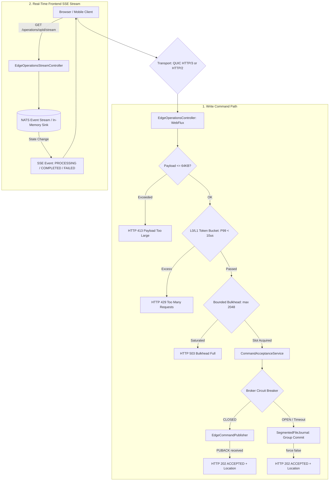
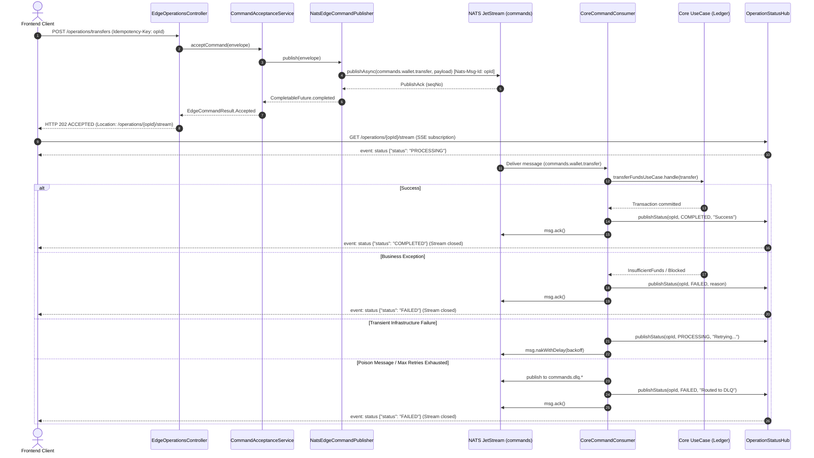

# 📐 Architecture Plan: PLAN-000.9 — Reactive Edge Gateway & Ingress Resilience

- **Associated Spec**: [`../SPEC-000.9-reactive-edge-gateway-and-ingress-resilience.md`](file:///.spec/SPEC-000.9-reactive-edge-gateway-and-ingress-resilience.md)
- **Status**: 🟢 **Approved (Frontend SSE & QUIC HTTP/3 Included)**
- **Author**: Antigravity Edge Architecture & Financial Reliability Team
- **Date**: 2026-09-09

---

## 1. Technical Strategy & Architecture Overview

The **Reactive Edge Gateway** (`:edge` subproject / `br.com.wallet.edge`) decouples external financial callers from core database connections and background workers. Organized as a dedicated Gradle module (`:edge`), its controllers delegate to a dedicated **`CommandAcceptanceService`**:
- **Multi-Protocol Edge Transport**: HTTP/3 over QUIC (UDP) with automatic HTTP/2 (TLS) fallback via `Alt-Svc`. While 0-RTT is supported for connection establishment and read queries, financial command mutations strictly enforce a **1-RTT handshake** to eliminate early-data replay risks (`REQ-EDG-020`).
- **Frontend Real-Time Push with Durable Visibility**: Server-Sent Events (SSE) streaming state changes (`PROCESSING` $\to$ `COMPLETED` / `FAILED`). Per `I-EDGE-007`, SSE is a notification layer, not the source of truth; re-connecting clients receive the latest durable operation state before subscribing to live transitions.
- **Core Failure Isolation**: Invariant `I-EDGE-008` ensures failure, saturation, or total downtime of PostgreSQL or core ledger pools does not prevent the Edge from performing durable acceptance via NATS or local spooling.
- **Configurable Bulkhead**: Dynamically limits concurrent inflight dispatches (`edge.bulkhead.max-inflight`, default 2,048).
- **Durable Acceptance Semantics**: Commands route to NATS JetStream; on broker timeout or circuit breaker open, commands spill over to a local preallocated `SegmentedFileJournal` with group-commit `force(false)` durability barrier.
- **Preallocated Segment Commit Policy**: Segment files (64MB) are preallocated and zeroed with `FileChannel.force(true)`. Sequential command appends inside an active segment invoke `FileChannel.force(false)`, avoiding repeated inode metadata sync overhead.
- **Fair Recovery Drain**: Restored broker connectivity triggers fair-scheduled draining (`edge.recovery.replay-share=0.80`, `edge.recovery.live-reserved-share=0.20`), ensuring reserved capacity for live traffic.
- **Reactive Health Probe**: `EdgeReadinessHealthIndicator` implements `ReactiveHealthIndicator` emitting `Mono<Health>`, maintaining non-blocking readiness state (`OUT_OF_SERVICE` during recovery scan, `UP` once operational).
- **Storage Incident Separation**: Disk CRC corruption halts segment replay and isolates the segment to forensic storage (`.corrupt`), never routing corrupted frames to DLQ (`REQ-EDG-018`).
- **Runtime & Framework Baseline**: Built on **Java 27** and **Spring Boot 4.2.0-M1** with Generational ZGC (`-XX:+UseZGC -XX:+ZGenerational`), native Netty HTTP/3 (QUIC) codecs, and Foreign Function & Memory (FFM) off-heap zero-copy journaling readiness.



---

## 2. Spring Modulith & Subproject Component Topology
 
```text
:edge (Gradle Subproject — br.com.wallet.edge)
├── api (Published Edge Contracts)
│   ├── EdgeCommandIngress.java               (API contract interface)
│   ├── EdgeCommandResult.java                (Sealed interface: Accepted, RateLimited, BulkheadFull, Saturated)
│   └── EdgeReadinessState.java               (State Machine Enum)
└── internal
    ├── ingress
    │   ├── EdgeOperationsController.java     (Non-blocking WebFlux / MVC command REST controllers)
    │   ├── EdgeOperationsStreamController.java (Reactive Server-Sent Events controller)
    │   ├── EdgeRequestValidator.java         (64KB payload size gate & schema validation)
    │   └── OperationStatusHub.java           (Status transition broadcaster for SSE)
    ├── transport
    │   ├── Http3QuicConfiguration.java       (Netty QUIC codec & Alt-Svc header injector)
    │   └── AltSvcWebFilter.java              (Injects Alt-Svc: h3=":8443"; ma=86400)
    ├── command
    │   ├── CommandType.java                  (Enum: TRANSFER=1, DEPOSIT=2, WITHDRAW=3)
    │   ├── CommandEnvelope.java              (Immutable record carrying opId, payload, timestamp, type)
    │   └── CommandAcceptanceService.java     (Decides broker vs journal route and enforces 202 semantics)
    ├── resilience
    │   ├── PerimeterRateLimiter.java         (Lock-free atomic token bucket per IP/tenant)
    │   ├── IngressBulkhead.java              (Configurable inflight limiter, default 2048)
    │   └── BrokerCircuitBreaker.java         (Resilience4j CB guarding NATS publisher)
    ├── journal
    │   ├── spi
    │   │   └── DurableSpilloverJournal.java  (SPI interface for append-only storage)
    │   └── segmented
    │       ├── SegmentHeader.java            (32B: Magic 0x57414C4A, Version 1, SegmentId, HeaderCRC32C)
    │       ├── JournalRecord.java            (In-memory command frame with sequence number)
    │       ├── BinaryRecordCodec.java        (54B binary encoder/decoder with Castagnoli CRC32C)
    │       ├── SegmentedFileJournal.java     (64MB preallocated chunk management)
    │       └── GroupCommitEngine.java        (1ms / 100-item batching, atomic FileChannel.force(false))
    ├── publisher
    │   └── EdgeCommandPublisher.java         (SPI interface injecting Nats-Msg-Id)
    └── recovery
        ├── JournalRecoveryWorker.java        (Fair 80/20 sequential NATS drainer)
        ├── SpoolAckTracker.java              (Tracks JetStream PUBACK before reclaiming segment space)
        └── EdgeReadinessHealthIndicator.java (Spring Boot Actuator ReactiveHealthIndicator)

:root (Main Application & Infrastructure — br.com.wallet.infrastructure)
├── messaging
│   ├── publisher
│   │   └── NatsEdgeCommandPublisher.java     (Production EdgeCommandPublisher publishing to commands.wallet.*)
│   └── consumer
│       └── CoreCommandConsumer.java          (Durable JetStream consumer dispatching to UseCases & OperationStatusHub)
```

---

## 3. Frontend Streaming & Multi-Protocol Transport

### 3.1 Server-Sent Events (SSE) Contract & Durable Visibility
- **Endpoint**: `GET /operations/{operationId}/stream`
- **Headers**: `Accept: text/event-stream`, `Cache-Control: no-cache`
- **Durable Visibility Gate (`I-EDGE-007`)**:
  SSE is a push notification mechanism, not the source of truth. Upon client connection:
  1. The controller first queries the durable storage (`OperationQueryUseCase` / `wallet_operations`).
  2. If the operation has already transitioned to a terminal state (`COMPLETED` or `FAILED`), it emits the terminal event immediately and terminates the stream with `onComplete()`.
  3. If the operation is still `PROCESSING` or pending, it registers the emitter in `OperationStatusHub` to receive live notifications from `EdgeCommandConsumer`.
- **Event Flow**:
  ```text
  event: status
  data: {"operationId": "a0000000-0000-0000-0000-000000000001", "status": "PROCESSING", "timestamp": "2026-09-09T14:00:01Z"}

  event: status
  data: {"operationId": "a0000000-0000-0000-0000-000000000001", "status": "COMPLETED", "timestamp": "2026-09-09T14:00:02Z"}
  ```
- **Lifecycle**: Stream terminates with `onComplete()` immediately upon emitting a terminal state (`COMPLETED` or `FAILED`).

### 3.2 HTTP/3 (QUIC) Transport & Fallback
- **QUIC over UDP**: Netty `Http3ServerConnectionHandler` listens on UDP 8443 for 0-RTT handshakes and connection migration.
- **Financial 1-RTT Invariant (`REQ-EDG-020`)**:
  0-RTT early data is restricted to TLS session resumption and replay-safe queries. Financial command mutations (`POST /operations/transfers`, `/deposits`, `/withdrawals`) strictly enforce a **1-RTT handshake**, preventing early-data network replay from duplicating liability before reaching application idempotency filters.
- **Alt-Svc Discovery**: HTTP/2 responses over TCP include:
  ```http
  Alt-Svc: h3=":8443"; ma=86400; persist=1
  ```
  Supporting browsers and mobile apps upgrade transparently on subsequent requests.

---

## 4. Binary Framing Specification (Segment & Record)

### 4.1 Segment File Header (32 Bytes)
```text
+-------------------+-------------------+-------------------+-------------------+
|  Magic (4 Bytes)  | Version (2 Bytes) |    Flags (2 Bytes)| SegmentId (8B)    |
|    0x57414C4A     |      0x0001       |       0x0000      | Monotonic counter |
+-------------------+-------------------+-------------------+-------------------+
| CreatedAt (8 Bytes) Epoch Millis      | HeaderCRC32C (4B) | Padding (4 Bytes) |
+-------------------+-------------------+-------------------+-------------------+
```

### 4.2 Individual Record Frame (54 Bytes Header + Payload)
```text
+-------------------+-------------------+-------------------+-------------------+
|  Magic (4 Bytes)  | Version (2 Bytes) |  Flags (2 Bytes)  |  Length (4 Bytes) |
+-------------------+-------------------+-------------------+-------------------+
|   CRC32C (4B)     | SequenceNumber (8 Bytes) Monotonic Record Identifier      |
+-------------------+-------------------+-------------------+-------------------+
|                OperationId (16 Bytes UUID Big-Endian)                         |
+-------------------+-------------------+-------------------+-------------------+
|     Timestamp (8 Bytes) Epoch Millis  | CommandType (2B)  | PayloadLength (4B)|
+-------------------+-------------------+-------------------+-------------------+
|                           Payload (N Bytes UTF-8 JSON)                        |
+-------------------------------------------------------------------------------+
```

---

## 5. Spool Capacity Watermarks & Admission Hysteresis

| Journal Utilization | Admission State | System Behavior |
| :--- | :--- | :--- |
| `< 70%` | `NORMAL` | Normal broker publication; full degraded spooling allowed. |
| `70% - 80%` | `WARNING` | Emit metric warning; spooling operational. |
| `80% - 95%` | `PRESSURE` | Stronger client shedding; priority to healthy broker path. |
| `≥ 95%` | `SATURATED` | Reject degraded acceptance with `HTTP 503 (Retry-After: 5)`. |
| `< 85% (post-sat)` | `RECOVERED` | Re-enable degraded acceptance (10% hysteresis buffer). |

---

## 6. Observability & SLO Metrics

14 Micrometer meters exported via OTel:
`edge_ingress_requests_total`, `edge_inflight_commands`, `edge_rate_limit_rejections_total`, `edge_bulkhead_rejections_total`, `edge_nats_publish_latency`, `edge_nats_circuit_breaker_state`, `edge_journal_append_latency`, `edge_journal_group_commit_size`, `edge_journal_fsync_latency`, `edge_journal_usage_bytes`, `edge_journal_usage_percent`, `edge_recovery_backlog_records`, `edge_replay_success_total`, `edge_journal_corruption_incidents_total`.

---

## 7. Edge-to-Core Bridge & Command Consumer Pipeline

### 7.1 Dataflow & Feedback Sequence


### 7.2 Consumer Configuration
- **Stream**: `commands` (covering `commands.*` and `commands.wallet.*`)
- **Durable Name**: `core-command-consumer`
- **Subjects**: `commands.wallet.*` (`commands.wallet.transfer`, `commands.wallet.deposit`, `commands.wallet.withdraw`)
- **Payload Enrichment**: `NatsEdgeCommandPublisher` injects `operationId` into JSON if missing and sets headers (`operation_id`, `type`, `Nats-Msg-Id`).
- **Terminal Notifications**: Direct invocation of `OperationStatusHub.publishStatus(...)` ensures zero latency push to waiting SSE subscribers without database polling.
- **Three-Tier Failure Handling**:
  1. *Business Rejection*: Emits `FAILED` to Hub, invokes `operationStateUseCase.markOperationFailed()`, and commits `msg.ack()`.
  2. *Transient Failure*: Emits `PROCESSING` to Hub and triggers JetStream `msg.nakWithDelay(backoff)`.
  3. *Poison Message / Exhaustion*: Routes to `commands.dlq.*`, emits `FAILED` to Hub, and commits `msg.ack()`.
