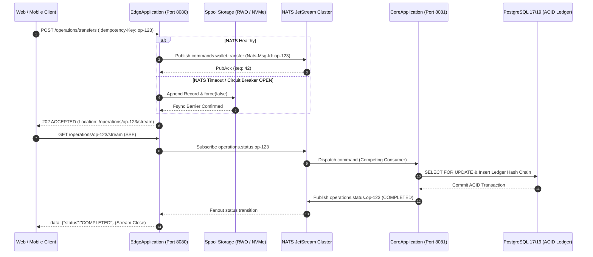

# 📐 Architecture Plan: PLAN-000.9.1 — Edge & Core Independent Runtimes & Process Separation

- **Associated Spec**: [`../SPEC-000.9.1-edge-core-independent-runtimes.md`](file:///.spec/SPEC-000.9.1-edge-core-independent-runtimes.md)
- **Governing Architecture**: [`../architecture/ARCH-000.9-reactive-edge-and-multi-process-topology.md`](file:///.spec/architecture/ARCH-000.9-reactive-edge-and-multi-process-topology.md)
- **Status**: 🟢 **Approved**
- **Author**: Antigravity Core & Edge Architecture Guild
- **Date**: 2026-09-11
- **Target Modules**: `:edge` (`br.com.wallet.edge`), `:core` (`br.com.wallet.core`), and Root Monolith (`br.com.wallet`)
- **Architectural Scope**: Enforces OS process isolation (`I-PROCESS-001`), contract decoupling (`I-CONTRACT-001`), zero-DB edge state (`I-STATE-001`), single-writer spool protection (`I-JOURNAL-001`), and dual-profile runtime flexibility (`I-RUNTIME-001`).

---

## 1. Technical Strategy & Architecture Overview

`PLAN-000.9.1` transitions the Wallet platform from a single-process deployment where `:edge` runs inside `WalletApplication` into **independently executable OS runtimes** within the same source repository:

1. **`EdgeApplication` (`wallet-edge.jar`)**:
   - Lean Spring Boot WebFlux application executing Netty HTTP/3 (QUIC) and HTTP/2.
   - Classpath and runtime completely exclude `spring-boot-starter-data-jpa`, `org.postgresql:postgresql`, and HikariCP. Relational database auto-configuration is explicitly excluded (`DataSourceAutoConfiguration`, `HibernateJpaAutoConfiguration`).
   - Connects directly to NATS JetStream to publish commands (`commands.wallet.*`) and subscribe to operation status transitions (`operations.status.*`).
   - Binds public ingress port `8080` (REST & SSE) and UDP `8443` (QUIC).
2. **`CoreApplication` (`wallet-core.jar` / root `WalletApplication`)**:
   - Headless transactional core service managing PostgreSQL 17/19 ACID ledger mutations, row-level locks (`SELECT FOR UPDATE`), and DragonflyDB hot fraud cache.
   - Public HTTP endpoints (`/operations/*`) are disabled in `multi-process` mode.
   - Runs management/actuator endpoints on internal port `8081`.
   - Consumes commands from NATS JetStream `commands.wallet.*` competing consumer group, executes domain use cases, and publishes terminal statuses to `operations.status.<operationId>`.
3. **Dual-Profile Runtime Mode (`wallet.runtime.mode`)**:
   - `multi-process` (Default for Production): Discrete JVM processes communicating over NATS JetStream.
   - `monolith` (Test/Development Profile): Both runtimes boot in a single JVM. Emits an explicit warning log at startup (`REQ-PRC-012`).
4. **Single-Writer Spool File Lock (`I-JOURNAL-001`)**:
   - To guarantee zero split-brain corruption, each `EdgeApplication` instance exclusively owns its local journal directory and acquires an exclusive OS lock (`FileChannel.tryLock()`) on `.spool.lock` upon boot. Startup aborts immediately if the directory is already locked by another process. Volume mapping profiles are defined in `SPEC-000.9.2`.



---

## 2. Spring Modulith, Module Topology & Packaging

```text
wallet/
├── edge/                                      (Subproject: wallet-edge.jar)
│   ├── build.gradle                           (bootJar enabled = true, jnats, webflux, NO jdbc)
│   └── src/main/java/br/com/wallet/edge/
│       ├── EdgeApplication.java              (Spring Boot Entry Point - ComponentScan edge & core)
│       ├── api/                               (Published Contracts: Zero DB Dependencies)
│       │   ├── CommandEnvelope.java           (Public command record with opId, payload, metadata)
│       │   ├── CommandType.java               (TRANSFER, DEPOSIT, WITHDRAW)
│       │   ├── OperationStatusResponse.java   (Public status response record)
│       │   ├── DurableOperationStatus.java    (PENDING, PROCESSING, COMPLETED, FAILED)
│       │   ├── EdgeCommandPublisher.java      (SPI interface for command dispatch)
│       │   └── DurableOperationStateProvider.java (SPI for querying durable operation state)
│       └── internal/
│           ├── config/
│           │   ├── EdgeNatsConfiguration.java (Standalone NATS Connection & JetStream Beans)
│           │   └── EdgeRuntimeProperties.java (Config properties: wallet.runtime.mode, ports)
│           ├── ingress/
│           │   ├── EdgeOperationsController.java
│           │   ├── EdgeOperationsStreamController.java
│           │   └── OperationStatusHub.java    (Subscribes to operations.status.* via NATS)
│           ├── command/
│           │   └── CommandAcceptanceService.java
│           ├── journal/
│           │   └── segmented/                 (SegmentedFileJournal, GroupCommitEngine, LockFile)
│           ├── recovery/
│           │   └── JournalRecoveryWorker.java (80/20 fair drain to NATS JetStream)
│           └── transport/
│               └── AltSvcWebFilter.java       (HTTP/3 Alt-Svc header injection)
│
├── core/                                      (Subproject: Shared Core Primitives)
│   ├── build.gradle                           (Pure domain library, NO persistence)
│   └── src/main/java/br/com/wallet/core/
│       ├── context/                           (TraceContext, OperationOrigin)
│       ├── exceptions/                        (AccountBlockedException, IdempotencyException)
│       └── tracing/                           (Traceable, TracingAspect)
│
└── src/main/java/br/com/wallet/               (Root Project: wallet-core.jar)
    ├── WalletApplication.java                 (Headless Transactional Core Entry Point)
    ├── infrastructure/
    │   ├── config/
    │   │   ├── CoreRuntimeConfiguration.java  (Port 8081 mgmt, disables Edge web controllers)
    │   │   └── NatsConfiguration.java         (Core NATS connection & stream definitions)
    │   └── messaging/
    │       ├── consumer/
    │       │   └── CoreCommandConsumer.java   (Subscribes commands.wallet.* -> UseCases)
    │       └── publisher/
    │           └── CoreStatusPublisher.java   (Publishes operations.status.<opId> to NATS)
    ├── ledger/                                (Double-entry accounting, Hash Chains, Row Locks)
    ├── fraud/                                 (Fraud Gate, Dragonfly cache, Rules)
    ├── savings/                               (Smart Savings Module)
    └── goals/                                 (Financial Goal & Cashflow Strategy)
```

---

## 3. Data Flow & Communication Contracts

### 3.1 NATS Subject Topology
| Subject | Producer | Consumer | Semantics | Invariants |
| :--- | :--- | :--- | :--- | :--- |
| `commands.wallet.<type>` | Edge (`NatsEdgeCommandPublisher`) | Core (`CoreCommandConsumer`) | Competing Consumer Group (`wallet-core-workers`), Durable | `I-IDEMPOTENCY-001`, `I-DEDUP-001` |
| `operations.status.<operationId>` | Core (`CoreStatusPublisher`) | Edge (`NatsOperationStatusListener` -> `OperationStatusHub`) | Canonical Ephemeral Fanout / Broadcast to all active Edge SSE hubs (`operations.status.*`) | `I-EDGE-007`, `I-STATUS-001` |
| `operations.query.<operationId>` | Edge (`NatsDurableOperationStateProvider`) | Core (`CoreOperationQueryResponder`) | Synchronous Request-Reply; Core resolves state authoritatively from PostgreSQL `wallet_operations` (returns NOT_FOUND if unrecorded); Edge emits DEGRADED_UNAVAILABLE on timeout | `I-STATE-001`, `I-EDGE-007` |

### 3.2 Command Envelope Payload Contract
```json
{
  "operationId": "a0000000-0000-0000-0000-000000000001",
  "commandType": "TRANSFER",
  "tenantId": "tenant-alpha",
  "clientIp": "192.168.1.100",
  "timestamp": "2026-09-10T21:30:00Z",
  "replayed": false,
  "payload": {
    "sourceAccountId": "b1000000-0000-0000-0000-000000000001",
    "targetAccountId": "b2000000-0000-0000-0000-000000000002",
    "amount": "150.00"
  }
}
```

### 3.3 Operation Status Event Contract
```json
{
  "operationId": "a0000000-0000-0000-0000-000000000001",
  "status": "COMPLETED",
  "failureReason": null,
  "completedAt": "2026-09-10T21:30:01.050Z"
}
```

---

## 4. Architecture Decision Records (ADRs)

### ADR-000.9.1-01: Discrete BootJars in a Monorepo
- **Context**: Monolithic packaging tightly binds Edge ingress to Core JVM lifecycles, risking total failure on DB exhaustion or GC storms. Microrepo fragmentation incurs high maintenance tax.
- **Decision**: Keep single Gradle monorepo, configure `:edge` subproject with `bootJar { enabled = true; archiveFileName = 'wallet-edge.jar' }`, and configure root with `bootJar { archiveFileName = 'wallet-core.jar' }`.
- **Consequence**: Independent deployments and scaling without repository sprawl.

### ADR-000.9.1-02: Zero-Database Classpath for Edge Runtime
- **Context**: Accidental leakage of Spring Data JPA or JDBC into Edge creates connection pool allocation and startup failures when PostgreSQL is unreachable (`I-EDGE-008`).
- **Decision**: `:edge` Gradle dependencies explicitly exclude all JDBC, Hibernate, and PostgreSQL drivers. `EdgeApplication` disables `DataSourceAutoConfiguration`.
- **Consequence**: Edge starts in $< 1.5\text{s}$ and operates strictly with Netty, local file I/O, and NATS JetStream.

### ADR-000.9.1-03: Single-Writer Lock Protection for Spool Volumes
- **Context**: Option A (Local NVMe) and Option B (Dedicated CSI RWO Block Volume) must never be accessed by multiple writers concurrently, which causes binary segment corruption (`I-JOURNAL-001`).
- **Decision**: `SegmentedFileJournal` acquires an exclusive OS lock (`FileChannel.tryLock()`) on `${edge.journal.spool-dir}/.spool.lock`.
- **Consequence**: If a second instance attempts to mount the same volume, it fails fast at startup. Zero split-brain risk.

### ADR-000.9.1-04: Dual-Profile Runtime (`multi-process` vs `monolith`)
- **Context**: Developers need fast local iteration and single-command startup (`./gradlew bootRun`), while production mandates strict process isolation.
- **Decision**: Introduce `wallet.runtime.mode` property. When set to `monolith`, root boots with both Edge controllers and Core consumers active. When set to `multi-process` (default), root acts purely as headless Core, while `EdgeApplication` acts purely as Edge ingress.
- **Consequence**: Maximizes developer ergonomics without sacrificing production resilience.

### ADR-000.9.1-05: Coordinated SIGTERM Graceful Shutdown & Financial ACK Durability
- **Context**: Uncoordinated pod termination during container redeployment risks dropping in-flight fsync batches or leaving unacknowledged NATS commands in limbo.
- **Decision**: Standardize `server.shutdown=graceful` with 30s grace period. Edge catches SIGTERM, marks readiness `OUT_OF_SERVICE`, sheds ingress, flushes active `GroupCommitEngine` batches, and terminates (`I-GRACEFUL-001`). Core stops pulling messages, finishes active transactions, and ACKs ONLY after durable ledger persistence (`I-ACK-001`).
- **Consequence**: Zero data loss during rolling deployments and zero phantom financial commitments across crashes and termination cycles.

---

## 5. Failure Modes & Boundary Security

| Scenario | Detection & Gate | Recovery / Behavioral Outcome |
| :--- | :--- | :--- |
| **Core Process OOM / Crash** | NATS consumer ping drops | Edge continues 202 acceptance, buffers in JetStream or local spool. Zero dropped requests (`I-PROCESS-001`). |
| **Edge Ingress Unauthorized DB Import** | ArchUnit test (`ProcessBoundaryArchitectureTest`) | Build fails immediately if `:edge` references JDBC/JPA or Core internal packages (`I-CONTRACT-001`). |
| **Spool Mount Conflict (Split-Brain)** | `FileChannel.tryLock()` returns `null` | Second pod halts with `IllegalStateException: Spool directory already locked by active Edge instance`. |
| **Core Port Conflict** | Spring Boot startup check | Core binds strictly to port `8081`; startup aborts if `8080` is attempted (`I-PORT-001`). |
| **Monolith Mode in Production** | `wallet.runtime.mode=monolith` detected | System emits high-visibility `WARN` log on application startup (`REQ-PRC-012`). |

---

## 6. Zero Spec-Drift Verification Plan

1. **Gradle Build Verification**:
   - Verify `./gradlew :edge:bootJar` generates `edge/build/libs/wallet-edge.jar`.
   - Verify `./gradlew bootJar` generates `build/libs/wallet-core.jar`.
2. **Architecture Boundary Verification**:
   - `ProcessBoundaryArchitectureTest`: ArchUnit rule asserting zero dependencies from `br.com.wallet.edge..` to `br.com.wallet.ledger..`, `br.com.wallet.fraud..`, and persistence libraries.
3. **Integration Test Matrix**:
   - `EdgeStandaloneIT`: Boots `wallet-edge.jar` with `RestTestClient` (Spring Boot 4.1+) and Testcontainers NATS, verifying zero database beans, HTTP 202 acceptance, and health probe.
   - `CoreHeadlessIT`: Boots `wallet-core.jar` with `RestTestClient` and Testcontainers PostgreSQL, verifying port 8081 management and absence of `/operations/*` routes (HTTP 404).
   - `MultiProcessClusterIT`: Boots both runtimes simultaneously in separate processes, executing transfer commands end-to-end via NATS JetStream.
