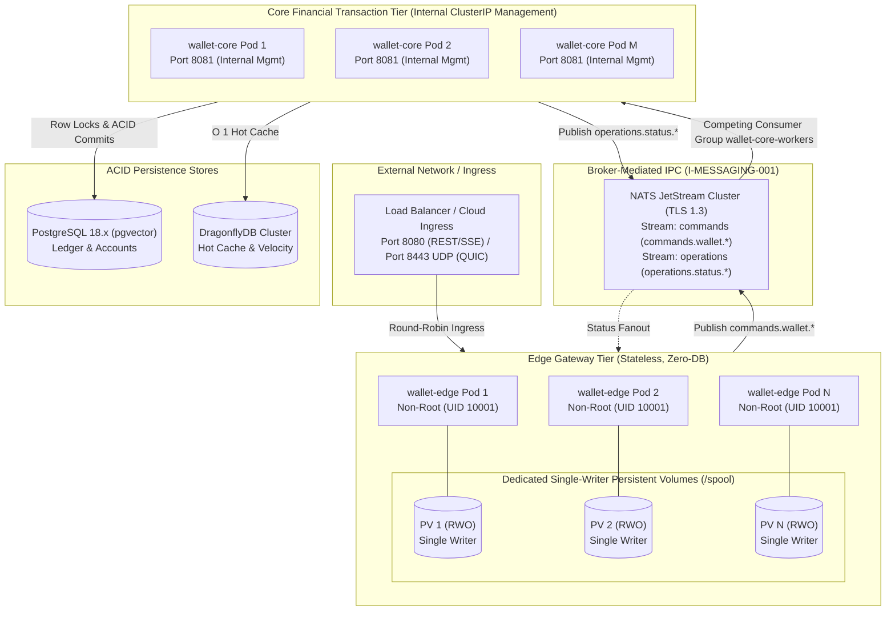
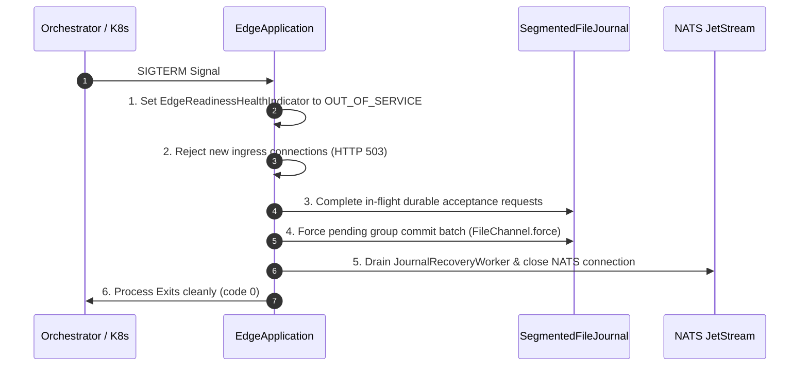
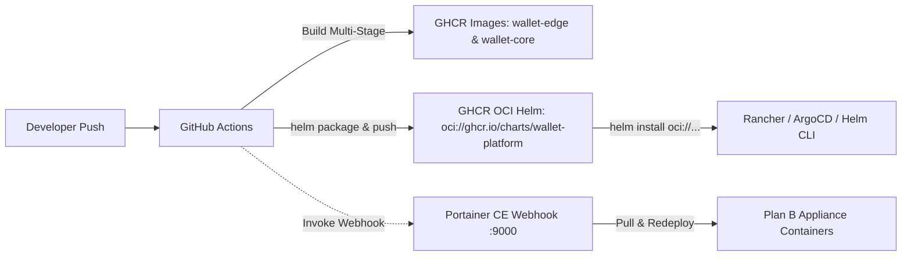

# 📐 Architecture Plan: PLAN-000.9.2 — Containerized Multi-Process Topology & Platform Packaging

- **Associated Spec**: [`../SPEC-000.9.2-containerized-multi-process-topology.md`](file:///.spec/SPEC-000.9.2-containerized-multi-process-topology.md)
- **Governing Architecture**: [`../architecture/ARCH-000.9-reactive-edge-and-multi-process-topology.md`](file:///.spec/architecture/ARCH-000.9-reactive-edge-and-multi-process-topology.md)
- **Status**: 🟢 **Approved**
- **Author**: Antigravity Platform Infrastructure & Edge Resilience Guild
- **Date**: 2026-09-13
- **Target Modules**: `:edge` (`wallet-edge.jar`), Root Application (`wallet-core.jar`), Container Infrastructure (`dockerfile`, `docker-compose.yaml`, `deploy/helm/wallet-platform`)
- **Architectural Scope**: Enforces independent horizontal scaling (`I-TOPOLOGY-001`), discrete hardened OCI packaging (`I-CONTAINER-001`), single-writer spool volume isolation (`I-STORAGE-001`, `I-STORAGE-002`), broker-mediated IPC (`I-MESSAGING-001`), coordinated shutdown lifecycles (`I-LIFECYCLE-001`, `I-LIFECYCLE-002`), and security plumbing hooks for Phase 000.9.3 (`REQ-TOP-012`).
- **Governing Skills**: [`onprem-infrastructure`](file:///.agents/skills/onprem-infrastructure/SKILL.md) (Rancher, SUSE Virtualization, vCluster, and HCI add-on architecture).

---

## 1. Technical Strategy & Macro Topology

`PLAN-000.9.2` physicalizes the logical separation established in Phase 000.9.1. Edge and Core exhibit fundamentally different operational, resource, and failure characteristics:
- **Edge Gateway (`wallet-edge`)**: I/O-bound reactive Netty runtime handling external HTTP/3 (QUIC) and HTTP/2 ingress, rate limiting, and local segmented journal `fsync`. Zero relational persistence dependencies (`I-CONTAINER-001`). Scales on network concurrency, active SSE streams, and request rate.
- **Core Financial Engine (`wallet-core`)**: CPU- and transaction-bound engine executing ACID ledger mutations, `SELECT FOR UPDATE` account locks, fraud graphs, and smart savings sweeps. Exposes internal ClusterIP Service on port 8081 strictly for management/metrics, zero public HTTP ingress. Scales on NATS JetStream consumer lag and processing latency (`I-MESSAGING-001`).



---

## 2. Packaging & Container Hardening Design

### 2.1 Multi-Stage OCI Dockerfile
The repository Dockerfile (`dockerfile`) uses multi-stage builds producing hardened, minimal OCI images on JDK 27 runtime (pinned in Dockerfile to Valhalla Early Access):

```dockerfile
# Stage 1: Build
FROM oraclelinux:9-slim AS builder
# ... Compile :bootJar and :edge:bootJar) ...

# Stage 2: Hardened Edge Runtime (wallet-edge)
FROM oraclelinux:9-slim AS edge
RUN useradd -u 10001 -m -s /bin/sh wallet && \
    mkdir -p /spool && chown -R 10001:10001 /spool && chmod 700 /spool
USER 10001:10001
WORKDIR /app
COPY --from=builder --chown=10001:10001 /app/edge/build/libs/wallet-edge.jar app.jar
VOLUME ["/spool"]
EXPOSE 8080 8443/udp
ENTRYPOINT ["java", "-Duser.timezone=UTC", "-XX:MaxRAMPercentage=75", "-jar", "app.jar"]

# Stage 3: Hardened Core Runtime (wallet-core)
FROM oraclelinux:9-slim AS core
RUN microdnf install -y libstdc++ libgomp curl && microdnf clean all && \
    useradd -u 10001 -m -s /bin/sh wallet
USER 10001:10001
WORKDIR /app
COPY --from=builder --chown=10001:10001 /app/build/libs/wallet-core.jar app.jar
EXPOSE 8081
ENTRYPOINT ["java", "-Duser.timezone=UTC", "--enable-native-access=ALL-UNNAMED", "-XX:MaxRAMPercentage=75", "-jar", "app.jar"]
```

### 2.2 Strict Classpath Boundary Assertions (`I-CONTAINER-001`)
Automated test `ContainerImageVerificationTest` validates that `wallet-edge.jar` contains zero references to:
- `org.postgresql:postgresql`
- `spring-boot-starter-data-jpa` / Hibernate
- `com.zaxxer:HikariCP`
- `org.flywaydb:flyway-core`

---

## 3. Storage Architecture & Single-Writer Isolation

### 3.1 Single-Writer Spool Ownership & Non-Root Permissions (`I-STORAGE-001`, `I-CONTAINER-001`)
- Each `wallet-edge` container exclusively owns its mounted `/spool` directory.
- `SegmentedFileJournal` acquires an OS-level file lock on `${SPOOL_DIR}/.spool.lock` via `FileChannel.tryLock()`.
- If a container is rescheduled or cloned and attempts to mount an active directory, startup halts with `IllegalStateException`.
- Under non-root execution (`UID 10001:10001`), mounted volumes are guaranteed write access via:
  - **Docker Compose (Plan A & B)**: An ephemeral `spool-init` helper container mounts the volume as root before Edge starts, executing `mkdir -p /spool && chown -R 10001:10001 /spool && chmod 700 /spool && chmod -R u+rwX /spool`.
  - **Kubernetes (Plan C & D)**: `podSecurityContext.fsGroup: 10001` automatically configures volume group ownership.
  - **Runtime Diagnostics**: `SegmentedFileJournal` wraps `AccessDeniedException` on lock or segment acquisition with actionable remediation messages.

### 3.2 Dual Storage Profile Durability Scopes (`I-STORAGE-002`)
| Profile | Volume Mechanism | Durability Guarantee | Target Topology |
| :--- | :--- | :--- | :--- |
| **Option A (HostPath NVMe)** | Host NVMe bind mount | Node-local restart durability while host survives. No pod-reschedule durability. | Bare-metal high-throughput appliances (Profile P1). |
| **Option B (Dedicated CSI RWO Block)** | Dedicated Cloud PV (`ReadWriteOnce`) | Pod-reschedule durability where CSI provider re-attaches volume to replacement pod. | Enterprise Cloud & Kubernetes clusters (Profile P2, P3). |

### 3.3 Hysteresis Gate (`I-EDGE-005`)
In broker-degraded scenarios, `SpoolWatermarkGate` monitors disk capacity:
- Rejects new incoming commands (`HTTP 503 SERVICE_UNAVAILABLE`) when `/spool` usage $\ge 95\%$.
- Resumes command admission only after background recovery drains usage below $85\%$.

---

## 4. Cost-Tiered Deployment Profiles Matrix

```text
               ┌────────────────────────────────────────────────────────────────────────┐
               │                      Cost-Tiered Deployment Profiles                   │
               └───────┬────────────────┬──────────────────────┬────────────────────────┘
                       │                │                      │
                       ▼                ▼                      ▼
                 ┌──────────┐     ┌───────────┐          ┌───────────┐
                 │  Plan A  │     │  Plan B   │          │  Plan C   │ ──> Plan D (GKE)
                 │ Local Dev│     │ Low-Cost  │          │ Enterprise│
                 │ Compose  │     │ Non-K8s   │          │ Rancher/HC│
                 └──────────┘     └───────────┘          └───────────┘
```

### 4.1 Plan A: Local Dev & CI (`docker-compose.yaml` / Zero Infrastructure Cost)
- Runs discrete containers on bridge network `wallet-net`:
  - `wallet-edge`: Ingress port `8080`, UDP `8443`, isolated named volume `edge-spool`.
  - `wallet-app`: Core port `8081`, depends on `nats`, `dragonfly`, `postgres`, `otel-collector`.
  - Infrastructure: `postgres` (pgvector 18), `dragonfly` (v1.40.1 UDS + TCP), `nats` (JetStream enabled), `otel-collector`, `openobserve`.
- Healthcheck orchestration: Core checks `/actuator/health`; Edge checks `/actuator/health/readiness`.

### 4.2 Plan B: Low-Cost Lean On-Prem Appliance (Pure Non-K8s Docker Compose + Portainer CE)
- **Target**: Branch appliances, single bare-metal servers, and budget-constrained deployments.
- **Cost Minimization**: Eliminates Kubernetes control plane tax entirely (no multi-node etcd, no API server overhead; saves $>8\text{GB}$ RAM and 4+ CPU cores).
- **Orchestration**: Runs multi-container stack via Docker Engine & Docker Compose directly on bare-metal host or lightweight VM (`docker-compose.appliance.yaml`). Zero Kubernetes or K3s overhead.
- **Visual Management UI**: Bundles **Portainer CE** (`portainer/portainer-ce:latest`) listening on HTTP `9000` / HTTPS `9443` bound to `/var/run/docker.sock`. Gives operators visual stack deployments, container health monitoring, log viewing, and restart controls without needing CLI access.
- **Ultra-Light Telemetry**: Employs **VictoriaLogs** (`victoriametrics/victoria-logs:latest`, ~30–50MB RAM) for structured logs and **VictoriaTraces** (`victoriametrics/victoria-traces:latest`, ~40–60MB RAM) for distributed traces, ingested via OpenTelemetry Collector (`docker/otel-collector-appliance-config.yml`). Slashes telemetry overhead from ~1.5GB (OpenObserve) to $<150\text{MB}$ RAM total.
- **Storage**: Direct HostPath NVMe mounts at `/spool` for Edge and direct disk for PostgreSQL (`Option A`, `I-STORAGE-002`). Zero storage licensing, zero network SAN latency.
- **Footprint**: Resource limits strictly capped at ~5.8 GB RAM total (including Portainer 128MB, VictoriaLogs 256MB, VictoriaTraces 256MB), fitting comfortably well below the $<8\text{GB}$ constraint.

### 4.3 Plan C: Medium-Cost Enterprise On-Prem (Rancher Full + SUSE Virtualization / Harvester HCI)
- **Target**: Regional enterprise data centers, regulated private banking clouds, multi-tenant appliances.
- **Orchestration**: Full SUSE Virtualization (Harvester HCI) + Rancher Open Source + RKE2 + Harvester Add-ons:
  - **VM Auto-Balance**: Live migration shifting Core/NATS workloads non-disruptively during node maintenance.
  - **Kube-OVN**: Distributed firewall, micro-segmentation isolating Core port `8081` (`REQ-TOP-012`).
  - **LVM Local Storage**: Direct NVMe IOPS for `/spool` and PostgreSQL, bypassing Longhorn 3x network replication penalty.
  - **vCluster**: Isolated virtual Kubernetes control planes per tenant inside a shared RKE2 guest cluster.
- **Manifests**: Helm chart under `deploy/helm/wallet-platform` with independent Edge deployment, internal Core ClusterIP management Service (port 8081), and PodDisruptionBudget.

### 4.4 Plan D: Public Cloud Elastic Scale (GKE Standard / EKS)
- **Target**: Hyperscale multi-region deployments with elastic autoscaling.
- **Orchestration**: GKE Standard with cloud-managed load balancers, Cloud Persistent Disks (`ReadWriteOnce`), and Horizontal Pod Autoscalers:
  - `EdgeHPA`: Scales on CPU ($>70\%$), active connections, and HTTP RPS.
  - `CoreHPA`: Scales on NATS JetStream consumer lag (`commands.wallet.*` backlog $> 500$ msgs).

---

## 5. Coordinated Shutdown Lifecycle Contracts

### 5.1 Grace Period Sizing (`REQ-TOP-009`)
Containers configure `terminationGracePeriodSeconds: 30`. Application shutdown deadline is configured to 20s (`spring.lifecycle.timeout-per-shutdown-phase: 20s`), ensuring a 10s safety buffer before Kubernetes issues `SIGKILL`.

### 5.2 Edge Shutdown Ordering (`I-LIFECYCLE-001`)


### 5.3 Core Transaction-Commit ACK Safety (`I-LIFECYCLE-002`)
During shutdown:
1. Core pauses pulling new messages from JetStream consumer.
2. For messages currently processing: Core finishes domain logic, commits PostgreSQL transaction (`SELECT FOR UPDATE`), and sends NATS `Message.ack()`.
3. If PostgreSQL fails or crashes, message is NOT ACKed and remains available in JetStream for peer replicas.

---

## 6. Security & Secret Injection Boundary (Hook for 000.9.3 — REQ-TOP-012)

`REQ-TOP-012` establishes the platform infrastructure required by Phase 000.9.3:
1. **TLS Transport Capabilities**: Ingress manifests and Docker Compose support TLS certificates mounted into `/etc/ssl/certs/`. TLS termination and re-encryption policies are deployment-profile concerns finalized in `SPEC-000.9.3`.
2. **Secret Externalization**: Secrets (`NATS_TOKEN`, `SPRING_DATASOURCE_PASSWORD`, future HMAC keys) are injected via platform-native Kubernetes Secrets / environment variables, never committed to git or baked into OCI layers.
3. **Core Network Isolation**: Core exposes internal management port `8081` only via ClusterIP Service and NetworkPolicy. Public Ingress routes strictly to `wallet-edge`. All financial command processing is broker-mediated over NATS JetStream (`I-MESSAGING-001`).

---

## 7. Automated OCI Delivery & Appliance GitOps (`REQ-TOP-016` to `REQ-TOP-019`)



### 7.1 GitHub Container Registry (GHCR) Publishing (`REQ-TOP-016`)
- Workflow `.github/workflows/ci-cd-appliance.yml` activates on push to `main` branch and `v*` release tags.
- Uses `docker/build-push-action` with Docker Buildx and GitHub Actions cache (`type=gha`).
- Multi-stage targets: builds `edge` (`ghcr.io/${{ github.repository }}/wallet-edge`) and `core` (`ghcr.io/${{ github.repository }}/wallet-core`).
- Tags generated: `latest`, branch slug, and short git commit SHA.

### 7.2 Unified Helm OCI Artifact Distribution (`REQ-TOP-017`)
- Leverages native Helm 3.8+ OCI registry support, eliminating the legacy `gh-pages` branch, `index.yaml`, and static web server overhead.
- Packages `deploy/helm/wallet-platform` and pushes the `.tgz` archive as an OCI artifact directly to `oci://ghcr.io/${{ github.repository }}/charts` authenticated via `GITHUB_TOKEN`.
- Consumed friction-free by Plan C (Harvester HCI / Rancher) and Plan D (GKE) without needing `helm repo add`:
  ```bash
  helm upgrade --install wallet-platform oci://ghcr.io/<owner>/charts/wallet-platform \
    --version 0.1.0 \
    -f deploy/helm/wallet-platform/values-harvester.yaml
  ```
- Supports referencing charts by immutable digest (`@sha256:...`) for enterprise zero-trust supply chain compliance (`REQ-TOP-019`).

### 7.3 Portainer GitOps & Appliance Continuous Deployment (`REQ-TOP-018`)
- Plan B on-prem appliance integrates with CI/CD via:
  1. **Webhook-Triggered Auto-Deploy (Primary)**: Portainer exposes a unique webhook URL for the appliance stack. The CI/CD workflow invokes `POST $PORTAINER_WEBHOOK_URL` following successful GHCR image publishing. Portainer immediately pulls updated images and performs an in-place restart.
  2. **Git-Backed Stack Polling (Fallback)**: Alternatively, Portainer connects directly to the repository Git URL and polls for changes to `docker-compose.appliance.yaml` at configured intervals.

---

## 8. Architecture Decision Records (ADRs)

### ADR-000.9.2-01: Discrete Hardened OCI Containers with Non-Root Execution
- **Context**: Running containers as root introduces severe container breakout vulnerabilities. Packaging single images with conditional binaries violates `I-CONTAINER-001`.
- **Decision**: Multi-stage build producing discrete `wallet-edge` (lean, no JDBC) and `wallet-core` images running under dedicated UID `10001:10001`.
- **Consequence**: Full compliance with enterprise container security gates and `readOnlyRootFilesystem` compatibility.

### ADR-000.9.2-02: Independent Horizontal Scaling via NATS Competing Consumers
- **Context**: Prior specs mandated $N \ne M$, which was an arbitrary and mathematically flawed restriction. Edge and Core exhibit different resource bottlenecks.
- **Decision**: Formalize $N \ge 1, M \ge 1$ as independent variables (`I-TOPOLOGY-001`). Core replicas join JetStream competing consumer group `wallet-core-workers` without process affinity.
- **Consequence**: Operators can run $(N=2, M=2)$, $(N=5, M=2)$, or $(N=2, M=10)$ depending on write vs processing loads.

### ADR-000.9.2-03: Single-Writer Spool Isolation & Explicit Durability Scopes
- **Context**: The journal requires single-writer access (`ConcurrentWriters = 1`). Cloud block volumes and host local storage offer different failure characteristics.
- **Decision**: Document explicit durability guarantees: HostPath provides node-local restart durability; CSI RWO provides pod-reschedule durability where supported (`I-STORAGE-002`). `FileChannel.tryLock()` serves as an active safety barrier against accidental multi-mount.

### ADR-000.9.2-04: Strict Shutdown Ordering with Core ACK Durability
- **Context**: Rolling container upgrades risk dropping in-flight journal writes or premature NATS message ACKs before PostgreSQL commits.
- **Decision**: Enforce coordinated shutdown ordering for Edge (`I-LIFECYCLE-001`) and assert Core commits transactions before ACKing (`I-LIFECYCLE-002`).

### ADR-000.9.2-05: Unified GHCR OCI Distribution for Images and Helm Charts
- **Context**: Distributing container images on GHCR while maintaining a separate GitHub Pages branch for Helm `index.yaml` creates fragmented infrastructure and branch management complexity.
- **Decision**: Consolidate all artifacts into GitHub Container Registry (`ghcr.io`) using native OCI artifact support for both Docker containers and Helm charts (`oci://ghcr.io/...`). Plan B appliance auto-deploys via Portainer Webhooks.
- **Consequence**: Zero auxiliary infrastructure, zero extra branches (`gh-pages` eliminated), uniform authentication (`GITHUB_TOKEN`), and support for immutable sha256 digest pinning across both images and charts.

---

## 9. Failure Modes & Boundary Resilience

| Scenario | Immediate Detection | System Impact | Automated Recovery / Mitigation |
| :--- | :--- | :--- | :--- |
| **Core Process Crash / OOM** | NATS consumer heartbeat drops | Zero impact on Edge ingress | Edge continues accepting commands while broker/spool capacity permits. Replacement Core resumes consumer group (`I-PROCESS-001`). |
| **Edge Container Restart** | K8s liveness failure | Pod restarts on same node/volume | `JournalRecoveryWorker` scans `/spool`, recovers unACKed segments, and drains to NATS (`I-EDGE-004`). |
| **Spool Mount Conflict** | `.spool.lock` lock attempt fails | Pod fails fast at boot | Second pod halts with `IllegalStateException`, preventing split-brain corruption (`I-STORAGE-001`). |
| **NATS Broker Outage** | `BrokerCircuitBreaker` trips `OPEN` | Ingress switches to local spool | Edge writes commands to 64MB segments with group-commit `fsync`, returning `202 ACCEPTED` (`I-EDGE-001`). |
| **Graceful Shutdown Timeout** | K8s sends SIGTERM | Readiness set `OUT_OF_SERVICE` | Edge flushes pending journal batch and drains within 20s. K8s allows 30s grace before SIGKILL (`I-LIFECYCLE-001`). |

---

## 10. Zero Spec-Drift Verification Plan

1. **Packaging & Boundary Verification**:
   - `ContainerImageVerificationTest`: Inspects `wallet-edge.jar` classpath to assert absence of JDBC/JPA/Postgres classes, and inspects Dockerfile layers for non-root UID `10001`.
2. **Topology & Orchestration Verification**:
   - `DockerComposeSmokeIT`: Boots multi-container environment via Testcontainers / Compose, verifying independent execution and end-to-end transfer acceptance.
   - `ScalingTopologyTest`: Asserts JetStream competing consumer distribution across multiple Core instances ($M \ge 2$) from multiple Edge nodes ($N \ge 2$) without message duplication.
3. **Storage & Durability Verification**:
   - `SpoolVolumePersistenceIT`: Simulates container restart and verifies segment recovery from mounted persistent volume.
4. **Lifecycle & Shutdown Verification**:
   - `GracefulShutdownIT`: Emits SIGTERM to running Edge process and verifies that in-flight group commit batches are fully forced to disk before shutdown.
