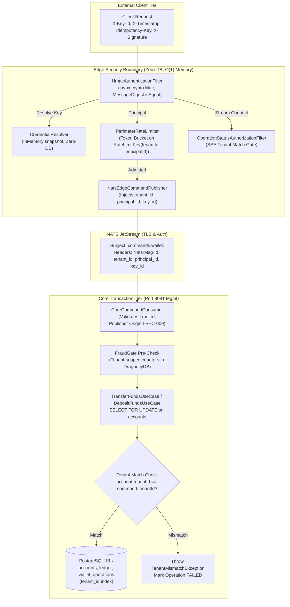

# 📐 Architecture Plan: PLAN-000.9.3 — HMAC-Signed Ingress & Multi-Tenant Security Boundary

- **Associated Spec**: [`../SPEC-000.9.3-hmac-signed-ingress-and-tenant-boundaries.md`](file:///.spec/SPEC-000.9.3-hmac-signed-ingress-and-tenant-boundaries.md)
- **Governing Architecture**: [`../architecture/ARCH-000.9.3-hmac-signed-ingress-and-tenant-boundaries.md`](file:///.spec/architecture/ARCH-000.9.3-hmac-signed-ingress-and-tenant-boundaries.md)
- **Status**: 🟢 **Approved**
- **Author**: Antigravity Platform Security & Edge Architecture Guild
- **Date**: 2026-09-13
- **Target Modules**: `:core` (`br.com.wallet.core`), `:edge` (`br.com.wallet.edge`), Root Application (`br.com.wallet.ledger`, `br.com.wallet.infrastructure`)
- **Governing Skills**: [`perimeter-security`](file:///.agents/skills/perimeter-security/SKILL.md), [`capability-driven-development`](file:///.agents/skills/capability-driven-development/SKILL.md)

---

## 1. Technical Strategy & Component Architecture

`PLAN-000.9.3` eliminates identity spoofing and establishes strict multi-tenant boundaries across the ingress, messaging, and transactional persistence layers:


```mermaid
flowchart TD
    subgraph Client["External Client Tier"]
        C["Client Request<br/>X-Key-Id, X-Timestamp, Idempotency-Key, X-Signature"]
    end

    subgraph EdgePerimeter["Edge Security Boundary (Zero-DB, O(1) Memory)"]
        HAF["HmacAuthenticationFilter<br/>(javax.crypto.Mac, MessageDigest.isEqual)"]
        CR["CredentialResolver<br/>(InMemory snapshot, Zero-DB)"]
        PRL["PerimeterRateLimiter<br/>(Token Bucket on RateLimitKey(tenantId, principalId))"]
        OSAF["OperationStatusAuthorizationFilter<br/>(SSE Tenant Match Gate)"]
        PUB["NatsEdgeCommandPublisher<br/>(Injects tenant_id, principal_id, key_id)"]

        HAF -->|Resolve Key| CR
        HAF -->|Principal| PRL
        PRL -->|Admitted| PUB
        HAF -->|Stream Connect| OSAF
    end

    subgraph MessagingFabric["NATS JetStream (TLS & Auth)"]
        NATS["Subject: commands.wallet.<type><br/>Headers: Nats-Msg-Id, tenant_id, principal_id, key_id"]
    end

    subgraph CoreDomain["Core Transaction Tier (Port 8081 Mgmt)"]
        CCC["CoreCommandConsumer<br/>(Validates Trusted Publisher Origin I-SEC-009)"]
        FG["FraudGate Pre-Check<br/>(Tenant-scoped counters in DragonflyDB)"]
        TX["TransferFundsUseCase / DepositFundsUseCase<br/>SELECT FOR UPDATE on accounts"]
        TC{"Tenant Match Check<br/>account.tenantId == command.tenantId?"}
        DB[("PostgreSQL 18.x<br/>accounts, ledger, wallet_operations<br/>(tenant_id index)")]
        EX["Throw TenantMismatchException<br/>Mark Operation FAILED"]

        CCC --> FG --> TX --> TC
        TC -->|Match| DB
        TC -->|Mismatch| EX
    end

    C --> HAF
    PUB --> NATS
    NATS --> CCC
```

---

## 2. Interface Contracts & Component Specifications

### 2.1 Core Shared Primitives (`:core`)
- [`TenantMismatchException`](file:///core/src/main/java/br/com/wallet/core/exceptions/TenantMismatchException.java): Runtime exception thrown when account `tenantId` does not match the command's derived `tenantId`.
- [`SecurityHeaders`](file:///core/src/main/java/br/com/wallet/core/security/SecurityHeaders.java): Standard constants:
  - `X-Key-Id`: `X-Key-Id`
  - `X-Timestamp`: `X-Timestamp`
  - `X-Signature`: `X-Signature`
  - `Idempotency-Key`: `Idempotency-Key` (or `X-Operation-Id`)
  - Canonical protocol version: `WALLET-HMAC-V1`

### 2.2 Edge Perimeter Components (`:edge`)
- **Credential Domain Models**:
  - `CredentialMetadata`: `record CredentialMetadata(String keyId, String tenantId, String principalId, Set<String> permissions, boolean active)`
  - `CredentialMaterial`: `final class CredentialMaterial` holding `byte[] secret` with defensive cloning and zero-string retention.
  - `AuthenticatedPrincipal`: `record AuthenticatedPrincipal(String principalId, String tenantId, String keyId, Set<String> permissions)`
  - `CredentialSnapshot`: Immutable snapshot supporting at least two simultaneously valid credential versions during rotation (`REQ-SEC-010`).
- **`CredentialResolver` SPI**:
  - `record ResolvedCredential(CredentialMetadata metadata, CredentialMaterial material)`
  - Interface `CredentialResolver` defining `Optional<ResolvedCredential> resolve(String keyId)`.
  - Implementation `InMemoryCredentialResolver`: Pre-loads test/bootstrap credentials and production secrets into an unmodifiable concurrent map with zero database dependencies (`I-SEC-003`). Supports zero-downtime key rotation (`REQ-SEC-010`).
- **Canonical Request Builder & Verifier**:
  - `HmacCanonicalizer`: Deterministically builds:
    $$\text{"WALLET-HMAC-V1\n"} + \text{METHOD} + \text{"\n"} + \text{CanonicalPath} + \text{"\n"} + \text{CanonicalQuery} + \text{"\n"} + \text{KEY_ID} + \text{"\n"} + \text{TIMESTAMP} + \text{"\n"} + \text{OP_ID} + \text{"\n"} + \text{HEX_BODY_SHA256}$$
    - Path: RFC 3986 normalized.
    - Query: sorted lexicographically by encoded key then encoded value (empty query = empty line).
    - Body: exact transmitted UTF-8 bytes (empty body = SHA-256 of empty bytes `e3b0c442...`).
    - Lowercase hex encoding for digests and signatures.
    - The canonical request MUST NOT contain a trailing newline.
  - `HmacSignatureVerifier`: Computes HMAC-SHA-256 using JDK 27 standard `javax.crypto.Mac` with `SecretKeySpec` and constant-time verification `MessageDigest.isEqual()` (`I-SEC-002`).
- **Ingress Security Filter (`HmacAuthenticationFilter`)**:
  - Intercepts mutating endpoints (`POST /transfers`, `POST /deposits`, `POST /withdrawals`) and SSE streams (`GET /operations/{opId}/stream`).
  - Enforces that SSE clients supply HMAC headers via streaming `fetch()` (native browser `EventSource` without custom headers is not supported) (`REQ-SEC-001`).
  - Checks timestamp freshness $|t_{\text{edge}} - t_{\text{req}}| \le 30{,}000\text{ms}$ (`I-SEC-006`). Freshness applies strictly to initial connection admission.
  - Resolves credential; verifies signature; derives `AuthenticatedPrincipal` and binds into request attribute `EdgeSecurityContext.PRINCIPAL`.
  - Untrusted client headers (`X-Tenant-Id`) are completely ignored; tenant is derived strictly from resolved credentials (`I-SEC-001`, `I-SEC-004`).
  - Rejects with RFC-compliant HTTP error codes (`401 Unauthorized` for missing/invalid auth/timestamp; `403 Forbidden` for tenant mismatch; `429 Too Many Requests` for rate limits).
- **Perimeter Rate Limiter Evolution**:
  - Refactors `PerimeterRateLimiter` to key token buckets by `RateLimitKey(tenantId, principalId)` (`I-SEC-007`).
  - Enforces bounded key cardinality (max 10,000 active keys) to prevent memory exhaustion; fails closed with `HTTP 429` (`RATE_LIMIT_SATURATED`).
  - Local limits are per-Edge instance; multi-replica global quotas are not guaranteed until distributed rate limiting is enabled.
- **Command Envelope & NATS Propagation**:
  - Updates `CommandEnvelope` in `br.com.wallet.edge.api` to include `tenantId`, `principalId`, `keyId`.
  - `NatsEdgeCommandPublisher` sets NATS message headers `tenant_id`, `principal_id`, `key_id` along with `Nats-Msg-Id`.
  - Uses dedicated Edge publisher credentials with least-privilege subject permissions: publish on `commands.wallet.>`, request on `operations.query.>`, subscribe to status reply subjects (`REQ-SEC-017`, `I-SEC-009`).
- **SSE Stream Authorization (`OperationStatusAuthorizationFilter`)**:
  - Verifies that `principal.tenantId` matches the tenant of the operation requested via NATS request-reply before subscribing to the SSE status stream (`REQ-SEC-007`).

### 2.3 Core Domain & Persistence Components (Root Project)
- **Database Schema Migration (`docker/init/schema.sql`)**:
  ```sql
  ALTER TABLE accounts ADD COLUMN IF NOT EXISTS tenant_id VARCHAR(64) NOT NULL DEFAULT 'default';
  ALTER TABLE ledger ADD COLUMN IF NOT EXISTS tenant_id VARCHAR(64) NOT NULL DEFAULT 'default';
  ALTER TABLE wallet_operations ADD COLUMN IF NOT EXISTS tenant_id VARCHAR(64) NOT NULL DEFAULT 'default';

  CREATE INDEX IF NOT EXISTS idx_accounts_tenant_id ON accounts(tenant_id, id);
  CREATE INDEX IF NOT EXISTS idx_ledger_tenant_id ON ledger(tenant_id, wallet_id);
  CREATE UNIQUE INDEX IF NOT EXISTS idx_wallet_operations_tenant_id ON wallet_operations(tenant_id, operation_id);
  ```
- **Domain Record & DAO Updates**:
  - `Account`: add `String tenantId`.
  - `LedgerEntry`: add `String tenantId`.
  - `WalletOperation`: add `String tenantId`.
  - `AccountDao`, `LedgerDao`, `WalletOperationsDao`: update query mappers and insert statements to persist and load `tenant_id`.
- **Core Command Consumer & Security Origin Gate (`I-SEC-009`)**:
  - `CoreCommandConsumer`: extracts verified `tenantId` and `principalId` from message headers.
  - Rejects commands lacking authenticated tenant identity or published by unauthorized NATS accounts (`REQ-SEC-017`).
- **Tenant-Scoped Risk State (`I-SEC-010`, `REQ-SEC-018`)**:
  - All DragonflyDB fraud velocity counters, risk profiles, and behavioral features namespace by `tenantId` (`fraud:{tenantId}:...`, `risk:{tenantId}:...`).
- **Use Case In-Transaction Validation (`I-SEC-005`)**:
  - `TransferFundsUseCase`: Inside `SELECT FOR UPDATE` transaction boundary, assert `sourceAccount.tenantId().equals(command.tenantId()) && targetAccount.tenantId().equals(command.tenantId())`.
  - `DepositFundsUseCase`: Inside `SELECT FOR UPDATE`, assert `targetAccount.tenantId().equals(command.tenantId())`.
  - `WithdrawFundsUseCase`: Inside `SELECT FOR UPDATE`, assert `sourceAccount.tenantId().equals(command.tenantId())`.
  - On `TenantMismatchException`, mark operation as `FAILED` with failure category `FORBIDDEN_TENANT_ACCESS` and commit transaction cleanly.

---

## 3. Concurrency, Performance & Memory Strategy

1. **Zero Database Access at Edge (`I-SEC-003`)**:
   - `HmacAuthenticationFilter` and `CredentialResolver` execute purely CPU-bound in-memory checks. Target: $P99 < 50\mu\text{s}$ for authentication overhead excluding network I/O and payload acquisition, measured with representative payload sizes.
2. **Constant-Time Verification**:
   - Signature checks execute via `MessageDigest.isEqual()` to prevent timing side-channel attacks.
3. **Structured Rate Limiting**:
   - Token buckets partition memory by `RateLimitKey(tenantId, principalId)` in Caffeine/in-memory map, eliminating cross-tenant lock contention.
4. **Row-Level Transaction Ordering**:
   - Deterministic UUID sorting of accounts during `SELECT FOR UPDATE` prevents deadlocks while verifying tenant equality.

---

## 4. Test Strategy & Verification Triads

| Requirement | Test Class | Invariant Asserted |
| :--- | :--- | :--- |
| `REQ-SEC-001` (`I-SEC-001`) | `HmacAuthenticationFilterTest.shouldIgnoreUntrustedTenantHeader()` | Client-provided `X-Tenant-Id` header ignored; tenant derived strictly from credential. |
| `REQ-SEC-001`, `REQ-SEC-002` | `HmacAuthenticationFilterTest` | Valid HMAC-SHA256 signature accepted; tampered body rejected with 401. |
| `REQ-SEC-002` (Canonical) | `HmacCanonicalizerTest` | Deterministic sort of unsorted query params; body SHA-256 formatting without trailing newline. |
| `REQ-SEC-003` (`I-SEC-006`) | `HmacTimestampFreshnessTest` | Timestamp skew $> 30{,}000\text{ms}$ rejected with 401 `TIMESTAMP_OUT_OF_RANGE`. |
| `REQ-SEC-004` (`I-SEC-003`) | `InMemoryCredentialResolverTest` | $O(1)$ memory resolution; zero database queries or JDBC beans. |
| `REQ-SEC-005` (`I-SEC-007`) | `PerimeterRateLimiterTest` | Exhausting Tenant A bucket does not throttle Tenant B; cardinality overflow fails closed. |
| `REQ-SEC-006`, `REQ-SEC-009` | `EdgeToCoreTenantIsolationIT` | End-to-end command flow propagates verified tenant; cross-tenant transfer rejected. |
| `REQ-SEC-007` | `OperationStatusAuthorizationFilterTest` | Tenant B cannot subscribe to SSE stream of Tenant A's operation (403). |
| `REQ-SEC-008`, `REQ-SEC-009` | `TransferFundsUseCaseTenantTest` | Core transactional rollback and `TenantMismatchException` on account tenant mismatch. |
| `REQ-SEC-010` (Rotation) | `CredentialRotationTest` | Dual-key rotation supports old and new keys simultaneously during transition. |
| `REQ-SEC-017` (`I-SEC-009`) | `NatsPublisherAuthorizationIT` | Core accepts commands from authorized Edge NATS publisher; rejects forged/unauthorized origins. |
| `REQ-SEC-015` (`I-PLATFORM-001`)| `ProcessBoundaryArchitectureTest` | Zero external auth/crypto SDK dependencies beyond JDK 27 standard libraries. |
| `REQ-SEC-018` (`I-SEC-010`) | `TenantScopedFraudStateTest` | Velocity counters and risk keys isolated under `fraud:{tenantId}:...` and `risk:{tenantId}:...`. |
