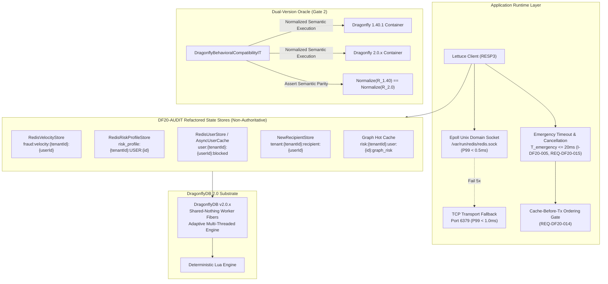

# 📐 Architecture Plan: PLAN-000.9.4 — DragonflyDB 2.0 Migration & Codebase State Audit

- **Associated Spec**: [`../SPEC-000.9.4-dragonfly-2.0-migration-and-codebase-audit.md`](file:///.spec/SPEC-000.9.4-dragonfly-2.0-migration-and-codebase-audit.md)
- **Governing Architecture**: [`../architecture/ARCH-000.9.4-dragonfly-2.0-and-state-audit.md`](file:///.spec/architecture/ARCH-000.9.4-dragonfly-2.0-and-state-audit.md)
- **Status**: 🟢 **Approved (Rev. 1 per History 69)**
- **Author**: Antigravity Platform Infrastructure & Distributed Systems Guild
- **Date**: 2026-09-22
- **Target Modules**: `:fraud`, `:edge`, `:core`, Root Application (`br.com.wallet.infrastructure`, Appliance Stack)
- **Governing Skills**: [`antifraud-engineering`](file:///.agents/skills/antifraud-engineering/SKILL.md), [`perimeter-security`](file:///.agents/skills/perimeter-security/SKILL.md), [`spec-driven-development`](file:///.agents/skills/spec-driven-development/SKILL.md)

---

## 1. Technical Strategy & Architecture Overview

`PLAN-000.9.4` executes a non-blind upgrade from DragonflyDB 1.40.1 to 2.0.x organized around **3 Migration Gates + 1 Cross-Cutting State Audit (`DF20-AUDIT`)**:

---

## 2. Component & Configuration Changes

### 2.1 Infrastructure & Appliance Configuration
1. **`docker-compose.yaml` & `docker-compose.appliance.yaml`**:
   - Upgrade image tag: `docker.dragonflydb.io/dragonflydb/dragonfly:v2.0.x`.
   - Preserve entrypoint script configuring permissions for `/var/run/redis/redis.sock` (`chmod 777`).
   - Maintain `--proactor_threads=2`, `--maxmemory=512mb` (standard) / `768mb` (appliance), and `--cache_mode=true`.
2. **Lettuce Client Configuration ([`RedisConfig.java`](file:///src/main/java/br/com/wallet/infrastructure/config/RedisConfig.java))**:
   - Negotiate `ProtocolVersion.RESP3`.
   - Configure socket options with 2s connect timeout.
   - Enforce bounded emergency cache timeout ($T_{\text{emergency}} \le 20\text{ms}$) via command timeout options to prevent cache stalls from impacting upstream request threads (`I-DF20-005`).
   - Ensure timeout triggers in-flight cancellation on the reactive/Netty layer without leaking thread resources (`REQ-DF20-015`).
3. **Test Infrastructure ([`IntegrationTestBase.java`](file:///src/test/java/br/com/wallet/support/IntegrationTestBase.java))**:
   - Update default `DRAGONFLY_IMAGE` to `docker.dragonflydb.io/dragonflydb/dragonfly:v2.0.x`.
   - Support dual-container initialization in `DragonflyBehavioralCompatibilityIT` for cross-version assertion.

### 2.2 `DF20-AUDIT` Key Namespacing & Store Refactoring

To comply with `I-DF20-004`, `REQ-DF20-016`, and `I-SEC-010`, all tenant-scoped keys are refactored to mandate canonical `tenantId`:

1. **[`RedisVelocityStore.java`](file:///fraud/src/main/java/br/com/wallet/fraud/infrastructure/RedisVelocityStore.java)**:
   - Change key generator to:
     $$\text{key} = \text{"fraud:velocity:"} + \text{tenantId} + \text{":"} + \text{userId}$$
   - Update `recordTransaction(String tenantId, UUID userId, Instant timestamp, Duration window)`.
   - Audit Lua script: sorted set `zadd NX`, `zremrangebyscore`, `zcard`, and `pexpire` continue executing atomically in Dragonfly 2.0.
2. **[`RedisRiskProfileStore.java`](file:///fraud/src/main/java/br/com/wallet/fraud/fusion/internal/persistence/RedisRiskProfileStore.java)**:
   - Change key generator to:
     $$\text{key} = \text{"risk_profile:"} + \text{tenantId} + \text{":USER:"} + \text{userId}$$
   - Batch `HSET` and `EXPIRE` via pipelining to cut network round-trips from 2 to 1 (`REQ-DF20-008`). Note: Pipelining batches independent network frames; read-modify-write atomicity is not claimed or required for simple write-with-TTL creation.
3. **[`RedisScripts.java`](file:///src/main/java/br/com/wallet/infrastructure/config/RedisScripts.java)**:
   - Refactor `REVIEW_COUNT_PROTECTED_SCRIPT` and `BLOCK_PROTECTED_SCRIPT` keys:
     - `KEYS[2]`: `user:{tenantId}:{userId}:review_count`
     - `KEYS[3]`: `user:{tenantId}:{userId}:risk_score`
     - `KEYS[4]`: `user:{tenantId}:{userId}:blocked`
   - Replay protection key `KEYS[1]` is `fraud:op:{operationId}`, explicitly verified as globally unique UUID/ULID (`I-DF20-004`).
4. **[`NewRecipientStore.java`](file:///fraud/src/main/java/br/com/wallet/fraud/infrastructure/NewRecipientStore.java)**:
   - Refactor key prefix to: `tenant:{tenantId}:recipient:{userId}` and `tenant:{tenantId}:sender:{userId}`.
5. **Graph Hot State ([`GraphRebuildService`](file:///fraud/src/main/java/br/com/wallet/fraud/intelligence/projector/GraphRebuildService.java))**:
   - Update key namespacing: `risk:{tenantId}:user:{userId}:graph_risk` and `risk:{tenantId}:user:{userId}:temporal_risk`.

---

## 3. The 3 Verification Gates Protocol

### Gate 1: Compatibility & Infrastructure Verification
- Verify Lettuce RESP3 negotiation against Dragonfly 2.0.
- Verify Unix Domain Socket connection and automatic fallback to TCP when socket is unavailable.
- Validate all commands in use: `HGETALL`, `HSET`, `EXPIRE`, `INCRBY`, `ZADD`, `ZREMRANGEBYSCORE`, `ZCARD`, `PSETEX`, `PEXPIRE`, `DEL`, `SADD`, `SCARD`.

### Gate 2: Behavioral Correctness & Dual-Version Oracle
Implement [`DragonflyBehavioralCompatibilityIT`](file:///src/test/java/br/com/wallet/integration/infrastructure/DragonflyBehavioralCompatibilityIT.java):
1. Spawn both `dragonfly:v1.40.1` and `dragonfly:v2.0.x` containers concurrently.
2. Execute identical operations against both engines:
   - Atomic continuous sliding window calculation (`I-DF20-003`).
   - Review counter and risk score accumulation Lua script.
   - Idempotent block script.
   - Millisecond and second TTL expiration semantics.
   - Tenant isolation partition tests (`I-DF20-004`, `REQ-DF20-016`).
3. Assert normalized semantic parity: $\text{Normalize}(\text{Result}_{1.40}) \equiv \text{Normalize}(\text{Result}_{2.0})$ (ignoring hash field order, internal metrics, and residual millisecond TTL drift).
4. Assert non-blocking cache-before-transaction ordering (`REQ-DF20-014`).

### Gate 3: Performance & Non-Regression Benchmark
Implement [`DragonflyBenchmarkTest`](file:///src/test/java/br/com/wallet/integration/infrastructure/DragonflyBenchmarkTest.java):
- **Workload**: 10,000 mixed operations (70% reads, 30% sliding-window writes) across 16 concurrent worker threads.
- **Latency Assertions (`I-DF20-001`, `I-DF20-002`)**:
  - $P99(\text{UDS}) < 0.5\text{ms}$
  - $P99(\text{TCP}) < 1.0\text{ms}$
  - $P99(DF_{2.0}) \le P99(DF_{1.40})$ (No statistically significant regression).
- **Throughput & Memory Tracking**:
  - Throughput $(DF_{2.0}) \ge \text{Throughput}(DF_{1.40})$ (Target: $+30\%$).
  - Memory consumption $(DF_{2.0}) \le \text{Memory}(DF_{1.40})$ (Target: $-30\%$).

### Gate Promotion Rule
$$\text{PROMOTION} \iff \text{Gate 1} = \text{PASS} \land \text{Gate 2} = \text{PASS} \land \text{Gate 3} = \text{PASS}$$

---

## 4. Deterministic Test Triads (`I-TDD-002`)

### Triad 1: Velocity Rule Atomic Continuous Evaluation (`REQ-DF20-004`, `REQ-DF20-013`, `I-DF20-003`)
- **Count & Amount Cases**:
  - Count: $\text{count} \le \text{threshold}_{\text{count}} \implies \text{ALLOW}$; $\text{count} > \text{threshold}_{\text{count}} \implies \text{REJECT}$.
  - Amount: $\text{amount} \le \text{threshold}_{\text{amount}} \implies \text{ALLOW}$; $\text{amount} > \text{threshold}_{\text{amount}} \implies \text{REJECT}$.
- **Temporal Boundaries**: Exact verification of $t - W$ (excluded), $t - W + \epsilon$ (included), $t$ (included), $t + \epsilon$ (excluded).
- **Invalid Input**: Negative amount, zero window duration, or null tenant ID throws `IllegalArgumentException`.

### Triad 2: Canonical Tenant Scoping vs. Global Key Namespacing (`REQ-DF20-006`, `REQ-DF20-016`, `I-DF20-004`)
- **Positive**: Tenant `tenant-alpha` writes velocity counter for `user-1`; Tenant `tenant-beta` queries `user-1`; returns 0.
- **Global Key**: Health probe queries `system:version` (global key); succeeds without requiring tenant context. Replay key `fraud:op:{uuid}` verified globally unique.
- **Boundary**: Attempting to write tenant-scoped state without canonical `tenantId` throws `TenantContextMissingException`.

### Triad 3: Emergency Timeout & Non-Blocking Database Transaction Boundary (`I-DF20-005`, `REQ-DF20-014`, `REQ-DF20-015`)
- **Positive**: Dragonfly responds in $<0.5\text{ms}$; domain use case proceeds to execute database transaction.
- **Boundary**: Simulated cache partition causes Lettuce command to exceed $T_{\text{emergency}} = 20\text{ms}$; request immediately aborts cache lookup and degrades to local Caffeine rules (`I-DF20-006`). Zero database transaction threads (`SELECT FOR UPDATE`) are held or blocked. In-flight operations cancelled without thread leakage.

### Triad 4: Dual-Version Normalized Semantic Oracle (`REQ-DF20-013`)
- **Positive**: For identical multi-key Lua scripts and complex data types, Dragonfly 2.0 returns normalized semantic equivalence to Dragonfly 1.40.1 ($\text{Normalize}(R_{1.40}) \equiv \text{Normalize}(R_{2.0})$).
- **Boundary**: Rapid sequential ZSET eviction under high clock drift maintains mathematical invariant $\text{Count}(W, t)$ without ghost retention.

---

## 5. Architectural & Concurrency Risk Mitigations

| Failure Mode | Root Cause | Architectural Mitigation |
| :--- | :--- | :--- |
| **Cross-Tenant State Pollution** | Un-namespaced keys in legacy fraud scripts | `DF20-AUDIT` mandates `tenantId` in all tenant keys (`I-DF20-004`, `REQ-DF20-016`, `I-SEC-010`). Validated by `TenantIsolationIT`. |
| **Cache Hang Blocks Core Transactions** | DB connection thread waiting on Redis response | `I-DF20-005`, `REQ-DF20-014`: Cache pre-check runs strictly *before* database locks; $T_{\text{emergency}} \le 20\text{ms}$ bounded fallback with in-flight cancellation (`REQ-DF20-015`). |
| **UDS Socket Permission Denied** | Container restart recreates socket with root-only permissions | Container entrypoint script executes `chmod 777 /var/run/redis/redis.sock` before starting Dragonfly server. |
| **Memory Exhaustion Under Attack** | Unbounded key creation without TTL | Every write command is audited to require an explicit TTL (`EXPIRE`, `PEXPIRE`, `PSETEX`). Maxmemory capped at 512MB / 768MB with LRU eviction. Missing evicted keys trigger safe deterministic rule fallback (`I-DF20-006`). |
