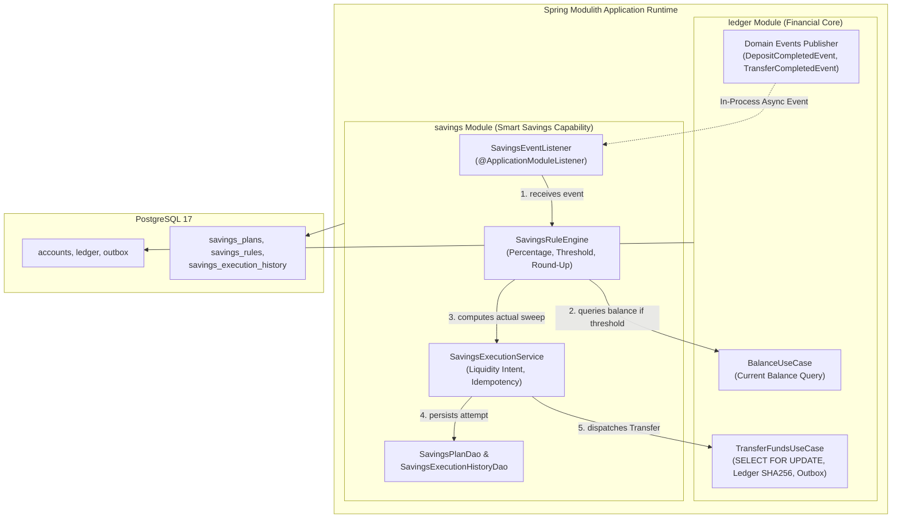
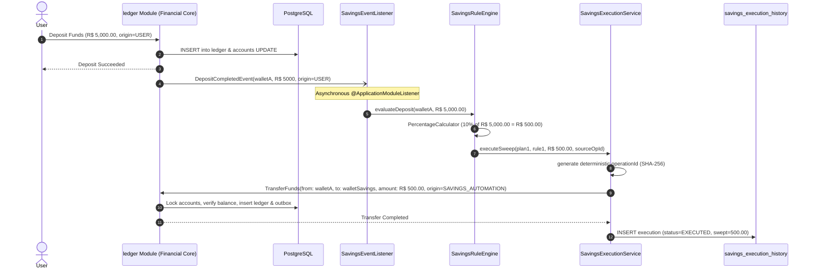
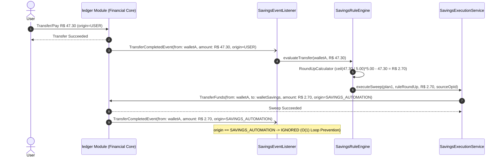

# 🏗️ Architecture Plan: PLAN-001 — Smart Savings Automation (br.com.wallet.savings)

- **Associated Spec**: [`../SPEC-001-smart-savings-automation.md`](file:///.spec/SPEC-001-smart-savings-automation.md)
- **Status**: Approved / Implemented
- **Author**: Antigravity Financial Architecture Team
- **Date**: 2026-08-22
- **Module**: `br.com.wallet.savings`

---

## 1. Technical Strategy & Architectural Overview

The goal of **`PLAN-001`** is to design the first concrete business capability module (**`br.com.wallet.savings`**) as a pure **Spring Modulith Application Module**, passively listening to financial core domain events and dispatching idempotent transfers to the transactional ledger.

### 🏛️ Core Architectural Principle
> *"Capabilities observe, analyze, and decide. The Financial Core (ledger) authorizes and executes."*



---

## 2. Module Boundaries & Physical vs Logical Topology

### 2.1 Physical Build Subprojects vs Spring Modulith Application Modules

```text
                  PHYSICAL GRADLE SUBPROJECTS
              :core                         :fraud
        (Shared Foundation)            (Fraud Engine)
                 │                            │
                 └──────────────┬─────────────┘
                                │
                                ▼
                       Wallet Application
                                │
                  ┌─────────────┴─────────────┐
                  ▼                           ▼
                ledger                     savings
            (Financial Core)          (Smart Savings)
         Spring Modulith Module    Spring Modulith Module
```

### 2.2 Package Structure & Restrictive Boundaries

```text
br.com.wallet.savings
│
├── package-info.java                   (@ApplicationModule(allowedDependencies = {"ledger::api", "core::api", "core"}))
│
├── api                                 (Published Public Interface)
│   ├── SavingsPlanUseCase.java         (Lifecycle operations: create, pause, resume, delete)
│   ├── SavingsQueryUseCase.java        (Metrics & historical execution lookups)
│   ├── model                           (Public DTOs & Models)
│   │   ├── SavingsPlanDto.java
│   │   ├── SavingsRuleDto.java
│   │   ├── SavingsMetricsDto.java
│   │   ├── SavingsExecutionHistoryDto.java
│   │   └── OperationOrigin.java        (USER, SAVINGS_AUTOMATION, SYSTEM, REVERSAL)
│   └── dto                             (Command records)
│       ├── CreateSavingsPlanCommand.java
│       ├── CreateSavingsRuleCommand.java
│       └── SavingsMetricsResponse.java
│
└── internal                            (Protected Sealed Subpackages)
    ├── domain                          (Internal Entities & Enums)
    │   ├── SavingsPlan.java
    │   ├── SavingsRule.java
    │   ├── SavingsRuleType.java        (ROUND_UP, PERCENTAGE, THRESHOLD)
    │   ├── SavingsPlanStatus.java      (ACTIVE, PAUSED, DELETED)
    │   └── SavingsExecutionStatus.java (EXECUTED, SKIPPED_INSUFFICIENT_FUNDS, REJECTED_BY_FRAUD, FAILED_RETRYABLE, FAILED_PERMANENT)
    │
    ├── application                     (Service Implementations)
    │   ├── SavingsPlanService.java
    │   └── SavingsExecutionService.java
    │
    ├── listener                        (Event Observers)
    │   └── SavingsEventListener.java   (@ApplicationModuleListener on Deposit & Transfer events)
    │
    ├── engine                          (Pure Deterministic Calculators)
    │   ├── SavingsRuleEngine.java      (Event-specific rule coordinator)
    │   ├── RoundUpCalculator.java      (Step-based round-up delta)
    │   ├── PercentageCalculator.java   (HALF_EVEN percentage sweep)
    │   └── ThresholdCalculator.java    (Ceiling excess calculation)
    │
    └── persistence                     (JDBC DAOs)
        ├── SavingsPlanDao.java
        ├── SavingsRuleDao.java
        └── SavingsExecutionHistoryDao.java
```

---

## 3. Database Persistence Schema (PostgreSQL)

```sql
-- Savings Plans
CREATE TABLE IF NOT EXISTS savings_plans (
    id UUID PRIMARY KEY DEFAULT gen_random_uuid(),
    source_wallet_id UUID NOT NULL,
    target_wallet_id UUID NOT NULL,
    minimum_retained_balance NUMERIC(18, 4) NOT NULL DEFAULT 0.0000,
    status VARCHAR(32) NOT NULL DEFAULT 'ACTIVE',
    created_at TIMESTAMP WITH TIME ZONE NOT NULL DEFAULT NOW(),
    updated_at TIMESTAMP WITH TIME ZONE NOT NULL DEFAULT NOW(),
    CONSTRAINT chk_diff_wallets CHECK (source_wallet_id != target_wallet_id),
    CONSTRAINT chk_min_balance CHECK (minimum_retained_balance >= 0)
);

CREATE INDEX IF NOT EXISTS idx_savings_plans_source ON savings_plans(source_wallet_id) WHERE status = 'ACTIVE';

-- Savings Rules
CREATE TABLE IF NOT EXISTS savings_rules (
    id UUID PRIMARY KEY DEFAULT gen_random_uuid(),
    plan_id UUID NOT NULL REFERENCES savings_plans(id) ON DELETE CASCADE,
    rule_type VARCHAR(32) NOT NULL, -- ROUND_UP, PERCENTAGE, THRESHOLD
    step_amount NUMERIC(18, 4),      -- For ROUND_UP (e.g. 1.0000, 5.0000, 10.0000)
    percentage_rate NUMERIC(7, 4),  -- For PERCENTAGE (e.g. 10.0000 = 10%)
    ceiling_threshold NUMERIC(18, 4),-- For THRESHOLD (e.g. 10000.0000)
    is_active BOOLEAN NOT NULL DEFAULT TRUE,
    created_at TIMESTAMP WITH TIME ZONE NOT NULL DEFAULT NOW(),
    CONSTRAINT chk_rule_config CHECK (
        (rule_type = 'ROUND_UP' AND step_amount > 0) OR
        (rule_type = 'PERCENTAGE' AND percentage_rate > 0 AND percentage_rate <= 100) OR
        (rule_type = 'THRESHOLD' AND ceiling_threshold > 0)
    )
);

CREATE INDEX IF NOT EXISTS idx_savings_rules_plan ON savings_rules(plan_id) WHERE is_active = TRUE;

-- Savings Execution History (Layer 1 Deduplication & Audit)
CREATE TABLE IF NOT EXISTS savings_execution_history (
    id UUID PRIMARY KEY DEFAULT gen_random_uuid(),
    operation_id UUID NOT NULL UNIQUE, -- Layer 1 Deduplication Key
    plan_id UUID NOT NULL REFERENCES savings_plans(id),
    rule_id UUID NOT NULL REFERENCES savings_rules(id),
    source_operation_id UUID NOT NULL,
    trigger_event_type VARCHAR(64) NOT NULL,
    calculated_amount NUMERIC(18, 4) NOT NULL,
    swept_amount NUMERIC(18, 4) NOT NULL,
    status VARCHAR(32) NOT NULL, -- EXECUTED, SKIPPED_INSUFFICIENT_FUNDS, REJECTED_BY_FRAUD, FAILED_RETRYABLE, FAILED_PERMANENT
    error_message TEXT,
    created_at TIMESTAMP WITH TIME ZONE NOT NULL DEFAULT NOW()
);

CREATE INDEX IF NOT EXISTS idx_savings_hist_source_op ON savings_execution_history(source_operation_id);
CREATE INDEX IF NOT EXISTS idx_savings_hist_plan ON savings_execution_history(plan_id, created_at DESC);
```

---

## 4. Architectural Decision Records (ADRs)

### 🏛️ ADR-001-1: In-Process Event Handling via Spring Modulith `@ApplicationModuleListener`
- **Context**: Capabilities need to react to core financial events without blocking the synchronous deposit/transfer HTTP request or introducing complex distributed orchestrators.
- **Decision**: Use Spring Modulith `@ApplicationModuleListener` for intra-process event distribution. Listeners execute asynchronously in a separate transaction boundary upon transaction commit of the event publisher.
- **Consequences**:
  - *Positive*: Perfect fault isolation (`I-SAVINGS-003`); failure in savings never rolls back user transactions.
  - *Positive*: Low intra-process latency ($< 5\text{ms}$).
  - *Neutral*: Savings is eventually consistent with the triggering event (`I-SAVINGS-005`).

### 🏛️ ADR-001-2: Causality & Loop Prevention via `OperationOrigin` and Deterministic `operation_id`
- **Context**: An automated savings transfer generates a `TransferCompletedEvent`. Without explicit protection, this would trigger another Round-Up rule in an infinite recursive loop.
- **Decision**: 
  1. Add `OperationOrigin` (`USER`, `SAVINGS_AUTOMATION`, `SYSTEM`, `REVERSAL`) to events and commands.
  2. The `SavingsEventListener` filters out any event with `origin != OperationOrigin.USER` in $O(1)$.
  3. Every savings transfer command generates a deterministic `operation_id` using SHA-256:
     $$\text{operationId} = \text{UUID}(\text{SHA256}(\text{sourceOperationId} + \text{ruleId} + \text{"SAVINGS\_SWEEP"}))$$
- **Consequences**:
  - *Positive*: 100% loop-proof (`I-SAVINGS-001`).
  - *Positive*: Safe retries — re-processing the same trigger produces the exact same `operation_id`, which the Financial Core recognizes and deduplicates idempotently (`I-IDEMPOTENCY-001`).

### 🏛️ ADR-001-3: Target Savings Account as a Standard Wallet
- **Context**: We need a destination for saved funds.
- **Decision**: Model the savings target as a standard `target_wallet_id` in `savings_plans`. 
- **Consequences**:
  - *Positive*: Zero modifications to PostgreSQL `accounts` or `ledger` table schemas.
  - *Positive*: The Financial Core executes standard `TransferFundsUseCase` with full fraud gating and double-entry hash-chain integrity (`I-LEDGER-002`).

### 🏛️ ADR-001-4: Event-Specific Rule Engine & Projected Balance Composition
- **Context**: Deposit and transfer events trigger different rules. On deposit, Percentage and Threshold rules both apply and compete for balance.
- **Decision**: 
  1. The Rule Engine is event-specific:
     - `DepositCompletedEvent`: Evaluates `PercentageCalculator` $\rightarrow$ derives projected balance ($\text{projectedBalance} = \text{currentBalance} - \text{percentageSweep}$) $\rightarrow$ evaluates `ThresholdCalculator` on `projectedBalance`.
     - `TransferCompletedEvent`: Evaluates `RoundUpCalculator` only.
  2. Each calculated rule produces an independent sweep command with its own `ruleId` and deterministic `operationId`, maximizing auditability and retry independence.
  3. Liquidity clamping is enforced: $\text{maxSweep} = \max(0, \text{currentBalance} - \text{minRetainedBalance})$.
- **Consequences**:
  - *Positive*: Predictable mathematical composition without requiring intermediate database execution between rules.
  - *Positive*: Strict adherence to user liquidity intent (`I-SAVINGS-004`).

### 🏛️ ADR-001-5: Strictly Restrictive Modulith Module Boundaries (`ledger::api`)
- **Context**: To strictly prevent capability modules from leaking into `ledger.internal` code, Spring Modulith allows fine-grained dependencies.
- **Decision**: Declare `allowedDependencies = {"ledger::api", "core::api", "core"}` on `br.com.wallet.savings.package-info.java`. Explicitly omit `"ledger"`.
- **Consequences**:
  - *Positive*: `savings` is physically and logically forbidden by Spring Modulith from importing any class under `br.com.wallet.ledger.internal.*`.
  - *Positive*: Enforces `I-MODULITH-001` and `I-MODULITH-002` at compile/test time.

### 🏛️ ADR-001-6: Savings Rule Independence & Plan Association Topology
- **Context**: Currently, `savings_rules` has a direct foreign key `plan_id REFERENCES savings_plans(id) ON DELETE CASCADE`. If a savings plan is deleted, all rule configurations are cascaded and deleted. In advanced financial settings, rule definitions (e.g. "Save 10%", "5 Reais Round-Up") represent reusable user strategies that could exist independently of specific source/target wallet associations.
- **Decision**:
  - *Current Implementation (1-to-N Parent-Child Aggregate)*: `SavingsPlan` is the DDD Aggregate Root, and rules are child entities scoped to the plan. Deleting a plan deletes its rules.
  - *Evolutionary Path (Many-to-Many via `savings_plan_rules`)*: In Phase 2/3, introduce a join table `savings_plan_rules(plan_id, rule_id, priority)` where `savings_rules` becomes an independent catalog of strategies (`user_id`, `rule_type`, `parameters`). Plans reference rules without owning their lifecycle.
- **Consequences**:
  - *Positive*: Preserves backwards compatibility with current baseline while charting the clean path toward rule reusability across multiple target savings goals (`br.com.wallet.goals`).

---

## 5. Sequence Diagrams

### 5.1 Flow 1: Incoming Deposit $\rightarrow$ Income Percentage Sweep



### 5.2 Flow 2: Outgoing Payment $\rightarrow$ Round-Up Micro-Savings



---

## 6. Threat Modeling & Failure Modes

| Threat / Failure Mode | Impact | Mitigation Strategy | Invariant |
| :--- | :--- | :--- | :--- |
| **Cascading Loop Attack** | Savings transfer triggers another savings transfer infinitely | `origin == SAVINGS_AUTOMATION` filter in listener aborts processing in $O(1)$ | `I-SAVINGS-001` |
| **Listener Crash / Node Restart** | Event was acknowledged but sweep not recorded | Replay using deterministic `operation_id` ensures idempotent execution | `I-SAVINGS-001`, `I-IDEMPOTENCY-001` |
| **Concurrent Spend Exhausts Balance** | Source wallet drained before async sweep executes | `TransferFundsUseCase` in Financial Core rejects with `InsufficientFundsException`; logged as `SKIPPED_LIQUIDITY` | `I-SAVINGS-003`, `I-BALANCE-002` |
| **Direct DB Modification Attempt** | Malicious or buggy module trying to write to ledger table | Spring Modulith verification test fails build; separate DAO boundaries | `I-MODULITH-001`, `I-SAVINGS-002` |

---

## 7. Verification & Testing Strategy

1. **Unit Tests (TDD $\ge 85\%$ coverage)**:
   - `RoundUpCalculatorTest`: step tests (1.00, 5.00, 10.00, exact multiples returning 0).
   - `PercentageCalculatorTest`: scale, `HALF_EVEN` rounding on odd fractions (e.g. 101.01 * 10%).
   - `ThresholdCalculatorTest`: ceiling thresholds, balance below ceiling returning 0.
   - `SavingsRuleEngineTest`: multi-rule ordering and liquidity clamping (`maxSweep`).
   - `SavingsExecutionServiceTest`: deterministic `operation_id` generation.
2. **Integration Tests (Testcontainers & Spring Modulith)**:
   - `SavingsScenarioIT`: Deposit R$ 5,000 $\rightarrow$ assert savings wallet credited R$ 500 $\rightarrow$ assert ledger hash chain valid.
   - `RoundUpScenarioIT`: Spend R$ 47.30 $\rightarrow$ assert savings wallet credited R$ 2.70 $\rightarrow$ assert zero recursive loop.
   - `ModulithArchitectureTest`: Verify `savings` module boundaries and dependencies.
