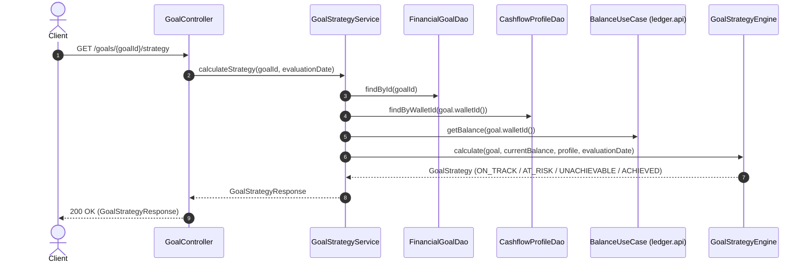
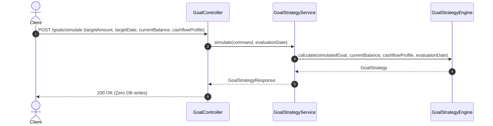

# 📐 Architecture Plan: PLAN-002 — Financial Goal & Cashflow Strategy Engine (br.com.wallet.goals)

- **Associated Spec**: [`../SPEC-002-financial-goal-engine.md`](file:///.spec/SPEC-002-financial-goal-engine.md)
- **Status**: Approved (Lean Architecture)
- **Date**: 2026-08-27
- **Target Release / Milestone**: Wallet Service V4 — Phase 2
- **Architectural Mantra**: *"Capabilities observe, analyze, decide, and propose. Wallet Core authorizes and executes."*

---

## 1. Technical Strategy & Architecture Overview

The `br.com.wallet.goals` module is designed as an autonomous, lean **Spring Modulith Application Module** providing deterministic financial goal planning, cashflow capacity analysis, and feasibility projection without direct ledger mutation or background table bloat.

```
┌────────────────────────────────────────────────────────────────────────────────────────┐
│                                Module Interaction Flow                                 │
│                                                                                        │
│   HTTP Client                                                                          │
│       │                                                                                │
│       │ GET /goals/{id}/strategy, POST /goals, PUT /goals/cashflow, POST /simulate     │
│       ▼                                                                                │
│   GoalController (infrastructure.rest.controller)                                      │
│       │                                                                                │
│       ├──► FinancialGoalUseCase ────────► FinancialGoalService ──► FinancialGoalDao    │
│       ├──► CashflowProfileUseCase ──────► CashflowProfileService ─► CashflowProfileDao │
│       └──► GoalStrategyUseCase ─────────► GoalStrategyService                          │
│                                                   │                                    │
│                                                   ├──► BalanceUseCase.getBalance()     │
│                                                   │    (br.com.wallet.ledger.api)      │
│                                                   │                                    │
│                                                   └──► GoalStrategyEngine              │
│                                                        (Pure In-Memory Math)           │
│                                                        ├── ContributionCalculator      │
│                                                        └── CashflowCapacityCalculator  │
└────────────────────────────────────────────────────────────────────────────────────────┘
```

---

## 2. Module & Layer Boundaries

### 2.1 Modulith Package Hierarchy
```text
br.com.wallet.goals
│
├── package-info.java                   (@ApplicationModule(allowedDependencies = {"ledger::api", "ledger", "core::api", "core"}))
│
├── api                                 (Published Public Interface)
│   ├── FinancialGoalUseCase.java       (Goal CRUD & status lifecycle)
│   ├── CashflowProfileUseCase.java     (Cashflow profile management)
│   ├── GoalStrategyUseCase.java        (Live strategy calculations & simulation)
│   ├── GoalQueryUseCase.java           (Read-only goal queries)
│   │
│   ├── model/                          (Domain Records & Types)
│   │   ├── FinancialGoal.java
│   │   ├── CashflowProfile.java
│   │   ├── GoalStrategy.java
│   │   ├── MultiGoalStrategyReport.java
│   │   ├── GoalPriority.java           (CRITICAL, HIGH, MEDIUM, LOW)
│   │   ├── GoalStatus.java             (ACTIVE, PAUSED, ACHIEVED, CANCELLED)
│   │   └── GoalFeasibility.java        (ON_TRACK, AT_RISK, UNACHIEVABLE, ACHIEVED)
│   │
│   └── dto/                            (Commands & Responses)
│       ├── CreateGoalCommand.java
│       ├── UpdateGoalCommand.java
│       ├── SaveCashflowProfileCommand.java
│       ├── SimulateGoalCommand.java
│       ├── GoalResponse.java
│       └── GoalStrategyResponse.java
│
└── internal                            (Encapsulated Implementation)
    ├── engine/                         (Pure In-Memory Stateless Math)
    │   ├── ContributionCalculator.java
    │   ├── CashflowCapacityCalculator.java
    │   └── GoalStrategyEngine.java
    │
    ├── service/                        (Application Services)
    │   ├── FinancialGoalService.java
    │   ├── CashflowProfileService.java
    │   ├── GoalStrategyService.java
    │   └── GoalQueryService.java
    │
    └── persistence/                    (Spring JDBC DAOs)
        ├── FinancialGoalDao.java
        └── CashflowProfileDao.java
```

### 2.2 Infrastructure Layer (`br.com.wallet.infrastructure`)
- `GoalApi`: OpenAPI-annotated interface defining endpoints under `/goals`.
- `GoalController`: WebMvc REST controller delegating to `goals.api` use cases.

---

## 3. Data Model & Schema Changes

### 3.1 Database DDL (`../../docker/init/schema.sql`)

```sql
-- 1. Goals Table
CREATE TABLE IF NOT EXISTS goals (
    id UUID PRIMARY KEY DEFAULT gen_random_uuid(),
    user_id UUID NOT NULL,
    wallet_id UUID NOT NULL REFERENCES accounts(id),
    target_wallet_id UUID NULL REFERENCES accounts(id),
    name VARCHAR(128) NOT NULL,
    target_amount NUMERIC(19, 2) NOT NULL CHECK (target_amount > 0),
    target_date DATE NOT NULL,
    priority VARCHAR(16) NOT NULL DEFAULT 'MEDIUM',
    status VARCHAR(32) NOT NULL DEFAULT 'ACTIVE',
    created_at TIMESTAMPTZ NOT NULL DEFAULT NOW(),
    updated_at TIMESTAMPTZ NOT NULL DEFAULT NOW(),
    CONSTRAINT chk_goal_priority CHECK (priority IN ('LOW', 'MEDIUM', 'HIGH', 'CRITICAL')),
    CONSTRAINT chk_goal_status CHECK (status IN ('ACTIVE', 'PAUSED', 'ACHIEVED', 'CANCELLED'))
);

CREATE INDEX IF NOT EXISTS idx_goals_user ON goals(user_id);
CREATE INDEX IF NOT EXISTS idx_goals_wallet_status ON goals(wallet_id, status);

-- 2. Cashflow Profiles Table
CREATE TABLE IF NOT EXISTS cashflow_profiles (
    id UUID PRIMARY KEY DEFAULT gen_random_uuid(),
    user_id UUID NOT NULL,
    wallet_id UUID NOT NULL UNIQUE REFERENCES accounts(id),
    monthly_income NUMERIC(19, 2) NOT NULL DEFAULT 0.00 CHECK (monthly_income >= 0),
    monthly_committed_expenses NUMERIC(19, 2) NOT NULL DEFAULT 0.00 CHECK (monthly_committed_expenses >= 0),
    minimum_safety_buffer NUMERIC(19, 2) NOT NULL DEFAULT 0.00 CHECK (minimum_safety_buffer >= 0),
    updated_at TIMESTAMPTZ NOT NULL DEFAULT NOW()
);

CREATE INDEX IF NOT EXISTS idx_cashflow_wallet ON cashflow_profiles(wallet_id);
```

---

## 4. Sequence Diagrams & Interaction Flows

### 4.1 On-Demand Strategy Evaluation (`GET /goals/{id}/strategy`)



### 4.2 Stateless Simulation Flow (`POST /goals/simulate`)



---

## 5. Architecture Decision Records (ADRs)

### `ADR-GOAL-001`: Pure Functional In-Memory Strategy Engine
- **Context**: Financial calculations must be predictable, lightning-fast ($< 1\text{ms}$), and easy to verify.
- **Decision**: `GoalStrategyEngine`, `ContributionCalculator`, and `CashflowCapacityCalculator` are pure stateless Java components without Spring Data or I/O dependencies. They accept `evaluationDate: LocalDate` explicitly (`I-GOAL-004`).
- **Consequences**: Enables 100% unit test coverage with instant test execution and zero mocking overhead.

### `ADR-GOAL-002`: Live Balance Projections vs Background Materialized Tables
- **Context**: Historical evaluation records become stale as balances change and require complex background update jobs.
- **Decision**: Calculate goal strategy on-demand using `BalanceUseCase.getBalance()` from `ledger.api`.
- **Consequences**: Zero background table bloat, zero synchronization race conditions, and always guarantees up-to-the-millisecond strategy accuracy.

### `ADR-GOAL-003`: Explicit User Cashflow Profile vs Premature AI Transaction Scraping
- **Context**: The Wallet does not yet have income detection (scheduled for Phase 3: `SPEC-003`).
- **Decision**: Store user-configured `CashflowProfile` in V1.
- **Consequences**: Clean separation of concerns; Phase 3 will populate/suggest profile values without altering the core Goal engine.

### `ADR-GOAL-004`: Multi-Goal Waterfall Priority Resolution
- **Context**: When a user defines multiple active goals, total required contributions may exceed safe cashflow capacity.
- **Decision**: Allocate available `safeContributionCapacity` in strict descending priority order (`CRITICAL` $\succ$ `HIGH` $\succ$ `MEDIUM` $\succ$ `LOW`).
- **Consequences**: Higher-priority goals (e.g. Emergency Fund) remain `ON_TRACK` while lower-priority goals (e.g. Vacation) transition gracefully to `AT_RISK` or `UNACHIEVABLE`.

---

## 6. Security, Concurrency & Failure Analysis

- **Concurrency & Locking**: 
  - Goal strategy queries are read-only and lock-free (`SELECT balance FROM accounts WHERE id = ?`).
  - Cashflow profile updates use atomic `INSERT ... ON CONFLICT (wallet_id) DO UPDATE`.
- **Error Handling & Resilience**:
  - Goals with `targetDate <= evaluationDate` fail fast with `IllegalArgumentException` / `400 Bad Request`.
  - Non-existent goals return `GoalNotFoundException` / `404 Not Found`.
- **Modulith Boundary Verification**:
  - Tested via `ModulithArchitectureTest.verifyArchitecture()`.
