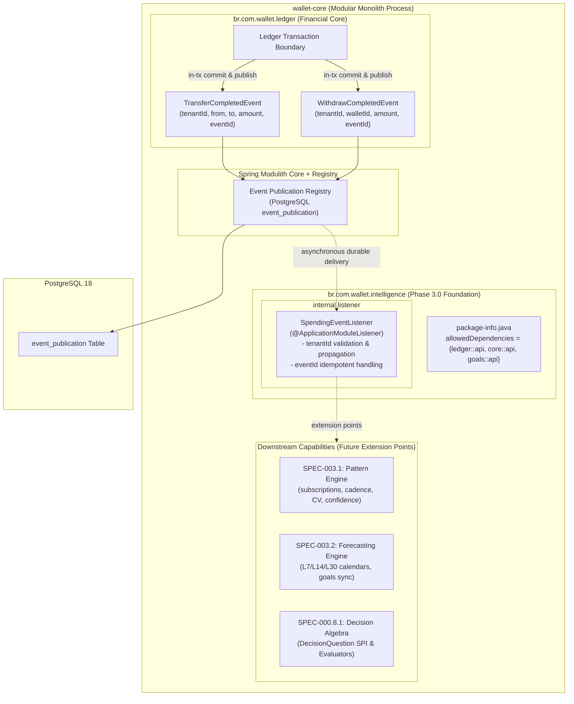

# 📐 Architecture Plan: PLAN-003 — Spending & Subscription Intelligence (Phase 3.0 Module Foundation)

- **Associated Spec**: [`../SPEC-003-spending-and-subscription-intelligence.md`](file:///.spec/SPEC-003-spending-and-subscription-intelligence.md)
- **Status**: 📝 **Approved / Ready for Tasks**
- **Author**: Antigravity Intelligence & Financial Planning Team
- **Date**: 2026-10-07
- **Target Release / Milestone**: Wallet Service V4 — Phase 3.0 (Module Scaffolding & Foundation)
- **Module**: `br.com.wallet.intelligence`
- **Strictly Out of Scope for Phase 3.0**:
  - Deterministic recurrence math, cadence intervals, and cycle clustering (owned by `SPEC-003.1`).
  - Forward liability calendars ($L_7, L_{14}, L_{30}$) and goal profile synchronization (owned by `SPEC-003.2`).
  - Concrete rule/ONNX/Ollama evaluators (owned by `SPEC-000.8.1`).
  - Core transactional ledger modifications or write-path intercepts (prohibited by `I-INTEL-001`).

---

## 1. Technical Strategy & Architectural Overview

`PLAN-003` establishes **`br.com.wallet.intelligence`** as an autonomous, asynchronous Spring Modulith application module. The module acts strictly as an analytical observer, listening to financial transactions in-process via Spring Modulith's **Event Publication Registry**, maintaining multi-tenant isolation, and providing the architectural foundation for subsequent capability slices (`SPEC-003.1` and `SPEC-003.2`).



---

## 2. Core Architectural Decisions (ADRs)

### ADR-003.1: Restrictive Modulith Module Boundaries (`I-INTEL-004`)
- **Decision**: Define `br.com.wallet.intelligence` as a first-class Spring Modulith module in `package-info.java` with dependencies restricted strictly to public API contracts:
  ```java
  @org.springframework.modulith.ApplicationModule(
      displayName = "Spending & Subscription Intelligence",
      allowedDependencies = {"ledger::api", "core::api", "goals::api"}
  )
  package br.com.wallet.intelligence;
  ```
- **Rationale**: Root `core` and internal `ledger` packages are completely omitted. Intelligence is an analytical observer and must never access ledger entities, DAOs, or transaction managers.
- **Verification**: `ModulithArchitectureTest.verifyArchitecture()` enforces zero boundary leaks and zero circular dependencies.

### ADR-003.2: Intra-Core Event Durability & Idempotent Side Effects (`I-INTEL-002`, `I-INTEL-008`)
- **Decision**: Ingest `TransferCompletedEvent` and `WithdrawCompletedEvent` via Spring Modulith `@ApplicationModuleListener` backed by the PostgreSQL Event Publication Registry.
- **Delivery Semantics**: At-least-once delivery. Exactly-once processing must never be assumed.
- **Idempotency Model**:
  - `eventId`: Canonical identifier of the published domain event used to ensure **idempotent side effects** under redelivery (`I-INTEL-008`).
  - `operationId`: Financial operation identifier passed to downstream capability projections for business-level deduplication where required.
  - Listeners MUST ensure that side effects are idempotent for a given `eventId` under at-least-once redelivery (`I-INTEL-008`).

### ADR-003.3: Strict Multi-Tenant Partitioning (`I-INTEL-010`, `I-SEC-005`, `I-SDD-007`)
- **Decision**: Every domain contract, event, and database table in the intelligence bounded context must carry mandatory `@NonNull String tenantId` (`tenant_id VARCHAR(64) NOT NULL`).
- **Validation & Propagation**: Events missing a valid `tenantId` are rejected with `TenantContextMissingException`. Validated events propagate tenant context immutably without creating mutable global or thread-local context.
- **Rationale**: `I-SDD-007` forbids greenfield models without mandatory domain attributes. Events from tenant $T_A$ must never pollute or cross-aggregate with tenant $T_B$.

### ADR-003.4: Precision Policy: Monetary vs. Statistical Mathematics (`I-INTEL-003`)
- **Decision**:
  - Monetary fields (`amount`, `liabilities`, `balances`): Canonical `BigDecimal` scale 2 with `RoundingMode.HALF_EVEN`.
  - Statistical calculations ($\sigma_A, CV_A, \text{confidence}$): Canonical `BigDecimal` with declared intermediate precision $\ge 6$ decimal places. Binary floating-point (`double`, `float`) is strictly forbidden (`I-TDD-002`).
  - Rounding occurs only at persistence, API, or comparison boundaries.

### ADR-003.5: Hot-Path Airgap & Decision Integration Seam (`I-INTEL-005`, `I-INTEL-006`, `I-INTEL-007`)
- **Decision**:
  - Hot-Path Airgap: Remote LLMs, SLMs, and AI runtimes are prohibited from executing synchronously on transaction paths:
    $$\text{Deps}(\text{SynchronousTxPath}) \cap \{\text{LLM}, \text{SLM}, \text{Ollama}, \text{SpringAI}\} = \emptyset$$
  - Provider-Neutral SPI: Phase 3.0 MUST NOT depend on concrete semantic evaluator implementations.
  - Semantic Ownership & Failure Isolation: `SPEC-000.8.1` owns the semantic decision algebra contracts. When semantic decision integration is introduced by downstream capabilities, the integration seam MUST preserve the `DecisionUnavailable<T>` failure isolation semantics defined by `SPEC-000.8.1` (`I-INTEL-007`). Semantic evaluator failures never interrupt event consumption.

### ADR-003.6: Foundation Schema Conventions (`REQ-INTEL-006`)
- **Decision**: `SPEC-003` defines the foundation migration conventions for tenant-scoped intelligence persistence in `docker/init/schema.sql` mandating `tenant_id VARCHAR(64) NOT NULL` and composite tenant indexes. Concrete capability tables are owned by their respective slices: `SPEC-003.1` owns `subscriptions`, and `SPEC-003.2` owns `cashflow_forecasts`.

---

## 3. Package & Module Topology

```text
src/main/java/br/com/wallet/intelligence
├── package-info.java                   (@ApplicationModule(allowedDependencies = {"ledger::api", "core::api", "goals::api"}))
├── api                                 (Public module contracts)
│   └── event                           (Module-level analytical events)
└── internal
    └── listener
        └── SpendingEventListener.java  (@ApplicationModuleListener consuming Transfer/Withdraw events with eventId idempotency)
```
> *Note: Capability-specific domain models (`Subscription`, `InferredCashflowProfile`) and evaluators are owned by SPEC-003.1, SPEC-003.2, and SPEC-000.8.1.*

---

## 4. Test Strategy & Architectural Verification Triads (`I-TDD-001`, `I-TDD-002`)

| Verification Target | 1. Positive Canonical Test | 2. Boundary / Negative Gate | 3. Invariant Breach Gate |
| :--- | :--- | :--- | :--- |
| **Modulith Boundaries (`REQ-INTEL-001`, `002`)** | `ModulithArchitectureTest.verifyArchitecture()` passes with 0 violations | Import from root `core` $\to$ Modulith verification fails | Import from `ledger.internal.*` $\to$ Modulith verification fails (`I-INTEL-004`) |
| **Zero NATS Ingestion (`REQ-INTEL-007`)** | Internal events consumed via `event_publication` | NATS subscriber declared for internal events $\to$ Architecture test fails | NATS broker offline $\to$ In-process events continue delivering (`I-INTEL-002`) |
| **Multi-Tenant Isolation (`REQ-INTEL-005`, `I-INTEL-010`)** | Event with `tenant-alpha` processed in `tenant-alpha` context | Missing / blank `tenantId` in event $\to$ `TenantContextMissingException` | Events for `tenant-beta` do not modify `tenant-alpha` state (`TenantIsolationArchitectureTest`) |
| **Event Idempotency (`REQ-INTEL-004`, `I-INTEL-008`)** | Event with unique `eventId` processed successfully | Redelivery of same `eventId` $\to$ Idempotent no-op (zero duplicate side effects) | Event redelivery re-executing side effect $\to$ Assertion failure |
| **Zero Ledger Mutation (`REQ-INTEL-007`, `I-INTEL-001`)** | Intelligence listener execution verifies 0 DB writes (INSERT/UPDATE/DELETE) to accounts or ledger | Listener attempting mutation $\to$ Prohibited by design | Ledger verification proves append-only hash chain unaffected |

---

## 5. Traceability Matrix (`SPEC-003` $\to$ `PLAN-003`)

| Requirement ID | MoSCoW | Architectural Component / Class | Associated Invariants |
| :--- | :---: | :--- | :--- |
| `REQ-INTEL-001` | `[MUST]` | `package-info.java` (`@ApplicationModule`) | `I-INTEL-004`, `I-STREAM-001` |
| `REQ-INTEL-002` | `[MUST]` | `ModulithArchitectureTest` | `I-INTEL-004` |
| `REQ-INTEL-003` | `[MUST]` | `SpendingEventListener` (`@ApplicationModuleListener`) | `I-INTEL-002` |
| `REQ-INTEL-004` | `[MUST]` | `SpendingEventListener` (canonical `eventId` deduplication) | `I-INTEL-008` |
| `REQ-INTEL-005` | `[MUST]` | `SpendingEventListener` (tenantId validation and propagation) | `I-INTEL-010`, `I-SDD-007` |
| `REQ-INTEL-006` | `[MUST]` | `docker/init/schema.sql` (Foundation schema conventions & `tenant_id`) | `I-INTEL-010`, `I-SDD-007` |
| `REQ-INTEL-007` | `[MUST]` | `NoInternalEventNatsDependencyTest`, `ZeroLedgerMutationTest`, `TenantIsolationArchitectureTest` | `I-INTEL-001`, `I-INTEL-002`, `I-INTEL-010` |
| `REQ-INTEL-008` | `[SHOULD]` | Integration seam for `SPEC-000.8.1` contracts | `I-INTEL-005`, `I-INTEL-006`, `I-INTEL-007` |
| `REQ-INTEL-009` | `[WON'T]` | N/A (Guarded by architectural boundaries) | `I-INTEL-001` |
| `REQ-INTEL-010` | `[WON'T]` | N/A (Guarded by hot-path airgap) | `I-INTEL-005` |
| `REQ-INTEL-011` | `[WON'T]` | N/A (Owned by downstream `SPEC-003.1` and `SPEC-003.2`) | `I-SDD-006` |
