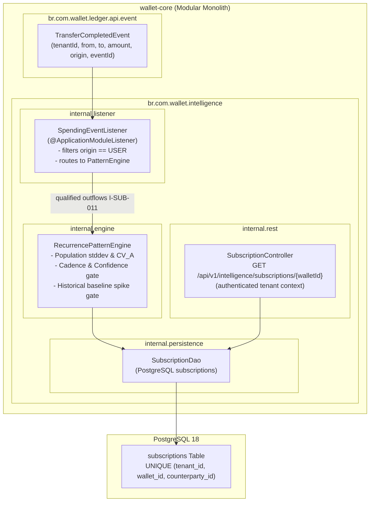

# 📐 Architecture Plan: PLAN-003.1 — Recurring Pattern & Subscription Detection

- **Associated Spec**: [`../SPEC-003.1-recurring-pattern-and-subscription-detection.md`](file:///.spec/SPEC-003.1-recurring-pattern-and-subscription-detection.md)
- **Status**: 📝 **Approved / Ready for Tasks**
- **Author**: Antigravity Intelligence & Financial Planning Team
- **Date**: 2026-10-07
- **Target Release / Milestone**: Wallet Service V4 — Phase 3.1
- **Bounded Context / Module**: `br.com.wallet.intelligence`
- **Scope Budget**: $\le 250$ lines (`I-SDD-006`)

---

## 1. Technical Strategy & Architectural Overview

`PLAN-003.1` realizes the **Deterministic Recurring Pattern & Subscription Detection Engine** on top of the Phase 3.0 foundation (`SPEC-003`). The engine observes user debit outflows in-process via `@ApplicationModuleListener`, clusters series deterministically by `(tenantId, walletId, counterpartyId)`, executes population statistics, classifies cadence and variance, manages subscription lifecycles independently from price alerts, and provides authenticated tenant-scoped REST queries.



---

## 2. Core Architectural Decisions (ADRs)

### ADR-003.1.1: Outflow Observation & Series Clustering (`I-SUB-010`, `I-SUB-011`)
- **Qualification**: Only completed user-originated outflows (`origin == OperationOrigin.USER`) participate in subscription clustering. Inbound credits, automated system sweeps, and internal liquidity ops are discarded.
- **Series Key**: Clustered strictly by `(tenantId, walletId, counterpartyId)`. For `TransferCompletedEvent`, `walletId = from` (debit account) and `counterpartyId = to` (destination identity).
- **Counterparty Identity**: Canonical UUID / normalized identity representing the beneficiary or merchant.

### ADR-003.1.2: Deterministic Recurrence Mathematics & Population Statistics (`I-SUB-001`, `I-SUB-002`, `I-SUB-007`)
- **Observation Count ($N$)**: Number of qualifying observations strictly $\le t$.
- **Population Standard Deviation**:
  $$\mu_A = \frac{1}{N}\sum_{i=1}^N A_i, \quad \sigma_A = \sqrt{\frac{1}{N}\sum_{i=1}^N (A_i - \mu_A)^2}, \quad CV_A = \frac{\sigma_A}{\mu_A}$$
- **Cadence & Renewal Projection**:
  - $\text{WEEKLY}$: $|\overline{\Delta t} - 7| \le 1$ days
  - $\text{BI\_WEEKLY}$: $|\overline{\Delta t} - 14| \le 2$ days
  - $\text{MONTHLY}$: $|\overline{\Delta t} - 30| \le 3$ days
  - $\text{ANNUAL}$: $|\overline{\Delta t} - 365| \le 5$ days
  - $\text{IRREGULAR}$: otherwise $\implies \text{nextExpectedAt} = \text{null}$.
  - Deterministic cadences: $\text{nextExpectedAt} = t_{\text{last}} + \text{round}(\overline{\Delta t})$ days (UTC).
- **Confidence & Promotion Gate**:
  $$\text{Confidence}(N, CV_A) = \min\left(1.00, \, \frac{N}{3} \times (1.00 - \min(0.50, CV_A))\right)$$
  - $N=1 \implies \text{DISCOVERED}$
  - $N=2 \implies \text{CANDIDATE}$
  - $N \ge 3 \land \text{Confidence} \ge 0.70 \implies \text{ACTIVE}$
- **Precision**: Monetary attributes maintain `BigDecimal` scale 2 (`HALF_EVEN`). Statistical metrics ($\sigma_A, CV_A, \text{Confidence}$) maintain $\ge 6$ decimal places.

### ADR-003.1.3: Separation of Lifecycle Status and Price Spike Condition (`I-SUB-003`)
- **Design Decoupling**: Price spikes are an orthogonal alert state, NOT a mutually exclusive lifecycle status. An active subscription with a price hike remains `status = ACTIVE`.
  - `SubscriptionStatus`: `DISCOVERED`, `CANDIDATE`, `ACTIVE`, `CANCELLED_INFERRED`
  - `PriceState`: `NORMAL`, `PRICE_SPIKE_DETECTED`
- **Historical Baseline**: The baseline mean $\mu_A(t)$ MUST be computed exclusively from qualifying observations strictly preceding $t$. The new observation $A_{\text{new}}$ is compared against $\mu_A(t)$ before inclusion.
- **Spike Trigger**: If $A_{\text{new}} \ge \mu_A(t) \times 1.05$ (+5.00%), set `priceState = PRICE_SPIKE_DETECTED` and publish `SubscriptionPriceSpikeEvent`.

### ADR-003.1.4: Cancellation Inference & Reactivation (`I-SUB-004`)
- **Eligibility**: Applies only to `ACTIVE` subscriptions with non-`IRREGULAR` cadence.
- **Lapse Condition**: If $t - t_{\text{last}} > 1.50 \times \overline{\Delta t}$, status transitions to `CANCELLED_INFERRED`.
- **Reactivation**: Upon arrival of a new qualifying observation for a cancelled series, status resets to `CANDIDATE` for re-verification.

### ADR-003.1.5: Schema DDL & Multi-Tenant Partitioning (`REQ-SUB-007`, `I-SUB-010`)
- **Table Definition** (`subscriptions`):
  ```sql
  CREATE TABLE IF NOT EXISTS subscriptions (
      id UUID PRIMARY KEY,
      tenant_id VARCHAR(64) NOT NULL,
      wallet_id UUID NOT NULL,
      counterparty_id UUID NOT NULL,
      cadence VARCHAR(32) NOT NULL,
      status VARCHAR(32) NOT NULL,
      price_state VARCHAR(32) NOT NULL DEFAULT 'NORMAL',
      classification VARCHAR(32) NOT NULL DEFAULT 'UNKNOWN',
      average_amount NUMERIC(19, 2) NOT NULL,
      last_amount NUMERIC(19, 2) NOT NULL,
      confidence NUMERIC(7, 6) NOT NULL,
      observed_cycles INT NOT NULL DEFAULT 1,
      last_observed_at TIMESTAMPTZ NOT NULL,
      next_expected_at TIMESTAMPTZ,
      variance_type VARCHAR(16) NOT NULL DEFAULT 'FIXED',
      created_at TIMESTAMPTZ NOT NULL DEFAULT NOW(),
      updated_at TIMESTAMPTZ NOT NULL DEFAULT NOW(),
      CONSTRAINT uk_subscriptions_tenant_series UNIQUE (tenant_id, wallet_id, counterparty_id)
  );
  CREATE INDEX IF NOT EXISTS idx_subscriptions_tenant_wallet ON subscriptions (tenant_id, wallet_id);
  ```

### ADR-003.1.6: Authenticated REST Ingress & Semantic Decision Seam (`REQ-SUB-008`, `REQ-SUB-010`, `I-SUB-005`)
- **Tenant Scope**: `GET /api/v1/intelligence/subscriptions/{walletId}` derives tenant context strictly from the authenticated security boundary; client-provided tenant parameters are prohibited.
- **Decision Seam**: Exposes `DecisionQuestion<SubscriptionClassification>` for additive enrichment. Evaluator unavailability returns `DecisionUnavailable<T>` (never coerced to synthetic default). Inconclusive evaluation returns `DecisionAnswer(UNKNOWN)`. Concrete evaluators are owned by `SPEC-000.8.1`.

---

## 3. Package & Module Topology

```text
src/main/java/br/com/wallet/intelligence
├── package-info.java                   (@ApplicationModule allowedDependencies: ledger::api, core::api, goals::api)
├── api
│   ├── dto
│   │   └── SubscriptionResponse.java
│   ├── event
│   │   └── SubscriptionPriceSpikeEvent.java
│   └── model
│       ├── Cadence.java                (WEEKLY, BI_WEEKLY, MONTHLY, ANNUAL, IRREGULAR)
│       ├── PriceState.java             (NORMAL, PRICE_SPIKE_DETECTED)
│       ├── SubscriptionStatus.java     (DISCOVERED, CANDIDATE, ACTIVE, CANCELLED_INFERRED)
│       └── VarianceType.java           (FIXED, VARIABLE)
└── internal
    ├── domain
    │   └── Subscription.java           (Domain record with status and priceState)
    ├── engine
    │   └── RecurrencePatternEngine.java (Population stddev, cadence, confidence, baseline spike)
    ├── listener
    │   └── SpendingEventListener.java   (Delegates USER outflows to RecurrencePatternEngine)
    ├── persistence
    │   └── SubscriptionDao.java        (JdbcTemplate UPSERT & queries)
    └── rest
        └── SubscriptionController.java (GET /api/v1/intelligence/subscriptions/{walletId})
```

---

## 4. Test Strategy & Architectural Verification Triads (`I-TDD-001`, `I-TDD-002`)

| Verification Target | 1. Positive Canonical Test | 2. Boundary / Negative Gate | 3. Invariant Breach Gate |
| :--- | :--- | :--- | :--- |
| **Cadence & Activation (`REQ-SUB-003`, `004`, `I-SUB-001`, `002`)** | 3 monthly transfers ($CV_A=0$) $\to$ `ACTIVE`, `MONTHLY`, $\text{Confidence}=1.00$ | Non-USER event (`SYSTEM`) $\to$ ignored (`I-SUB-011`) | $N=3, CV_A > 0.30 \implies \text{Confidence} < 0.70 \implies \text{CANDIDATE}$ |
| **Price Spike (`REQ-SUB-006`, `I-SUB-003`)** | Amount jumps +15% vs baseline $\to$ `priceState = PRICE_SPIKE_DETECTED` and remains `ACTIVE` | Price increase $< 5\% \to$ remains `NORMAL` | $A_{\text{new}}$ included in baseline $\to$ test assertion fails |
| **Tenant Isolation (`REQ-SUB-002`, `007`, `I-SUB-010`)** | Query returns subscriptions for authenticated tenant | Unauthenticated request $\to$ rejected | Tenant B events do not alter Tenant A series |
| **Cancellation Inference (`REQ-SUB-009`, `I-SUB-004`)** | Inactive for $1.6 \times \overline{\Delta t} \to \text{CANCELLED_INFERRED}$ | Active interval $< 1.5 \times \overline{\Delta t} \to$ remains `ACTIVE` | IRREGULAR series $\to$ never inferred cancelled |
| **REST Query API (`REQ-SUB-008`)** | `GET /subscriptions/{walletId}` returns 200 with JSON list | Unknown walletId $\to$ returns empty list | Query with forged tenant param $\to$ ignored |

---

## 5. Traceability Matrix (`SPEC-003.1` $\to$ `PLAN-003.1`)

| Requirement ID | MoSCoW | Architectural Component / Class | Associated Invariants |
| :--- | :---: | :--- | :--- |
| `REQ-SUB-001` | `[MUST]` | `SpendingEventListener` (`origin == USER` filter) | `I-INTEL-002`, `I-SUB-011` |
| `REQ-SUB-002` | `[MUST]` | `RecurrencePatternEngine`, `SubscriptionDao` | `I-SUB-010` |
| `REQ-SUB-003` | `[MUST]` | `RecurrencePatternEngine` (lifecycle states) | `I-SUB-002`, `I-SUB-006` |
| `REQ-SUB-004` | `[MUST]` | `RecurrencePatternEngine` (cadence & population stddev) | `I-SUB-001`, `I-SUB-007` |
| `REQ-SUB-005` | `[MUST]` | `RecurrencePatternEngine` ($CV_A$ calculation) | `I-SUB-002`, `I-SUB-007` |
| `REQ-SUB-006` | `[MUST]` | `RecurrencePatternEngine`, `SubscriptionPriceSpikeEvent` | `I-SUB-003` |
| `REQ-SUB-007` | `[MUST]` | `docker/init/schema.sql`, `SubscriptionDao` | `I-SUB-010`, `I-SDD-007` |
| `REQ-SUB-008` | `[MUST]` | `SubscriptionController` (authenticated tenant) | `I-SUB-010` |
| `REQ-SUB-009` | `[SHOULD]` | `RecurrencePatternEngine` (`CANCELLED_INFERRED`) | `I-SUB-004` |
| `REQ-SUB-010` | `[SHOULD]` | Decision seam for `SubscriptionClassification` | `I-SUB-005`, `I-TYPED-005` |
| `REQ-SUB-011` | `[SHOULD]` | Nearline semantic classification seam (provider neutral) | `I-SUB-006` |
| `REQ-SUB-012` | `[COULD]` | Counterparty descriptor normalization seam | `I-SUB-010` |
| `REQ-SUB-013` | `[WON'T]` | N/A (Guarded by deterministic mathematical gates) | `I-SUB-006` |
| `REQ-SUB-014` | `[WON'T]` | N/A (Guarded by zero ledger mutation rules) | `I-INTEL-001` |
