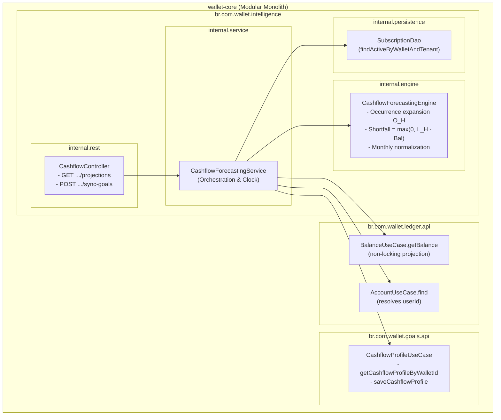

# 📐 Architecture Plan: PLAN-003.2 — Forward Cashflow Forecasting & Goals Integration

- **Associated Spec**: [`../SPEC-003.2-cashflow-forecasting-and-goals-integration.md`](file:///.spec/SPEC-003.2-cashflow-forecasting-and-goals-integration.md)
- **Status**: 📝 **Approved / Ready for Tasks**
- **Author**: Antigravity Intelligence & Financial Planning Team
- **Date**: 2026-10-08
- **Target Release / Milestone**: Wallet Service V4 — Phase 3.2
- **Bounded Context / Module**: `br.com.wallet.intelligence`
- **Scope Budget**: $\le 250$ lines (`I-SDD-006`)

---

## 1. Technical Strategy & Architectural Overview

`PLAN-003.2` realizes forward liquidity visibility and automated goal cashflow capacity alignment. The engine operates purely in-process as an ephemeral, deterministic projection capability: it evaluates active subscriptions discovered in Phase 3.1, expands them into projected recurrence occurrences $O_H$, calculates forward liabilities ($L_7, L_{14}, L_{30}$), evaluates current-balance coverage shortfalls without acquiring database locks, normalizes monthly committed expenses, and bridges to `br.com.wallet.goals` strictly via `goals::api`.



---

## 2. Core Architectural Decisions (ADRs)

### ADR-003.2.1: Projected Occurrences & Pure Domain Forecast Engine (`I-CASH-001`, `I-CASH-005`)
- **Canonical Cadence Interval**: Forecasting strictly uses the canonical interval associated with the classified cadence ($\Delta t_{\text{cadence}} \in \{7 \text{ (WEEKLY)}, 14 \text{ (BI\_WEEKLY)}, 30 \text{ (MONTHLY)}, 365 \text{ (ANNUAL)}\}$ days), rather than the historical average interval.
- **Occurrence Expansion**: For each active subscription $S$ matching `(tenantId, walletId)`:
  $$O_H(S, t_0) = \{ t_k = S.\text{nextExpectedAt} + k \cdot \Delta t_{\text{cadence}} \mid k \ge 0, \, t_0 \le t_k \le t_0 + H \}$$
  For `IRREGULAR`, $O_H(S, t_0) = \emptyset$ (zero projected occurrences, zero $L_H$ contribution).
  $$L_H(T, W) = \sum_{S \in \text{ActiveSubscriptions}(T, W)} |O_H(S, t_0)| \times S.\text{averageAmount}$$
- **Engine Purity**: `CashflowForecastingEngine` is pure domain logic (zero Spring, DB, REST, or Goals dependencies), taking `(subscriptions, balance, evaluationTime)` and returning deterministic projection records.
- **Server Timestamp**: $t_0 = \text{clock.instant()}$. Client-side override is prohibited in public API; tests inject deterministic `Clock.fixed(...)`.

### ADR-003.2.2: Current-Balance Coverage Shortfall Evaluation (`I-CASH-002`, `I-CASH-006`)
- **Formula**: $\text{Shortfall}_H(T, W) = \max\left(0.00, \, L_H(T, W) - \text{Balance}(T, W)\right)$.
- **Status Gate**: If $\text{Shortfall}_H > 0.00 \implies \text{DEFICIT_WARNING}$; otherwise $\text{SURPLUS}$.
- **Non-Locking Read**: Current balance is queried via `BalanceUseCase.getBalance(walletId)` (pure projection query; zero `SELECT FOR UPDATE`, zero ledger mutation).

### ADR-003.2.3: Semantic Committed Expense Partitioning & Anti-Double-Counting (`I-CASH-003`)
- **Monthly Normalization**:
  $$\text{NormalizeMonthly}(C, A) = \begin{cases}
  A \times 4.33 & (C = \text{WEEKLY}) \\
  A \times 2.17 & (C = \text{BI\_WEEKLY}) \\
  A \times 1.00 & (C = \text{MONTHLY}) \\
  A / 12.00     & (C = \text{ANNUAL}) \\
  0.00          & (C = \text{IRREGULAR})
  \end{cases}$$
- **Installment Partitioning**: When $S.\text{classification} == \text{"INSTALLMENT"}$, it is treated as a finite obligation: excluded from perpetual $\text{Committed}_{\text{monthly}}$, but included in discrete forward liabilities $L_H$ while active.
- **Anti-Double-Counting Invariant**: $L_H$ and $\text{Committed}_{\text{monthly}}$ serve different domains and MUST NEVER be added together to evaluate shortfall.

### ADR-003.2.4: Goals API Boundary & Profile Preservation (`I-CASH-004`)
- **Modulith Boundary**: Module `goals` owns `CashflowProfile`. `intelligence` accesses only `goals::api` via `CashflowProfileUseCase`, never querying goals tables or DAOs.
- **Identity Resolution**: `userId` is obtained via `AccountUseCase.find(walletId).userId()` (`ledger::api`) strictly to satisfy the existing `SaveCashflowProfileCommand` contract when creating/updating the profile, without introducing new identity semantics.
- **Preservation Contract**: Updating committed expenses strictly preserves existing `minimumSafetyBuffer` and user-configured `monthlyIncome`. If no profile exists, initializes with $0.00$ income and $0.00$ buffer.
- **Idempotency**: `POST /api/v1/intelligence/cashflow/{walletId}/sync-goals` produces identical profile state on repeated executions.

### ADR-003.2.5: Ephemeral Architecture & Zero Redundant Persistence (`I-CASH-008`)
- Forecasts are computed on-demand in memory. No `cashflow_forecasts` table is created in PostgreSQL in V1, eliminating cache invalidation drift and storage bloat.

### ADR-003.2.6: Authenticated REST Ingress & Strict Tenant Scoping (`REQ-CASH-004`, `REQ-CASH-005`, `I-CASH-007`)
- `tenantId` is resolved strictly from `TenantContextHolder`. Tampering via request params is blocked. Cross-tenant access is rejected with `TenantContextMissingException` or 403.

---

## 3. Package & Component Topology

```text
src/main/java/br/com/wallet/intelligence
├── package-info.java                   (@ApplicationModule allowedDependencies: ledger::api, core::api, goals::api)
├── api
│   ├── dto
│   │   ├── CashflowProjectionResponse.java
│   │   └── CashflowSyncResponse.java
│   ├── event
│   │   └── CashflowShortfallAlertEvent.java (REQ-CASH-006 [SHOULD])
│   └── model
│       └── CashflowStatus.java         (SURPLUS, DEFICIT_WARNING)
└── internal
    ├── engine
    │   └── CashflowForecastingEngine.java (Occurrence expansion, L_H, shortfall, monthly normalization)
    ├── service
    │   └── CashflowForecastingService.java (Orchestrates SubDao, Ledger, Goals, Clock)
    └── rest
        └── CashflowController.java     (GET /projections, POST /sync-goals)
```

---

## 4. Test Strategy & Architectural Verification Triads (`I-TDD-001`, `I-TDD-002`)

| Verification Target | 1. Positive Canonical Test | 2. Boundary / Negative Gate | 3. Invariant Breach Gate |
| :--- | :--- | :--- | :--- |
| **Occurrence Expansion (`REQ-CASH-001`, `I-CASH-001`)** | Weekly R$ 50 in 30d horizon $\to$ 4 occurrences $\to L_{30} = 200.00$ | Horizon without occurrences $\to L_H = 0.00$ | Single occurrence counted for weekly $\to$ test fails |
| **Shortfall & Status (`REQ-CASH-002`, `I-CASH-002`)** | $L_{14} = 200.00$, Bal = $150.00 \to$ Shortfall = $50.00$, `DEFICIT_WARNING` | Bal $\ge L_{14} \to$ Shortfall = $0.00$, `SURPLUS` | $L_H$ added to monthly committed $\to$ test fails (`I-CASH-003`) |
| **Installment Partitioning (`REQ-CASH-003`, `I-CASH-003`)** | Installment R$ 50 included in $L_{14}$, excluded from monthly committed | All subscriptions are installments $\to$ Committed = $0.00$ | Installment included in monthly committed $\to$ test fails |
| **Goals Profile Sync (`REQ-CASH-005`, `I-CASH-004`)** | Sync updates committed while keeping buffer = R$ 500 & income = R$ 3000 | No existing profile $\to$ initializes with 0.00 buffer/income | Sync mutating safety buffer $\to$ test fails |
| **Tenant Isolation (`REQ-CASH-004`, `I-CASH-007`)** | Query returns projections for authenticated tenant | Cross-tenant wallet query $\to$ 0 subscriptions / access denied | Tenant B subscriptions included in Tenant A forecast $\to$ test fails |

---

## 5. Traceability Matrix (`SPEC-003.2` $\to$ `PLAN-003.2`)

| Requirement ID | MoSCoW | Architectural Component / Class | Associated Invariants |
| :--- | :---: | :--- | :--- |
| `REQ-CASH-001` | `[MUST]` | `CashflowForecastingEngine` (occurrence expansion $O_H$) | `I-CASH-001`, `I-CASH-005` |
| `REQ-CASH-002` | `[MUST]` | `CashflowForecastingEngine`, `BalanceUseCase` | `I-CASH-002`, `I-CASH-006` |
| `REQ-CASH-003` | `[MUST]` | `CashflowForecastingEngine` (monthly normalization) | `I-CASH-003` |
| `REQ-CASH-004` | `[MUST]` | `CashflowController`, `CashflowForecastingService` | `I-CASH-005`, `I-CASH-007`, `I-CASH-008` |
| `REQ-CASH-005` | `[MUST]` | `CashflowController`, `CashflowProfileUseCase` | `I-CASH-004`, `I-CASH-007` |
| `REQ-CASH-006` | `[SHOULD]` | `CashflowShortfallAlertEvent`, `CashflowForecastingService` | `I-CASH-002` |
| `REQ-CASH-007` | `[COULD]` | N/A (Deferred to future income inference release) | `I-INTEL-009` |
| `REQ-CASH-008` | `[WON'T]` | N/A (Guarded by non-locking read & zero mutation invariants) | `I-INTEL-001`, `I-CASH-006` |
| `REQ-CASH-009` | `[WON'T]` | N/A (Guarded by ephemeral architecture invariant) | `I-CASH-008` |
