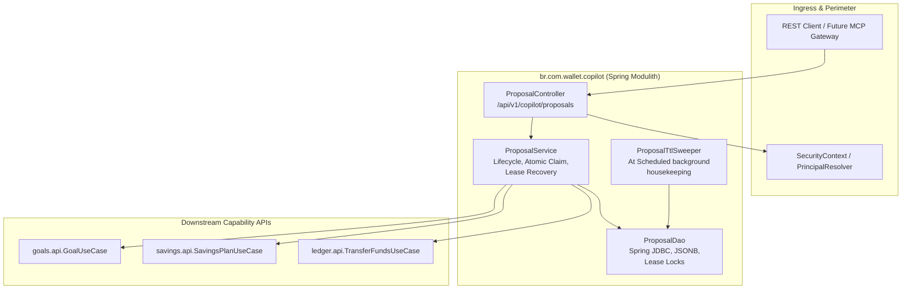

# 📐 Architecture Plan: PLAN-004 — AI Financial Copilot & Proposal Domain

- **Associated Spec**: [`../SPEC-004-ai-financial-copilot-and-proposal-domain.md`](file:///.spec/SPEC-004-ai-financial-copilot-and-proposal-domain.md)
- **Status**: 📝 Approved / Ready for Tasks (Refined per History 99)
- **Author**: Antigravity Orchestrator & System Architect
- **Date**: 2026-10-08
- **Target Release / Milestone**: Wallet Service V4 — Phase 4.0
- **Bounded Context / Module**: `br.com.wallet.copilot`
- **Scope Budget**: $\le 250$ lines (`I-SDD-006`)

---

## 1. Technical Strategy & Component Diagram

`PLAN-004` implements `br.com.wallet.copilot` as a dedicated Spring Modulith module providing an asynchronous, auditable **Financial Proposal Engine**. External agents or REST clients propose financial actions with creation idempotency and frozen parameters (`PROPOSED`), requiring explicit human authorization (`/approve`). Execution claims an atomic lease (`EXECUTING`), preserves a stable `executionOperationId`, and synchronously delegates the mutation to official downstream use cases (`ledger.api`, `savings.api`, `goals.api`).



---

## 2. Core Architectural Decisions (ADRs)

### ADR-004.1: `FinancialProposal` Lifecycle & Formal `EXECUTING` State (`I-AI-005`)
- **Lifecycle**: `PROPOSED` $\longrightarrow$ `EXECUTING` (internal claim) $\longrightarrow$ `EXECUTED`. Terminal branches: `REJECTED`, `EXPIRED`, `INVALIDATED`.
- **Atomic Claim with Lease**:
  ```sql
  UPDATE copilot_proposals 
  SET status = 'EXECUTING', approved_by = :principal, approved_at = :now,
      execution_claimed_at = :now, execution_lease_until = :now + INTERVAL '2 minutes'
  WHERE id = :id AND tenant_id = :tenantId AND status = 'PROPOSED' AND expires_at >= :now;
  ```
  `EXECUTING` é estritamente transiente interno e **não** representa sucesso financeiro.

### ADR-004.2: Crash Recovery & Stale Lease Reconciliation (`I-AI-010`)
- Se o processo falhar durante `EXECUTING` e `now() > execution_lease_until`:
  - Worker ou retry consulta o downstream via `OperationQueryUseCase.getOperationStatus(executionOperationId)`.
  - Três cenários determinísticos:
    1. **Concluída downstream**: Atualiza proposta para `EXECUTED` com dados em cache, sem repetir a mutação.
    2. **Comprovadamente não executada**: Re-despacha downstream usando o mesmo `executionOperationId` imutável.
    3. **Resultado desconhecido/timeout**: Preserva `EXECUTING` e permite nova reconciliação; nunca invalida por falha transitória.

### ADR-004.3: Creation Idempotency & Payload Conflict Gate (`I-AI-008`)
- Banco impõe `UNIQUE (tenant_id, idempotency_key)` e `UNIQUE (execution_operation_id)`.
- `parameters_hash` é SHA-256 sobre JSON canônico (chaves ordenadas, sem nulos, números normalizados).
- Mesmo `(tenantId, idempotencyKey)` com payload idêntico $\longrightarrow$ retorna proposta existente (`200 OK`).
- Mesmo `idempotencyKey` com payload divergente $\longrightarrow$ rejeição com HTTP 409 (`IdempotencyConflictException`).

### ADR-004.4: Invalidação de Negócio vs. Falha Técnica (`I-AI-010`)
- **Violação de Regra de Negócio** (saldo insuficiente, conta inativa) $\longrightarrow$ transição para `INVALIDATED`.
- **Falha Técnica de Infraestrutura** (timeout, BD indisponível) $\longrightarrow$ claim reverte para retry sem invalidar a proposta.

### ADR-004.5: Identidade Confiável via `SecurityContext` & Não Divulgação (`I-AI-004`)
- `createdBy` e `approvedBy` são extraídos do `SecurityContext` autenticado (nunca de payloads do cliente).
- Acessos cross-tenant retornam **HTTP 404 Not Found** (sem oráculo de enumeração de IDs).

### ADR-004.6: Execução Síncrona no Wallet V4
- A execução na V4 é **síncrona**. Resposta síncrona HTTP 200 com `status: EXECUTED`. Modelos assíncronos (HTTP 202) estão fora de escopo para o PLAN-004.

---

## 3. Spring Modulith Topology & Packaging

```text
br.com.wallet.copilot
├── package-info.java                   (@ApplicationModule(allowedDependencies = {"ledger::api", "savings::api", "goals::api", "core::api"}))
├── api/                                (@NamedInterface("api"))
│   ├── ProposalUseCase.java            (create, approve, reject, findById, listPending)
│   ├── dto/
│   │   ├── CreateProposalCommand.java  (walletId, type, parametersJson, idempotencyKey)
│   │   ├── ApproveProposalCommand.java (proposalId)
│   │   ├── RejectProposalCommand.java  (proposalId, reason)
│   │   └── ProposalResponse.java       (id, tenantId, walletId, type, status, parameters, etc.)
│   ├── model/
│   │   ├── FinancialProposal.java      (Domain record imutável)
│   │   ├── ProposalStatus.java         (PROPOSED, EXECUTING, EXECUTED, REJECTED, EXPIRED, INVALIDATED)
│   │   └── ProposalType.java           (TRANSFER, SAVINGS_RULE, GOAL_ADJUSTMENT)
│   └── event/
│       ├── ProposalCreatedEvent.java
│       ├── ProposalApprovedEvent.java
│       └── ProposalExecutedEvent.java
└── internal/
    ├── service/
    │   ├── ProposalService.java        (Orquestração, claim atômico, lease recovery)
    │   └── DownstreamExecutionBridge.java (Despacho tipado para use cases downstream)
    ├── reconciliation/
    │   └── ProposalLeaseReconciler.java (Reconciliação e recuperação de leases de EXECUTING expirados)
    ├── dao/
    │   └── ProposalDao.java            (Spring JDBC abstraction, JSONB, lease updates)
    ├── rest/
    │   └── ProposalController.java     (Ingress REST /api/v1/copilot/proposals)
    └── sweeper/
        └── ProposalTtlSweeper.java     (@Scheduled background housekeeping PROPOSED -> EXPIRED)
```

---

## 4. Data Model & Database DDL (`docker/init/schema.sql`)

```sql
CREATE TABLE IF NOT EXISTS copilot_proposals (
    id UUID PRIMARY KEY,
    tenant_id VARCHAR(64) NOT NULL,
    wallet_id UUID NOT NULL,
    type VARCHAR(32) NOT NULL,
    parameters_json JSONB NOT NULL,
    parameters_hash CHAR(64) NOT NULL,
    status VARCHAR(32) NOT NULL,
    idempotency_key VARCHAR(128) NOT NULL,
    execution_operation_id VARCHAR(128) NOT NULL,
    created_by VARCHAR(128) NOT NULL,
    approved_by VARCHAR(128),
    created_at TIMESTAMP WITH TIME ZONE NOT NULL,
    expires_at TIMESTAMP WITH TIME ZONE NOT NULL,
    execution_claimed_at TIMESTAMP WITH TIME ZONE,
    execution_lease_until TIMESTAMP WITH TIME ZONE,
    approved_at TIMESTAMP WITH TIME ZONE,
    executed_at TIMESTAMP WITH TIME ZONE,
    execution_reference VARCHAR(128),
    CONSTRAINT chk_copilot_proposal_status CHECK (status IN ('PROPOSED', 'EXECUTING', 'EXECUTED', 'REJECTED', 'EXPIRED', 'INVALIDATED')),
    CONSTRAINT uq_copilot_proposal_tenant_idempotency UNIQUE (tenant_id, idempotency_key),
    CONSTRAINT uq_copilot_proposal_execution_op_id UNIQUE (execution_operation_id)
);

CREATE INDEX IF NOT EXISTS idx_copilot_proposals_tenant_wallet_status ON copilot_proposals(tenant_id, wallet_id, status);
CREATE INDEX IF NOT EXISTS idx_copilot_proposals_expires_at ON copilot_proposals(status, expires_at) WHERE status = 'PROPOSED';
CREATE INDEX IF NOT EXISTS idx_copilot_proposals_stale_lease ON copilot_proposals(status, execution_lease_until) WHERE status = 'EXECUTING';
```

---

## 5. Concurrency, Locking & Idempotency Strategy

1. **Idempotência de Criação**: `ON CONFLICT (tenant_id, idempotency_key) DO NOTHING` seguido de validação do `parameters_hash`. Mismatch gera 409 Conflict.
2. **Reivindicação Atômica com Lease**: `UPDATE ... WHERE id = :id AND status = 'PROPOSED' AND expires_at >= :now`. Se linhas afetadas for zero:
   - Se `EXECUTED`: retorna `ProposalResponse` em cache (`I-AI-006`).
   - Se `EXECUTING` e `now() <= execution_lease_until`: retorna HTTP 409 / em processamento.
   - Se `EXECUTING` e `now() > execution_lease_until`: aciona `ProposalLeaseReconciler` (`ADR-004.2`).
   - Se `expires_at < now`: transiciona atomicamente para `EXPIRED` e lança 409 (`I-AI-005`).
   - Se terminal (`REJECTED`, `EXPIRED`, `INVALIDATED`): lança HTTP 409 Conflict.
   - Se inexistente ou outro tenant: lança HTTP 404 (`I-AI-004`).
3. **Sweeper vs. Reconciler**:
   - `ProposalTtlSweeper`: Housekeeping operacional para marcar propostas não aprovadas como `EXPIRED`.
   - `ProposalLeaseReconciler`: Reconciliador de falhas para propostas presas em `EXECUTING` além do lease, consultando o downstream via `OperationQueryUseCase.getOperationStatus(executionOperationId)`.
4. **Semântica dos Eventos Modulith (`event_publication`)**:
   - `ProposalCreatedEvent`: proposta persistida (`PROPOSED`).
   - `ProposalApprovedEvent`: autorização humana registrada (`EXECUTING` claim).
   - `ProposalExecutedEvent`: execução confirmada pelo downstream e estado `EXECUTED` persistido.

---

## 6. Traceability Matrix (`SPEC-004` $\longrightarrow$ `PLAN-004`)

### 6.1 Functional Requirements Mapping
| Requirement ID | Architectural Component | Verification Test Triad |
| :--- | :--- | :--- |
| `REQ-COPILOT-001` | `package-info.java`, Modulith boundary | `ModulithArchitectureTest.verifyArchitecture()` |
| `REQ-COPILOT-002`/`004` | `ProposalDao`, `copilot_proposals` table | `ProposalDaoIT` (persistence, JSONB, constraints) |
| `REQ-COPILOT-003` | `ProposalService.createProposal` | `ProposalServiceTest` (idempotency key & hash mismatch) |
| `REQ-COPILOT-005` | `ProposalService.approveProposal` (claim & lease) | `ProposalConcurrentApprovalIT` (100 threads $\to$ 1 claim) |
| `REQ-COPILOT-006` | Synchronous TTL validation | `ProposalServiceTest` (approval at $t > \text{expiresAt}$) |
| `REQ-COPILOT-007`/`011` | `ProposalController`, `SecurityContext` | `ProposalControllerTest` (404 on cross-tenant, principal) |
| `REQ-COPILOT-008` | Stable `executionOperationId` reuse | `ProposalServiceTest` (duplicate approval returns cached) |
| `REQ-COPILOT-009` | `DownstreamExecutionBridge` | `DownstreamBridgeTest` (invalidated vs retryable) |
| `REQ-COPILOT-010` | Downstream use case bridge dispatch | `ProposalExecutionIT` (end-to-end ledger dispatch) |
| `REQ-COPILOT-012` | `ProposalTtlSweeper` (housekeeping) | `ProposalTtlSweeperTest` (batch expiration) |

### 6.2 Invariants Verification Mapping
| Invariant ID | Description | Verification Method |
| :--- | :--- | :--- |
| **`I-AI-001`** | Human authorization gate & reuse in recovery | `ProposalServiceTest.testRecoveryReusesHumanAuthorization` |
| **`I-AI-004`** | Authenticated tenant context & 404 non-disclosure | `ProposalControllerTest.testCrossTenantReturns404` |
| **`I-AI-005`** | Atomic claim lease & authoritative TTL boundary | `ProposalConcurrentApprovalIT`, `ProposalServiceTest` |
| **`I-AI-006`** | Immutable `executionOperationId` idempotency | `ProposalServiceTest.testDuplicateApprovalReusesOperationId` |
| **`I-AI-007`** | Snapshot immutability with SHA-256 hash | `ProposalDaoIT.testParametersHashIntegrity` |
| **`I-AI-008`** | Creation idempotency & payload mismatch conflict | `ProposalServiceTest.testIdempotencyKeyPayloadConflict` |
| **`I-AI-009`** | Downstream owns financial rules & double-entry | `ProposalExecutionIT` (asserts ledger enforces balance) |
| **`I-AI-010`** | Technical failure remains in EXECUTING with lease | `ProposalLeaseReconcilerTest.testCrashRecoverySingleExecution` |
