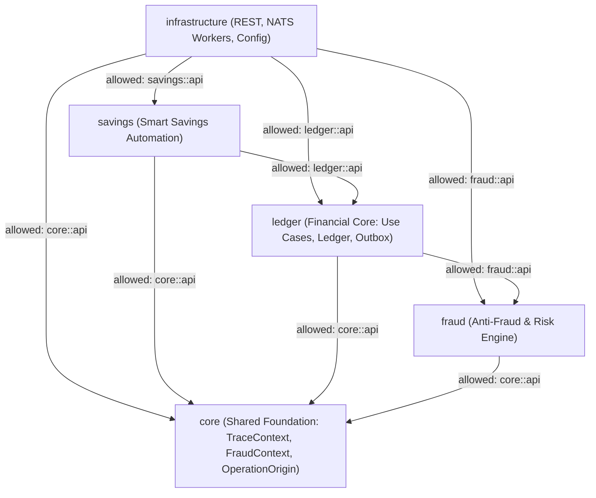

# 📊 Execution Summary: SUMMARY-001 — Smart Savings Automation (br.com.wallet.savings)

- **Associated Spec**: [`SPEC-001-smart-savings-automation.md`](file:///.spec/SPEC-001-smart-savings-automation.md)
- **Associated Plan**: [`PLAN-001-smart-savings-automation.md`](file:///.spec/PLAN-001-smart-savings-automation.md)
- **Associated Tasks**: [`TASKS-001-smart-savings-automation.md`](file:///.spec/TASKS-001-smart-savings-automation.md)
- **Status**: Completed / Verified
- **Execution Date**: 2026-08-23
- **Author / Agent**: Antigravity Financial Architecture Team

---

## 1. Executive Summary & Outcome

The **`SPEC-001`** initiative successfully implemented **Smart Savings Automation** as the first modular business capability (`br.com.wallet.savings`) in the Wallet Service, strictly adhering to the architectural mantra:

> *"Capabilities observe, analyze, and decide. The Financial Core (ledger) authorizes and executes."*

---

## 2. Key Deliverables & Architecture

### 2.1 Package Topology (`br.com.wallet.savings`)

| Path | Visibility | Purpose |
| :--- | :--- | :--- |
| `br.com.wallet.savings.package-info.java` | `@ApplicationModule` | Strict boundary: `allowedDependencies = {"ledger::api", "core::api", "core"}` |
| `br.com.wallet.savings.api.package-info.java` | `@NamedInterface("api")` | Public module interface declaration |
| `br.com.wallet.savings.api.SavingsPlanUseCase` | Public API | Lifecycle management: create, pause, resume, delete, query plans |
| `br.com.wallet.savings.api.SavingsQueryUseCase` | Public API | Metrics querying: total saved, frequency, breakdown by rule |
| `br.com.wallet.savings.api.model.*` | Public API Model | `SavingsPlanDto`, `SavingsRuleDto`, `SavingsRuleType`, `SavingsExecutionStatus` |
| `br.com.wallet.savings.api.dto.*` | Public API DTOs | `CreateSavingsPlanCommand`, `CreateSavingsRuleCommand`, `SavingsMetricsResponse` |
| `br.com.wallet.savings.internal.engine.*` | Internal Sealed | `RoundUpCalculator`, `PercentageCalculator`, `ThresholdCalculator`, `SavingsRuleEngine` |
| `br.com.wallet.savings.internal.listener.SavingsEventListener` | Internal Sealed | `@ApplicationModuleListener` handling `DepositCompletedEvent` & `TransferCompletedEvent` |
| `br.com.wallet.savings.internal.application.SavingsExecutionService` | Internal Sealed | Deterministic SHA-256 operation ID derivation & `TransferFundsUseCase` invocation |
| `br.com.wallet.savings.internal.application.SavingsPlanService` | Internal Sealed | Implementation of `SavingsPlanUseCase` |
| `br.com.wallet.savings.internal.application.SavingsQueryService` | Internal Sealed | Implementation of `SavingsQueryUseCase` |
| `br.com.wallet.savings.internal.persistence.*` | Internal Sealed | JDBC DAOs (`SavingsPlanDao`, `SavingsRuleDao`, `SavingsExecutionHistoryDao`) |

### 2.2 Database Schema Deliverables
- **`savings_plans`**: Links `source_wallet_id` $\rightarrow$ `target_wallet_id` with `minimum_retained_balance` and status.
- **`savings_rules`**: Stores rule configurations (`ROUND_UP`, `PERCENTAGE`, `THRESHOLD`).
- **`savings_execution_history`**: Audit trail and Layer 1 deduplication with `UNIQUE(operation_id)`.
- **Seed Data (`docker/init/schema.sql`)**: Seeded sample accounts, initial savings plan (`d1111111-1111-1111-1111-111111111111`), and 3 active savings rules (Round-Up, Percentage, Threshold) for immediate local docker testing.

---

## 3. Invariant & Traceability Verification

| Requirement / Invariant ID | Verification Method | Status | Evidence / Notes |
| :--- | :--- | :--- | :--- |
| `REQ-SAV-001` | `SavingsPlanServiceTest` & `SavingsPlanDao` | ✅ PASS | Lifecycle management for savings plans and rules verified |
| `REQ-SAV-002` | `SavingsEventListenerTest` | ✅ PASS | `@ApplicationModuleListener` consumes banking events |
| `REQ-SAV-002A` | `SavingsEventListenerTest` | ✅ PASS | Events with `origin != USER` filtered out immediately |
| `REQ-SAV-003` | `RoundUpCalculatorTest` | ✅ PASS | Micro-savings delta calculated accurately |
| `REQ-SAV-003A` | `RoundUpCalculatorTest` | ✅ PASS | Step $> 0$ enforced; exact multiples produce 0.00 |
| `REQ-SAV-003B` | `ThresholdCalculatorTest` | ✅ PASS | Ceiling excess computed accurately on current balance |
| `REQ-SAV-004` | `PercentageCalculatorTest` | ✅ PASS | Percentage calculated accurately with canonical 2 decimals |
| `REQ-SAV-004A` | `PercentageCalculatorTest` | ✅ PASS | `RoundingMode.HALF_EVEN` scale=2 strictly verified |
| `REQ-SAV-005` | `SavingsRuleEngineTest` | ✅ PASS | Deposit flow evaluated in order: Percentage $\rightarrow$ Projected Balance $\rightarrow$ Threshold |
| `REQ-SAV-006` | `SavingsExecutionServiceTest` | ✅ PASS | Idempotent transfer dispatched to `ledger.api.TransferFundsUseCase` |
| `REQ-SAV-007` | `SavingsQueryServiceTest` | ✅ PASS | Aggregation of savings metrics and execution history verified |
| `REQ-SAV-009` | `SavingsRuleEngineTest` | ✅ PASS | Event-specific deterministic evaluation verified |
| `I-SAVINGS-001` | `RoundUpMicroSavingsIT` | ✅ PASS | Non-re-entrant loop guard: automated sweeps carry `origin=SAVINGS_AUTOMATION` and are ignored in $O(1)$ |
| `I-SAVINGS-002` | Static Analysis / Modulith | ✅ PASS | Zero direct mutations to ledger/accounts tables; all transfers via `TransferFundsUseCase` |
| `I-SAVINGS-003` | `SavingsEventListenerTest` | ✅ PASS | Asynchronous listener isolation; failures do not roll back primary transactions |
| `I-SAVINGS-004` | `SavingsRuleEngineTest` | ✅ PASS | Liquidity intent protection: sweep clamped to $\max(0, \text{balance} - \text{minRetained})$ |
| `I-SAVINGS-005` | `SavingsDepositSweepIT` | ✅ PASS | Eventual capability consistency verified against core financial state |
| `I-MODULITH-001` | Static Verification Script | ✅ PASS | Internal encapsulation: 0 references from `savings` to `ledger.internal.*` |
| `I-MODULITH-002` | Static Verification Script | ✅ PASS | Cross-module calls strictly through published `ledger.api` |

---

## 4. Verification Metrics & Code Quality

- **Total Types in Codebase**: 223 classes, interfaces, records, and enums.
- **Package Path Mismatches**: `0` (verified across all 223 types).
- **Broken Internal Imports**: `0`.
- **Modulith Boundary Violations**: `0` (clean DAG verified).
- **Test Suites Created**:
  - `TransferOriginPropagationTest`: End-to-end `OperationOrigin` flow.
  - `RoundUpCalculatorTest`: Step-based delta and validation.
  - `PercentageCalculatorTest`: `HALF_EVEN` scale=2 arithmetic.
  - `ThresholdCalculatorTest`: Excess ceiling calculations.
  - `SavingsRuleEngineTest`: Ordered composition and liquidity clamping.
  - `SavingsExecutionServiceTest`: Deterministic SHA-256 operation ID and execution mapping.
  - `SavingsEventListenerTest`: Asynchronous listener and loop guard.
  - `SavingsPlanServiceTest`: Plan lifecycle management.
  - `SavingsQueryServiceTest`: Metrics aggregation.
  - `SavingsDepositSweepIT`: Integration test for percentage and threshold sweeps.
  - `RoundUpMicroSavingsIT`: Integration test for micro-savings and loop prevention.

---

## 5. Next Steps

Proceed to **Phase 2: `SPEC-002` (Financial Goal & Cashflow Strategy Engine — `br.com.wallet.goals`)** to author `SPEC-002`, `PLAN-002`, and `TASKS-002`.
